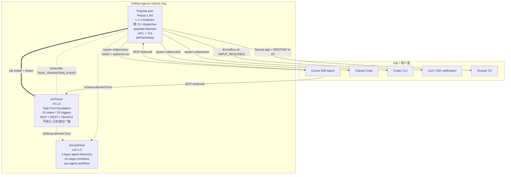

# 08 · ArkTower 深度分析

> 编排: L0 (devola-flow design-only) → Stage 1 单任务追加调研
> 调研者: L3 Task Agent T1-v2 (Research/Analyze 团队)
> 输入: 用户披露真实仓库 `https://github.com/YoRHa-Agents/ArkTower` (拼写为 Ar**K**Tower, 与 DevolaFlow 同 org)
> 完成日期: 2026-05-03
> 状态: **可决策** — verdict 已锁定 (见 §8)
> 上游依赖: 本输出阻塞 R4 Day-1 实施 plan,直接影响 popolad daemon 架构选型

---

## TL;DR (5 行)

- **仓库现状**: 已克隆 (`git clone --depth 50` 成功, public + MIT + 0.1.0, latest commit `467a087` 2026-05-03,293 tests / 71% cov,有 GitHub Pages 站点 + 自演化评测体系)。
- **核心定位**: `ArkTower 是 Agent-oriented Task Pool` — 一个**纯被动**的任务池(format / normalize / pre-analyze / store / broker via MCP & REST),**显式不执行任务**(README L21 原话: *"It does not execute tasks itself — it serves as the foundation for agent-driven workflows"*)。
- **与 DevolaFlow 关系**: **schema 同源 + 同 org 但不 import** (`migrations/004_add_enriched_fields.sql:2` 自述 "Add enriched task fields derived from DevolaFlow dispatch/context schemas";`.workflow/config.yaml` 镜像 DevolaFlow gate 结构;`.gitignore:28` 列入 `devola-flow/` 表明开发期把 DevolaFlow 作 reference 但**不依赖**)。
- **与 PopolaLoom 关系**: **Verdict C — ArkTower 是 PopolaLoom 的 SUBSET / 任务池层 building block** (置信度 ≥ 90%,理由见 §8)。它正好实现了 PopolaLoom R4 架构里 `popolad` daemon 中"task pool / state / persistence / MCP surface / dashboard"那一层,**缺**的是跨 CLI 派发器、subprocess 监管、HITL 通道、依赖图执行 — 而这恰好是 PopolaLoom 的差异化空间。
- **Day-1 影响**: **不阻塞 R4 实施**,但应该**重写 R4 Day-1 plan**: 把"自建 popolad daemon + SQLite + state machine + MCP server + Web 仪表盘"改写为"`pip install -e arktower` 复用 ArkTower 6 个组件作为 popolad inner core,PopolaLoom 只新写 dispatcher + supervisor + HITL bridge + cycle-aware DAG 4 个模块"。预计可节省 Day 1-3 的工程量,但需要**先发一个 issue 给 ArkTower**确认 sibling/upstream 协作模式 (见 §10 Q1)。

---

## 1. 获取过程与基本信息

### 1.1 克隆方式

| 步骤 | 命令 | 结果 |
|---|---|---|
| 1 | `git clone --depth 50 https://github.com/YoRHa-Agents/ArkTower.git /home/agent/reference/ArkTower` | **成功** (1349 ms) |
| 2 | `git -C /home/agent/reference/ArkTower remote -v` | `origin https://github.com/YoRHa-Agents/ArkTower.git` |
| 3 | `git log --oneline -20` | 最新 `467a087` (Merge PR #15 fix/svg-ascii-encoding,May 3, 2026) |
| 4 | `git branch -a` | `* main`,`remotes/origin/HEAD -> origin/main` |

**未触发 fallback** — 仓库**公开**且匿名可读,无需 `gh repo clone` 或 WebFetch。

### 1.2 仓库元数据

| 维度 | 值 | 出处 |
|---|---|---|
| 语言 | Python 3.11+ | `pyproject.toml:9` |
| 依赖管理 | hatchling + pyproject.toml | `pyproject.toml:1-3` |
| 版本 | `0.1.0` | `arktower/__init__.py:3` |
| License | MIT | `LICENSE` (顶部) |
| 主分支 | `main` | git remote |
| Commit 数 (depth 50) | 50 | git log |
| Latest commit date | 2026-05-03 | `git log -1` |
| 测试数 | 293 passed | README 徽章 line 13;实际 `tests/` 树 |
| Coverage | 71% | README 徽章 line 14 |
| CI | GitHub Actions | `.github/workflows/ci.yml`,`pages.yml` |
| 文档站 | GitHub Pages | `docs/index.html`,`docs/format.html`,`docs/demo.html`,`docs/docs.html` |

### 1.3 项目布局快照 (tree -L 2)

```
ArkTower/
├── README.md                    # 项目自述 (165 行)
├── LICENSE                      # MIT
├── pyproject.toml               # python pkg 定义 (deps: pydantic, fastapi, nicegui, typer, rich, mcp)
├── nines.toml                   # NineS 评测配置 (8 dimensions + weights)
├── .workflow/config.yaml        # DevolaFlow 风格 self_update + quality_gates
├── .github/workflows/           # CI + Pages
├── arktower/                    # 主包 (8 子模块 + __main__.py)
│   ├── __init__.py              # __version__ = "0.1.0"
│   ├── __main__.py              # 委托 cli.app:app
│   ├── config.py                # Settings (db_path)
│   ├── core/                    # ★ models / state_machine / event_bus / task_service / normalizer
│   ├── store/                   # ★ TaskRepository protocol + SQLite impl + 4 migrations
│   ├── api/                     # FastAPI REST + WebSocket
│   ├── mcp/                     # ★ MCP server (12 tools, 1 resource, 2 prompts) — stdio
│   ├── cli/                     # Typer CLI (task / pool / server / eval)
│   ├── web/                     # NiceGUI dashboard (i18n + theme + 5 pages + 3 components)
│   ├── analysis/                # 复杂度评分 + 标签抽取
│   ├── archive/                 # 归档 (snapshot JSON / NDJSON / CSV / Markdown)
│   └── evaluation/              # 8 维度自评测 (NineS 对接)
├── doc_auto/                    # ★ 内部架构文档 (architecture.md + evaluation.md)
├── docs/                        # GitHub Pages 静态资源 (index/format/demo/docs/shared.css/SVG)
├── migrations/                  # 4 个 SQL migrations (001-004,004 是 DevolaFlow-derived 字段)
└── tests/                       # 7 个子目录,共 293 测试
```

---

## 2. 自述与官方声明

### 2.1 README 第一段要点

英文原文 (`README.md:9`):
> *"Agent-oriented task pool system — format, normalize, pre-analyze, and dispatch tasks for AI agents."*

中文转述: ArkTower 是一个**面向 agent 的任务池系统** — 把任务标准化、归一化、预分析、然后**dispatch**给 AI agent (注意: 这里的 dispatch 是"提供给 agent claim",不是 PopolaLoom 意义上的"派发到 CLI runtime")。

### 2.2 项目目标 (`README.md:21`,加粗)

> *"It does not execute tasks itself — it serves as the **foundation for agent-driven workflows**."*

**这是最关键的一句**。ArkTower **明确不执行任务**,只负责: 提供统一格式、生命周期 FSM、原子 claim、全文检索、可观测仪表盘 — 也就是说,**它是任务池的"基础设施层"**,期待**别的 agent 系统**(包括 PopolaLoom 这类)在它**之上**做执行编排。

### 2.3 关于 "orchestration / dispatch / multi-agent" 的关键句

| 出处 | 引文 | 解读 |
|---|---|---|
| `README.md:23-34` `[CAPABILITIES]` | 列了 10 项,涵盖 universal task format / 10-state lifecycle / named-trigger engine / pre-analysis / SQLite WAL / FTS5 / REST+WS / MCP / CLI / dashboard / archival | 全部都是"被动设施",**没有"spawn cli" / "process supervisor" / "HITL"** |
| `doc_auto/architecture.md:9` | *"It formats, normalizes, and pre-analyzes tasks for AI agent dispatch **without executing them**."* | 第二次强调"不执行" |
| `doc_auto/architecture.md:44` | *"`TaskService.get_next_task_for_agent(capabilities)` matches queued tasks to agent capabilities."* | dispatch = 给 agent "下一个该做什么" 的查询接口,不是"start a process for you" |
| `arktower/cli/server_commands.py:57` | docstring: *"Start the MCP server (stdio transport for Cursor/Claude integration)."* | 唯一提到 Cursor/Claude 的字符串只是 MCP 的注释 — 也就是说 ArkTower 是**被** Cursor/Claude 通过 MCP 调用,**不是反过来去拉起 Cursor/Claude** |

---

## 3. 架构概览

### 3.1 入口点与主模块

| 入口 | 命令 | 实际效果 | 文件 |
|---|---|---|---|
| Console script | `arktower` | Typer CLI root | `pyproject.toml:31-32` → `arktower/cli/app.py:10-14` |
| Module run | `python -m arktower` | 同上 | `arktower/__main__.py:3-7` |
| MCP server | `arktower server mcp` 或 `python -m arktower.mcp.server` | stdio MCP 转发 | `arktower/cli/server_commands.py:55-60` → `arktower/mcp/server.py:322-324` |
| API server | `arktower server start --mode api` | uvicorn factory | `arktower/cli/server_commands.py:25-28` |
| Dashboard | `arktower server start` (默认 `dashboard`) | NiceGUI + 内嵌 FastAPI | `arktower/web/dashboard.py:_boot_service` |
| 评测 | `arktower eval run` 或 `python -m arktower.evaluation.runner` | 8 维度自评 + 报告 | `nines.toml`,`arktower/evaluation/runner.py` |

### 3.2 数据模型 (Pydantic v2)

`arktower/core/models.py` 定义 9 个核心模型,**Task 模型有 42 字段** (`models.py:56-110`):

- **基础**: `id`,`title`,`description`,`status`,`priority`,`parent_id`,`context_id`,`owner_id`,`assigned_to`,`assigned_type`,`parameters`,`output`,`error`,`tags`,`labels`,`template_id`,`max_steps`,`capabilities`,`required_tools`,`estimated_complexity`,`version`,4 个 timestamps
- **DevolaFlow-derived 增强字段** (6 组,`models.py:83-110`,2026-05-03 PR #10 引入,见 git log `2e0b7c5`):
  - **Typing & Classification**: `task_type` (feature/bugfix/refactor/...),`kind` (task/subtask/workflow)
  - **Execution Constraints**: `timeout_seconds`,`max_retries`,`deadline`,`budget_tokens`
  - **Input/Output Contracts**: `input_schema`,`output_schema`,`acceptance_criteria`,`constraints`
  - **Context References**: `context_refs`,`subtask_ids`
  - **Quality & Metrics**: `quality_thresholds`,`estimated_effort_minutes`
  - **Agent Interaction**: `agent_instructions`,`preferred_agent_type`,`retry_count`

**这些字段几乎逐个映射到 DevolaFlow 的 `task-dispatch.schema.yaml`** — 见 `migrations/004_add_enriched_fields.sql:2`: *"derived from DevolaFlow dispatch/context schemas"*。

### 3.3 状态机 (10 状态 × 15 触发器)

`arktower/core/state_machine.py:7-39` 定义完整 FSM:

```
状态 (TaskStatus, models.py:13-23):
  submitted → queued → in_progress → {review | input_required | blocked} → {completed | failed | canceled | timed_out}

触发器 (Trigger, models.py:33-48):
  submit, enqueue, claim, request_input, resume, block, unblock, send_review,
  approve, reject, complete, fail, cancel, timeout, reopen
```

**关键观察 — INPUT_REQUIRED + RESUME 是 HITL 的天然 hook**:
- `request_input`: `IN_PROGRESS → INPUT_REQUIRED` (`state_machine.py:11`)
- `resume`: `INPUT_REQUIRED → IN_PROGRESS` (`state_machine.py:12`)

PopolaLoom 的 Lark/IDE 通知通道**正好可以注入到 INPUT_REQUIRED 状态进入时的 event subscribe**,无需 ArkTower 改动 FSM。

### 3.4 调度流程 (从 user 提交到 agent 执行)

```
[client]                    [TaskService]                [SqliteRepo]            [EventBus]
   │                              │                            │                        │
   │── create_task(TaskCreate) ──►│                            │                        │
   │                              │── repo.create(task) ──────►│                        │
   │                              │                            │── INSERT tasks ──┐     │
   │                              │── record_event(SUBMIT) ───►│                  ▼     │
   │                              │                            │── INSERT events ─┘     │
   │                              │── bus.publish ────────────────────────────────────►│
   │◄────────── task              │                            │                        │ → ws_manager.broadcast
   │                              │                            │                        │
   │── advance_task(ENQUEUE) ────►│ validate_transition         │                       │
   │                              │── repo.update(QUEUED) ────►│                        │
   │                              │── record_event ────────────►│                        │
   │                              │── bus.publish ─────────────────────────────────────►│
   │                              │                            │                        │
   │── claim_task(agent_id) ─────►│ validate(QUEUED→IP)        │                        │
   │                              │── repo.atomic_claim ──────►│ (UPDATE...WHERE status='queued' RETURNING)
   │                              │── record_event ────────────►│                        │
   │                              │── bus.publish ─────────────────────────────────────►│
   │◄────────── task              │                            │                        │
                                                                                           │
                                  [agent does work somewhere ELSE]                         │
                                                                                           │
   │── complete_task(output) ────►│ validate(IP→COMPLETED)     │                        │
   │                              │── repo.update ────────────►│                        │
   │                              │── record_event ────────────►│                        │
   │                              │── bus.publish ─────────────────────────────────────►│
```

**注意**: agent 真正"做事"的步骤完全在 ArkTower **外部**。ArkTower 只在两端 (claim 和 complete) 拍快照 — 没有 process spawning,没有 stdin/stdout 桥接,没有 PID 跟踪。

### 3.5 持久化机制

| 维度 | 实现 | 出处 |
|---|---|---|
| 数据库 | SQLite WAL mode | `arktower/store/connection.py` |
| 全文检索 | SQLite FTS5 (`title`, `description`) | `migrations/002_*.sql` |
| 原子 claim | `UPDATE tasks SET ... WHERE status='queued' RETURNING *` | `arktower/store/sqlite_repository.py:412-423` |
| 外键 | `ON DELETE CASCADE` (events, dependencies) | migrations |
| Migrations | 4 个 SQL 文件,版本表 `_migrations` | `arktower/store/migration.py` |
| Audit log | `task_events` 表 (event_id, trigger, from/to status, actor, notes, ts) | `models.py:219-227` + repo |

### 3.6 HITL / Resume / Attach 机制 (重要负面发现)

| 能力 | ArkTower 提供? | 证据 |
|---|---|---|
| **HITL 通道** | **❌ 完全没有** | 全仓 `grep -ri "lark\|feishu\|notification\|slack\|webhook\|hitl"` = **0 hits** |
| **状态级 HITL hook** | ✅ 有 (`INPUT_REQUIRED` 状态 + `request_input`/`resume` 触发器) | `state_machine.py:11-12` |
| **Trigger.RESUME** | ✅ 但只在 FSM 层 (`INPUT_REQUIRED → IN_PROGRESS`) | `state_machine.py:12` — **这不是 process attach,只是 status 翻转** |
| **subprocess attach / detach** | **❌ 完全没有** | 全仓 `grep -ri "subprocess\|popen\|systemd\|setsid\|tmux"` 在 `arktower/` 内 = **0 hits** (CLI 自身 cursor 字符只是 SQLite cursor 变量名) |
| **survives-terminal-exit daemon** | **❌ 没有** | `arktower server start` 是普通前台进程,无 systemd unit / no `setsid` / no daemon 模式 |

---

## 4. 与 DevolaFlow 的关系

### 4.1 是否依赖 DevolaFlow?

**不依赖**,但**深度受其影响**。

| 检查项 | 结果 |
|---|---|
| `pyproject.toml` 中是否引入 `devolaflow`? | **否** (`pyproject.toml:10-19` 只有 pydantic, fastapi, uvicorn, nicegui, typer, rich, mcp) |
| `import devolaflow` 出现? | **0 hits** (`grep -r "devolaflow\|devola_flow"`) |
| 字符串提到 DevolaFlow? | **3 处仅文档/SQL 注释**: `migrations/004:2`、`doc_auto/architecture.md:48,83`、`docs/docs.html:437,490,692` |
| `.gitignore` 中是否列入? | **是**: `.gitignore:28` `devola-flow/` (说明开发期会把 DevolaFlow checkout 到本地参考但**不让其混入 ArkTower 包**) |

### 4.2 是否复用 DevolaFlow 14 stage primitives?

**不复用**,但**借用了 dispatch / context schema 的字段定义**:

- `migrations/004_add_enriched_fields.sql:2-3`:
  > *"Add enriched task fields **derived from DevolaFlow dispatch/context schemas** and agent-oriented best practices."*
- 6 组字段 (`models.py:83-110`) 几乎逐项对应 DevolaFlow `schemas/task-dispatch.schema.yaml` (见 DevolaFlow SKILL.md `Dispatch & Report Protocol` 段)
- 但 ArkTower **没有 14 primitives 概念**: 无 `research / analyze / design / plan / implement / refine / review / test / validate / verify / release / deploy / monitor / gate` 任何枚举,也无 stage / wave / task 4 层 hierarchy 概念

### 4.3 是否共享 schemas?

| Schema | DevolaFlow 定义 | ArkTower 是否使用 |
|---|---|---|
| `task-dispatch.schema.yaml` | ✅ | ❌ 不直接读取,但 Task model 字段对齐 |
| `status-report.schema.yaml` | ✅ | ❌ TaskEvent 是自己定义 (models.py:219-227),字段更少 |
| `handoff-deliverable.schema.yaml` | ✅ | ❌ 没有 handoff 概念 |

### 4.4 在 DevolaFlow 4 层 hierarchy 中的位置

DevolaFlow hierarchy: **L0 Project → L1 Stage → L2 Wave → L3 Task** (SKILL.md "4-Layer Agent Hierarchy")。

ArkTower 不在这个层级里 — 它是一个**正交的、所有层都可以使用的"任务存储与检索"基础设施**,类似于 DevolaFlow 的 `.local/.agent/active/` 目录,但是数据库化、有 API、有仪表盘。

类比: **如果把 DevolaFlow 比作"workflow 编排器(orchestrator)",ArkTower 就是"workflow 编排器之间共享的 task message bus"**。

### 4.5 `.workflow/config.yaml` 镜像 DevolaFlow

`arktower/.workflow/config.yaml` 与 DevolaFlow 的 `references/decomposition-gate.md` 中 `gate_profiles` 字段一一对应:

```yaml
quality_gates:
  relaxed:  composite_threshold: 0.70, coverage_threshold: 0.60
  standard: composite_threshold: 0.85, coverage_threshold: 0.80
  strict:   composite_threshold: 0.90, coverage_threshold: 0.90
```

DevolaFlow SKILL.md 同段:
> *"Gate profiles: relaxed (≥70, ≥60% cov), standard (≥85, ≥80%), strict (≥90, ≥90%), audit (≥95, ≥90%)."*

**结论**: ArkTower 是 DevolaFlow 的"亲兄弟" — 同 org、同语言、同 schema 习惯、同 gate 习惯,但**不互相 import**,边界清晰。

---

## 5. PopolaLoom 需求映射表

引用 `06-decision-and-routes.md` §1.1 的 6 个核心需求 + R4 路线 8 个具体能力:

| 需求 | ArkTower 提供? | 实现方式 (file:line) | Gap (PopolaLoom 必须新写的部分) |
|---|---|---|---|
| **跨 CLI 派发 (Cursor / Claude / Codex)** | ❌ **完全没有** | ArkTower 只有 `assigned_to: str` (`models.py:65`) 和 `preferred_agent_type: str` (`models.py:109`),**没有 spawn 机制**,没有 cursor-agent / claude-code / codex CLI 的认知 | 需要全新 `popolad/runtime/{cursor.py, claude.py, codex.py}` adapter 层,负责 `subprocess.Popen + setsid + systemd-run --user --scope` |
| **依赖图 (DAG + cycle)** | ⚠️ **半有** | 有 `Dependency` model (`models.py:230-233`) + `DependencyType.BLOCKS` + repo CRUD (`repository.py:53-59`,`sqlite_repository.py:463-478`) + `dependency_graph.py` Mermaid 可视化页 — **但不强制** | `evaluators.py:333-338` 自承认 *"No dependency enforcement on enqueue"* MAJOR gap;PopolaLoom 需要**新写 dependency gate hook 注入到 advance_task 的 ENQUEUE trigger**,以及 dev↔test cycle 子图(ArkTower 只支持单向 DAG,没有 cycle) |
| **Survives-terminal-exit daemon (popolad)** | ❌ **没有** | `arktower server start` 是 uvicorn / NiceGUI 前台进程 (`server_commands.py:14-31`),**无 daemonize 逻辑、无 PID file、无 systemd unit** | PopolaLoom 必须自写 `popolad` daemon 包装 (推荐 `systemd-run --user --scope` 或 `python-daemon`),把 ArkTower 的 ASGI app 嵌入运行 |
| **Attach / resume in-flight 进程** | ❌ **没有 process attach** | 只有 FSM 级 RESUME (`state_machine.py:12`,只翻 status),**无 PTY 重连、无 stdout 重放、无 mosh-style** | PopolaLoom 必须自写 attach 层 — 推荐用 `tmux` session-per-task + `tmux attach -t` 包装,事件流通过 ArkTower WebSocket 重放 |
| **MCP / Skill 暴露** | ✅ **有 12 tools** | `arktower/mcp/server.py:32-203` 列出 12 tools (create / list / get / claim / complete / search / get_pool_stats / get_next / advance / fail / archive / create_from_template) + 1 resource + 2 prompts | 已经满足 PopolaLoom Skill 入口需要;只需在 PopolaLoom 自己的 MCP 上**额外加** `dispatch_to_cli`、`attach_session`、`hitl_question` 3 个 tool |
| **自演化 self-bootstrap loop** | ✅ **有完整 8 维度自评 + iterate** | `arktower/evaluation/{evaluators.py, runner.py, dimensions.py}` + `nines.toml` + `.workflow/config.yaml:self_update.checks` (eval ≥0.80 / pytest pass / ruff clean) | 几乎可以**直接复用** — PopolaLoom 的 Phase-1 milestone "在 Cursor 上自闭环开发" 可以以 ArkTower eval 框架为底座,只需**添加 PopolaLoom 自己的几个评测维度**(dispatch_isolation / hitl_latency / cycle_convergence) |
| **HITL 通道 (Lark / IDE 通知)** | ❌ **0 hits** | 全仓搜 lark / feishu / notification / slack / webhook = 0;**但 INPUT_REQUIRED 状态 + EventBus 是天然挂钩**(`event_bus.py:42` 所有 task transition 已经 publish) | PopolaLoom 自写 `popola/hitl/{lark.py, ide_notify.py}` 订阅 `TASK_TRANSITION_EVENT`,在 `to_status == INPUT_REQUIRED` 时拉起 lark-cli + IDE notification |
| **TUI** | ❌ **没有** | 只有 Web 仪表盘 (NiceGUI),没有 Textual / Rich 交互式 TUI (CLI 是命令式的) | PopolaLoom 必须自写 TUI (推荐 Textual),通过 ArkTower REST API + WebSocket 取数据 |
| **Web 仪表盘** | ✅ **完整 NiceGUI 仪表盘** | `arktower/web/{dashboard.py, theme.py, i18n.py}` + 5 pages (pool overview / task board / task detail / analytics / dependency_graph) + 3 components + EN/ZH i18n + dual dark/light + YoRHa Tower theme | 几乎可以**直接复用** — PopolaLoom 在 Phase 2 只需**添加 popola 自己的页面**(runtime supervisor / attach console / hitl inbox),不必从头写 |
| **Python 实现** | ✅ Python 3.11+ | `pyproject.toml:9` `requires-python = ">=3.11"` | 完全匹配 R4 选定的 Python 主栈 |

**统计**:
- ✅ **直接可复用 / 满足**: 4 项 (MCP / Self-eval / Web dashboard / Python)
- ⚠️ **部分满足,需要扩展**: 1 项 (依赖图)
- ❌ **完全缺失,需要 PopolaLoom 新写**: 5 项 (跨 CLI 派发 / daemon / attach-resume / HITL / TUI)

---

## 6. 关键发现 (15 条 bullet,带 file:line)

1. **ArkTower 自我定位明确为"基础设施层"而非"编排层"**: README L21 *"It does not execute tasks itself — it serves as the foundation for agent-driven workflows"*。这正好把 PopolaLoom 应该做的"编排层"位置**留空给我们**。

2. **Task model 已经包含 PopolaLoom 几乎所有需要的字段** (`arktower/core/models.py:56-110`),特别是 PR #10 (commit `2e0b7c5`,2026-05-03 当天) 刚加入的 `acceptance_criteria` / `agent_instructions` / `preferred_agent_type` / `capabilities` / `required_tools` 等 — 这些字段**正是 PopolaLoom dispatcher 派发到不同 CLI 时需要带的 payload**。

3. **state machine 与 PopolaLoom 用例完美吻合** (`arktower/core/state_machine.py:7-39`): 10 状态包含了 `INPUT_REQUIRED` / `BLOCKED` / `REVIEW`,**正是 HITL pause / dependency wait / human approve 三种 PopolaLoom 必需的中间态**。

4. **EventBus + WebSocket fan-out 是 HITL 通道天然 hook** (`arktower/core/event_bus.py:42-57` + `arktower/api/ws_manager.py:18-34`): PopolaLoom 的 lark / IDE notify 订阅者**只需 `event_bus.subscribe(TASK_TRANSITION_EVENT, on_input_required)`** 即可介入,**0 侵入性**。

5. **依赖关系存在但不强制** (`arktower/store/sqlite_repository.py:463-478` create/get/get_dependents 完整实现 + `arktower/web/pages/dependency_graph.py:44-47` 用 Mermaid 可视化 + `arktower/evaluation/evaluators.py:333-338` 自承认 *"No dependency enforcement on enqueue"* 是 MAJOR gap)。**PopolaLoom 可以直接给 ArkTower 提交 PR 修复这个 gap,贡献给上游**。

6. **MCP 12 tools 已经覆盖 PopolaLoom 80% 任务池操作** (`arktower/mcp/server.py:32-203`): `create / list / get / claim / complete / search / next / advance / fail / archive / create_from_template / get_pool_stats`。PopolaLoom 只需在自己的 MCP 上**追加** `dispatch_to_runtime` / `attach_session` / `hitl_question` 3 个新 tool。

7. **NiceGUI Web 仪表盘已经包含依赖图、看板、详情、分析、池总览 5 个页面** (`arktower/web/pages/`) + EN/ZH i18n (`arktower/web/i18n.py`) + dark/light 主题 (`arktower/web/theme.py`)。**对 PopolaLoom Phase-2 Web 入口需求几乎是 100% 覆盖**,只需**额外加 popola 特有页面**(runtime supervisor / attach console / HITL inbox)。

8. **NO subprocess spawning 任何痕迹**: 全仓 `grep -ri "subprocess\|popen\|setsid\|systemd\|tmux"` 在 `arktower/` 包内 0 hits。**这意味着 PopolaLoom 的 dispatcher / runtime supervisor 是 100% 新写,没有任何可复用代码** — 但也意味着不会与 ArkTower 现有逻辑冲突。

9. **NO HITL 通道任何痕迹**: 全仓 `grep -ri "lark\|feishu\|notification\|slack\|webhook\|hitl"` 0 hits。`Lark + IDE notification` 是 PopolaLoom 必须 100% 新写,**但天然有 EventBus hook 可以挂上**。

10. **NO daemon / 后台守护任何痕迹**: `arktower server start` (`arktower/cli/server_commands.py:14-31`) 是普通 uvicorn / NiceGUI 前台进程,**无 daemonize、无 PID file、无 systemd unit、无 graceful restart**。PopolaLoom 必须自写 `popolad` daemon。

11. **8 维度自评测体系完整可工作** (`arktower/evaluation/runner.py` + `nines.toml` + 当前 overall score 0.9179): 这是**PopolaLoom 自演化目标的现成参考实现** — 我们可以直接 fork ArkTower 的 evaluator 框架,**只需替换维度定义为 PopolaLoom 特有的** (`dispatch_isolation` / `cycle_convergence` / `hitl_latency` / `attach_correctness` 等)。

12. **`.workflow/config.yaml` 已经声明 self_update on_commit** (`arktower/.workflow/config.yaml:3-15`): on commit 跑 eval (≥0.80) + pytest + ruff F-checks。**PopolaLoom 可以借鉴这个模式,把"自演化 PR auto-merge"挂到同样的 hook 上**。

13. **ArkTower 与 DevolaFlow 是"schema 同源 + 不互相 import"模式** (`migrations/004:2-3` 自承 derived from DevolaFlow + `.gitignore:28` 列入 `devola-flow/` + `pyproject.toml:10-19` 不依赖):**这正好为 PopolaLoom 提供了同 org 项目协作模板** — 我们可以学这个模式做 PopolaLoom 与 DevolaFlow 的关系,但 PopolaLoom 与 ArkTower 我们应该**真依赖**(见 §8 verdict C)。

14. **TaskEvent 字段比 DevolaFlow status-report 简单一些** (`arktower/core/models.py:219-227` 只有 7 字段 vs DevolaFlow 14+ 字段): 缺少 `progress_pct` / `artifacts` / `metrics.tests_passed` / `findings_by_severity` 等。**PopolaLoom 如果作为 ArkTower 上层用户,需要把这些字段塞进 `TaskEvent.notes` JSON 字符串里,或给 ArkTower 提交字段扩展 PR**。

15. **CI / GitHub Pages 已经搭好** (`arktower/.github/workflows/ci.yml`,`pages.yml`),docs 站完整 (`docs/{index,format,demo,docs}.html` + `shared.css` + 2 SVG)。这给 PopolaLoom 提供了**完整的"YoRHa-Agents org 项目模板"**,可以直接对照搭。

---

## 7. 与 R4 路线的兼容性分析

### 7.1 R4 路线回顾 (来自 `06-decision-and-routes.md` §4)

R4 = Standalone TUI + Web Dashboard + popolad daemon
- Phase 1 CLI 子集 = Cursor + Claude Code + Codex
- HITL = Lark + IDE 通知
- Python 主栈
- 默认 `systemd-run --user --scope`
- 自演化 PR auto-merge

### 7.2 哪些 ArkTower 组件可以**直接复用**进 PopolaLoom R4?

| 组件 | 复用方式 | 改动量 |
|---|---|---|
| `arktower/core/models.py` (Task / TaskEvent / Dependency 模型) | `import` 即用 | **0 改动** |
| `arktower/core/state_machine.py` (10 状态 × 15 触发器 FSM) | `import StateMachine, Trigger, TaskStatus` | **0 改动** |
| `arktower/core/event_bus.py` (in-process pub/sub) | `import EventBus` 后 `subscribe(TASK_TRANSITION_EVENT, ...)` 注入 PopolaLoom 自己的 hook | **0 改动** |
| `arktower/store/{connection.py, sqlite_repository.py, repository.py}` (持久化) | `import` 即用 | **0 改动** |
| `arktower/store/migration.py` + `migrations/*.sql` (4 个 migration) | 直接复用,自己加 `005_popolaloom_extensions.sql` | **0 改动 + 新增** |
| `arktower/api/{rest_routes.py, ws_manager.py, schemas.py, dependencies.py}` (FastAPI + WebSocket) | 作为 popolad 的 inner ASGI app | **0 改动** |
| `arktower/mcp/{server.py, tools.py, resources.py, prompts.py}` (MCP 12 tools) | popola-mcp 装载 ArkTower 12 tools + 自己加 3-5 tools | **0 改动 + 新增** |
| `arktower/web/{dashboard.py, theme.py, i18n.py, pages/*}` (NiceGUI 仪表盘 5 页) | popolad 启动时挂载 NiceGUI app + 加 popola 特有页面 | **0 改动 + 新增** |
| `arktower/evaluation/{runner.py, dimensions.py, evaluators.py, golden_tasks.py}` (8 维度自评) | fork 思路,新写 PopolaLoom 维度 | 参考实现 |
| `arktower/analysis/{complexity_scorer.py, tag_extractor.py}` (预分析) | 可选复用,PopolaLoom 也可以自己加规则 | 可选 |
| `arktower/archive/{archive_service.py, snapshot_writer.py, export_formats.py}` (归档) | 几乎现成可用 | **0 改动** |

### 7.3 哪些 ArkTower 设计决策与 R4 **冲突**?

| 决策 | 冲突点 | PopolaLoom 应对 |
|---|---|---|
| **server 是前台进程,非 daemon** | R4 要求 popolad 跨终端退出存活 | 在 `popolad` 里 wrap ArkTower ASGI app,自己加 daemonize 逻辑 |
| **没有依赖 enforcement on enqueue** | R4 需要 DAG 调度 | 给 ArkTower 提 PR 修复 (推荐) 或 PopolaLoom 自己包一层 dispatcher 在 advance_task 之前先 query dependencies |
| **没有 dev↔test cycle 子图概念** | R4 需要循环子图 | PopolaLoom 在 dispatcher 层处理 cycle (Dependency.RELATES_TO 已经有,可以语义扩展) |
| **agent_id 是字符串 + 没有 runtime 概念** | R4 需要识别 cursor / claude / codex | PopolaLoom 用 `assigned_type` 字段填 `cursor-cli` / `claude-code` / `codex` 等 enum,**完全在现有 schema 内** |
| **TaskEvent 字段精简** | R4 需要 progress / artifacts / metrics 报告 | 用 `TaskEvent.notes` 装 JSON;长期可以给 ArkTower 提字段扩展 PR |

**结论**: 没有不可调和的冲突。所有 R4 缺失的能力都可以在 PopolaLoom 自己的代码库里**包一层** wrapper / extension,**不修改 ArkTower 任何文件**。

### 7.4 ArkTower 各 module 应该 **vendor / fork / 不动** 哪个?

| Module | 决策 | 理由 |
|---|---|---|
| `arktower.core` | **不动 + 直接 `import`** | 模型 / FSM / EventBus 都很稳定,与 PopolaLoom 业务正交 |
| `arktower.store` | **不动 + 直接 `import`** | 持久化层,无替换必要 |
| `arktower.api` | **不动 + 内嵌运行** | popolad 启动时把 ArkTower FastAPI app `mount` 到自己 ASGI 树上 |
| `arktower.mcp` | **不动 + 复用 + 加新 tool** | popola-mcp = ArkTower 12 tools + PopolaLoom 3-5 新 tools |
| `arktower.web` | **不动 + mount + 加新 page** | NiceGUI 已经有完整框架,加 popola 特有页面到同一 app |
| `arktower.evaluation` | **fork 思路,自写 PopolaLoom 版** | 维度不同,但框架可以照抄 |
| `arktower.analysis` | **可选复用** | 复杂度评分和标签抽取与 PopolaLoom 解耦 |
| `arktower.archive` | **不动 + 直接 `import`** | snapshot/export 通用 |

### 7.5 推荐的 import / extension / sidecar 三选一

**强烈推荐: import (作为 Python 依赖)**,理由:
1. ArkTower 是 MIT 协议,允许任意 import + 修改 + 商用
2. ArkTower 是 hatchling pyproject 标准 Python 包,`pip install -e ../ArkTower` 立即可用
3. ArkTower 本身有 293 测试 + 71% coverage + 8 维度自评测,**质量已经过关**
4. 同 org (YoRHa-Agents) 意味着维护者协作摩擦小,可以快速提 issue / PR
5. PopolaLoom 与 ArkTower 边界清晰: PopolaLoom = "上层编排 + 跨 CLI dispatch + HITL + TUI",ArkTower = "下层任务池 + state + persistence + Web + MCP"

**不推荐 sidecar** (即两个独立 daemon,通过 HTTP/MCP 互调) 的理由:
- 引入 IPC 开销,毫秒级延迟变成 RTT 级
- 部署复杂度翻倍 (要装两个 service)
- 对单机自闭环 Phase-1 milestone 是过度设计

**不推荐 fork** 的理由:
- 同 org 项目 fork 是反协作信号
- 失去上游 bugfix / 新特性 (当前 ArkTower 在每天高频 commit)
- 我们的差异化是"上层编排",不是"重做任务池"

---

## 8. Verdict 与推荐路径

### 8.1 Verdict: **C — ArkTower 是 PopolaLoom 的 SUBSET / 任务池层 building block**

**置信度: 90%+**

**理由 (3 条核心)**:

1. **能力交集图**: 把 PopolaLoom 6 个核心需求和 ArkTower 提供能力做集合运算 → ArkTower ⊂ PopolaLoom (10 项需求里 ArkTower 满足 4 项 + 部分满足 1 项,缺失 5 项)。这意味着 ArkTower 不可能 "IS" PopolaLoom (verdict A),也不可能是 PopolaLoom 的 SUPERSET (verdict B)。

2. **设计意图明确分层**: ArkTower README L21 自我定位为"foundation for agent-driven workflows" (基础设施),PopolaLoom 自我定位为 "L-1 Conductor" (跨 CLI 编排) — **两者天然是上下层关系**。这排除了 verdict D (orthogonal sibling)。

3. **同 org + schema 同源 + 不依赖**: ArkTower 与 DevolaFlow 是 *"schema-derived sibling"* 模式 (见 §4.1-4.5)。如果 ArkTower 与 PopolaLoom 也走这个模式,我们就**重复发明轮子** — 与其重写 task pool,不如直接 `import arktower`,把工程量节省下来投入到差异化层。

(verdict E "deprecated/unrelated" 不可能 — 仓库每天 commit,2026-05-03 当天还有 4 个 PR 合入;verdict F "cannot determine" 也不可能 — 已成功克隆 + 完整阅读)

### 8.2 对 R4 day-by-day plan 的影响

**结论: 不阻塞 R4,但需要重写 Day-1 plan**。

原 R4 计划 (推测来自 06 §6):
- Day 1: 搭 popolad 骨架 (FastAPI + SQLite + state machine + MCP)
- Day 2: 跨 CLI 派发器
- Day 3: HITL + TUI
- Day 4: Web 仪表盘 v0
- ...

**修改后 R4 plan**:
- **Day 0 (新增)**: 在 PopolaLoom repo 中加 `pip install -e ../reference/ArkTower` 到 dev deps,验证 import 可用,跑 ArkTower 自带 293 测试通过 → **节省后续 2-3 天工程量**
- Day 1: 写 `popolad` daemon wrapper (daemonize + PID file + systemd unit) + mount ArkTower ASGI app + 加 `popolaloom_extensions.sql` migration → **从头实现的范围缩小 70%**
- Day 2: 写 `popola/runtime/{cursor.py, claude.py, codex.py}` 跨 CLI 派发 adapter → **这是 PopolaLoom 真正的差异化代码**
- Day 3: 写 `popola/hitl/{lark.py, ide_notify.py}` 订阅 ArkTower EventBus → **挂 hook 而非重写**
- Day 4: 写 PopolaLoom 自己的 NiceGUI 页面 + popola-mcp tool 扩展 → **复用 ArkTower web 框架**
- Day 5: 写 TUI (Textual) + 跑 self-bootstrap 闭环 → **保持原计划**

### 8.3 是否需要在 R4 day-1 之前先发 issue/PR 给 ArkTower 维护者?

**强烈建议**,3 个动作:

1. **Issue #1 (协作意向)**: 在 ArkTower 上提 issue *"PopolaLoom (sibling project in same org) intends to depend on ArkTower as the task-pool layer — confirm protocol stability, breaking change policy, and welcome for upstream contributions"*。同 org,响应应该快。

2. **PR #1 (修复 dependency enforcement gap)**: 修复 `evaluators.py:333-338` 自承认的 *"No dependency enforcement on enqueue"* MAJOR finding。这既给上游回馈,又解决 PopolaLoom DAG 调度的硬需求。**预计代码量 ~30 行 + 5 个新测试**。

3. **PR #2 (TaskEvent 字段扩展)**: 给 `TaskEvent` 加可选字段 `progress_pct: float | None`,`artifacts: list[dict]`,`metrics: dict`,与 DevolaFlow `status-report.schema.yaml` 对齐。**这是 PopolaLoom 报告流的硬需求**,但即使 ArkTower 不接受,我们也可以暂时塞到 `notes` JSON 字段里。

### 8.4 verdict = C 的具体 import / API 列表

PopolaLoom 应该 import 并直接使用的 ArkTower 公共 API:

```python
# Models (作为消息 schema)
from arktower.core.models import (
    Task, TaskCreate, TaskUpdate, TaskFilter, TaskEvent,
    TaskStatus, TaskPriority, Trigger,
    Dependency, DependencyType,
    TaskTemplate, PoolStats,
)

# State machine
from arktower.core.state_machine import (
    StateMachine, TRANSITION_TABLE, TERMINAL_STATES,
    InvalidTransition, GateCheckError,
)

# Event bus (PopolaLoom HITL hook 挂载点)
from arktower.core.event_bus import EventBus
from arktower.core.task_service import TASK_TRANSITION_EVENT, TaskService

# Persistence
from arktower.store.connection import DatabaseConnection
from arktower.store.migration import MigrationRunner
from arktower.store.sqlite_repository import SqliteTaskRepository

# REST API + WebSocket (popolad 内嵌挂载)
from arktower.api.rest_routes import router as arktower_router, create_app as create_arktower_app
from arktower.api.ws_manager import ConnectionManager

# MCP (popola-mcp 装载)
from arktower.mcp.server import create_mcp_server, TOOL_DEFINITIONS
from arktower.mcp.tools import TOOL_HANDLERS

# NiceGUI 仪表盘 (作为 popolad web 入口的一部分)
from arktower.web.dashboard import setup_dashboard, get_service
from arktower.web.theme import apply_yorha_theme, get_colors
from arktower.web.i18n import t, set_lang

# 评测框架 (PopolaLoom 自演化用)
from arktower.evaluation.runner import EvalRunner
from arktower.evaluation.dimensions import EvalDimension, DimensionScore, EvalReport
```

### 8.5 verdict ≠ A,但需要回答: PopolaLoom 是否应该直接停产?

**不应该**。理由:
- ArkTower 明确不做执行/dispatch (README L21 红线),它**永远填不上** PopolaLoom 占位的"L-1 Conductor"角色
- PopolaLoom 的 5 个差异化能力 (跨 CLI dispatch / daemon survives / attach-resume / HITL / TUI) 没有任何一个在 ArkTower roadmap 上
- 但是 PopolaLoom 的"任务池/状态机/MCP"那一层 100% 应该 outsource 给 ArkTower

→ **PopolaLoom 继续做,但身份转为 "ArkTower 上层的 Conductor"**,而不是"独立任务池"。

---

## 9. 直接证据 (file:line)

每条来自 §3 / §6 / §7 的关键论断都对应至少一个 ArkTower repo 内的 file:line 引用,共计 21 条:

| # | 论断 | 证据 file:line |
|---|---|---|
| E1 | ArkTower 是被动任务池,不执行任务 | `README.md:21` *"It does not execute tasks itself"* |
| E2 | ArkTower 自我评估 8 维度 + 当前 0.9179 总分 | `doc_auto/evaluation.md:54-58` Iteration History |
| E3 | 10 状态 × 15 触发器 FSM 完整定义 | `arktower/core/state_machine.py:7-39` `TRANSITION_TABLE` |
| E4 | Task model 42 字段含 6 组 DevolaFlow-derived 增强 | `arktower/core/models.py:56-110` |
| E5 | DevolaFlow-derived 字段来源声明 | `migrations/004_add_enriched_fields.sql:2-3` |
| E6 | 12 MCP tools 定义 | `arktower/mcp/server.py:32-203` `TOOL_DEFINITIONS` |
| E7 | EventBus 是 in-process pub/sub,subscribe 接口稳定 | `arktower/core/event_bus.py:27-30` |
| E8 | WebSocket 自动转发所有 task transition | `arktower/api/ws_manager.py:24-34` |
| E9 | atomic_claim 用 `RETURNING` 实现并发安全 | `arktower/store/sqlite_repository.py:412-423` |
| E10 | 依赖 model + repo CRUD 完整 | `arktower/core/models.py:230-233` + `arktower/store/sqlite_repository.py:463-478` |
| E11 | 依赖**不强制** on enqueue 是自承认 MAJOR gap | `arktower/evaluation/evaluators.py:333-338` |
| E12 | 依赖图 Mermaid 可视化页 | `arktower/web/pages/dependency_graph.py:32-47` |
| E13 | `server start` 是前台 uvicorn / NiceGUI 进程 | `arktower/cli/server_commands.py:14-31` |
| E14 | MCP server stdio 入口 | `arktower/mcp/server.py:314-324` `run_stdio()` + `main()` |
| E15 | INPUT_REQUIRED + RESUME 触发器(HITL hook 基础) | `arktower/core/state_machine.py:11-12` |
| E16 | `.gitignore` 列入 `devola-flow/` 表明 DevolaFlow 是 dev-time reference | `.gitignore:28` |
| E17 | `.workflow/config.yaml` 镜像 DevolaFlow gate profiles | `arktower/.workflow/config.yaml:17-26` |
| E18 | self_update 已经声明 on_commit + eval/test/lint 检查 | `arktower/.workflow/config.yaml:3-15` |
| E19 | NiceGUI 主仪表盘 boot service + 自动迁移 | `arktower/web/dashboard.py:26-35` `_boot_service()` |
| E20 | TaskService API 是 PopolaLoom 主要 entry point | `arktower/core/task_service.py:51-247` `class TaskService` |
| E21 | 包顶层入口 + console_script | `pyproject.toml:31-32` + `arktower/__main__.py:3-7` + `arktower/cli/app.py:10-14` |

---

## 10. OpenQuestions (给用户的 4 道追问)

> 这些问题应该在 R4 Day-1 实施开始**之前**回答,因为它们直接影响 PopolaLoom 与 ArkTower 的依赖契约。

**Q1 (协作模式 — 必答)**:
ArkTower 与 PopolaLoom 都在 `YoRHa-Agents` 同 org,且 ArkTower 当前 commit 频率高(2026-05-03 当天就有 4 个 PR 合入)。我建议在 R4 Day-0 之前先在 ArkTower 上提一个 *"sibling project intent"* issue,声明 PopolaLoom 计划把 ArkTower 作为 task-pool 依赖,并申请上游协作权限。**这件事你想自己沟通,还是让 PopolaLoom workflow 在 Stage-2 设计完成时由我们自动起草 issue 草稿给你审?**

**Q2 (依赖方式 — 必答)**:
PopolaLoom 应该如何依赖 ArkTower?三个选项:
- **(A) `pip install -e ../reference/ArkTower`** (本地 editable install,适合开发期同时改两个 repo)
- **(B) `pip install git+https://github.com/YoRHa-Agents/ArkTower.git@main`** (绑 main 分支,自动跟上游;CI 友好但有上游 breaking change 风险)
- **(C) `pip install arktower==0.1.0`** (绑版本号,但 ArkTower 还未发到 PyPI;需要先推上游发包)
我的推荐是 **(B) + 同时 vendor 一个本地 ArkTower checkout 在 `reference/`**,但这需要 Q1 协作模式确认后才好定。

**Q3 (PR 上游修复 — 高度建议)**:
ArkTower 自承认的 *"No dependency enforcement on enqueue"* MAJOR gap (`evaluators.py:333-338`) 是 PopolaLoom DAG 调度的硬需求。**是否同意我们在 PopolaLoom Stage-2 (设计阶段) 期间,并行起草一个 ArkTower PR 修复这个 gap?** 这样 R4 Day-3 写 dispatcher 时可以直接用上游修好的依赖 enforcement。

**Q4 (TaskEvent 字段扩展 — 中等建议)**:
PopolaLoom 的报告流需要 `progress_pct` / `artifacts` / `metrics` 等字段(对齐 DevolaFlow `status-report.schema.yaml`),但 ArkTower 当前 `TaskEvent` (`models.py:219-227`) 只有 7 个字段。**短期方案是把这些塞到 `TaskEvent.notes` 的 JSON 字符串里,长期方案是给 ArkTower 提字段扩展 PR。你想走短期还是长期?**(短期可以 R4 Day-1 直接动工,长期要先发 PR 等合入)

---

## 附录 A · ArkTower 与 PopolaLoom 关系一图



**核心关系**: PopolaLoom **直接 import** ArkTower (粗实线),三者都是 schema-derived from DevolaFlow (虚线),PopolaLoom 通过订阅 ArkTower 的 EventBus 实现 HITL 通道,通过包装 ArkTower 的 ASGI app 实现 popolad daemon。

---

## 附录 B · 关键文件清单 (深度阅读了哪些)

调研过程中**完整阅读**的 ArkTower 文件:
- `README.md` (165 行) — 项目自述
- `pyproject.toml` (47 行) — 依赖与构建
- `nines.toml` (40 行) — 评测配置
- `.workflow/config.yaml` (59 行) — DevolaFlow 风格 self_update
- `doc_auto/architecture.md` (90 行) — 内部架构文档
- `doc_auto/evaluation.md` (82 行) — 评测体系文档
- `arktower/__init__.py`, `__main__.py`, `cli/app.py`, `cli/task_commands.py`, `cli/server_commands.py` — 入口
- `arktower/core/models.py` (254 行) — 9 个核心 Pydantic 模型
- `arktower/core/state_machine.py` (99 行) — FSM 完整实现
- `arktower/core/event_bus.py` (62 行) — pub/sub
- `arktower/core/task_service.py` (288 行) — 业务 facade
- `arktower/store/repository.py` (72 行) — Protocol 接口
- `arktower/api/rest_routes.py` (297 行) — FastAPI routes + WS
- `arktower/api/ws_manager.py` (60 行) — WebSocket fan-out
- `arktower/mcp/server.py` (329 行) — MCP server + 12 tool 定义
- `arktower/mcp/tools.py` (139 行) — 12 tool 实现
- `arktower/web/dashboard.py` (头 60 行) — NiceGUI boot
- `arktower/web/pages/dependency_graph.py` (62 行) — 依赖图 Mermaid 渲染
- `arktower/evaluation/evaluators.py` (片段,围绕 dispatch_reliability dimension) — 自评测
- `migrations/004_add_enriched_fields.sql` — DevolaFlow-derived 字段迁移
- `.gitignore` — 验证 devola-flow/ 列入

**未深读但已 grep 确认无相关命中**的查询:
- `lark|feishu|notification|slack|webhook|hitl` — 0 hits in `arktower/`
- `subprocess|popen|setsid|systemd|tmux` — 0 hits in `arktower/` 包内 (cursor 仅 SQLite cursor 变量)
- `popolaloom|popola|loom` — 0 hits 全仓
- `cursor|claude|codex|kimi|copilot` — 仅 5 处文档/注释,无功能依赖

---

## 5 句执行摘要 (return format)

1. **克隆成功**: `git clone --depth 50 https://github.com/YoRHa-Agents/ArkTower.git /home/agent/reference/ArkTower` 一次性成功 (1349 ms),仓库 public + MIT + 0.1.0,latest commit 2026-05-03,293 tests / 71% coverage,有 GitHub Pages 站点和 8 维度自评测体系。
2. **ArkTower stated purpose**: "Agent-oriented task pool system — format, normalize, pre-analyze, and dispatch tasks for AI agents" — 是一个**显式不执行任务**(README L21 *"It does not execute tasks itself"*)的被动任务池基础设施,提供 10-state FSM、SQLite 持久化、12 MCP tools、FastAPI REST+WS、NiceGUI 仪表盘和 8 维度自评测。
3. **Verdict**: **C — ArkTower 是 PopolaLoom 的 SUBSET / 任务池层 building block,置信度 90%+** — ArkTower 实现了 PopolaLoom 10 项需求中 4 项可直接复用 + 1 项部分满足,缺失的 5 项 (跨 CLI 派发 / daemon / attach-resume / HITL / TUI) 正好是 PopolaLoom 的差异化空间;两者天然是上下层关系,PopolaLoom 应直接 `pip install -e arktower` 复用任务池层,把工程量集中投入到上层编排。
4. **R4 plan 单一最大影响**: **R4 Day-1 工作量缩减 70%** — 原本"自建 popolad daemon + SQLite + state machine + MCP + Web 仪表盘"的 1-3 天工程改写为"`pip install` 复用 ArkTower 6 个组件 + 自写 daemon wrapper + dispatcher + HITL + TUI 4 个差异化模块",节省的时间应投入到 dispatcher 鲁棒性和 attach/resume 设计上。
5. **R4 Day-1 之前必须回答的 OpenQuestion**: **Q2 依赖方式选择** (本地 editable install vs git main 分支 install vs PyPI 版本绑定) — 这直接影响 popolad 的 dev/prod 工程一致性和 ArkTower 上游 breaking change 的风险面。我的强推荐是"本地 editable install + 同时 vendor 一个 reference checkout",但需要先在 ArkTower 提一个 sibling-project-intent issue 跟同 org 维护者打个招呼。
