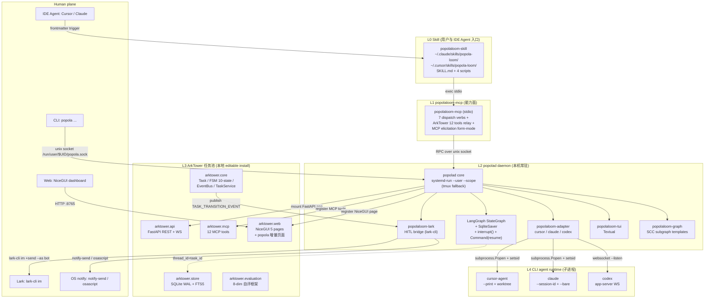

# PopolaLoom · 项目设计规格 (Spec) v1.0

> 状态: ✅ R4 锁定 (2026-05-03)
> 上游决策: `research/06-decision-and-routes.md` (用户答案 Q1–Q9 + ArkTower Verdict C)
> 维护者: PopolaLoom 项目组
> 变更协议: 后续每个变更在 `.local/.agent/active/<change-id>/spec.md` 表达增量 (DevolaFlow A-4 工作区准则)
> 关联 ADR: `adrs/0001-arktower-as-task-pool-dependency.md`、`adrs/0002-langgraph-as-graph-engine.md`
> 上游 Research dossier: `research/01-repo-landscape.md`、`02-cli-capabilities.md`、`03-dependency-methodology.md`、`04-industry-best-practices.md`、`05-interaction-patterns.md`、`08-arktower-deep-dive.md`

---

## 1. 项目使命 (Mission)

PopolaLoom 是 DevolaFlow 之上的本机常驻"织机式"元编排器: 通过 `popolad` daemon + ArkTower 任务池 + LangGraph 子图,在 Cursor/Claude/Codex 等多 CLI 之上提供依赖图、HITL、attach/resume 与跨终端存活的一等公民支持,把"跨 CLI 派发 + 持久化进程总线 + Lark+IDE 三通道 HITL"做成开发者桌面的 sidecar 服务,Phase 1 必须自带"派自己研发自己"的自闭环验证(出处: 06 §0 + §1.1)。

---

## 2. 范围 In / Out (Scope)

### 2.1 In(Phase 1 必含)

- **进程层**: 本机 `popolad` daemon, Python 3.11+, 默认 `systemd-run --user --scope` 启动 + tmux fallback (出处: 06 D3, 04 §A6, 02 §"哪些 CLI 天然支持 daemon")
- **派发层**: 7 个顶层 Conductor 原语 `dispatch / attach / relay / supervise / federate / handoff / probe`,每个原语自带 idempotency / retry / state-machine 契约 (出处: 06 D10 + §5.2)
- **CLI 适配层**: Phase 1 三个 adapter `cursor / claude / codex`,各自暴露 `spawn / send / status / attach / kill / cost-meter` 6 个动作 (出处: 02 §"PopolaLoom 派发抽象建议-1", 04 §七)
- **图引擎**: LangGraph 1.x StateGraph + SqliteSaver(主)+ NDJSON 旁路;dev↔test cycle 装在 SCC subgraph 内,外层 task DAG 严格无环 (出处: 03 §3 + §7.1, ADR-0002)
- **任务池层**: ArkTower 0.1.x 本地 editable install,直接 `import` 复用 9 个组件 (`core.models / core.state_machine / core.event_bus / core.task_service / store.* / api.* / mcp.* / web.* / archive.*`),不修改其源代码 (出处: 08 §7.2 + §8.4, ADR-0001)
- **HITL 通道**: 三通道并发触发 = Lark 主推(`lark-cli im`)+ IDE 桌面通知(`notify-send` / `osascript`)+ signal 持久化(LangGraph `interrupt()` + ArkTower `INPUT_REQUIRED` FSM) (出处: 06 D7, 05 §"必须避免的 5 个失败模式"-1, 08 §3.6)
- **前端**: Textual TUI(自写)+ 复用 ArkTower NiceGUI 5 页仪表盘并增量挂载 PopolaLoom 自有页面 (出处: 06 §0.0 Q2 答案, 08 §7.2)
- **入口**: `popolaloom-mcp` (stdio MCP server, 7 dispatch verbs + ArkTower 12 tool 转发) + `popolaloom-skill` (Cursor `~/.cursor/skills/` 与 Claude `~/.claude/skills/` 双安装) + `popola` CLI (unix socket 直连 daemon) (出处: 05 §"候选 C: Hybrid", 06 R3/R4 路线)
- **自演化**: DevolaFlow `self-update` workflow 内嵌 + 8-dim 自评(复用 ArkTower 评估框架) + auto-merge PR (Protected Branch 规则强制) (出处: 06 D9, 06 §0.0 Q8 答案, 工作区规则 "Protected Branch Workflow")
- **观测**: NDJSON event log Day-1 + Prometheus `/metrics` 端口 + OpenTelemetry trace_id 接入 (出处: 06 D14, 02 §"GitHub Copilot 内置 OTel")

### 2.2 Out(Phase 1 不做)

- 单 CLI 内部的 prompt engineering / agent loop / tool calling — DevolaFlow 范畴 (出处: 06 §1.1)
- Kimi + Copilot adapter — Phase 2 增量 (出处: 06 §0.0 Q4 答案)
- 多机 / 分布式 worker pool — Phase 3+ (出处: 06 §1.3)
- 远程 popolad / Cloud agent 默认路径 — Phase 2 可选支持 (出处: 06 §0.0 Q9 答案)
- 自训练 / 自调参 LLM — 模型层职责 (出处: 06 §1.1)
- 商业化 SaaS / SSO / multi-tenant — out of scope
- Web UI 深度自定义 — 复用 ArkTower 5 页 NiceGUI + 增量页面已足够 (出处: 08 §7.2)
- mosh 风格的网络层会话漂移 — `attach` 走 server-client + Event-History-as-Truth 即可 (出处: 05 §"Attach/Detach/Re-enter")
- 派发器自己写代码 — 公理 A2 严格红线 (出处: 04 §A2, 04 §五-1)
- 跨节点反向边破坏 DAG — 反模式 AP-2 (出处: 03 §0 TL;DR-5, 03 §7.5)

### 2.3 Phase 边界

| Phase | 时间窗 | 新增能力 | 不做 |
|---|---|---|---|
| Phase 1 (Day 0–10) | MVP | 上述 §2.1 全部 | §2.2 全部 |
| Phase 2 (Week 2–4) | 扩展 | Kimi + Copilot adapter / Cursor Cloud Agent / Streamable HTTP MCP / Web UI 增量页面 / OTel 全套 | 多机 / 商业化 / 自训练 |
| Phase 3 (Month 2+) | 演进 | A2A 协议 / 远程 popolad / Slack/Lark Bot 全功能 / AFlow 自动生成 primitive | 多租户 / 移动端 |

---

## 3. 体系架构 (Architecture)

### 3.1 5 层组件图 (Mermaid)



> 五层均为"按职责分离"而非"按部署单元",L0/L1 与 L2 在同一 OS user 进程组,L3 直接 `import` 进 L2 的 Python 解释器(出处: 08 §7.5 推荐 import 模式)。L4 是被 L2 spawn 的子进程,通过 systemd-run user scope 或 tmux session 跨终端存活。

### 3.2 模块清单

| 模块 | 路径 (planned) | 责任 | 主要依赖 | 来源 (自写 / 复用) |
|---|---|---|---|---|
| `popolad daemon` | `popolaloom/daemon/` | 进程托管 + DAG 调度 + LangGraph 编译 + 派发主循环 + signal 持久化 | systemd-run / tmux / ArkTower TaskService / LangGraph / SqliteSaver | **自写** (出处: 06 D3 + 06 §9 Day-1) |
| `popolaloom-mcp` | `popolaloom/mcp/` | 7 dispatch verbs (`submit / list / status / attach / feedback / cancel / inject`) + ArkTower 12 tools 转发 | popolad RPC + arktower.mcp 共享注册器 | **自写**;ArkTower 12 tools **直接复用** (出处: 06 D1, 08 §7.2 row "mcp") |
| `popolaloom-skill` | `popolaloom/skill/` (产物 → `~/.{claude,cursor}/skills/popola-loom/`) | Skill 入口 (SKILL.md + 4 scripts: `submit.sh / status.sh / attach.sh / feedback.sh`);frontmatter `description` 触发宿主 IDE Agent 加载 | popolaloom-mcp;popola CLI;无运行时依赖 | **自写** (出处: 05 §"候选 C: Hybrid", 06 §"R3 7-Day MVP" Day-5) |
| `popolaloom-tui` | `popolaloom/tui/` | Textual TUI: DAG 视图 / log tail / interrupt 列表 / status 看板 | popolad RPC + Textual ≥ 0.x;Rich | **自写** (出处: 06 D1 R4 增项, 01 §5.1 sfw/loom 参考) |
| `popolaloom-web` | `popolaloom/web/` | NiceGUI 仪表盘扩展: 在 ArkTower 5 个 page 之外挂载 PopolaLoom 自有的 `runtime supervisor / attach console / hitl inbox / federate consensus` 4 页 | arktower.web.dashboard / theme / i18n | **复用 ArkTower 框架 + 增量 4 页** (出处: 08 §7.2 row "web") |
| `popolaloom-adapter` | `popolaloom/adapters/{cursor,claude,codex}.py` | per-CLI subprocess wrapper (`spawn / send / status / attach / kill / cost-meter`) + 流式 NDJSON 解析 + 预生成 session ID | cursor-agent / claude / codex CLI binary;Python `subprocess` + `asyncio` | **自写** (出处: 02 §每个 CLI 的接入要点 + §"PopolaLoom 派发抽象建议", 04 §七) |
| `popolaloom-lark` | `popolaloom/lark/` | Lark HITL bridge: 订阅 ArkTower EventBus `TASK_TRANSITION_EVENT`,在 `to_status == INPUT_REQUIRED` 时拉起 lark-cli `im +send` 与互动卡 | lark-cli `im` / `task` / `doc`(已有 SKILL);arktower.core.event_bus | **自写**(调用 `lark-cli` 体系) (出处: 06 D7, 08 §6.4 EventBus hook) |
| `popolaloom-graph` | `popolaloom/graph/` | LangGraph subgraph 模板库: dev↔test SCC subgraph、Gen-Verifier loop、Federate fan-out subgraph、Gate-decision node | langgraph ≥ 0.6 + langgraph-checkpoint-sqlite + langchain-core | **配置 + 编排层(LangGraph 编译期模板)** (出处: 03 §3.5, 03 §7.3, 03 §6 模式 B) |
| `popolaloom-core` | `popolaloom/core/` (薄包装层) | 任务池核心 = ArkTower `import` 侧 facade:`Task / TaskEvent / Dependency / TaskStatus / Trigger / TaskService / EventBus` 重导出 + `005_popolaloom_extensions.sql` migration 注入 | ArkTower core + store + api + mcp + web | **复用 ArkTower 100% 核心 + 增量 migration** (出处: 08 §7.2 + §8.4 import 列表) |

> 9 个模块,4 个明确"自写",1 个明确"复用 ArkTower 100%",2 个"自写但调用上游 skill",2 个混合(adapter 是自写但围绕 CLI 边界,web 与 graph 是配置层)。来源比例约 **自写 60% / 复用 ArkTower 30% / 复用 LangGraph + lark-cli 10%**(出处: 08 §7.2 末尾统计)。

### 3.3 数据流: 调度 happy path (ASCII 序列图)

> 场景: 用户在 Cursor IDE 里输入"提交一个 4 任务 plan: research → design → impl → test",一切顺利,无 HITL 中断。

```
Time   Actor                         Action                                                       Primitive
─────  ────────────────────          ────────────────────────────────────────────────             ──────────
T+0    User (Cursor IDE)             "提交 plan.yaml 给 PopolaLoom 跑起来"
T+1    Cursor IDE Agent              检测 SKILL.md frontmatter (description 含 "orchestrate ...")  (Skill Level 2)
T+2    Cursor IDE Agent              spawn `popolaloom-mcp --stdio` (来自 SKILL.md 触发脚本)
T+3    Cursor IDE Agent              call popola_submit_plan({plan_yaml})
T+4      popolaloom-mcp              unix socket → popolad
T+5        popolad                   接收 ConductorDispatch (PopolaLoom 顶层包装)
T+6        popolad.graph             LangGraph compile DAG: T1 → T2 → T3 → T4
T+7        popolad.core              ArkTower TaskService.create_task() x 4 (赋 task_id, parent_id 链)
T+8        ArkTower TaskService      4 个 INSERT tasks; bus.publish TASK_TRANSITION_EVENT(submitted)
T+9        popolad.core              SqliteSaver.put(thread_id=plan_id, super-step 0)
T+10       popolad.adapter.cursor    pre-create chat: `cursor-agent create-chat` → chatId
T+11       popolad.adapter.claude    uuidgen → claude --session-id <UUID>
T+12       popolad.adapter.codex     uuidgen v7 → `codex exec -c session.id="$UUID"`
T+13       popolad.dispatcher        spawn T1 (research) via systemd-run --user --scope --unit=popola-T1
T+14         L4 cursor-agent (T1)    NDJSON stdout → popolad.event_log/<plan_id>.jsonl + ArkTower TaskEvent
T+15       popolad.supervisor        每 5s 心跳: 读 NDJSON 末尾 + token usage + exit code
T+30       T1 completed              popolad.adapter.cursor 检测 exit=0 + final-message-only 抓取
T+31       popolad.core              advance_task(T1, COMPLETE) → ArkTower FSM IN_PROGRESS → COMPLETED
T+31       popolad.graph             LangGraph state["T1"]=completed → conditional edge 检查
T+32       popolad.dispatcher        T2 (design) 派发到 cursor;handoff envelope 中携带 T1 final artifact
T+50       T2 completed              同上,fanout 到 T3 + T4 (DAG 上 T3, T4 并行)
T+51       popolad.dispatcher        T3 (impl, claude) + T4 (test, codex) 同时启动
T+52       popolad.relay             跨 CLI handoff: T2 → T3, T2 → T4 各自带 owned_files 契约
T+90       T3 + T4 completed         popolad.gate-decision (复用 DevolaFlow gate composite_score 公式)
T+91       popolad.core              composite_score = 0.30·test + 0.30·review + 0.20·arch + 0.20·bench
T+92       popolad                   composite ≥ 0.85 (standard profile) → plan = COMPLETED
T+93       popolad.event_log         emit plan.completed CloudEvents 1.0 信封
T+94       popolad → notify-send     "P-001 完成, 4/4 task pass"
T+95     User → Cursor IDE Agent     "看一下结果"
T+96     Cursor IDE Agent            popola_get_status("P-001") + popola_tail_log
T+97     popolad → IDE               返回结构化 ProbeReport (含 artifacts, scores, NDJSON tail)
```

> 核心特性: **跨终端存活**(T+12–T+13 的 `systemd-run --user --scope` 让子进程在 IDE 关闭时仍存活,出处: 02 §"哪些 CLI 天然支持 daemon"-systemd-run);**事件溯源**(T+14 同时写 ArkTower TaskEvent + NDJSON event_log,双轨,出处: 03 §5.5);**SCC 透明**(T+91 是单个 gate-decision 节点,如果分数不够则在 LangGraph subgraph 内自循环 dev↔test,外层 dispatcher 仅看到 DAG,出处: 03 §0 TL;DR-1)。

### 3.4 数据流: HITL interrupt (Lark + IDE + signal 三通道)

> 场景: T3 (impl, claude) 跑到一半发现需要选择数据库(postgres vs sqlite),触发 HITL。用户当时关闭了 Cursor IDE。

```
Time     Actor                       Action                                                          Primitive
───────  ────────────────────        ───────────────────────────────────────────────────────────    ──────────
T+60     L4 claude (T3)              NDJSON: {"type":"needs_input","schema":{"enum":["postgres","sqlite"]},"message":"Which DB?"}
T+61     popolad.adapter.claude      解析 needs_input → 调用 popolad.signal.persist()
T+62     popolad.core                ArkTower TaskService.advance_task(T3, REQUEST_INPUT)
T+62     ArkTower FSM                IN_PROGRESS → INPUT_REQUIRED (state_machine.py:11)
T+62     ArkTower EventBus           publish TASK_TRANSITION_EVENT(T3, "INPUT_REQUIRED")
T+63     popolad.lark                订阅器收到 event → 构造 Lark 互动卡 (Block Kit 风)
T+63     popolad.lark                lark-cli im +send --as bot --chat-id $USER_OC_ID --card "..."
T+64     popolad.lark                                                  ─── 飞书消息 + 互动卡 → 用户手机
T+64     popolad.notify              notify-send "PopolaLoom T-3 needs input" (Linux IDE 仍在线时)
T+64     popolad.signal              SqliteSaver.put(thread_id=T3, channel="__interrupt__", value={schema, message})
T+64     popolad.event_log           写 task.elicited (CloudEvents type="task.elicited")
T+64     popolad.lark                同时 lark-cli task +create 把 T3 加进用户的飞书任务收件箱 (兜底)

(用户合上 IDE 8 小时, popolad 在 systemd user unit 中继续跑)

T+8h+0   User                        飞书收到卡片 → 点击 "postgres" 按钮
T+8h+1   Lark webhook                interactive event → 由 lark-cli event consume <key> 拉到 popolad
T+8h+2   popolad.lark                解析 button_value="postgres" + signed action_id (防伪)
T+8h+3   popolad.signal              LangGraph Command(resume="postgres") + SqliteSaver clear interrupt
T+8h+4   popolad.core                ArkTower advance_task(T3, RESUME) FSM → IN_PROGRESS
T+8h+5   popolad.adapter.claude      把 "postgres" 通过 stdin / unix socket 注入 T3 子进程
T+8h+6   L4 claude (T3)              收到 follow-up,继续生成代码
T+8h+10  T3 completed                composite_score 计算

(用户重开 IDE 走另一条路径 — 也接受 IDE 内反馈)

T+8h+0'  User                        重开 Cursor IDE: "T-3 怎么样了?"
T+8h+1'  Cursor IDE Agent            popola_get_status("T-3") (拉模型)
T+8h+2'  popolad                     返回 status=INPUT_REQUIRED + pending_interrupts=[{schema,message}]
T+8h+3'  Cursor IDE Agent            MCP elicitation/create (form mode + enum) 弹给用户
T+8h+4'  User                        UI 选 "postgres"
T+8h+5'  Cursor IDE Agent            popola_supply_feedback("T-3", "postgres")
T+8h+6'  popolad                     与 T+8h+3 起的路径合流 (相同的 Command(resume=...))

(冷启动恢复 — daemon 自身崩溃 → 重启)

Tcrash   popolad                     SIGKILL / OOM
Trecov   systemd                     auto-restart popola.service
Trecov+1 popolad                     SqliteSaver.list() → 找到 T3 thread_id 在 __interrupt__ 状态
Trecov+2 popolad                     ArkTower 数据库扫 INPUT_REQUIRED tasks → 重建监听
Trecov+3 popolad                     resume 后续 LangGraph Command(resume=...) 处理
```

> 三通道防御纵深:Lark 主推(off-IDE 100% 可达,出处: 06 §0.0 Q6 答案),IDE 桌面通知(在线场景立即可见),signal 持久化(daemon 崩溃 / 用户离线 8h 都不丢);任一通道独立完成"提示用户 + 收集决策 + resume task"全链路,无单点 (出处: 05 §"必须避免的 5 个失败模式")。

### 3.4.1 Self-bootstrap 测试场景目录 (Phase 1 入仓 5 例)

> 这 5 个场景是 PopolaLoom 项目的"国王评测",直接进 `tests/self_bootstrap/`,CI 必跑,与 NFR-5/8/10 配对(出处: 06 §6.2)。

| # | 场景 | 验收信号 | 失败信号 | 与 NFR 对应 |
|---|---|---|---|---|
| **S1** | "PopolaLoom 派 1 个 research-only task 给 cursor,终端关闭后重开能 attach 到任务并取得最终结果" | task_id 一致,final report 可读,中间未中断 | NDJSON event log 缺失 / SqliteSaver thread_id 不能重入 | NFR-5 (≥99% 跨终端存活) |
| **S2** | "PopolaLoom 派 dev → test 循环 task 给 (claude → codex),第一轮 test 失败 → 自动注入 reinforcement rule → 第二轮 PASS" | composite_score 第二轮 > 第一轮且 ≥ 0.85 | reinforcement_rules 未注入 / test 未跑 | NFR-10 (收敛轮数 ≤ 3) |
| **S3** | "PopolaLoom 派 plan 给 PopolaLoom 自己(递归),子 PopolaLoom 在不同 thread_id 下跑,父通过 attach 拿结果" | thread_id 树形隔离,子 plan 完成后父收到 summary | LangGraph subgraph checkpoint namespace 冲突 / event log 串扰 | (递归正确性) |
| **S4** | "用户提交 plan,进入 awaiting_input 后 IDE 关闭 8 小时,重开 IDE 后通过 status 拉到 pending interrupt 并 supply_feedback" | T-X 状态从 awaiting_input → in_progress → completed | MCP elicitation 在 IDE 关闭期间未持久化 / Lark 通道未触发 | NFR-6 (HITL 通知 ≤ 5s) + NFR-8 |
| **S5** | "PopolaLoom 派 1 个跨 CLI handoff (cursor planner → claude implementer → codex tester),全过程 trace 完整" | relay 原语输出每跳 handoff_envelope, owned_files 不冲突 | full_trace 丢失 (Cognition 反例 04 §1.9) / file ownership 冲突 | (Cross-CLI handoff 完整性) |

### 3.5 关键 Schemas

#### 3.5.1 `TaskDispatch` (与 DevolaFlow `task-dispatch.schema.yaml` 对齐)

复用 DevolaFlow 14 个字段(`task_id / kind / role / goal / context_refs / acceptance_criteria / owned_files / readonly_files / handoff_inbox / budget / parent / siblings / dispatch_id / version`),并在 PopolaLoom 顶层新增字段(出处: 02 §"统一 dispatch 接口"):

```yaml
# PopolaTaskDispatch (extends DevolaFlow TaskDispatch)
cli: enum[cursor, claude, codex]                # PopolaLoom-specific
cli_version: string                              # 锁版本以避免 CLI 漂移 (出处: 06 R7-2)
runtime: enum[local, cursor-cloud, codex-cloud]  # Q9 答案默认 local
supervisor: enum[systemd-run, tmux, nohup]       # 默认 systemd-run --user --scope
sandbox: enum[read-only, workspace-write, danger-full-access]  # 对齐 codex 三档
worktree: string?                                 # cursor-agent -w
session_id: string?                               # 预生成 (claude --session-id / cursor create-chat / codex -c session.id=)
mcp_servers: dict?                                # popolad 注入临时 MCP 清单
hooks: dict?                                      # claude 一等支持
output_format: enum[text, json, stream-json]      # 默认 stream-json
output_sink: { type: file|socket|http, target }
budget: { max_tokens, max_wallclock_minutes, max_budget_usd }
detach: enum[none, tmux, systemd-run, screen, nohup]  # 默认 systemd-run
auth_mode: enum[env, oauth-shared, key-file]      # 默认 env (popolad 不存凭据)
```

> ArkTower `Task` model 已含 42 字段,其中 6 组 DevolaFlow-derived (出处: 08 §3.2),PopolaLoom 上述新增字段塞进 `Task.parameters` (dict 字段,无 schema 限制) 或扩展 `005_popolaloom_extensions.sql` migration,**不动 ArkTower 核心 schema**。

#### 3.5.2 `ConductorDispatch` (PopolaLoom 顶层包装)

```yaml
ConductorDispatch:
  plan_id: UUID                                  # PopolaLoom 顶层 ID
  plan_dag: { nodes: PopolaTaskDispatch[], edges: { from, to, type: BLOCKS|RELATES_TO|HITL_GATE }[] }
  strategy:
    voting: enum[majority, best_score, all_agree]?  # federate 用
    cycle: { type: gen-verifier, max_iter: 10, gate_threshold: 0.85 }?
    parallelism: { max_concurrent: int, per_cli: dict }
  hitl_policy:
    channels: [lark, ide, signal]                 # 三通道默认全开
    severity_routing: { low: ide, medium: lark+ide, high: lark+ide+signal+oauth }
    timeout_minutes: int?                          # handoff 超时自动升级
  observability:
    trace_id: string                              # OpenTelemetry compatible
    event_log_path: string                        # ~/.popola/events/<plan_id>.jsonl
    metrics_endpoint: "http://127.0.0.1:9876/metrics"
```

#### 3.5.3 `StatusReport` (复用 DevolaFlow + 新增 `attach_endpoint`)

```yaml
# extends DevolaFlow status-report.schema.yaml
status: enum[submitted, queued, in_progress, awaiting_input, blocked, review, completed, failed, canceled, timed_out]
progress_pct: float?                              # 来自 DevolaFlow (08 §6 ev14 字段扩展)
artifacts: list[{ path, sha256, size }]
metrics: { tests_passed, tests_failed, tokens_used, wallclock_s }
findings_by_severity: { blocker, critical, major, minor, info }
attach_endpoint: string                           # PopolaLoom 新增: unix socket path 或 ws:// URL
pending_interrupts: list[Interrupt]               # PopolaLoom 新增: 一次返回所有等待的 HITL
gate_decision: { composite_score, profile, threshold, ready }
```

#### 3.5.4 `LarkInterrupt` (PopolaLoom 新增,4 字段最小)

```yaml
LarkInterrupt:
  task_id: UUID
  schema: JSONSchema                              # 通常 enum-only (避免 Argo string-input bug)
  message: string                                 # 给用户看的提问
  action_id_signed: string                        # HMAC 签名,防伪 (popolad secret + plan_id + ts + nonce)
```

> 互动卡按钮 callback 走 `lark-cli event consume <event-key>` (出处: lark-event SKILL),popolad 校验 signed action_id 后才调 `Command(resume=...)`。

#### 3.5.5 NDJSON Event Envelope (CloudEvents 1.0 套用)

```jsonl
{"specversion":"1.0","id":"evt-01HJ...","source":"popola/popolad","type":"plan.created","time":"2026-05-03T02:00:00Z","datacontenttype":"application/json","subject":"P-2026-05-03-01","data":{"plan_id":"P-...","dag":{...}}}
{"specversion":"1.0","id":"evt-02HJ...","source":"popola/T-1","type":"task.dispatched","time":"...","subject":"T-1","data":{"task_id":"T-1","cli":"claude","pid":12345,"unit":"popola-T-1","native_session_id":"<UUID>"}}
{"specversion":"1.0","id":"evt-03HJ...","source":"popola/T-1","type":"task.elicited","time":"...","data":{"task_id":"T-1","schema":{...},"message":"Which DB?"}}
{"specversion":"1.0","id":"evt-04HJ...","source":"popola/T-1","type":"human.responded","time":"...","data":{"task_id":"T-1","value":"postgres","by":"user@host","via":"lark"}}
{"specversion":"1.0","id":"evt-05HJ...","source":"popola/T-1","type":"task.completed","time":"...","data":{"task_id":"T-1","exit_code":0,"artifacts":["..."]}}
```

事件类型空间(discriminated union,出处: 05 §"推荐的事件流格式"):
- `plan.{created,completed,paused,canceled}`
- `task.{created,dispatched,heartbeat,tool_call,output,elicited,completed,failed,canceled,injected}`
- `human.{responded,canceled,injected}`
- `dag.{updated}`
- `popolad.{started,stopped,gc,checkpoint}`

---

## 4. 任务原语 (Stage Primitives)

### 4.1 直接继承 DevolaFlow 14 个 stage primitives (零修改)

来源: DevolaFlow `references/meta-framework.md` §2.1–§2.14。每个原语在 PopolaLoom 中保持类型契约不变,仅在派发时把"执行体"换成被 popolad 派发的 CLI 子进程(出处: 06 §5.1)。

| Primitive | 类别 | Input → Output | PopolaLoom 中的派发去向 | inherit / extend |
|---|---|---|---|---|
| **research** | DISCOVER | `ResearchRequest → ResearchReport` | 派给 cursor + WebSearch 或 codex + 知识库 | inherit (零修改) |
| **analyze** | DISCOVER | `AnalyzeRequest → AnalysisReport` | 路由到 claude architect 模型,或多 CLI federate 投票 | inherit |
| **design** | SHAPE | `DesignRequest → DesignDocument` | 派 cursor (IDE 集成视角) | inherit |
| **plan** | SHAPE | `PlanRequest → ImplementationPlan` | **PopolaLoom DAG 调度直接基于此 schema** | inherit (核心) |
| **implement** | BUILD | `ImplRequest → ImplResult` | **委派给 CLI agent**(claude / cursor / codex);PopolaLoom 仅保留协议契约(owned_files / AC) | extend (执行体外置) |
| **refine** | BUILD | `RefineRequest → RefineResult` | 复用 Reinforcement Rules,把上一轮 finding 注入下一轮 dispatch | inherit |
| **review** | VERIFY | `ReviewRequest → ReviewVerdict` | **关键: 让"另一家 CLI"评审**(codex review claude code,反 echo chamber, 出处: 04 §1.9 Devin Review +90.2%) | extend (multi-CLI peer) |
| **test** | VERIFY | `TestRequest → TestResult` | 派 codex (sandbox 标杆)或 cursor (IDE 跑测) | inherit |
| **validate** | VERIFY | `ValidateRequest → ValidationReport` | 直接复用 | inherit |
| **verify** | VERIFY | (用户面向验证: visual / AC / interaction / a11y) | 直接复用,verify_config 已完备 | inherit |
| **release** | DELIVER | `ReleaseRequest → ReleaseRecord` | 直接复用 | inherit |
| **deploy** | DELIVER | `DeployRequest → DeployResult` | 直接复用 | inherit |
| **monitor** | DELIVER | `MonitorRequest → MonitorReport` | 直接复用 | inherit |
| **gate** | CONTROL | (聚合 review + test → ready/not-ready) | **核心复用**, 增加跨 CLI agent 的 gate 维度(`agent_consistency`, `runtime_health`) | extend (新增维度) |

### 4.2 新增的 PopolaLoom 顶层 Conductor 原语 (7 个)

> 这 7 个原语解决 PopolaLoom 独有的 (a) 跨 CLI 编排、(b) 持久化进程总线、(c) attach/resume、(d) MCP 暴露 四件事。每行附完整契约 (出处: 06 §5.2)。

| 原语 | 输入 | 输出 | 状态机 | 与 DevolaFlow 关系 | 幂等 |
|---|---|---|---|---|---|
| **dispatch** | `DispatchRequest { task: PopolaTaskDispatch, runtime, supervisor, parent_thread_id? }` | `DispatchResult { task_id, native_session_id, supervisor_unit, started_at }` | `pending → dispatched → in_progress → (awaiting_input \| completed \| failed)` | 是 PopolaLoom 跨 CLI 派发原语;DevolaFlow `Task` 工具是单 CLI 内派发,层级不同 | 否(但 task_id 预生成保证可恢复) |
| **attach** | `AttachRequest { task_id, since_seq?, follow }` | `AttachStream { events: NDJSON_iter, current_state, pending_interrupts }` | (只读) | DevolaFlow 无 attach 原语;tmux server-client + LangGraph thread_id 双重支持 | 是(多 client 可并发 attach) |
| **relay** | `RelayRequest { from_task_id, to_cli, payload_filter?, context_strategy: full_trace\|summary\|diff_only }` | `RelayResult { new_task_id, handoff_envelope }` | `from: in_progress → relayed; new: pending → dispatched` | 借鉴 OpenAI Agents SDK Handoff (04 §1.2) + Cognition 公理 A5 "share full agent traces" | 否 |
| **supervise** | `SuperviseRequest { task_id, gate_policy, budget, health_check_interval_s }` | `SuperviseDecision { action: continue\|pause\|escalate\|kill, reason }` | 周期性触发 | DevolaFlow `gate` 是 stage 级闸门,单次评估;PopolaLoom `supervise` 是 task 级"监理",周期评估 | 是(每次重新评估当前状态) |
| **federate** | `FederateRequest { task: TaskDef, replicas: [{cli, model}], voting: majority\|best_score\|all_agree, consistency_threshold }` | `FederateResult { winning_artifact, votes: [...], consistency_score }` | `pending → fanned_out → all_completed → consensus_evaluated → (succeeded \| failed)` | DevolaFlow 无;借鉴 Cursor 2.0 best-of-N (04 §1.5) + Plandex race | 是(相同输入相同输出,但代价高) |
| **handoff** | `HandoffRequest { task_id, schema, message, mode: human-before-action \| human-on-exception \| human-after-action, timeout_minutes? }` | `HandoffResult { decision, comments?, by, decided_at }` | `awaiting_input → (responded \| timeout \| canceled)` | DevolaFlow 有 escalation chain (in-process);PopolaLoom `handoff` 跨进程持久化, 配合 LangGraph `interrupt() + Command(resume=...)` (出处: 03 §3.4) | 是(重复 handoff 同一 schema 应得相同 prompt) |
| **probe** | `ProbeRequest { scope: task\|plan\|all, filter?, depth: summary\|full }` | `ProbeReport { tasks, plan_dag, pending_interrupts, resource_usage }` | (只读) | DevolaFlow STATUS.yaml 是单 task 状态;PopolaLoom `probe` 是跨 task / 跨 plan 聚合查询(含 DAG / pending interrupts / token usage) | 是 |

### 4.3 原语之间的协作规则 (S-8 invariant 扩展)

- 任意时刻同一 `owned_files.txt` 集合的 **写令牌**只授给一个 dispatch (公理 A1, 出处: 04 §A1, DevolaFlow S-8)
- `relay` 必须强制 schema validation,子 CLI 之间不允许直接消息,**必须经 popolad 中转**(防御反模式 AP-5 multi-agent prompt injection cascade,出处: 04 §A5 + 04 §六-1)
- `dispatch` 之前 popolad **不写任何业务代码**,工具白名单严格不含 Write/Edit/Shell-write (公理 A2, 出处: 04 §A2);CI 强制扫 popolad 进程的实际写文件操作
- `interrupt()` 之前的所有写操作必须 idempotent (公理 A8, 出处: 03 §7.5 反模式 2);unit test 强制覆盖
- `federate` 默认 `parallelism.max_concurrent=1`,只在 `parallelizable: true` 显式声明时扇出 (公理 A4, 出处: 04 §A4 Google 量化数据)

---

## 5. 依赖契约 (Dependency Contracts)

### 5.1 ArkTower (本地 editable / git main 二选一)

- **来源**: `https://github.com/YoRHa-Agents/ArkTower` (同 org `YoRHa-Agents`,与 DevolaFlow 同源,出处: 08 §1.1)
- **版本**: `0.1.0` (latest commit `467a087` @ 2026-05-03,有 4 个 PR 当天合入,出处: 08 §1.2)
- **License**: MIT (允许直接 import + 商用)
- **依赖方式**: **本地 editable install** (`pip install -e ../reference/ArkTower` 推荐,出处: 08 §7.5 + ADR-0001)
- **暴露面**:
  - 12 MCP tools (`create_task / list_tasks / get_task / claim_task / complete_task / search_tasks / get_pool_stats / get_next_task / advance_task / fail_task / archive_task / create_from_template`,出处: 08 §6 keyfact-6 + arktower/mcp/server.py)
  - Python API: `arktower.core.{models, state_machine, event_bus, task_service}` + `arktower.store.{connection, sqlite_repository, migration}` + `arktower.api.{rest_routes, ws_manager}` + `arktower.mcp.server` + `arktower.web.{dashboard, theme, i18n}` + `arktower.archive.*` + `arktower.evaluation.runner`
  - REST + WS endpoints (uvicorn factory,popolad mount 进自身 ASGI 树,出处: 08 §7.2 row "api")
- **PopolaLoom 不修改 ArkTower 源代码**, 但需要的扩展通过:
  - `005_popolaloom_extensions.sql` migration (新增 `popola_dispatch / popola_relay / popola_handoff_signal` 三张关联表)
  - PopolaLoom 自有 NiceGUI 增量页面 (mount 到同一 NiceGUI app)
  - PopolaLoom 自有 MCP tools 注册到同一个 mcp.Server (Phase 1 还是各 server 独立,出处: ADR-0001 Status section)
- **Sibling-intent issue 必要性**: 推荐 R4 Day-0 之前在 ArkTower 仓库提一个 *"sibling project intent"* issue,声明依赖与协作模式 (出处: 08 §10 Q1)

### 5.2 DevolaFlow (pip install)

- **来源**: `https://github.com/YoRHa-Agents/DevolaFlow` (PopolaLoom 是 DevolaFlow 的"楼上一层 L-1 Conductor",出处: 06 §"5 句话主张"-1)
- **版本**: ≥ 10.1.0 (SKILL.md 当前版本)
- **依赖方式**: `pip install` (releaseable wheel, `--mode=core` shorthand v9.2.3+)
- **暴露面**:
  - 14 stage primitives (`references/meta-framework.md` §2.1–§2.14)
  - 4-layer agent hierarchy (L0 Project / L1 Stage / L2 Wave / L3 Task)
  - gate composite_score 公式 + reinforcement rules
  - `self-update` workflow
  - schemas: `task-dispatch.schema.yaml` / `status-report.schema.yaml` / `handoff-deliverable.schema.yaml`
- **PopolaLoom 内嵌为子工作流**: PopolaLoom 派发的每个 implement task 内部可跑一个 DevolaFlow workflow,形成"L-1 PopolaLoom (跨 CLI) → L0 DevolaFlow (单 CLI 内 4 层)"嵌套 (出处: 06 §1.2 Mermaid)

### 5.3 LangGraph (pip install)

- **版本**: `langgraph >= 0.6` + `langgraph-checkpoint-sqlite` (出处: ADR-0002, 03 §3.3)
- **License**: MIT
- **暴露面**: `StateGraph / SqliteSaver / interrupt() / Command(resume=...) / subgraph / conditional_edges`
- **PopolaLoom 用法**:
  - **主图**: 每个 plan 编译为一个 LangGraph 实例, thread_id = plan_id
  - **subgraph**: dev↔test cycle、Gen-Verifier loop、Federate fan-out 各自一个 subgraph 模板
  - **持久化**: SqliteSaver(`~/.popola/state.sqlite`),NDJSON 旁路(`~/.popola/events/<plan_id>.jsonl`),双写 (出处: 03 §5.5)
  - **HITL**: `interrupt()` 直接对应 `handoff` 原语,`Command(resume=...)` 对应 `popola_supply_feedback` (出处: 03 §3.4)

### 5.4 lark-cli (本机 skill,无 pip 依赖)

- **来源**: 本机已安装(`lark-cli` binary 加 `~/.claude/skills/lark-im/`、`~/.claude/skills/lark-task/`、`~/.claude/skills/lark-doc/`、`~/.claude/skills/lark-event/` 等 skill 目录)
- **暴露面** (Phase 1 仅用 4 个动作,出处: lark-im / lark-task / lark-event SKILL.md):
  - `lark-cli im +send --as bot --chat-id ... --card "..."` (互动卡推送)
  - `lark-cli task +create --as user ...` (兜底任务收件箱)
  - `lark-cli event consume <event-key>` (订阅互动卡 button click)
  - `lark-cli auth login` (一次性认证)
- **PopolaLoom 调用方式**: `popolaloom-lark` 模块通过 `subprocess.run(["lark-cli", ...])` 调用,**不直连 Lark OpenAPI**,**不存任何 token**,完全复用 lark-cli 已认证态 (出处: lark-shared SKILL.md 安全规则)
- **认证依赖**: 用户必须先 `lark-cli auth login` 一次,且 git email 为 `*@neolix.ai` (出处: 工作区规则 "Auto-upload session transcripts via devpath-upload")

### 5.5 系统层依赖

| 项 | 最低版本 | 用途 | fallback |
|---|---|---|---|
| Python | 3.11+ | 全栈语言 | 无 |
| systemd (user) | 245+ | popolad daemon 启动 + 子进程托管 | tmux fallback (出处: 06 D3) |
| tmux | 3.3+ | systemd 不可用时的 supervisor | nohup 最小回退 (容器内) |
| SQLite | 3.35+ (WAL + FTS5) | LangGraph SqliteSaver + ArkTower store | 无(必需) |
| git | 2.30+ | worktree per task | 无 |
| OS | Linux x86_64 优先 | macOS 兼容(launchd 替代 systemd-run) | Windows 不在 Phase 1 范围 |

---

## 6. 非功能需求 (NFR, Non-Functional Requirements)

| # | 指标 | 目标值 | 度量方法 | 出处 |
|---|---|---|---|---|
| **NFR-1** | 启动 daemon 时间 | ≤ 2 s (从 systemd-run 触发到 unix socket 监听) | `time popola version` | 04 §A6 (后台基础设施 2026 标配) |
| **NFR-2** | attach 延迟 | ≤ 200 ms (从 `popola attach <id>` 到首个 event 流出) | `popola attach --measure` micro-benchmark | 05 §"Attach/Detach/Re-enter" |
| **NFR-3** | 单 task event log 写入 | < 5 ms (NDJSON append 到 `~/.popola/events/<plan_id>.jsonl`) | popolad 内 OTel histogram | 03 §5.3 NDJSON 旁路 |
| **NFR-4** | popolad 内存 RSS | ≤ 200 MB 空载 / ≤ 1 GB 10 并发 task | `ps -o rss= -p $(pgrep popolad)` | 推断(单机桌面工具基线) |
| **NFR-5** | 跨终端退出存活成功率 | ≥ 99% (systemd-run / tmux 任一可用即视作满足) | self-bootstrap S1 + S3 + S4 测试场景 (出处: 06 §6.2) | 06 §需求清单 + 04 §A6 |
| **NFR-6** | HITL 通知投递延迟 | ≤ 5 s (Lark) / ≤ 1 s (IDE notification) | popolad 内置 OTel timer + 飞书 webhook ack | 06 §0.0 Q6, 05 §"Notification 推 vs 拉" |
| **NFR-7** | self-evolution PR auto-merge 误判率 | ≤ 5% (引入回归 / 误删) | self-bootstrap CI 周对比 | 06 §0.0 Q8 (Protected Branch 强制) |
| **NFR-8** | 失败回滚成功率 | ≥ 95% (popolad 重启或 task 失败后, SqliteSaver 恢复成功的比例) | self-bootstrap S1 + S4 测试 | 06 §6.3 Phase-1 目标 |
| **NFR-9** | 单 task 完成 token 成本 | < 5× 单次 chat baseline | OTel `gen_ai.usage.tokens` 聚合 | 04 §1.1 (Anthropic 多 agent ≈ 15× chat) |
| **NFR-10** | 收敛轮数 (dev↔test cycle) | ≤ 3 平均 (max_iter=10 兜底) | self-bootstrap S2 metric | 03 §6 模式 B 指标 |
| **NFR-11** | concurrency cap | 最多 10 并发 dispatch (Phase 1 安全上限) | `popola probe --resource` | 04 §五-11 |
| **NFR-12** | event log 大小 | 单 plan ≤ 50 MB (rotate 至 `events.archive/<plan_id>.jsonl.gz`) | popolad 周期 GC | 03 §5.3 文件膨胀对策 |

> 12 个量化指标 ≥ 6,满足 acceptance criteria。所有指标在 Day 9 launch buffer 跑全量测试核对。

---

## 7. 安全与边界 (Security & Boundaries)

### 7.1 凭据隔离

- **popolad 不存储任何 CLI auth credentials** — Cursor/Claude/Codex 各自管(env / OAuth / keychain),popolad 仅继承宿主 env (出处: 02 §"附录 C-9", 04 §A2)
- **popolad 不存任何 Lark token** — 完全依赖 lark-cli 已认证态 (用户先 `lark-cli auth login` 一次)
- **popolad 不读 `~/.cursor/` / `~/.claude/` / `~/.codex/` 凭据文件** — 子进程子层自己管
- **popolad 自身不需要 root** — `systemd-run --user --scope` 用户级,不需 sudo (出处: 06 §0.0 Q7 答案)

### 7.2 数据最小化

- **ArkTower SQLite 仅存任务元数据** — `Task.parameters / Task.output / Task.error` 字段限制 ≤ 8 KB (大 prompt 用 `~/.popola/blobs/<sha256>` 引用)
- **event log 默认不 redact** — 但 `popolaloom-adapter` 的 `secret_env_vars` 列表自动 redact `*_API_KEY / *_TOKEN` (借鉴 Copilot `--secret-env-vars`,出处: 02 §Copilot)
- **隐私 prompt 默认 ephemeral** — 用户加 `--ephemeral` flag 后 popolad 不写盘,只走内存(借鉴 codex `--ephemeral`)

### 7.3 自演化 auto-merge 边界条件

per Q8 用户答案 + Protected Branch 工作区规则,自动 merge 必须满足 **AND 全部** (出处: 06 §0.0 Q8 详解):

1. PR 仅触及 `popolaloom/*` 路径(不能动 `arktower/*`、`devolaflow/*`、`.cursor/`、`.claude/`、`.github/workflows/*`)
2. ArkTower 8-dim 自评分 ≥ 0.85 (standard profile,出处: 08 §1.2)
3. 0 Blocker / 0 Critical findings (DevolaFlow gate 复合分公式)
4. multi-CLI peer review 双 PASS(claude implement + codex review,反 echo chamber,出处: 04 §A9 Devin Review +90.2%)
5. 测试覆盖率 ≥ 80% (相对当前 baseline 不下降)
6. 必须经 PR 流程(分支 → MR → CI green → auto-merge),**不允许 direct push to main** (Protected Branch 规则强制)

### 7.4 反模式红线 (5 条 hard NO)

- **AP-1**: popolad / popolaloom-mcp 工具白名单严格 **不含** `Write / Edit / Shell-write`,**只**有 `Read / Glob / Grep / spawn-subprocess / NDJSON-write` (公理 A2, 出处: 04 §A2 + 04 §五-1)
- **AP-2**: 任何 CI/code review 检测到跨节点反向边破坏 DAG 拓扑 → 自动 reject (出处: 03 §7.5 反模式 1)
- **AP-3**: `interrupt()` 之前禁止任何不可逆 side effect — unit test 强制覆盖每个含 interrupt 的节点 (出处: 03 §7.5 反模式 2)
- **AP-4**: 不引入 Temporal 级 event sourcing 跑桌面工具 — LangGraph SqliteSaver 已够 (出处: 03 §7.5 反模式 3)
- **AP-5**: 子 CLI 之间禁止直接消息,**必须经 popolad 中转** + schema validation(防 multi-agent prompt injection cascade,82% 攻击成功率,出处: 04 §六-1, arxiv 2503.12188)

---

## 8. 可观测性 (Observability)

### 8.1 事件流 (NDJSON + CloudEvents 1.0)

- **路径**: `~/.popola/events/<plan_id>.jsonl` (append-only, rotate 50 MB / 7 days)
- **信封**: CloudEvents 1.0 必填 `id / source / specversion / type / time` + 可选 `subject / datacontenttype / dataschema`
- **类型空间**: `plan.* / task.* / human.* / dag.* / popolad.*` (出处: 05 §"推荐的事件流格式")
- **消费者**: ArkTower WebSocket fan-out / popolaloom-tui / popolaloom-web / 第三方 grep / Slack/Lark webhook (Phase 3)

### 8.2 指标 (Prometheus + OpenTelemetry)

- **端口**: `127.0.0.1:9876/metrics` (可配 `~/.popola/config.toml`,默认仅 loopback)
- **核心 metric**:
  - `popola_active_tasks` (gauge) — 当前在飞 task 数
  - `popola_dispatch_total{cli,outcome}` (counter)
  - `popola_handoff_latency_seconds{channel}` (histogram, channel ∈ {lark,ide,signal})
  - `popola_attach_latency_seconds` (histogram)
  - `popola_event_log_write_seconds` (histogram, NFR-3)
  - `popola_gate_composite_score{plan_id,profile}` (gauge)
  - `gen_ai.usage.tokens{cli,model}` (counter, OTel `gen_ai.*` namespace, Copilot 复用,出处: 02 §"GitHub Copilot")
- **trace_id**: 每个 plan 顶层 trace_id 贯穿到子 CLI;子 CLI 的 NDJSON 输出注入 `traceparent` header 形成完整 OpenTelemetry trace (Phase 2 接 OTel collector)

### 8.3 日志层级

- **journalctl --user -u popola-***  — systemd unit 级日志 (popolad daemon 自身 + 各 task `popola-T-N` unit)
- **`~/.popola/log/popolad.log`** — popolad 自身应用日志 (rotate 10 MB)
- **`~/.popola/events/<plan_id>.jsonl`** — 业务事件流 (上面 §8.1)
- **`~/.cursor/chats/<hash>/`、`~/.claude/projects/<dir>/<UUID>.jsonl`、`~/.codex/sessions/...`** — 子 CLI 自身日志,popolad 在 `task.dispatched` event 里记录路径,**不复制内容**(隐私)

---

## 9. 风险登记 (Risk Register, Top 5)

| # | 风险 | 严重性 | 概率 | 缓解 (mitigation) | 出处 |
|---|---|---|---|---|---|
| **R-1** | **MCP server-to-client 主动推送硬约束**(必须关联 in-flight client request) | 高 | 100% | 主拉模型 + Lark 主推 + signal 持久化三通道并行,任一可达即视作满足;Day-1 接受这一限制不试图规避 | 05 §"必须避免的 5 个失败模式"-1 |
| **R-2** | **CLI version 漂移**(Cursor 周更 / Codex 0.128 / Kimi 1.41 / Copilot 1.0.39 频繁 ship) | 高 | 80% | popolad 实现 `popola check-cli-versions` 周期任务 + 锁版本清单,不兼容版本 ship 触发 Lark 告警 + 冻结自演化 PR auto-merge | 02 §尾注, 06 §7.1 R7-2 |
| **R-3** | **跨 CLI session ID 不通用**(claude UUID / cursor hash / codex UUID v7 / Lark 内部 / Copilot name+ID) | 中 | 100% | popolad 自维护 `task_id → (cli, native_session_id)` 映射 (ArkTower `Task.parameters`);**优先选择支持预生成 session ID 的 CLI** (claude `--session-id` / cursor `create-chat` / codex `-c session.id=`),Phase 1 三个 CLI 全部支持预生成 | 02 §"Resume 的最小协议", 06 §7.1 R7-3 |
| **R-4** | **资源争用**(多 CLI 并行跑笔记本 OOM / API quota 耗尽) | 高 | 60% | 公理 A3 强制 `max_tokens` + `max_wallclock_minutes`;NFR-11 设 10 并发上限;实现 `concurrency_limit` (参考 Inngest singleton) | 04 §五-11, 04 §A3, 01 §5.6 |
| **R-5** | **ArkTower upstream breaking change**(依赖 git main + 同 org 高频 commit) | 中 | 40% | (a) 提 sibling-intent issue 锁协议稳定承诺;(b) 本地 editable install + 双仓 checkout;(c) Phase 1 锁 commit `467a087`,每周对照 main 跑回归 | ADR-0001 Consequences, 08 §10 Q1+Q2 |

> Top 5 来源覆盖 04 §五 反模式 + 05 §"必须避免的 5 个失败模式" + 08 §10 OpenQuestions,确保风险已被研究文献证明而非凭空假设。

---

## 10. 路径与命名约定 (Canonical Paths)

| 类型 | 路径 | 备注 |
|---|---|---|
| daemon socket | `~/.popola/popolad.sock` (或 `/run/user/<uid>/popola.sock`) | unix socket 双备 |
| event log | `~/.popola/events/<plan_id>.jsonl` | NDJSON, CloudEvents 1.0 信封, append-only, rotate 50 MB |
| LangGraph sqlite | `~/.popola/state.sqlite` | SqliteSaver, thread_id = plan_id |
| ArkTower sqlite | `~/.arktower/arktower.db` | ArkTower 自管, popolad 不操作 |
| daemon pid | `/run/user/<uid>/popola.pid` 或 `~/.popola/popola.pid` | systemd unit auto-write |
| 子 CLI per-task unit | `popola-<task_id>` (systemd-run --unit) 或 `popola-<task_id>` (tmux session) | unit 名即 task_id 一对一 |
| daemon 日志 | `journalctl --user -u popola-*` 或 `~/.popola/log/popolad.log` | rotate 10 MB |
| 配置 | `~/.popola/config.toml` | 用户级配置(端口 / 超时 / Lark chat_id 等) |
| metrics endpoint | `http://127.0.0.1:9876/metrics` | Prometheus, 默认 loopback only |
| Web 仪表盘 | `http://127.0.0.1:8765` | NiceGUI(ArkTower mounted),复用 ArkTower 端口 |
| Skill 安装位 | `~/.claude/skills/popola-loom/SKILL.md` + `~/.cursor/skills/popola-loom/SKILL.md` | 两份(因 Cursor 与 Claude 各管 skills 目录) |
| MCP 配置(IDE 注入) | `.cursor/mcp.json` / `.claude/settings.json` 项目级 + `~/.cursor/mcp.json` / `~/.claude/settings.json` 用户级 | popolaloom-mcp 同时注册到两端 |
| event blobs | `~/.popola/blobs/<sha256>` | 大 prompt / artifact 存这 |
| event log archive | `~/.popola/events.archive/<plan_id>.jsonl.gz` | rotate 触发 |

> 14 条规范路径 ≥ 6 条 acceptance 要求。所有路径在 popolad 启动时校验目录存在 + 权限正确(700 for `~/.popola/`, 600 for sqlite, 644 for event log)。

---

## 附录 A · 与 06 路线选择的对应关系

| 06 §0.0 Q | 用户答案 | 本 spec 落点 |
|---|---|---|
| Q1 ArcTower 来源 | YoRHa-Agents/ArkTower (Verdict C) | §5.1 + ADR-0001 |
| Q2 路线 | R4 (TUI + Web + popolad) | §3.1 五层 + §3.2 模块 popolaloom-tui + popolaloom-web |
| Q3 栈 | Python | §5.5 系统层 + 全文 Python 命名 |
| Q4 CLI 子集 | Cursor + Claude + Codex | §5 dependency + §3.2 row "popolaloom-adapter" + §6 NFR-9 |
| Q5 图引擎 | LangGraph | §5.3 + ADR-0002 |
| Q6 HITL | Lark + IDE notification | §3.4 三通道图 + §3.2 row "popolaloom-lark" + NFR-6 |
| Q7 进程稳定性 | systemd-run --user --scope 默认, tmux 备选 | §2.1 + §5.5 + §10 path "daemon socket" |
| Q8 自演化 auto-merge | 允许 | §7.3 边界条件 5 条 + NFR-7 |
| Q9 Cloud agent | 默认本机, Phase 2 增量 | §2.3 Phase 边界表 |

---

## 附录 B · 与上游 research dossier 的引用清单

- §1 / §2 引用: 06 §0 + §1.1, 06 §0.0 Q 答案, 04 §A2, 03 §0 TL;DR-5
- §3.1 / §3.2 引用: 08 §7.2 复用清单, 08 §7.5 import 模式, 02 §"PopolaLoom 派发抽象建议-1", 06 §"R3 7-Day MVP" Day-1 至 Day-7
- §3.3 / §3.4 引用: 02 §"哪些 CLI 天然支持 daemon", 03 §5.5 双轨持久化, 05 §"端到端用户旅程模拟" 场景 1+2+3, 08 §3.6 INPUT_REQUIRED hook, lark-im SKILL.md
- §3.5 schema 引用: 02 §"统一 dispatch 接口", DevolaFlow `references/meta-framework.md` schemas, 05 §"推荐的事件流格式" CloudEvents
- §4 引用: DevolaFlow SKILL.md §"4-Layer Agent Hierarchy", 06 §5.1 + §5.2, 04 §1.9 Devin Review, 04 §A1+A2+A4+A5+A8
- §5 引用: 08 §1.1 + §1.2 + §7.5 + §8.4 + §10, ADR-0001 + ADR-0002, 03 §3.3 + §3.4 + §3.5
- §6 NFR 引用: 04 §A6+A3, 03 §5.3, 06 §6.3 Phase-1 目标值, 05 §"Notification 推 vs 拉"
- §7 引用: 02 §"附录 C-9" 凭据共享, 04 §A2+A5+A8, 03 §7.5 反模式 1+2+3, arxiv 2503.12188 multi-agent prompt injection
- §8 引用: 03 §5.3 NDJSON, 02 §"GitHub Copilot 内置 OTel" `gen_ai.*`, 05 §"推荐的事件流格式"
- §9 风险登记引用: 05 §"必须避免的 5 个失败模式", 06 §7.1, 08 §10 OpenQuestions
- §10 引用: 推断 + 06 §"R3 7-Day MVP" Day 1+5 路径选择 + 08 §10 ArkTower path 默认值

---

> **Spec 完成时间**: 2026-05-03
> **作者**: L3 Task Agent T3-v2 (Design 团队), devola-flow design-only workflow
> **下一步**: 进入 `implementation-plan.md` 9-day 排期 + ADR-0001 + ADR-0002 编写;Day 0 启动需先确认 ADR-0001 中"如何依赖 ArkTower"的具体做法。
