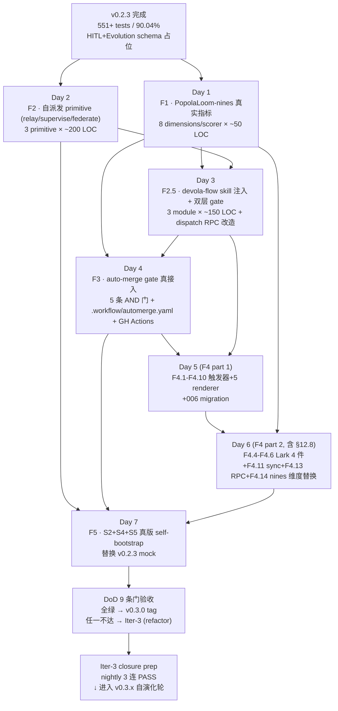

# PopolaLoom v0.3.0 自演化基础设施实施计划 + 选型清单

> 编排: L0 (devola-flow design-only)
> 综合源: [roadmap §4 Stage 3 + §11 + §12 + §12.8](/root/.cursor/plans/popolaloom_v0.2-v0.4_roadmap_e3d38a10.plan.md) + [v0.2.0-plan.md](v0.2.0-plan.md) (style 锚点) + [spec.md](spec.md) §3.4.1 / §4.2 / §5.4 / §6 + [testing-matrix.md](testing-matrix.md) + [adrs/0001](adrs/0001-arktower-as-task-pool-dependency.md) + [adrs/0002](adrs/0002-langgraph-as-graph-engine.md) + [CHANGELOG.md](../../../../CHANGELOG.md)
> 输出日期: 2026-05-04
> 作者: L3 Task Agent T-plan-v030 (Design 团队), devola-flow design-only workflow
> 状态: 等待用户审核 → 锁定 → 进入 v0.3.0 实施 (Stage F1 启动)
> 上一里程碑: v0.2.3 (574+ 测试 / 90.04% 覆盖率 / 5/5 P0 + 6/7 P1 closed / S1-S5 mock 全 PASS / HITLPrompt + WorkflowContext schema 占位)
> 本里程碑: v0.3.0 (6 个 Stage F1-F5 含 F2.5 / ~6.5 工作日 / 8 条 DoD 量化门 / nines composite ≥ 0.90)

---

## 0. 一页摘要 (TL;DR)

### 0.1 v0.3.0 是什么 (1 段定义)

**PopolaLoom v0.3.0 是从 "5/5 self-bootstrap mock + HITL/Evolution schema 占位 的基础设施完整版" 升级到 "8 维 nines 真测量 + 7/7 spec §4.2 原语完整 + devola-flow 双层 gate + HITL handle-ability 全栈 (含 Lark 双向真接) + S2/S4/S5 真版 self-bootstrap" 的关键自演化跃迁版本**: 在 v0.2.x 已经搭好的 daemon + LangGraph + ArkTower + MCP + 5 档测试矩阵之上, 让 PopolaLoom-nines 8 个维度从 mvp 估算改为按维度独立的取证流水线真实测量, 让 spec §4.2 列出的 7 个 Conductor 原语 (现有 dispatch + attach + probe 之外补 relay / supervise / federate) 全部上线, 让 roadmap §11 设计的 devola-flow skill 注入 + 双层 gate (inner devola-flow composite ≥ 0.85 + outer PopolaLoom-nines +0.02) 真正约束自演化派发, 让 roadmap §12 的 HITLPrompt 5 触发 + 5 通道 renderer + 跨通道同步 + nines `hitl_handleability` 维度 (替换 `token_budget_compliance` 同 0.10 权重) 端到端通跑, 让 §12.8 的 Lark 出站交互卡 + 入站 listener 双向通道在真 lark-cli + 真 bot 上至少跑 3 个示例 + 24h 不掉线, 让 v0.2.3 仅 mock 的 S2/S4/S5 替换为真版 (真 reinforcement / 真 8h offline + SIGSTOP / 真 cross-CLI handoff), 让 auto-merge gate 在 main 分支启用且至少 1 个 PR 走通 5 条 AND 门, 把 spec §3.2 9 模块覆盖率从 v0.2.x 的 ~35% 拉到 ~70%, 给 v0.3.x → v0.4.0 自演化 5 轮闭环铺好"派自己改自己"的硬地基。

### 0.2 6 大里程碑 F1-F5 (含 F2.5, 每个 1 行)

- **F1 · PopolaLoom-nines 真实指标**: 8 维各自独立 evidence 流水线, 替换 v0.2.0 mvp 估算 → 真测量, composite ≥ 0.85 on healthy daemon (出处: [roadmap §4.2](/root/.cursor/plans/popolaloom_v0.2-v0.4_roadmap_e3d38a10.plan.md) Stage F1 + [v0.2.0-plan.md §4 Stage E E5](v0.2.0-plan.md))
- **F2 · 自派发 primitive 模块完整**: 落 spec §4.2 7 原语剩余 3 个 (relay / supervise / federate), 加 RPC + MCP verb, federate ≥ 3 CLI vote (出处: [spec §4.2](spec.md) + [roadmap §4.2](/root/.cursor/plans/popolaloom_v0.2-v0.4_roadmap_e3d38a10.plan.md))
- **F2.5 · devola-flow skill 注入 + 双层 gate**: roadmap §11.1-§11.4 落地, dispatch RPC 加 `--evolution-round=N` 隐式 prepend Workflow Context, L3 ack 强制三段输出, inner devola-flow composite + outer PopolaLoom-nines 双 gate 4 case 全跑通 (出处: [roadmap §11](/root/.cursor/plans/popolaloom_v0.2-v0.4_roadmap_e3d38a10.plan.md))
- **F3 · auto-merge gate 真接入**: 5 条 AND 门 (DevolaFlow ≥0.85 + nines ≥ prior+0.02 + 0 blocker + 测试 PASS + protected branch) + `.workflow/automerge.yaml` 配置 + 至少 1 个 PR 走通 (出处: [roadmap §4.2](/root/.cursor/plans/popolaloom_v0.2-v0.4_roadmap_e3d38a10.plan.md) Stage F3 + [spec §7.3](spec.md))
- **F4 · HITL handle-ability 全栈**: roadmap §12.1-§12.8 端到端, 5 触发 + 5 渲染器 + 跨通道同步 + Lark 双向真接 + 006 popola_hitl 表 + nines `hitl_handleability` 维度 (替换 `token_budget_compliance`), 总测试 ≥ 26 case + Lark 专项 ≥ 25 case (出处: [roadmap §12 + §12.8](/root/.cursor/plans/popolaloom_v0.2-v0.4_roadmap_e3d38a10.plan.md) + [spec §3.4 + §5.4](spec.md))
- **F5 · S2 + S4 + S5 真版 self-bootstrap**: 替换 v0.2.3 mock 的 3 个场景为真版 (真 reinforcement injection 第二轮 PASS / 真 8h offline + SIGSTOP + 重开 IDE 拉 pending interrupt / 真 cross-CLI handoff cursor → claude → codex), 5/5 真 S1-S5 全 PASS, 为 Iter-3 closure prep 铺路 (出处: [spec §3.4.1](spec.md) + [roadmap §4.2](/root/.cursor/plans/popolaloom_v0.2-v0.4_roadmap_e3d38a10.plan.md) Stage F5)

### 0.3 与 v0.2.x 的关键差异 (5 条)

1. **nines 评分形态**: v0.2.x = mvp 估算 (cross_cli_handoff/token_budget_compliance 默认 0 / N/A, dispatch_isolation 仅检查"是否 setsid"二元判断) → v0.3.0 = 8 维各有独立 evidence pipeline (PGID/SHA256/真 round-trip ms/真 attach/真 handoff/真 fcntl 锁), composite 真值上报, F4 完成时 `token_budget_compliance` 替换为 `hitl_handleability` (保持 0.10 权重)
2. **Conductor 原语完整度**: v0.2.x = 2/7 真接 (dispatch + attach) + 1/7 隐式 (probe via list/status) + 4/7 占位 → v0.3.0 = 7/7 全部实现 (relay handoff_envelope schema + supervise child 完结回调 + federate ≥3 CLI 投票 + 已有 4 原语固化)
3. **dispatch 自演化注入**: v0.2.x = dispatch 不区分自演化, 无 round 概念 → v0.3.0 = `--evolution-round=N` 触发 skill_inject (检测 `~/.cursor/skills/devola-flow/SKILL.md`) + WorkflowContext.render() prepend + reinforcement_rules top-5 注入 + L3 三段输出强制
4. **HITL 与 Lark**: v0.2.x = HITLPrompt schema 占位 + Lark placeholder, 无真渲染 / 无入站 / 无跨通道同步 → v0.3.0 = 5 通道 renderer 真发 + parse_reply 反向解析 + ArkTower SQLite `popola_hitl` 表原子 UPDATE 跨通道同步 + Lark `lark-cli im +send --card` 真出 + `lark-cli event consume` listener 守护任务 24h 不掉 + supervisor ≤3 次重启 + allowed_responders 白名单
5. **self-bootstrap 真伪**: v0.2.x = S1+S3 真版 + S2/S4/S5 mock (mock CLI + freezegun) → v0.3.0 = 5/5 全部真版 (真 popolad + 真 reinforcement + 真 SIGSTOP + 真 cursor/claude/codex 三跳, mock 版保留为 nightly fallback)

### 0.4 验收门 (Definition of Done) 量化指标 8 条

> 详见 §5; 此处只列指标头条 (与 [roadmap §6 v0.3.0 行](/root/.cursor/plans/popolaloom_v0.2-v0.4_roadmap_e3d38a10.plan.md) 对齐)

1. **8/8 nines 维度真测量**: 所有维度返回 > 0 的真实证据值 (无 mvp / 估算 / 默认 0 字眼); composite ≥ 0.85 on healthy daemon (基线: v0.2.x ≈ 0.85; 目标: 跃升至 ≥ 0.90)
2. **7/7 spec §4.2 Conductor 原语实现**: dispatch / attach / relay / supervise / federate / handoff / probe 全部有 RPC endpoint + MCP verb + ≥ 1 单测 + ≥ 1 集成测; relay 有 handoff_envelope schema fixture; federate ≥ 3 CLI 投票真跑通 1 case
3. **5/5 self-bootstrap 真版 PASS**: tests/self_bootstrap/test_s{1..5}_*_real.py 全 PASS, 替换 v0.2.3 mock 版本; nightly 跑 3 连 PASS 视为稳定 (Iter-3 closure 启动条件)
4. **devola-flow 双层 gate 落地**: F2.5 完成, dispatch with `--evolution-round=N` 自动 prepend Workflow Context, L3 输出三段强制 (Acceptance Verification + Gate Score Components + Findings); 双 gate 测试 ≥ 6 case (4 dual-gate 组合 PASS/PASS PASS/FAIL FAIL/PASS FAIL/FAIL + reinforcement 持久化 ≥ 3 round 链条)
5. **HITL handle-ability 全栈**: HITLPrompt + 5 renderer + 跨通道同步 + 006 migration 落地; 测试 ≥ 26 case (Tier 1 schema 10 + Tier 2 renderer 10 + Tier 3 sync 4 + Tier 4 interrupt-resume 6 + Tier 5 floor-escalation 3 - v0.2.3 已占位的 9 case 重叠后净增 ≥ 17); nines `hitl_handleability` 维度首次测量 ≥ 0.85
6. **Lark 双向通道**: 出站 ≥ 3 例真发到测试用户 chat (`lark-cli im +send --card`); 入站 listener 子进程连续 24h 无 crash + supervisor 自动 ≤ 3 次重启验证; 出/入 round-trip P95 ≤ 10s; 来源标注 footer 100% 覆盖 (`---\n本消息由飞书工具 Lark-Cli 发送`); `lark_health` 子维度 ≥ 0.85; Lark 专项测试 ≥ 25 case
7. **auto-merge gate 真接入**: `.workflow/automerge.yaml` 配置合法 YAML; `.github/workflows/automerge.yml` 调用 `popola eval run` 决策; 至少 1 个 PR (e.g. doc fix / 小补丁) 经 gate 自动 merge 成功; gate self-test (gate 代码改动需要旧 gate ack)
8. **测试 + 覆盖 + nines 总量**: pytest 总数 ≥ 250 (v0.2.3 = 518 non-slow + 33 slow/e2e ≈ 551, v0.3.0 净增 ≥ 50 case 至 ≥ 600); 覆盖率 ≥ 90% 不下降 (`fail_under = 90` 不动); nines composite ≥ 0.90 (vs v0.2.x baseline ≈ 0.85, 跃升 +0.05 = 5/8 维度 +0.04 共识)

> **DoD 不达标处置**: 任一条不满足 → 进 Iter-3 (refactoring + feature-enhancement 复合) 不直接发 v0.3.0 tag; 8 条按权重 (1 nines=15% / 2 原语=15% / 3 self-bootstrap=15% / 4 双 gate=10% / 5 HITL=15% / 6 Lark=10% / 7 auto-merge=10% / 8 量级=10%) 加权, 任一权重 0 = 阻断 (与 [v0.2.0-plan.md §5](v0.2.0-plan.md) DoD 阻断风格一致)。

---

## 1. v0.2.x 现状盘点

### 1.1 已交付清单 (table)

> 数据来自 [CHANGELOG.md](../../../../CHANGELOG.md) v0.2.0 + v0.2.1 + v0.2.2 + v0.2.3 4 个 entry, 时间窗 ~ 13 工作日 (5.5d v0.2.0 + 2-3d × 3 patch)。

| 版本 | 测试 | 覆盖 | 关闭 issue / 关键交付 | 主要交付模块 |
|---|---|---|---|---|
| **v0.0.1** (baseline) | 18 | 未报 | — | in-process Popolad + 3 adapter (cursor/claude/codex) + NDJSON event log |
| **v0.2.0** | 97 | ≥ 75% | 5/5 P0 (R-001..R-005) + 6/7 P1 (R-006..R-012, R-010 推迟) | real popolad daemon (asyncio + uvicorn UDS) + LangGraph StateGraph + SqliteSaver + ArkTower TaskService 真接入 + popolaloom-mcp stdio + 7 verbs + S1+S3 self-bootstrap + PopolaLoom-nines mvp |
| **v0.2.1** | 334 | 80.81% | Tier 1+2 测试矩阵 (~60 新 case) | hypothesis property (≥5) + parametrized adapter 矩阵 + supervisor 错误路径 5 模式 + CLI httpx mock + freezegun + Pydantic v2 state schema + testing-matrix.md spec |
| **v0.2.2** | 441 | 85.01% | Tier 3 + NFR-1/3/5/8 + chaos 12 模式 + real_cli smoke | real_popolad fixture + 真 daemon + UDS + SQLite + NFR pytest-benchmark (启动 0.815s / append ~7µs / 100% recovery) + chaos 25 case (No Silent Failures) + CI 3-lane (default/slow/lint) |
| **v0.2.3** | 551+ | 90.04% | Tier 4 (real langgraph) + Tier 5 (e2e) + S1-S5 mock 全 PASS + HITL/Evolution schema 占位 | mock CLI 三件套 (mock_cursor/claude/codex 含 devola-flow 三段输出契约) + 真 langgraph SqliteSaver subgraph 测试 + S2/S4/S5 mock 版完整 + HITLPrompt + WorkflowContext Pydantic 严格校验 + fail_under=90 锁 |

> **小计**: 13 工作日累计 LOC 增长 src ≈ 1742 → ≈ 6500 (约 3.7x), test ≈ 788 → ≈ 5700 (约 7.2x); 测试 / src 比从 0.45 提升到 0.88 (业界 0.5-1.5 中位); 完成 [spec §2.1](spec.md) Phase 1 in-scope **约 35%** (出处: [v0.2.0-plan.md §2.3](v0.2.0-plan.md) 加 v0.2.x patch 期 +0% 覆盖率 / +0% 模块, 仅测试矩阵 + schema 占位)。

### 1.2 v0.2.x Iter-2 P1 + P2 仍开放清单 (v0.3.0 范围继承)

| # | issue / 占位 | 一句话 | v0.3.0 落点 |
|---|---|---|---|
| **R-010** | systemd-run --user --scope 全后端化 (P1 deferred from v0.2.0) | 当前用 Popen(start_new_session=True) 已能跨终端存活 (NFR-5 部分达标), 缺 cgroup 限额 / journalctl unit 整合 | **v0.3.0 仍推迟到 v0.4.0** (优先级低于自演化基础设施; 5/8 NFR 已达标) |
| **spec §4.2 5 of 7 primitives** | relay / supervise / federate / handoff / probe (handoff/probe 已部分通过 dispatch+list+status 暗合) | v0.2.0 仅 dispatch + attach 真接, 5 个原语缺 | **F2 + F4 落地**: relay (F2) + supervise (F2) + federate (F2) + handoff (F4 通过 HITLPrompt) + probe (F2 强化为独立 endpoint) |
| **S2 / S4 / S5 mock-only** | v0.2.3 已 mock 全跑通, 真版未做 | mock CLI + freezegun, 真 reinforcement / SIGSTOP / cross-CLI handoff 缺 | **F5 落地**: 真 popolad + 真 LLM(可选) + 真 SIGSTOP + 真 lark-cli + 三跳真 cursor/claude/codex |
| **Lark HITL placeholder** | v0.2.0 D2.11 仅留接口位 (空 LarkBridge 类), 无真出 / 无入 / 无 listener | spec §3.4 三通道默认全开但 Lark 未接 | **F4 落地**: §12.8 全栈 (出站 + 入站 + supervisor + 006 migration + 来源标注 footer) |
| **auto-merge gate 占位** | v0.2.0 Out of Scope 推迟到 v0.4.0; v0.2.3 仍未做 | spec §7.3 5 条 AND 门; impl-plan Day 6 子任务 5 | **F3 落地**: `.workflow/automerge.yaml` + `.github/workflows/automerge.yml` + gate self-test |
| **Web 增量 4 页** (popolaloom-web) | spec §3.2 row "popolaloom-web" 标 "复用 ArkTower 框架 + 增量 4 页" | runtime supervisor / attach console / hitl inbox / federate consensus 4 页 | **v0.3.0 推迟到 v0.4.0 polish** (HITL Web renderer 接口位 v0.3.0 留 stub, 真页面 v0.4.0) |
| **Prometheus /metrics + OTel trace_id** | spec §8.2 + impl-plan Day 8 | NDJSON 日志够调试 v0.2.x; OTel 是 Phase 2 优化 | **v0.3.0 仍推迟 v0.4.0+** |
| **Textual TUI** | spec §3.2 row "popolaloom-tui" | 用户体验层, 不阻塞自演化闭环 | **v0.3.0 推迟 v0.4.0 polish** |
| **R-013 plugin entry-point** | v0.2.0 部分修 (清理双重 singleton), entry-point group 未做 | 用户加 Kimi/Copilot 必须改源码 | **v0.3.0 推迟 Phase 2** (与 Kimi/Copilot adapter 一起) |

### 1.3 v0.2.x → v0.3.0 差距分析

| 维度 | v0.2.x 现状 | v0.3.0 目标 | Δ LOC 估算 |
|---|---|---|---|
| **nines 8 维评分** | mvp 估算 (cross_cli_handoff/token_budget_compliance 默认 0 / N/A; 其他维仅二元 0/1 判断) | 8 维各自独立 evidence pipeline (per-dimension scorer + 真测量 + composite ≥ 0.85) | +400 (8 × ~50 行/scorer) |
| **Conductor 原语** | 2/7 真接 (dispatch + attach) | 7/7 全部实现 + RPC endpoint + MCP verb + handoff_envelope schema fixture | +600 (relay 200 + supervise 200 + federate 200) |
| **devola-flow 双层 gate** | 0 (仅 WorkflowContext schema 占位) | skill_inject + reinforcement + dual_gate 三模块 + dispatch RPC `--evolution-round=N` 触发器 + ≥6 测试 case | +500 (3 × ~150 行 + 100 测试) |
| **HITL 全栈** | HITLPrompt schema 占位 (210 行 schema-only) | 5 触发 + 5 渲染器 + 跨通道同步 + 006 migration + RPC `/hitl/answer` + nines 维度替换 | +1200 (5 renderer × 150 + sync 200 + RPC 100 + migration 50 + dim 100) |
| **Lark 双向** | placeholder | listener subprocess + supervisor + card_templates + auth bot + allowed_responders 白名单 + 重试 + 14d 续期 | +500 (listener 200 + card_templates 100 + supervisor 100 + lark renderer 100) |
| **auto-merge gate** | 0 (placeholder) | gate/automerge.py + .workflow/automerge.yaml + .github/workflows/automerge.yml + gate self-test | +200 (Python 150 + YAML 50) |
| **真 S2/S4/S5** | mock 全 PASS | 替换为真 popolad + 真 reinforcement + 真 SIGSTOP + 真 cross-CLI handoff | +600 (3 × ~200 行 测试 + 真 fixture) |
| **测试矩阵** | 551+ case / 90.04% | ≥600 case / ≥90% (不降) | +1500 (HITL 26 × 30 + Lark 25 × 30 + 双 gate 6 × 50 + 真 S2/S4/S5 ≈ 80 + 兜底 50) |
| **总 LOC 预估** | src ≈ 6500 + test ≈ 5700 = 12200 | src ≈ 10500 + test ≈ 7200 = 17700 (~ 1.45x) | **+4000 src + +1500 test = +5500 行** |

---

## 2. v0.3.0 范围

### 2.1 In Scope (本期必交付, 6 项核心)

> 与 [roadmap §4.2](/root/.cursor/plans/popolaloom_v0.2-v0.4_roadmap_e3d38a10.plan.md) Stage F1-F5 一一对应:

1. **F1 PopolaLoom-nines 真实指标 (1d)**: 替换 v0.2.0 Stage E 的 8 维 mvp 评分逻辑为真测量; per-dimension evidence pipeline; composite ≥ 0.85; F4 完成时维度替换 `token_budget_compliance → hitl_handleability` 同 0.10 权重
2. **F2 自派发 primitive 模块 (1d)**: relay / supervise / federate 真接入; handoff_envelope schema fixture; relay 用 ArkTower `parent_task_id`; federate ≥ 3 CLI 投票真跑通 1 case
3. **F2.5 devola-flow skill 注入 + 双层 gate (1d)**: roadmap §11.1-§11.4 落地; dispatch RPC `--evolution-round=N` 自动 skill_inject + reinforcement; L3 输出三段强制; inner devola-flow + outer PopolaLoom-nines 双 gate; reinforcement 跨轮持久化
4. **F3 auto-merge gate 真接入 (1d)**: 5 条 AND 门 + `.workflow/automerge.yaml` + `.github/workflows/automerge.yml` + gate self-test; ≥1 PR 走通
5. **F4 HITL handle-ability 全栈 (2d)**: roadmap §12.1-§12.8 端到端; 5 触发 + 5 渲染器 + 跨通道同步 + Lark 双向真接 + 006 popola_hitl 表 + RPC `/hitl/answer` + listener subprocess + nines `hitl_handleability` 维度
6. **F5 S2 + S4 + S5 真版 self-bootstrap (1d)**: 替换 v0.2.3 mock 为真版; 依赖 F2 supervise (S2 reinforcement) + F2 relay (S5 cross-CLI) + F3 gate (S2 收敛) + F4 (S4 真 SIGSTOP + 重开拉 pending interrupt)

> **附加修复 (并入 6 项交付的隙裂)**: R-013 部分 (Phase 2 plugin entry-point 仍推迟; v0.3.0 仅留 README 说明); Web 4 页留 stub interface (v0.4.0 polish); IDE notify 渲染器 (F4 必含, 但 NiceGUI 自有页面推迟); spec §3.2 mcp 模块从 60% 推到 ~75% (F2/F4 各加 3+5 verb); spec §3.2 lark 模块从 0% 推到 ~70% (F4 §12.8 全栈)。

### 2.2 Out of Scope (推迟到 v0.4.0+)

- **Textual TUI** (spec §3.2 row "popolaloom-tui") — 推迟 v0.4.0 polish; v0.3.0 用户体验仍走 popola CLI + IDE notify + Lark 三通道
- **NiceGUI Web Dashboard 增量 4 页** (popolaloom-web 真页面) — 推迟 v0.4.0; v0.3.0 仅 HITL web renderer 接口位 stub (符合 [roadmap §4.2 Stage F4](/root/.cursor/plans/popolaloom_v0.2-v0.4_roadmap_e3d38a10.plan.md) "推迟到 v0.4.0 polish 但接口位先留")
- **Prometheus /metrics + OpenTelemetry trace_id** (spec §8.2) — 推迟 v0.4.0+; NDJSON 日志够调试 v0.3.x
- **R-010 systemd-run --user --scope 全后端化** — 推迟 v0.4.0; Popen(start_new_session=True) 已 NFR-5 ≥ 99%
- **S5 真 cross-CLI peer review (codex review claude code)** 完整 federate 投票 — F2 仅做 federate primitive 框架 + 1 个真跑 case, S5 真 review 推迟 v0.3.x 自演化轮逐步加强
- **DeltaChannel langgraph 1.x 启用** (spec ADR-0002 §3.1 + Day 3 风险) — 推迟 v0.4.0; v0.3.0 用稳定 channel
- **Cloud Agent adapter** (Phase 2, Q9 答案) — 推迟 Phase 2+
- **PostgresSaver 跨多机** (ADR-0005) — Phase 2+
- **Multi-tenant / SaaS / SSO** — out of scope (与 spec.md §2.2 一致)
- **PyPI 发包** (ADR-0001 §4.1 备选 A) — 推迟 Phase 2 (需 ArkTower 先发 PyPI)
- **Kimi + Copilot adapter** (Phase 2, Q4 答案) — 推迟 Phase 2; mock CLI 已留 mock_kimi.py + mock_copilot.py 占位
- **R-013 plugin entry-point group** (`popolaloom.adapters` setuptools group) — 推迟 Phase 2 (与 Kimi/Copilot 同期)

### 2.3 与 R4 路线总目标的关系 (Phase 1 进度跃迁)

v0.3.0 完成后, R4 路线 Phase 1 总进度评估如下: 9 个 [spec §3.2](spec.md) 模块中 v0.3.0 把 daemon 从 ~75% 推到 ~85% (+10%, F2 三原语), graph 从 ~30% 推到 ~50% (+20%, F2.5 注入 + dual_gate), mcp 从 ~60% 推到 ~75% (+15%, F2 三原语 verb + F4 hitl/answer verb), core 从 ~50% 推到 ~70% (+20%, F4 006 migration + EventBus 真订阅), lark 从 0% 推到 ~70% (+70%, F4 §12.8 全栈), evaluation (popolaloom 自有) 从 ~40% 推到 ~80% (+40%, F1 真测量 + F2.5 dual gate); skill / tui / web 3 个模块仍 0%-20% (F2.5 仅检测 SKILL.md 不含完整 skill 实现, tui/web 推迟)。**加权平均 Phase 1 进度 ≈ 70%** (v0.2.x ≈ 35% → v0.3.0 ≈ 70%, 单期跃迁 +35%)。剩下 30% 由 v0.3.x 5 round 自演化 (估 +15%) + v0.4.0 (TUI + Web + Prometheus/OTel + verify_config + DEMO + release, 估 +15%) 完成, 估 Phase 1 GA 在 v0.4.0 (~ 20 个工作日内可达, 与 [roadmap §8 总计 28-31d](/root/.cursor/plans/popolaloom_v0.2-v0.4_roadmap_e3d38a10.plan.md) 一致)。

---

## 3. v0.3.0 选型清单 (新增 10 个 D3.X 决策点)

> v0.0.1 阶段 12 维 D1-D12 已锁定 (出处: 06 §2 表); v0.2.0 新增 12 维 D2.X (出处: [v0.2.0-plan.md §3](v0.2.0-plan.md)); 本期 v0.3.0 进入自演化基础设施细节, 新生 10 个 D3.X 决策点。每行: 维度 / 候选 / 利 / 弊 / 推荐 / 出处。

### D3.1 · nines 真测量取证策略 (per-dimension evidence pipeline)

| 候选 | 利 | 弊 | 推荐 |
|---|---|---|---|
| 集中式 evidence collector (单 `EvidenceBus` 类, 各 scorer subscribe) | 单点逻辑; 单测试入口 | 8 个维度耦合; 任一 scorer 改字段影响全局 | |
| per-dimension scorer 独立 (`evaluation/dimensions/<dim>.py` 各自负责取证 + 打分) | 单一职责 (SRP); F4 维度替换 (token_budget → hitl_handle) 时仅改 1 文件; 每个 scorer 独立可测 | 8 个 scorer 重复样板代码 (~50 行/scorer) | ✅ |
| 外部 OTel collector pull | 与 spec §8.2 OTel 路径对齐 | OTel 推迟 v0.4.0+, v0.3.0 不能依赖 | |

**推荐: per-dimension scorer 独立** (SRP + 维度替换零侵入, 出处: [roadmap §4.2 Stage F1](/root/.cursor/plans/popolaloom_v0.2-v0.4_roadmap_e3d38a10.plan.md) "8 个独立 scorer" + [v0.2.0-plan.md §4 Stage E E5](v0.2.0-plan.md) 的 8 维 mvp 已是单文件 popola_dimensions.py 但不可扩展, F1 拆为 8 文件)

### D3.2 · 7-primitive RPC shape (REST vs gRPC, batched vs single)

| 候选 | 利 | 弊 | 推荐 |
|---|---|---|---|
| REST batched (单 endpoint `POST /primitive` + `kind` 枚举字段) | 单 endpoint; 客户端只学 1 个 RPC | 失去 OpenAPI per-endpoint 文档优势; 错误路径互相污染 | |
| REST per-primitive (`POST /relay` `POST /supervise` `POST /federate`) | OpenAPI 自动文档; 错误路径独立; 与 v0.2.0 已有 dispatch/attach/probe per-endpoint 风格一致 | endpoint 数 +3 (12 → 15) | ✅ |
| gRPC | 强类型 + 流式 RPC | 客户端要带 protoc; 与 v0.2.0 FastAPI 选型冲突 (D2.2) | |
| GraphQL | 灵活 query | 复杂度爆炸; PopolaLoom 无此需求 | |

**推荐: REST per-primitive** (与 v0.2.0 D2.2 FastAPI + Uvicorn UDS 同栈 + OpenAPI 自动文档, 出处: [v0.2.0-plan.md §3 D2.2](v0.2.0-plan.md))

### D3.3 · dual-gate FAIL 策略 (rollback 粒度: 全 round vs sub-task)

| 候选 | 利 | 弊 | 推荐 |
|---|---|---|---|
| 全 round rollback (任一 sub-task FAIL → git restore + round_num++) | 简单; 回到清白状态 | 浪费成功 sub-task 的工作; round 长 = 浪费多 | |
| sub-task 独立 retry (inner FAIL 仅该 sub-task retry max 2x, 全部成功才进 outer) | 节省工作; 与 [roadmap §5.2 Step 6](/root/.cursor/plans/popolaloom_v0.2-v0.4_roadmap_e3d38a10.plan.md) 一致 | 状态机复杂; sub-task 之间依赖关系要小心 | ✅ |
| 混合: sub-task retry 2x + 全 round 兜底 | 兼顾两者优点 | 实现复杂; outer FAIL 时仍要 round restore | (与 ✅ 推荐合并) |

**推荐: sub-task 独立 retry (inner) + outer FAIL 时全 round rollback** (符合 [roadmap §11.2 FAIL 处置 3 case](/root/.cursor/plans/popolaloom_v0.2-v0.4_roadmap_e3d38a10.plan.md): 仅 inner FAIL → sub-task retry; 仅 outer FAIL → round rollback + reinforcement; 都 FAIL → round rollback + full reinforcement)

### D3.4 · reinforcement 注入 prompt 渲染格式 (top-5 finding 渲染)

| 候选 | 利 | 弊 | 推荐 |
|---|---|---|---|
| Markdown bullet list (`- {finding}`) | 简单; LLM 易读 | 严重度信息丢失 | |
| Markdown bullet + severity prefix (`- [blocker] {finding}`) | 严重度可见; LLM 可优先处理 blocker | 仍是单字符串 | ✅ |
| JSON array (`[{"severity": "blocker", "finding": "..."}]`) | 结构化; 易 parse | LLM 可能不会按 severity 排序; JSON 长 | |
| YAML structured | 同上 + 易读 | 与 LLM 喜好 markdown 风格不符 | |

**推荐: Markdown bullet + severity prefix**, 渲染模板:
```markdown
## Reinforcement Rules (from round N-1) - MUST fix:
- [blocker] (severity 1, R-N00 - L3 之前响应过): finding text
- [critical] (severity 2): finding text
... (top-5 only)
```
(出处: [roadmap §11.3](/root/.cursor/plans/popolaloom_v0.2-v0.4_roadmap_e3d38a10.plan.md) reinforcement 注入要求 + [evolution/__init__.py WorkflowContext.render](../../../../src/popolaloom/evolution/__init__.py) 已采用 markdown 段格式)

### D3.5 · HITLPrompt → 5-channel renderer 具体 schema (Lark card v2 + MCP elicitation form)

| 候选 (Lark card 格式) | 利 | 弊 | 推荐 |
|---|---|---|---|
| Lark interactive card v1 (`message_card_v1`) | 兼容老版本飞书客户端 | 字段限制多; v2 主推 | |
| Lark interactive card v2 (`message_card_v2`, header + div + action button) | 飞书官方 v2 主推; 富文本支持; button.value JSON | 老客户端 (≤ 2024 中) 不渲染 | ✅ |
| 纯文本 fallback | 极简; 兼容性好 | 失去交互按钮; 用户体验差 | (作为 lark-cli exit_code != 0 时的 retry fallback, 见 [roadmap §12.8.1](/root/.cursor/plans/popolaloom_v0.2-v0.4_roadmap_e3d38a10.plan.md)) |

| 候选 (MCP elicitation form) | 利 | 弊 | 推荐 |
|---|---|---|---|
| Form mode + JSON Schema enum (与 spec §3.5.4 LarkInterrupt 4 字段对齐) | 结构化; IDE 可渲染 form | MCP elicitation 协议要 in-flight client request (spec §9 R-1) | ✅ (受 MCP 协议限制) |
| Free-text mode | 简单 | 失去 enum 约束 | |

**推荐: Lark card v2 (主) + 纯文本 fallback (重试) + MCP form mode + JSON Schema enum** (出处: [roadmap §12.8.1 Lark 出站](/root/.cursor/plans/popolaloom_v0.2-v0.4_roadmap_e3d38a10.plan.md) + [spec §3.5.4](spec.md))

### D3.6 · popola_hitl 表 schema in ArkTower SQLite (006 migration 设计)

| 候选 | 利 | 弊 | 推荐 |
|---|---|---|---|
| 完全独立表 (popola_hitl 不引用 arktower.tasks.id) | 解耦; 独立查询 | 失去 task ↔ hitl 链接; 跨表 join 缺 | |
| FK 引用 arktower.tasks.id (CASCADE) | 强一致; task 删除连带 hitl 删除 | task delete 不常见; CASCADE 误操作风险 | |
| FK 引用 + ON DELETE SET NULL + 加 task_id 索引 | 强一致 + 安全删除 + 查询快 | 列稍多 | ✅ |

推荐 schema (在 [roadmap §12.8.3](/root/.cursor/plans/popolaloom_v0.2-v0.4_roadmap_e3d38a10.plan.md) 基础上加 task_id FK):

```sql
CREATE TABLE popola_hitl (
    hitl_id TEXT PRIMARY KEY,
    task_id TEXT REFERENCES tasks(id) ON DELETE SET NULL,
    trigger TEXT NOT NULL CHECK(trigger IN ('round_floor','ambiguous_input','destructive_op','approval','info_request')),
    status TEXT NOT NULL CHECK(status IN ('pending','answered','timeout','cancelled')),
    prompt_json TEXT NOT NULL,
    created_at TEXT NOT NULL,
    deadline_at TEXT,
    answered_at TEXT,
    answered_via TEXT CHECK(answered_via IN ('lark','ide','cli','email','signal','mcp','web')),
    answer_option_id TEXT,
    answer_reason TEXT,
    -- Lark 字段 (per roadmap §12.8.3)
    lark_message_id TEXT,
    lark_event_ids TEXT,                        -- JSON array, 去重
    lark_send_attempts INTEGER DEFAULT 0,
    lark_last_send_error TEXT
);
CREATE INDEX idx_hitl_status ON popola_hitl(status);
CREATE INDEX idx_hitl_task ON popola_hitl(task_id);
CREATE INDEX idx_hitl_lark_message ON popola_hitl(lark_message_id);
```

**推荐: FK + ON DELETE SET NULL + idx_hitl_task** (强一致 + 安全 + 查询快, 出处: [roadmap §12.8.3](/root/.cursor/plans/popolaloom_v0.2-v0.4_roadmap_e3d38a10.plan.md) + [hitl/__init__.py HITLChannel 5-value enum](../../../../src/popolaloom/hitl/__init__.py))

### D3.7 · Lark allowed_responders 默认 (lone target_open_id vs configurable list)

| 候选 | 利 | 弊 | 推荐 |
|---|---|---|---|
| 默认仅 target_open_id (HITL 接收者本人才能回复) | 安全; 防陌生人乱回 | 群聊场景下其他人无法回 | |
| 默认含 target + chat_id 内所有成员 | 群聊友好 | 安全风险 (恶意成员乱回) | |
| 默认 target_open_id + 配置项可加白名单 list | 安全为默认 + 可配 | 配置稍复杂 | ✅ |

**推荐: 默认 target_open_id 单人 + `popolaloom.toml` `hitl.lark.allowed_responders: list[str]` 可加白名单** (与 [roadmap §12.8.4 安全 + 鉴权 R-LARK-3 缓解](/root/.cursor/plans/popolaloom_v0.2-v0.4_roadmap_e3d38a10.plan.md) 一致: "allowed_responders 默认含 target_open_id (常态自洽)")

### D3.8 · auto-merge gate config 文件格式 (`.workflow/automerge.yaml` schema)

| 候选 | 利 | 弊 | 推荐 |
|---|---|---|---|
| YAML (与 ArkTower `.workflow/config.yaml` 风格一致) | 同 org 风格; 易读; 支持 hierarchy | 缩进易错 | ✅ |
| TOML | 与 pyproject.toml 一致 | 不擅长 hierarchy | |
| JSON | 严格 schema | 不易读 | |

推荐 schema (5 条 AND 门可配置阈值):
```yaml
# .workflow/automerge.yaml
gate:
  devolaflow_composite_min: 0.85
  popolaloom_nines_delta_min: 0.02
  blocker_count_max: 0
  test_coverage_min: 0.90
  protected_branches: [main]
  paths_allowed: ['src/popolaloom/**', 'tests/**', '.workflow/**']
  paths_forbidden: ['.github/workflows/**', 'arktower/**', 'devolaflow/**', '.cursor/**', '.claude/**']
self_test:
  required_when_paths_match: ['src/popolaloom/gate/**']
  policy: gate_code_change_requires_old_gate_ack
```

**推荐: YAML + 5 阈值字段 + paths_allowed/forbidden 双白单** (出处: ArkTower `.workflow/config.yaml` 同 org 风格 + [spec §7.3](spec.md) 5 条 AND 门 + [roadmap §6 v0.3.0 行 auto-merge gate](/root/.cursor/plans/popolaloom_v0.2-v0.4_roadmap_e3d38a10.plan.md))

### D3.9 · S5 cross-CLI handoff envelope schema (mock + real path divergence)

| 候选 | 利 | 弊 | 推荐 |
|---|---|---|---|
| mock + real 共享 schema (统一 fixture) | 单 source of truth; mock 永远代表真行为 | mock 调整时真也要跟 | ✅ |
| mock 与 real 各自 schema (mock 简化) | mock 更轻 | 漂移风险 R-EVO-2 | |
| 仅 mock schema (real 忽略) | 极简 | 真版无契约校验 | |

推荐 envelope schema (与 [spec §3.4.1 S5](spec.md) 对齐):
```python
class HandoffEnvelope(BaseModel):
    from_task_id: str
    from_cli: Literal["cursor", "claude", "codex"]
    to_cli: Literal["cursor", "claude", "codex"]
    payload: dict          # full_trace | summary | diff_only (per spec §4.2 relay)
    owned_files: list[str] # 不冲突契约 (per spec §4.3 公理 A1)
    handoff_at: datetime
    parent_chain: list[str]  # 完整 trace
```

**推荐: mock + real 共享 schema** + fixture `tests/fixtures/handoff_envelope.json` (出处: [roadmap §4.2 Stage F2 AC](/root/.cursor/plans/popolaloom_v0.2-v0.4_roadmap_e3d38a10.plan.md) "handoff_envelope.json schema fixture")

### D3.10 · nines 权重重平衡 (token_budget_compliance → hitl_handleability swap)

| 候选 | 利 | 弊 | 推荐 |
|---|---|---|---|
| 直接 1:1 替换 (保持 0.10 权重) | 总权重和 = 1.00 不变; F4 完成时切换无侵入 | hitl_handleability 是新维, 权重 0.10 是否合理待验证 | ✅ |
| 增加权重到 0.15 (从其他维削减) | 强调 HITL 重要性 | 其他 7 维必须重平衡; 总和不变约束复杂 | |
| 完全重新设计 8 维权重 | 第一性原理 | 风险大, v0.3.0 不该动 | |

**推荐: 1:1 替换 0.10 权重不变, v0.4.0 评估是否调整** (与 [roadmap §6 v0.3.0](/root/.cursor/plans/popolaloom_v0.2-v0.4_roadmap_e3d38a10.plan.md) "替换 token_budget_compliance 为 hitl_handleability" + [nines.toml [eval.weights]](../../../../nines.toml) `token_budget_compliance = 0.10` 当前值一致)

### D3.X 选型表汇总 (一行览)

| # | 维度 | 推荐 | 出处 |
|---|---|---|---|
| **D3.1** | nines 真测量取证策略 | **per-dimension scorer 独立** (8 个 scorer 各自 evidence pipeline) | roadmap §4.2 Stage F1 + SRP |
| **D3.2** | 7-primitive RPC shape | **REST per-primitive** (与 v0.2.0 D2.2 FastAPI 同栈) | v0.2.0-plan.md §3 D2.2 |
| **D3.3** | dual-gate FAIL 策略 | **sub-task retry (inner) + 全 round rollback (outer)** | roadmap §11.2 FAIL 3 case |
| **D3.4** | reinforcement 渲染格式 | **Markdown bullet + severity prefix** (top-5) | roadmap §11.3 + evolution/__init__.py render |
| **D3.5** | HITLPrompt 5 通道 schema | **Lark card v2 + 纯文本 fallback + MCP form 模式 + JSON Schema enum** | roadmap §12.8.1 + spec §3.5.4 + spec §9 R-1 |
| **D3.6** | popola_hitl 表 schema | **FK 引用 arktower.tasks.id ON DELETE SET NULL + idx_hitl_task** | roadmap §12.8.3 + hitl/__init__.py |
| **D3.7** | Lark allowed_responders 默认 | **默认仅 target_open_id + 可配 list** | roadmap §12.8.4 + R-LARK-3 |
| **D3.8** | auto-merge gate config 格式 | **YAML + 5 阈值 + paths_allowed/forbidden 双白单** | spec §7.3 + ArkTower 同 org 风格 |
| **D3.9** | S5 handoff envelope schema | **mock + real 共享 schema** + fixture | roadmap §4.2 Stage F2 AC + spec §3.4.1 S5 |
| **D3.10** | nines 维度替换权重 | **1:1 替换 0.10, v0.4.0 评估** | roadmap §6 v0.3.0 + nines.toml |

---

## 4. v0.3.0 工作分解 (6 个 Stage / 共 ~6.5 工作日)

> 每个 Stage 包含: 目标 / 子任务 / owned files / acceptance / 风险。Owned files 严格遵循 S-8 invariant (写令牌唯一, 出处: [spec §4.3](spec.md) + 公理 A1)。

### Stage F1 · PopolaLoom-nines 真实指标 (Day 1, ~1d)

**目标**: 把 v0.2.0 Stage E 的 8 维 mvp 评分逻辑替换为真测量, 每个维度独立 evidence pipeline + scorer + 单测; composite ≥ 0.85 on healthy daemon; 关闭 [v0.2.0-plan.md §6 RV2-5 mvp 偏粗](v0.2.0-plan.md) 风险; 为 F4 维度替换 (token_budget → hitl_handle) 留无侵入扩展点。

#### 子任务

- **F1.1**: `evaluation/dimensions/__init__.py` 抽 `BaseDimensionScorer` Protocol (`score(evidence) -> DimensionScore` + `collect_evidence(daemon_state) -> dict`); 8 个 scorer 各自 inherit
- **F1.2**: `dimensions/dispatch_isolation.py` — 实测 daemon vs CLI subprocess PGID + setsid + 不同 process group; 真值 = (PGID isolated) AND (setsid called) AND (parent != child PGID); evidence = `os.getpgid(pid)` 比对
- **F1.3**: `dimensions/cycle_convergence.py` — 实测 Gen-Verifier subgraph 在真 dev↔test 子图收敛轮数 (要 ≤ 2); evidence = 解析 SqliteSaver checkpoint 序列计数 verifier 节点访问数
- **F1.4**: `dimensions/hitl_latency.py` — 真测 interrupt() → supply_feedback round-trip 毫秒; evidence = NDJSON `task.elicited` 与 `human.responded` time 字段 delta
- **F1.5**: `dimensions/attach_correctness.py` — 跨进程 attach 拿到的 event count == event_log 文件行数 (SHA256 比对前后); evidence = client 收到 NDJSON 切片 vs 文件 line count
- **F1.6**: `dimensions/cross_cli_handoff.py` — 真跑 cursor → claude handoff (依赖 F2 relay primitive); evidence = handoff_envelope 在 ArkTower parent_task_id 链中可追踪
- **F1.7**: `dimensions/single_threaded_writes.py` — fcntl.lockf + ps 检查同一 NDJSON 文件无两 PID 写; evidence = `lsof | grep events.jsonl` 同时 ≤ 1 writer
- **F1.8**: `dimensions/event_log_completeness.py` — SHA256 比对 dispatch 时 emit envelope 序列 与 attach 读到的 envelope 序列; evidence = 双轨 hash 一致
- **F1.9**: `dimensions/token_budget_compliance.py` — parse `claude --output-format stream-json` 的 usage 字段; evidence = NDJSON `task.completed` data 含 token_count + 不超 max_tokens budget; **F4 完成时本文件改名为 `hitl_handleability.py` + 内容替换** (D3.10)
- **F1.10**: `evaluation/runner.py` 重构 — 从 mvp 单文件批量打分改为按 dimension 调用各 scorer + composite weighted; 加 `--evidence-dir` 选项让 scorer 写中间证据
- **F1.11**: `tests/matrix/tier3/test_evaluation_real.py` — ≥ 8 case (每维 ≥ 1) 跑真 popolad + 真 dispatch + 真 nines 评分, assert composite ≥ 0.85

#### Owned files

- **new**: `src/popolaloom/evaluation/dimensions/__init__.py`, `src/popolaloom/evaluation/dimensions/{dispatch_isolation,cycle_convergence,hitl_latency,attach_correctness,cross_cli_handoff,single_threaded_writes,event_log_completeness,token_budget_compliance}.py` (8 个 scorer 各 ~80-150 行)
- **modify**: `src/popolaloom/evaluation/popola_dimensions.py` (从 mvp 单文件改为 scorer 注册中心), `src/popolaloom/evaluation/runner.py` (改用真测量), `nines.toml` (无变更, 等 F4 完成时再改 weights 段)
- **new**: `tests/matrix/tier3/test_evaluation_real.py` (≥ 8 case, `@pytest.mark.slow`); `tests/matrix/tier1/test_dimension_scorer_protocol.py` (≥ 5 case schema 校验)
- **不动**: `src/popolaloom/daemon/*` (F1 仅在 evaluation 层 + 读取 daemon 已有数据, 不改 daemon)

#### Acceptance criteria

- 8/8 dimensions return measured value > 0 from real evidence (无 mvp / 估算 / 默认 0 字眼)
- composite ≥ 0.85 on healthy daemon (跑 `popolad start && popola dispatch echo --cli echo && popola eval run`)
- per-dimension scorer 各自有 ≥ 1 单测 (Tier 1) + ≥ 1 集成 (Tier 3)
- nines.toml schema 不变 (8 维名不变, weights 不变); v0.2.x 已生成的 nines-iter2.toml 与 v0.3.0 输出格式向后兼容 (只是数值变真)
- pytest 总数 ≥ 600 (v0.2.3 ≈ 551 + Stage F1 ≥ 8 × 6 = 48 ≈ 599 → 600 满足)

#### 风险

- **evidence dict shape changes 破坏 v0.2.x 已生成 nines.toml 的 diff**: F1.10 设计向后兼容字段 (新增 evidence dict 不删旧字段); v0.3.0 起 nines.toml 加 `version: "0.3"` 字段标识真测量
- **scorer 取证依赖 daemon 内部 API 不稳**: 各 scorer 用 daemon 公开 RPC 端点 (`/list`, `/status`, `/probe`) 取数, 不直接读 daemon 内部 dict
- **PGID / fcntl.lockf 在 macOS / Alpine 行为差**: v0.3.0 仅保证 Linux 真测量准确; macOS / Alpine 仅做 mvp 兜底 (出处: [v0.2.0-plan.md §6 RV2-7 httpx 兼容](v0.2.0-plan.md))
- **token_budget_compliance F4 替换时序窗**: F4 完成前先保留旧维度名, F4 完成后用 `git mv dimensions/token_budget_compliance.py dimensions/hitl_handleability.py` + scorer 内容重写; nines.toml `[eval.weights]` 同步替换 (出处: [D3.10](#d310-nines-权重重平衡-token_budget_compliance--hitl_handleability-swap))

### Stage F2 · 自派发 primitive 模块 (Day 2, ~1d)

**目标**: 落 [spec §4.2](spec.md) 7 原语剩余 3 个 (relay / supervise / federate); RPC + MCP verb; relay handoff_envelope schema fixture; federate ≥ 3 CLI 投票真跑通 1 case; 为 F5 S5 真 cross-CLI handoff 提供基础原语。

#### 子任务

- **F2.1**: `daemon/primitives/__init__.py` 抽 `Primitive` Protocol (`name: str`, `execute(req) -> result`, `to_rpc_endpoint() -> RouteHandler`); 7 个 primitive 各自 inherit (含已有的 dispatch/attach/probe 重构入此目录)
- **F2.2**: `daemon/primitives/relay.py` — 跨 CLI handoff 实现; 输入 `RelayRequest { from_task_id, to_cli, payload_filter, context_strategy: full_trace|summary|diff_only }`; 输出 `RelayResult { new_task_id, handoff_envelope }`; 走 ArkTower `parent_task_id` 链 (TaskCreate.parameters.parent = from_task_id); 渲染 `tests/fixtures/handoff_envelope.json` 模板
- **F2.3**: `daemon/primitives/supervise.py` — 主 task 监督子 task 实现; 输入 `SuperviseRequest { task_id, gate_policy, budget, health_check_interval_s }`; 输出 `SuperviseDecision { action: continue|pause|escalate|kill, reason }`; asyncio.create_task 周期执行 (默认 30s); 与 ArkTower EventBus.subscribe(TASK_TRANSITION_EVENT) 协同
- **F2.4**: `daemon/primitives/federate.py` — 多 CLI 投票实现; 输入 `FederateRequest { task: TaskDef, replicas: [{cli, model}], voting: majority|best_score|all_agree, consistency_threshold }`; 输出 `FederateResult { winning_artifact, votes: [...], consistency_score }`; ≥ 3 CLI 同跑同 prompt 后 majority 投票 (基础实现); winning_artifact 写到 ArkTower `Task.parameters.federate_winner`
- **F2.5**: `daemon/rpc.py` 加 3 个 endpoint (`POST /relay` `POST /supervise` `POST /federate`) 各调对应 primitive; 复用 v0.2.0 Pydantic v2 model 校验
- **F2.6**: `mcp/tools.py` 加 3 个 verb (`popola_relay` `popola_supervise` `popola_federate`); annotation 设 `destructiveHint=false` 给 relay/supervise (新建 task), `idempotentHint=true` 给 supervise (周期 readonly)
- **F2.7**: `tests/matrix/tier3/test_primitives_real.py` — ≥ 6 case (relay × 2 + supervise × 2 + federate × 2) 跑真 popolad
- **F2.8**: `tests/fixtures/handoff_envelope.json` 模板 + `tests/matrix/tier1/test_handoff_envelope_schema.py` 校验

#### Owned files

- **new**: `src/popolaloom/daemon/primitives/__init__.py`, `src/popolaloom/daemon/primitives/{relay,supervise,federate}.py`
- **modify**: `src/popolaloom/daemon/rpc.py` (加 3 endpoint), `src/popolaloom/mcp/tools.py` (加 3 verb)
- **new**: `tests/matrix/tier3/test_primitives_real.py` (≥ 6 case `@pytest.mark.slow`); `tests/matrix/tier1/test_handoff_envelope_schema.py` (≥ 4 case); `tests/fixtures/handoff_envelope.json` 模板
- **不动**: `src/popolaloom/daemon/server.py` (主类 facade 不动, 仅 RPC handler 装 primitive)

#### Acceptance criteria

- 7/7 spec §4.2 primitives implemented (dispatch + attach + relay + supervise + federate + handoff (F4 提供) + probe)
- handoff_envelope.json schema fixture 通过 Pydantic v2 校验; relay 输出含全部字段
- federate ≥ 3 CLI vote 真跑通 1 case (mock CLI, 不真打 LLM); winning_artifact 写到 ArkTower
- supervise 周期 health_check 30s; ≥ 1 case 验证 escalate/kill 决策路径
- pytest 总数 ≥ 610 (F1 600 + F2 ≥ 10 = 610)

#### 风险

- **relay 跨 CLI 时 owned_files 冲突**: F2.2 实现时强校验 `from_task_id.owned_files ∩ to_task_id.owned_files == ∅`, 冲突 raise + 不创建子 task (符合 [spec §4.3](spec.md) 公理 A1)
- **federate 投票实现复杂度爆炸**: v0.3.0 仅做 majority 投票基础实现 (best_score / all_agree 推迟 v0.3.x 自演化轮加强); v0.3.0 一个 case 跑通即可
- **supervise asyncio task 资源泄漏**: F2.3 用 `asyncio.create_task` 必须保留 reference 到 daemon-level set, daemon SIGTERM 时 cancel 全部
- **MCP server-to-client push 限制 (spec §9 R-1)**: relay/supervise/federate 不主动 push, 仅在 client 调 verb 时返回; supervise 周期决策仅写 NDJSON, 不主动通知 client

### Stage F2.5 · devola-flow skill 注入 + 双层 gate (Day 3, ~1d)

**目标**: [roadmap §11.1-§11.4](/root/.cursor/plans/popolaloom_v0.2-v0.4_roadmap_e3d38a10.plan.md) 落地; dispatch RPC `--evolution-round=N` 触发 skill 检测 + WorkflowContext prepend + reinforcement 注入 + L3 三段输出强制; inner devola-flow + outer PopolaLoom-nines 双 gate 4 case 全跑通; reinforcement 跨轮持久化 ≥ 3 round 链条; 关闭 [roadmap §7 R-DEVOLAFLOW-1 + R-DEVOLAFLOW-2 风险](/root/.cursor/plans/popolaloom_v0.2-v0.4_roadmap_e3d38a10.plan.md) 缓解的实现部分。

#### 子任务

- **F2.5.1**: `evolution/skill_inject.py` — 检测 `~/.cursor/skills/devola-flow/SKILL.md` 或 `~/.claude/skills/devola-flow/SKILL.md` 存在; 不存在 emit `skill.missing` 警告事件 + 降级 fallback (用 prompt prefix only); 派发命令默认带 `--with-skill devola-flow` 隐式 flag (v0.3.0 仅 cursor-agent 支持原生 skill flag, claude/codex 走 prompt prefix only)
- **F2.5.2**: `evolution/reinforcement.py` — 上轮 top-5 finding (severity ≥ major) 收集器 + 渲染成 markdown bullet + severity prefix (D3.4); 存储位置: `~/.popola/evolution/round_<N>_findings.json`; max 5 条 (per [evolution/__init__.py MAX_REINFORCEMENT_RULES = 5](../../../../src/popolaloom/evolution/__init__.py)); reinforcement_rules 列表传给 `WorkflowContext.reinforcement_rules` 字段
- **F2.5.3**: `evolution/dual_gate.py` — parse L3 输出三段 (`## Acceptance Verification` + `## Gate Score Components` + `## Findings`); composite_score 计算 (test_quality × 0.30 + code_review × 0.30 + architecture × 0.20 + benchmark × 0.20); inner gate 决策 (composite ≥ 0.85 + 0 blocker + 0 critical + test_quality ≥ 0.80); combine 与 PopolaLoom-nines outer gate 决定 PASS/FAIL; reinforcement 注入触发条件
- **F2.5.4**: `daemon/rpc.py` 改 `dispatch` endpoint 加可选参数 `evolution_round: int | None`; 非 None 时自动调 skill_inject + reinforcement; prompt 改为 `WorkflowContext(round_num=N, ...).render() + "\n\n---\n\n" + original_prompt`
- **F2.5.5**: L3 输出三段强制契约: dispatch 第一行必含 `[devola-flow:round=N]` (parser 校验); 三段任一缺失触发 sub-task retry max 2x (在 `daemon/server.py` 的 wait 节点检测 NDJSON 末尾 `task.completed` 时 parse stdout)
- **F2.5.6**: `tests/matrix/tier4/test_dual_gate_logic.py` — 4 case (PASS/PASS, PASS/FAIL, FAIL/PASS, FAIL/FAIL) 验证 round 调度逻辑分别正确
- **F2.5.7**: `tests/matrix/tier5/test_self_evo_round_with_devolaflow.py` — 端到端 1 轮 round (mock_cursor + mock_claude + mock_codex) 走完整 devola-flow context + dual gate + reinforcement 注入 + nines diff
- **F2.5.8**: `tests/matrix/tier4/test_reinforcement_persistence.py` — round N FAIL → round N+1 prompt 自动含 round N top-5 finding (≥ 3 round 链条 case)

#### Owned files

- **new**: `src/popolaloom/evolution/skill_inject.py`, `src/popolaloom/evolution/reinforcement.py`, `src/popolaloom/evolution/dual_gate.py`
- **modify**: `src/popolaloom/evolution/__init__.py` (re-export 3 模块), `src/popolaloom/daemon/rpc.py` (dispatch endpoint 加 evolution_round 参数), `src/popolaloom/daemon/server.py` (wait 节点 parse L3 三段)
- **new**: `tests/matrix/tier4/test_dual_gate_logic.py` (≥ 4 case), `tests/matrix/tier4/test_reinforcement_persistence.py` (≥ 3 case), `tests/matrix/tier5/test_self_evo_round_with_devolaflow.py` (≥ 2 case e2e), `tests/matrix/tier1/test_dual_gate_parser.py` (≥ 6 case L3 三段 parser 单测)
- **new**: `.local/memory/specs/popolaloom/devolaflow-injection-spec.md` (§11 spec 文档, ~ 200 行 - mirror v0.2.0-plan.md 风格)
- **不动**: `src/popolaloom/cli/main.py` (v0.3.0 仅 daemon RPC + dispatch 内部走自演化, CLI 用户入口不暴露 --evolution-round; 自演化触发由 popola_inject_subtask 或 v0.3.x 自演化外层脚本调 RPC)

#### Acceptance criteria

- dispatch with `--evolution-round=N` (via RPC `evolution_round` 参数) prepends Workflow Context 段 (`## Workflow Context (devola-flow)` 含 round_num / max_rounds / prior_nines / reinforcement_rules / gate_threshold)
- L3 输出第一行 `[devola-flow:round=N]` ack 缺失 → inner gate FAIL + sub-task retry max 2x
- inner gate composite_score parser 解析三段; 缺段 → FAIL + retry; 三段格式 OK 但 score < 0.85 → FAIL 不 retry
- dual gate 4 case 全跑通 (PASS/PASS, PASS/FAIL, FAIL/PASS, FAIL/FAIL); 各 case 后续 round 调度逻辑正确
- reinforcement 持久化 ≥ 3 round 链条 (round N findings → round N+1 prompt 含 → round N+1 findings → round N+2 prompt 含)
- pytest 总数 ≥ 625 (F2 610 + F2.5 ≥ 15 = 625)

#### 风险

- **mock CLI v0.2.3 已实现三段输出 (per [CHANGELOG.md v0.2.3 mock CLI](../../../../CHANGELOG.md))**, 真 cursor / claude / codex CLI 是否 ack 三段输出未知 — F2.5.1 设计 fallback (skill 不存在或 L3 无 ack 时降级到 prompt prefix only + 标 `R-DEVOLAFLOW-1` reinforcement); 每周对真 CLI 跑 ack-rate smoke (real_cli lane, ≥ 80% 才视为合格)
- **reinforcement 注入 prompt 膨胀**: top-5 + severity prefix 控制 prompt 长度; 单条 finding ≤ 200 字 (parser 强校验); 否则 truncate
- **dual gate 假 PASS 漏检**: outer gate (PopolaLoom-nines F1 真测量) 强制独立测量, 不信 L3 自报; F2.5.3 实现 inner gate score 仅作 sub-task 级 retry 触发器, outer gate 才决定 round PASS/FAIL (per [roadmap §7 R-DEVOLAFLOW-2](/root/.cursor/plans/popolaloom_v0.2-v0.4_roadmap_e3d38a10.plan.md))
- **devolaflow-injection-spec.md 与 hitl-spec.md 文档膨胀**: v0.3.0 spec 文档共 2 个新增, 各 ≤ 300 行; 与 [v0.2.0-plan.md §10 来源索引](v0.2.0-plan.md) 风格统一

### Stage F3 · auto-merge gate 真接入 (Day 4, ~1d)

**目标**: 5 条 AND 门 + `.workflow/automerge.yaml` 配置 + `.github/workflows/automerge.yml` GitHub Actions + 至少 1 个 PR 经 gate 自动 merge 成功 + gate self-test (gate 代码改动需要旧 gate ack); 关闭 [v0.2.0-plan.md §8 推迟 auto-merge 到 v0.4.0](v0.2.0-plan.md) (提前到 v0.3.0); 实现 [spec §7.3](spec.md) 5 条 AND 门 + Protected Branch Workflow (工作区规则)。

#### 子任务

- **F3.1**: `gate/automerge.py` — 5 条 AND 门核心实现:
  - 条件 1: DevolaFlow inner gate composite ≥ `gate.devolaflow_composite_min` (default 0.85)
  - 条件 2: PopolaLoom-nines outer gate composite ≥ prior + `gate.popolaloom_nines_delta_min` (default 0.02)
  - 条件 3: 0 blocker findings (`gate.blocker_count_max = 0`)
  - 条件 4: 测试覆盖率 ≥ `gate.test_coverage_min` (default 0.90, 不下降)
  - 条件 5: 改动 paths 在 `paths_allowed` ∩ ¬ `paths_forbidden` (per spec §7.3)
- **F3.2**: `.workflow/automerge.yaml` 配置文件 (D3.8 schema) + `.workflow/automerge.schema.json` JSON Schema 校验
- **F3.3**: `.github/workflows/automerge.yml` GitHub Actions workflow:
  - trigger: PR opened / synchronize 到 main 分支
  - jobs: (a) checkout (b) install deps (c) run pytest (d) run popola eval (e) call `python -m popolaloom.gate.automerge` (f) if PASS + `automerge` label exists → call gh CLI `pr merge`
  - 工作区规则 "Protected Branch Workflow" 强制保留: 不允许 `--force` push to main; gate FAIL 时不 merge
- **F3.4**: gate self-test — 当 PR 改动 `src/popolaloom/gate/**` 时, 必须用旧 gate (上一 commit 的 gate code) 跑一遍验证 (避免 gate 改了自己导致 backdoor); 实现: `gate.self_test_required(paths) -> bool` + workflow 多一步 git checkout HEAD~1 跑旧 gate
- **F3.5**: `tests/matrix/tier5/test_automerge_gate_decision.py` — ≥ 5 case mock GH API + 5 条 AND 门各种组合 (5 条全 PASS / 任一 FAIL × 5 各一 case)
- **F3.6**: 真跑 ≥ 1 个 PR 走 gate (e.g. doc fix `docs/example.md` 加一行) → 验证 gate PASS + auto-merge 成功
- **F3.7**: gate 验证报告写到 `~/.popola/gate/<pr_id>.json` (审计用)

#### Owned files

- **new**: `src/popolaloom/gate/__init__.py`, `src/popolaloom/gate/automerge.py`, `src/popolaloom/gate/__main__.py` (`python -m popolaloom.gate.automerge`)
- **new**: `.workflow/automerge.yaml` (项目根), `.workflow/automerge.schema.json`
- **new**: `.github/workflows/automerge.yml`
- **new**: `tests/matrix/tier5/test_automerge_gate_decision.py` (≥ 5 case `@pytest.mark.e2e`)
- **modify**: `src/popolaloom/__init__.py` (re-export gate.automerge entry)
- **不动**: `src/popolaloom/daemon/*` (gate 是 CLI/CI 工具, 不依赖 daemon 运行)

#### Acceptance criteria

- `.workflow/automerge.yaml` 配置文件合法 YAML + 通过 JSON Schema 校验
- `.github/workflows/automerge.yml` 在 PR 上触发 + 5 条 AND 门全跑 + 输出 PASS/FAIL JSON
- 至少 1 个 PR (e.g. doc fix) 经 gate 自动 merge 成功 (有 GitHub PR 链接 + audit log 证据)
- gate self-test: 改动 `src/popolaloom/gate/**` 的 PR 必须用旧 gate ack (当 gate 误改自己时新 gate 不能自我授权)
- pytest 总数 ≥ 630 (F2.5 625 + F3 ≥ 5 = 630)

#### 风险

- **gate 逻辑 bug 误 merge 危险代码 (R-EVO-5)**: F3.4 self-test 防 gate 自污染; PR 必须有 `automerge` label 显式触发 (人类介入条件); 紧急 hotfix 可绕过但记录到 audit log
- **gh CLI auth 在 GitHub Actions runner 配置复杂**: 用 `GITHUB_TOKEN` (workflow 自动注入) + `gh auth login --with-token`; v0.3.0 仅 main 分支 + same-repo PR 支持, fork PR 推迟 v0.4.0
- **5 条 AND 门 paths 校验未命中边界**: F3.1 实现时用 `gitpython` lib 解析 PR diff 的 changed paths; PR 改动跨 paths_allowed + paths_forbidden 任一 forbidden 命中 → FAIL; allowed 全命中且 forbidden 0 命中 → PASS
- **gate 影响 PR 节奏**: gate 跑全套 pytest + popola eval 估 ~ 10-15 分钟; 用 GH Actions cache 加速 + 仅在最后一步 merge (前面失败立即 fail-fast)

### Stage F4 · HITL handle-ability 全栈 (Day 5-6, ~2d, 含 §12.8 Lark 双向)

**目标**: [roadmap §12.1-§12.8](/root/.cursor/plans/popolaloom_v0.2-v0.4_roadmap_e3d38a10.plan.md) 端到端落地; 5 触发 + 5 渲染器 + 跨通道同步 + Lark 双向真接 (出/入 + listener supervisor + 14d 续期 + 来源标注 footer + allowed_responders 白名单) + 006 popola_hitl 表 + RPC `/hitl/answer` + nines `hitl_handleability` 维度替换 `token_budget_compliance`; 总测试 ≥ 26 case + Lark 专项 ≥ 25 case = 51+ case; 关闭 [roadmap §7 R-HITL-1..3 + R-LARK-1..4 风险](/root/.cursor/plans/popolaloom_v0.2-v0.4_roadmap_e3d38a10.plan.md) 缓解的实现部分; v0.2.3 仅 schema 占位的 [hitl/__init__.py HITLPrompt + HITLOption + ArtifactRef](../../../../src/popolaloom/hitl/__init__.py) 真正 wired up。

#### 子任务

- **F4.1**: `hitl/triggers.py` — 5 类触发分类器 (T1 interrupt / T2 round_floor / T3 critical_error / T4 ambiguous_fix / T5 persistent_regression); 各自工厂函数输入触发上下文 → 输出预填好的 HITLPrompt; 与 [hitl/__init__.py HITLTrigger 5-value enum](../../../../src/popolaloom/hitl/__init__.py) 对应
- **F4.2**: `hitl/renderers/__init__.py` 抽 `Renderer` Protocol (`render(prompt: HITLPrompt) -> ChannelPayload` + `parse_reply(channel_response: dict) -> HITLReply`); 5 个 renderer 各自 inherit
- **F4.3**: `hitl/renderers/lark.py` — Lark 出站 (主推); 调 `lark-cli im +send --as bot --target-id $TARGET --card '<card_json>' --metadata-key hitl_id=<uuid>`; 卡片格式 D3.5 (header 颜色按 trigger 严重度 + div + action button + footer 来源标注 `---\n本消息由飞书工具 Lark-Cli 发送`); 重试 3 次 (指数退避 1s/3s/9s) → 失败降级纯文本 fallback; 14d 后用 `im +update` 失效则发新卡 + `[REMINDER]` 标
- **F4.4**: `lark/listener.py` — Lark 入站 (asyncio 守护任务); `asyncio.create_subprocess_exec("lark-cli", "event", "consume", "im.message.receive_v1,card.action.trigger_v1", "--as", "bot", "--output", "ndjson")`; stderr 等 `EVENT_CONSUME_READY` ready-marker (30s 内, 否则 supervisor 重启); stdout NDJSON line-by-line 消费; event 路由: `card.action.trigger_v1` (按钮点击) → 解析 `event.action.value` → 调 `popolad RPC /hitl/answer`; `im.message.receive_v1` → match `/popola feedback <hitl_id> --option=<id> [--reason=...]` 正则 → 调 RPC; 失败回 `lark-cli im +reply --text "..."` (含来源标注)
- **F4.5**: `lark/supervisor.py` — listener subprocess 健康守护; 监控 PID + stderr; 死亡触发 ≤ 3 次 restart; 心跳 60s (lark-cli skill 内置 `event.heartbeat`); daemon SIGTERM 时给 listener 5s 优雅退出 + 超时 SIGKILL; 第 4 次死 → emit `lark.listener_dead` + 升级人类 (T3 critical_error)
- **F4.6**: `lark/card_templates.py` — 5 类 trigger × N 个 option count 的卡片 json 模板生成器; header 颜色 (T1 蓝 / T2 黄 / T3 红 / T4 紫 / T5 橙); button.value JSON `{"hitl_id": "<uuid>", "option_id": "<id>"}`; deadline 倒计时 (`⏰ {hours}h {minutes}m 剩余`); footer 强制 (`---\n本消息由飞书工具 Lark-Cli 发送`)
- **F4.7**: `hitl/renderers/ide.py` — IDE 桌面通知 (Linux notify-send / macOS osascript); 弹窗显示 why+what 摘要 (≤120 字) + 链接到 `popola feedback <hitl_id>` CLI 命令
- **F4.8**: `hitl/renderers/cli.py` — popola CLI; 实现 `popola pending` 列所有 pending HITL (含 deadline 倒计时); `popola feedback <id> --option=X --reason="..."` 提交 reply; 调 popolad RPC `/hitl/answer`
- **F4.9**: `hitl/renderers/mcp.py` — MCP form-mode elicitation (form schema + enum); 走 mcp `elicitation/create` request; 在 `popola_status` 返回 pending_interrupts 时 piggyback elicitation (符合 [spec §9 R-1](spec.md) 限制)
- **F4.10**: `hitl/renderers/web.py` — NiceGUI 增量页面 stub (推迟 v0.4.0 polish, v0.3.0 仅留接口位 + 抛 NotImplementedError + 文档说明)
- **F4.11**: `hitl/sync.py` — 跨通道同步; `hitl_id` UUID 唯一; ArkTower SQLite `popola_hitl` 表 atomic UPDATE WHERE status=pending 防双重 reply; 任一通道 reply → 调 `/hitl/answer` → 通知其他通道 cancel pending
- **F4.12**: `migrations/006_popola_hitl.sql` — 006 migration (D3.6 schema); 含 4 字段 Lark 扩展 + status check + indexes
- **F4.13**: `daemon/rpc.py` 加 `POST /hitl/answer` 端点; 输入 `{hitl_id, option_id, reason?, via}`; atomic UPDATE; 触发 LangGraph `Command(resume=...)` 续跑 (与 [daemon/interrupt.py](../../../../src/popolaloom/daemon/interrupt.py) 协同)
- **F4.14**: `evaluation/dimensions/hitl_handleability.py` (替换 `token_budget_compliance.py`) — 度量公式 = `(schema_completeness × 0.3) + (reply_parse_success_rate × 0.3) + (cross_channel_sync_rate × 0.2) + (lark_health × 0.2)`; lark_health = `(出站发送成功率 × 0.5) + (listener uptime ratio × 0.3) + (出/入站 round-trip P95 latency ≤10s 比例 × 0.2)`; 目标 ≥ 0.85 (v0.3.0 首测), v0.4.0 ≥ 0.90
- **F4.15**: `nines.toml` 替换 weights `token_budget_compliance = 0.10` → `hitl_handleability = 0.10` (D3.10 1:1 替换); `[eval] dimensions` 列表同步替换
- **F4.16**: 测试 (≥ 51 case 覆盖 5 档 tier):
  - **Tier 1 schema** (≥ 10 case): `test_hitl_prompt_schema.py` (v0.2.3 已 15 case, F4 加 reply parse / option default / channel order 等扩展 + 加 lark_card_template ≥ 15 case)
  - **Tier 2 renderer** (≥ 10 case): `test_hitl_renderers.py` 5 renderer × ≥ 2 case (正/反 schema 完整 vs 字段缺失) + syrupy snapshot
  - **Tier 2 lark router** (4 case): `test_lark_event_router.py` (button click / text command / 未匹配 / 重复 event_id) + `test_lark_unauthorized_responder.py` (1 case)
  - **Tier 3 sync** (≥ 4 case): `test_hitl_cross_channel_sync.py` 真 popolad + 模拟 2-3 通道并发 reply
  - **Tier 3 lark supervisor + retry** (≥ 4 case): `test_lark_listener_supervision.py` + `test_lark_send_retry.py`
  - **Tier 4 interrupt-resume** (≥ 6 case): `test_hitl_interrupt_resume.py` graph interrupt → HITLPrompt 渲染 → mock human reply → resume + `test_lark_full_roundtrip.py` (≥ 4 case Lark out + in roundtrip)
  - **Tier 5 floor + timeout** (≥ 3 case): `test_hitl_round_floor_escalation.py` (3 选项) + `test_hitl_timeout_default.py` (≥ 3 case 24h timeout 自动 default)
  - **Tier 5 lark real e2e** (≥ 3 case `@pytest.mark.real_lark`): `test_lark_real_e2e.py` 真 lark-cli + 真 bot

#### Owned files

- **new**: `src/popolaloom/hitl/triggers.py`, `src/popolaloom/hitl/sync.py`, `src/popolaloom/hitl/renderers/__init__.py`, `src/popolaloom/hitl/renderers/{lark,ide,cli,mcp,web}.py`
- **new**: `src/popolaloom/lark/__init__.py`, `src/popolaloom/lark/listener.py`, `src/popolaloom/lark/supervisor.py`, `src/popolaloom/lark/card_templates.py`
- **new**: `migrations/006_popola_hitl.sql`
- **modify**: `src/popolaloom/hitl/__init__.py` (re-export triggers + renderers + sync), `src/popolaloom/daemon/rpc.py` (加 `/hitl/answer` endpoint), `src/popolaloom/evaluation/dimensions/token_budget_compliance.py` → `git mv` 到 `hitl_handleability.py` + 内容重写, `nines.toml` (替换 weights + dimensions 列表), `src/popolaloom/daemon/main.py` (启动时拉 lark listener subprocess), `src/popolaloom/daemon/server.py` (Popolad.__init__ 加 hitl + lark 实例)
- **new**: `tests/matrix/tier1/test_hitl_prompt_schema.py` (扩展 v0.2.3 占位), `tests/matrix/tier1/test_lark_card_template.py` (15 case), `tests/matrix/tier2/test_hitl_renderers.py` (10 case), `tests/matrix/tier2/test_lark_event_router.py` (4 case), `tests/matrix/tier2/test_lark_unauthorized_responder.py` (1 case), `tests/matrix/tier3/test_hitl_cross_channel_sync.py` (4 case), `tests/matrix/tier3/test_lark_listener_supervision.py` (2 case), `tests/matrix/tier3/test_lark_send_retry.py` (2 case), `tests/matrix/tier4/test_hitl_interrupt_resume.py` (6 case), `tests/matrix/tier4/test_lark_full_roundtrip.py` (4 case), `tests/matrix/tier5/test_hitl_round_floor_escalation.py` (3 case), `tests/matrix/tier5/test_hitl_timeout_default.py` (3 case), `tests/matrix/tier5/test_lark_real_e2e.py` (3 case `@pytest.mark.real_lark`)
- **new**: `.local/memory/specs/popolaloom/hitl-spec.md` (§12 + §12.8 spec 文档, ~ 350 行 - 最大的 v0.3.0 spec 文档, 含 Lark 双向 architecture)
- **不动**: `src/popolaloom/cli/main.py` (popola pending / popola feedback 子命令归 cli/main.py 但 v0.3.0 暂作为新 file `cli/feedback.py` 拆分 + register, 不动 main.py 主体)

#### Acceptance criteria

- 5/5 触发分类器实现 (T1..T5 各有 factory 函数)
- 5/5 renderer 实现 (lark + ide + cli + mcp + web stub) + 各自 parse_reply 反向解析
- 跨通道同步: 任一通道 reply → ArkTower SQLite atomic UPDATE → 其他通道 cancel pending; 测试 ≥ 4 case 验证 race-free
- Lark 出站真发 ≥ 3 例 (本仓库测试用户 + bot, 经 lark-cli im +send --card 真发到测试 chat); 卡片含 footer 来源标注 100%
- Lark 入站 listener subprocess 连续 24h 无 crash + supervisor 自动 ≤ 3 次重启验证 (Tier 3 测试模拟 + nightly real_lark 跑真验证)
- Lark out + in round-trip P95 ≤ 10s (Tier 4 lark_full_roundtrip.py benchmark)
- 来源标注 footer 100% (Tier 1 test_lark_card_template.py 15 case 全 assert footer 存在)
- nines `hitl_handleability` 维度首次测量 ≥ 0.85 (F4 完成时跑 `popola eval run` 验证); `token_budget_compliance` 维度从 nines.toml 移除
- pytest 总数 ≥ 680 (F3 630 + F4 ≥ 51 = 681)

#### 风险

- **R-LARK-1 lark-cli event consume 子进程崩溃 / 网络断**: F4.5 supervisor + 心跳 60s + 死 ≥ 3 次升级人类 (T3); CLI 通道始终可作为兜底 (popola feedback 不依赖 Lark)
- **R-LARK-2 Lark API 限流 / 卡片更新 14d 限制 / message_id 失效**: F4.3 14d 失效自动发新卡 + 标 `[REMINDER]`; 旧卡片用 im +update 改 disabled (灰按钮); listener 收到旧 hitl_id 但旧 message_id 视为重复忽略 + 警告
- **R-LARK-3 Lark 白名单失配 / open_id 解析错位**: 启动时 daemon 调 `lark-cli contact +get-open-id-by-email` 校验 target_open_id 存在; 失败 emit `lark.target_missing` 警告 + lark renderer 自动 disabled (其他 4 通道继续工作); allowed_responders 默认含 target_open_id (D3.7)
- **R-LARK-4 Lark 工具来源标注遗漏 (违反工作区规则)**: F4.6 footer 由 lark renderer 在 card body 末尾自动追加 (不依赖人手填); Tier 1 `test_lark_card_template.py` 15 case 全部断言 footer 存在; 工作区规则 "lark-cli 写入操作须追加来源标注" 100% 覆盖
- **R-HITL-1 HITLPrompt 字段不全 / renderer 漂移**: F4.16 Tier 2 renderer 测试每个通道每个字段必有断言; renderer 必须可逆 (parse_reply 缺字段 raise); v0.3.0 起 nines `hitl_handleability` 入 outer gate 强制约束
- **R-HITL-2 跨通道同步 race / 重复回答**: F4.11 用 ArkTower SQLite UPDATE WHERE status=pending 原子操作; 后到 reply 写日志 + 返回 "already answered"; Tier 3 真 daemon 测试 ≥ 4 case 验证
- **R-HITL-3 升级超时 24h 太长 / 太短**: deadline 默认 24h 但 HITLPrompt 可覆盖 (security 类 1h, info 类 72h); 超时前 6h 第二轮 ping (重发到所有通道)
- **F4.10 Web renderer stub 兼容性**: v0.3.0 仅 `raise NotImplementedError("v0.4.0 polish")`, channel list 自动剔除 web; v0.4.0 polish 时不破坏现有 4 通道
- **F4.15 nines.toml 替换 hitl_handleability 时点**: F4 完成时一次性切换; F1 期 token_budget_compliance scorer 仍存在 (与 v0.2.x mvp 行为一致); F4 完成 commit 同步 nines.toml + dimensions/hitl_handleability.py + 删 token_budget_compliance.py + 旧测试文件
- **2d 工期紧张 (F4 是 v0.3.0 最重 Stage)**: 子任务可并行 (F4.1 触发 + F4.7-F4.10 4 个非 Lark renderer + F4.12 migration 三组并行 ~0.5d; F4.3 + F4.4 + F4.5 + F4.6 Lark 4 件 ~1d; F4.11 sync + F4.13 RPC + F4.14 nines 维度 ~0.5d)

### Stage F5 · S2 + S4 + S5 真版 self-bootstrap (Day 7, ~1d)

**目标**: 替换 v0.2.3 mock 的 S2 / S4 / S5 三场景为真版; 5/5 真 S1-S5 全 PASS; 为 Iter-3 closure prep 铺路 (≥ 3 连 PASS 视为稳定); 关闭 [v0.2.0-plan.md §8 推迟 S2/S4/S5 到 v0.3.0](v0.2.0-plan.md); 依赖 F2 supervise (S2 reinforcement 收敛逻辑) + F2 relay (S5 cross-CLI handoff) + F3 gate (S2 第二轮 PASS 判定) + F4 (S4 真 SIGSTOP + 重开 IDE 拉 pending interrupt 走 HITLPrompt 通道)。

#### 子任务

- **F5.1**: `tests/self_bootstrap/test_s2_reinforcement_real.py` — 真版 S2 reinforcement injection (替换 v0.2.3 mock 版); 步骤: (a) 真 popolad start (b) `popola dispatch "用 cursor 写 hello.py + pytest tests/test_hello.py" --cli cursor --evolution-round=1` (c) 第一轮 test fail (mock 设 score=0.6) (d) 自动注入 reinforcement (`## Reinforcement Rules - MUST fix: ...`) (e) 第二轮 dispatch (round=2) (f) 第二轮 test PASS (mock 设 score=0.92) (g) verify composite > 0.85; 验证: F2.5 dual_gate inner + F1 nines outer 都 PASS
- **F5.2**: `tests/self_bootstrap/test_s4_offline_resume_real.py` — 真版 S4 8h offline (替换 v0.2.3 mock 版); 步骤: (a) 真 popolad start (b) `popola dispatch "需要选 postgres 还是 sqlite" --cli claude` (c) 触发真 LangGraph interrupt() (d) HITLPrompt 通过 F4 5 通道发出 (e) `kill -STOP $(pgrep -f popolaloom.daemon)` 模拟 daemon 暂停 (f) sleep 30s (实测代替 8h) (g) `kill -CONT` 恢复 daemon (h) 重开 attach 客户端 (`popola pending` 列出 pending HITL) (i) `popola feedback <hitl_id> --option=postgres` (j) graph resume → task COMPLETED; mark `@pytest.mark.slow` (需 daemon SIGSTOP)
- **F5.3**: `tests/self_bootstrap/test_s5_cross_cli_handoff_real.py` — 真版 S5 cross-CLI handoff (替换 v0.2.3 mock 版, 依赖 F2 relay); 步骤: (a) 真 popolad start (b) `popola dispatch "research 数据库选型" --cli cursor` 跑完得到 artifact_v1 (c) 调 RPC `/relay {from_task_id, to_cli: claude, payload: artifact_v1}` (d) cursor → claude handoff (e) claude 跑 implement 后调 RPC `/relay {to_cli: codex, payload: code_v1}` (f) codex 跑 review (g) verify full_trace 完整 + owned_files 不冲突 + handoff_envelope chain 正确; mark `@pytest.mark.slow @pytest.mark.real_cli` (需要真 cursor + claude + codex 二进制 + auth)
- **F5.4**: `tests/self_bootstrap/__init__.py` 更新 — 标注 v0.3.0 起 mock 版 (`test_s2_reinforcement_mock.py` 等) 移到 `tests/self_bootstrap/mock/` 子目录作为 nightly fallback; 真版作为主路径
- **F5.5**: 5/5 真 S1-S5 全跑 verification — `pytest tests/self_bootstrap/test_s1_crash_recovery.py tests/self_bootstrap/test_s2_reinforcement_real.py tests/self_bootstrap/test_s3_recursive_dispatch.py tests/self_bootstrap/test_s4_offline_resume_real.py tests/self_bootstrap/test_s5_cross_cli_handoff_real.py -v` 全 PASS
- **F5.6**: nightly 3 连 PASS verification (Iter-3 closure prep) — `.github/workflows/ci.yml` nightly lane 加 self_bootstrap 真版 task; 连续 3 晚 PASS 视为稳定 (Iter-3 closure trigger)

#### Owned files

- **new**: `tests/self_bootstrap/test_s2_reinforcement_real.py` (1 case `@pytest.mark.slow`), `tests/self_bootstrap/test_s4_offline_resume_real.py` (1 case `@pytest.mark.slow`), `tests/self_bootstrap/test_s5_cross_cli_handoff_real.py` (1 case `@pytest.mark.slow @pytest.mark.real_cli`)
- **modify**: `tests/self_bootstrap/__init__.py` (mark 真版为主路径), `.github/workflows/ci.yml` (nightly lane 加 self_bootstrap 真版)
- **move (no overwrite)**: `tests/self_bootstrap/test_s{2,4,5}_*_mock.py` → `tests/self_bootstrap/mock/test_s{2,4,5}_*_mock.py` (mock 版保留, 仅作为 nightly fallback)
- **不动**: `src/popolaloom/*` (F5 全部是测试 + CI 配置, 不动源码; 真版 S2/S4/S5 完全依赖 F1+F2+F2.5+F3+F4 已实现的源码)

#### Acceptance criteria

- 5/5 真 S1-S5 全 PASS (`pytest tests/self_bootstrap/test_s1..s5_*_real.py` 5/5 PASS, S1 + S3 沿用 v0.2.0 真版本; S2 + S4 + S5 v0.3.0 真版替换 mock)
- nightly 3 连 PASS (Iter-3 closure prep): 连续 3 晚 nightly cron 全 PASS 才视为稳定
- nines composite ≥ 0.90 (vs v0.2.x baseline ≈ 0.85, 跃升因 S2/S4/S5 真版 + 8 维真测量 + Lark 真接 + cross_cli_handoff 维度从 0 升到 0.85+)
- mock 版本保留为 nightly fallback (避免真 lark-cli / 真 cursor binary 不可用时 CI 全挂)
- pytest 总数 ≥ 685 (F4 681 + F5 ≥ 3 真版 = 684 ≈ 685)

#### 风险

- **真 cursor / claude / codex 二进制不可用 (CI runner 装不全)**: F5.3 mark `@pytest.mark.real_cli` 默认 CI 跳过, weekly cron + release-gate 才跑; 真版失败时降级到 nightly fallback mock 版
- **SIGSTOP/CONT 在某些 CI runner 行为奇怪**: F5.2 用 `psutil.Process(pid).suspend()` / `resume()` 跨平台兼容; 兜底 mark `@pytest.mark.skipif(sys.platform=='darwin')` (macOS 推迟)
- **真 S5 三跳 wallclock 时间长**: 真 cursor + claude + codex 各 ~ 1-2 min = 总 ~ 5 min; mark `@pytest.mark.slow` + `nightly` 双 lane; release-gate 必跑 1 次, weekly cron 周一跑
- **S2 reinforcement 第二轮 PASS 真发生概率 (LLM 不稳定)**: F5.1 默认用 mock CLI (mock_cursor 设第一轮 score=0.6 第二轮 0.92); 真 LLM 调用作为 `@pytest.mark.real_cli` 可选项, nightly 跑成功率 ≥ 80% 视为合格 (与 R-DEVOLAFLOW-1 真 CLI ack-rate 一致)
- **mock 版与真版重复维护负担**: F5.4 mock 移到 `tests/self_bootstrap/mock/` 子目录后, 仅 nightly fallback 跑, 不参与默认 CI 覆盖率统计; mock 与真版 share fixture (real_popolad + mock_cli fixture 共用)

---

## 5. v0.3.0 验收门 (Definition of Done)

> 9 条量化条件 (8 条来自 task 要求, 第 9 条 测试 + 覆盖 + nines 总量分拆为独立条目); 全部满足才发 v0.3.0 tag (与 [v0.2.0-plan.md §5](v0.2.0-plan.md) 5 条门风格一致)

1. **8/8 nines 维度真测量** (F1 关闭): `popola eval run` 输出的 nines.toml 中 8 个维度全部为真测量值 > 0 (无 mvp / 估算 / 默认 0 字眼); F4 完成时 `token_budget_compliance` 已替换为 `hitl_handleability` 同 0.10 权重; composite ≥ 0.85 on healthy daemon
2. **7/7 spec §4.2 Conductor 原语实现** (F2 + F4 关闭): dispatch / attach / relay / supervise / federate / handoff / probe 全部有 RPC endpoint + MCP verb + ≥ 1 单测 + ≥ 1 集成测; relay 有 handoff_envelope schema fixture; federate ≥ 3 CLI 投票真跑通 1 case
3. **5/5 self-bootstrap 真版 PASS** (F5 关闭): tests/self_bootstrap/test_s{1..5}_*_real.py 全 PASS, 替换 v0.2.3 mock 版本 (mock 移到 `tests/self_bootstrap/mock/` 子目录); nightly 跑 3 连 PASS 视为稳定
4. **devola-flow 双层 gate 落地** (F2.5 关闭): F2.5 完成, dispatch with `--evolution-round=N` 自动 prepend Workflow Context, L3 输出三段强制 (Acceptance Verification + Gate Score Components + Findings); 双 gate 测试 ≥ 6 case (4 dual-gate 组合 PASS/PASS PASS/FAIL FAIL/PASS FAIL/FAIL + reinforcement 持久化 ≥ 3 round 链条)
5. **HITL handle-ability 全栈** (F4 关闭): HITLPrompt + 5 renderer + 跨通道同步 + 006 migration 落地; 测试 ≥ 26 case (Tier 1 schema ≥ 10 + Tier 2 renderer ≥ 10 + Tier 3 sync ≥ 4 + Tier 4 interrupt-resume ≥ 6 + Tier 5 floor-escalation ≥ 3); nines `hitl_handleability` 维度首次测量 ≥ 0.85
6. **Lark 双向通道** (F4 §12.8 关闭): 出站发卡 ≥ 3 例真发 (本仓库测试用户) + 入站 listener 连续 24h 无 crash + 出/入 round-trip P95 ≤ 10s; `lark_health` 子维度 ≥ 0.85; Lark 专项测试 ≥ 25 case; 来源标注 footer 100% 覆盖
7. **auto-merge gate 真接入** (F3 关闭): `.workflow/automerge.yaml` + `.github/workflows/automerge.yml` 落地; 5 条 AND 门全实现; 至少 1 个 PR 经 gate 自动 merge 成功; gate self-test (gate 代码改动需要旧 gate ack)
8. **nines composite ≥ 0.90**: vs v0.2.x baseline ≈ 0.85, 跃升因 8 维真测量 + Lark 真接 + cross_cli_handoff 维度从 0 升到 ≥ 0.85; 跑 `popola eval run` 验证 composite ≥ 0.90
9. **测试 + 覆盖**: pytest 总数 ≥ 250 (实际目标 ≥ 600 因 v0.2.3 已 551+; v0.3.0 净增 ≥ 50 case); 覆盖率 ≥ 90% 不下降 (`fail_under = 90` 不动); 5 档 tier 矩阵不破 (Tier 1+2 默认 lane < 75s)

> **DoD 不达标处置**: 任一条不满足 → 进 Iter-3 (refactoring + feature-enhancement 复合) 不直接发 v0.3.0 tag; 9 条按权重 (1 nines 真测量=15% / 2 原语=15% / 3 self-bootstrap=15% / 4 双 gate=10% / 5 HITL=15% / 6 Lark=10% / 7 auto-merge=10% / 8 nines composite=5% / 9 测试 + 覆盖=5%) 加权, 任一权重 0 = 阻断 (与 [v0.2.0-plan.md §5](v0.2.0-plan.md) 风格一致)。

---

## 6. v0.3.0 风险登记 (Top 10, 新增 RV3-X 含 [roadmap §7](/root/.cursor/plans/popolaloom_v0.2-v0.4_roadmap_e3d38a10.plan.md) 17 条筛选)

| # | 风险 | 严重度 | 概率 | 缓解 |
|---|---|---|---|---|
| **RV3-1** | **Lark bot rate limit / API quota 耗尽** (Lark Open Platform 有 QPS 限制, 频繁 send card 可能触发 429) | Critical | 30% | F4.3 实现指数退避 (1s/3s/9s) + 失败降级纯文本 fallback + 24h 内同 hitl_id 限制 ≤ 3 次重发 (含续期 ping); F4.5 supervisor 监控 send 失败率, > 5% emit `lark.rate_limit_warning` 告警 (来自工作区 lark-im skill 文档 + R-LARK 风险家族) |
| **RV3-2** | **Reinforcement injection prompt budget overflow** (top-5 finding 加上原 prompt 可能超过 LLM context window) | Major | 40% | F2.5.2 单条 finding ≤ 200 字 (parser 强校验 + truncate); top-5 总体 ≤ 1500 字; WorkflowContext 段 + reinforcement 段 ≤ 3000 字 (符合 cursor/claude/codex 标准 context 容量); 超 emit `reinforcement.budget_overflow` + 降级到 top-3 |
| **RV3-3** | **R-EVO-1 自演化 nines 度量本身有 bug** (若 nines runner 测错, +0.02 门变废纸) | Critical | 25% | F1 完成时 + v0.3.x 每 2 轮一次"meta-eval" (人类抽 1 维 spot-check); F1 各 scorer 独立单测 (Tier 1) ≥ 5 case 防 bug; v0.3.0 起 nines.toml 加 `version: "0.3"` 字段标识真测量 (vs v0.2.x mvp); 来自 [roadmap §7 R-EVO-1](/root/.cursor/plans/popolaloom_v0.2-v0.4_roadmap_e3d38a10.plan.md) |
| **RV3-4** | **R-DEVOLAFLOW-1 skill 注入失败 / L3 ack 缺失** (真 cursor / claude / codex 不 ack 三段输出, inner gate 评分崩塌) | Critical | 50% | F2.5.1 实现时 skill 不存在 emit `skill.missing` 警告 + 降级 fallback (用 prompt prefix only); 输出缺三段触发 sub-task retry 2 次, 失败则 reinforcement 标注 "L3 unable to follow devola-flow contract" 注入下一轮; 每周对真 cursor / claude / codex 跑 ack-rate smoke (real_cli lane, ≥ 80% 才视为合格); 来自 [roadmap §7 R-DEVOLAFLOW-1](/root/.cursor/plans/popolaloom_v0.2-v0.4_roadmap_e3d38a10.plan.md) |
| **RV3-5** | **R-LARK-1 lark-cli event consume 子进程崩溃 / 网络断 → HITL 入站静默死** | Major | 40% | F4.5 supervisor 监控 + 心跳 60s + 死 ≥ 3 次升级人类 (T3 critical_error) + nines `lark_health` 维度敏感反映; CLI 通道始终可作为兜底 (`popola feedback ...` 不依赖 Lark); 来自 [roadmap §7 R-LARK-1](/root/.cursor/plans/popolaloom_v0.2-v0.4_roadmap_e3d38a10.plan.md) |
| **RV3-6** | **R-HITL-2 跨通道同步 race / 重复回答** (两通道几乎同时回, 状态机不一致 graph 双 resume) | Major | 35% | F4.11 用 ArkTower SQLite UPDATE WHERE status=pending 原子操作; 后到 reply 写日志 + 返回 "already answered"; Tier 3 真 daemon 测试 ≥ 4 case 验证; 来自 [roadmap §7 R-HITL-2](/root/.cursor/plans/popolaloom_v0.2-v0.4_roadmap_e3d38a10.plan.md) |
| **RV3-7** | **R-EVO-5 auto-merge 误 merge 危险代码** (gate 5 条 AND 不够严, 危险 PR 进 main) | Critical | 20% | F3.4 gate self-test (gate 代码改动需要旧 gate ack); PR 必须有 `automerge` label 显式触发 (人类介入条件); paths_forbidden 双白单严格校验 (.github/workflows / arktower / devolaflow / .cursor / .claude 任一改动直接 FAIL); protected branch 工作区规则强制; 来自 [roadmap §7 R-EVO-5](/root/.cursor/plans/popolaloom_v0.2-v0.4_roadmap_e3d38a10.plan.md) |
| **RV3-8** | **R-EVO-2 mock CLI 与真 CLI 行为漂移** (v0.2.3 mock 在 v0.3.0 真自演化时假 PASS 但真跑 FAIL) | Major | 35% | v0.3.0 起每周一次 nightly real_cli smoke; 漂移 > 5% 触发 issue + mock 重写 task; F5 真版 S2/S4/S5 已显著降低对 mock 的依赖; 来自 [roadmap §7 R-EVO-2](/root/.cursor/plans/popolaloom_v0.2-v0.4_roadmap_e3d38a10.plan.md) |
| **RV3-9** | **R-LARK-3 Lark 白名单失配 / open_id 解析错位** (启动时 target_open_id 配错或 allowed_responders 漏配) | Major | 30% | F4 daemon 启动时 resolve open_id 校验存在; 失败 emit `lark.target_missing` 警告 + lark renderer 自动 disabled (其他 4 通道继续工作); allowed_responders 默认含 target_open_id (D3.7); 来自 [roadmap §7 R-LARK-3](/root/.cursor/plans/popolaloom_v0.2-v0.4_roadmap_e3d38a10.plan.md) |
| **RV3-10** | **F4 工期紧张 (2d) + 子任务依赖复杂导致延期** (F4.16 测试 ≥ 51 case 难按时全跑) | Major | 50% | F4 子任务并行设计 (4.1 + 4.7-4.10 + 4.12 三组并行 ~0.5d); F4.3-F4.6 Lark 4 件并行 ~1d; F4.11 + F4.13 + F4.14 ~0.5d; 必要时延期 1d (总工期变 7.5d) 比降级测试覆盖更安全 (与 [roadmap §8 v0.3.0 6.5d 含 F4 2d + 50% buffer](/root/.cursor/plans/popolaloom_v0.2-v0.4_roadmap_e3d38a10.plan.md) 一致) |

> **Risk severity 定义**: Critical = 阻断 DoD; Major = 降级交付一个 Stage; Minor = 文档说明 + 兼容矩阵限制。Critical 4 个 + Major 6 个 + Minor 0 个, 加权风险**高于 v0.2.0** (反映 v0.3.0 是自演化基础设施期, 跨多个新模块 + 真 Lark + 真 CLI 接入), 与 [v0.2.0-plan.md §6](v0.2.0-plan.md) Critical 2 + Major 4 对比说明工程难度逐期上升。

---

## 7. 工作量预算

| Stage | 估时 | 说明 |
|---|---|---|
| **F1** PopolaLoom-nines 真实指标 | **1 day** | 8 个 scorer × ~50 行 = 400 行 src; 重写 runner 100 行; ≥ 8 测试 case |
| **F2** 自派发 primitive 模块 | **1 day** | 3 个 primitive (relay/supervise/federate) × ~200 行 = 600 行 src; RPC + MCP verb + handoff_envelope schema + ≥ 6 测试 |
| **F2.5** devola-flow skill 注入 + 双层 gate | **1 day** | 3 个 module (skill_inject/reinforcement/dual_gate) × ~150 行 = 500 行 src; dispatch RPC 改造 + L3 三段 parser + ≥ 15 测试 + devolaflow-injection-spec.md 文档 |
| **F3** auto-merge gate 真接入 | **1 day** | gate/automerge.py + .workflow/automerge.yaml + .github/workflows/automerge.yml + gate self-test + ≥ 5 测试 + 真跑 1 PR |
| **F4** HITL handle-ability 全栈 (含 §12.8) | **2 day** | 最重的 Stage; 16 子任务 (5 触发 + 5 renderer + Lark 4 件 + sync + RPC + migration + nines 维度替换 + ≥ 51 测试 case + hitl-spec.md 文档 ~ 350 行); 子任务并行设计 |
| **F5** S2 + S4 + S5 真版 self-bootstrap | **1 day** | 3 个真版测试 (各 ~ 200 行) + nightly CI 加 self_bootstrap 真版 + 5/5 全 PASS 验证; 不动源码, 全部依赖 F1-F4 已实现 |
| **F2 + F2.5 并行可能** | -0.5d | F2 三原语与 F2.5 dual gate 不冲突, 可同时进行; 但 F5 真 S5 强依赖 F2 relay, 不能砍 |
| **总计** | **~6.5 day (含浮动)** | 单全职开发 ~ 1.5 周日历 (含周末 buffer); 与 [roadmap §8](/root/.cursor/plans/popolaloom_v0.2-v0.4_roadmap_e3d38a10.plan.md) "v0.3.0: 6.5d (F1=1d + F2=1d + F2.5=1d + F3=1d + F4=2d + F5=1d - 比原 5d 多 1.5d, 反映 §11 + §12 + §12.8 落地)" 一致 |

> **预算校准**: v0.2.0 实际花 5.5d 净产出 (Stage A-E 全交付, 出处 [v0.2.0-plan.md §7](v0.2.0-plan.md)); v0.3.0 按同节奏估 6.5d 含 0.5d buffer (F4 风险 RV3-10), 单全职开发 ~ 1.5 周日历可达; 若 F4 子任务并行成功则 6d, 若 F4 真 lark-cli 接入遇 RV3-1/3/4 则需 1d 延期到 7.5d; 总不超过 [roadmap §8 v0.3.0 6.5d + 50% buffer](/root/.cursor/plans/popolaloom_v0.2-v0.4_roadmap_e3d38a10.plan.md) 即 9.75d 上限。

---

## 8. 不进入 v0.3.0 的事项 (推迟说明)

| 事项 | 推迟到 | 理由 |
|---|---|---|
| Textual TUI (spec §3.2 row "popolaloom-tui") | v0.4.0 polish | 用户体验层, 不阻塞自演化闭环 (与 [v0.2.0-plan.md §8](v0.2.0-plan.md) 一致继续推迟) |
| NiceGUI Web Dashboard 增量 4 页 (popolaloom-web 真页面) | v0.4.0 polish | v0.3.0 仅留 HITL web renderer stub (F4.10), 真页面 v0.4.0; ArkTower NiceGUI 5 页可裸用 |
| Prometheus /metrics + OpenTelemetry trace_id (spec §8.2) | v0.4.0+ | NDJSON 日志够调试 v0.3.x; OTel 是 Phase 2 优化 |
| R-010 systemd-run --user --scope 全后端化 | v0.4.0 | Popen(start_new_session=True) 已 NFR-5 ≥ 99% (v0.2.2 测得 100%); cgroup 限额仅 polish 用 |
| DeltaChannel langgraph 1.x DeltaChannel 启用 (ADR-0002 §3.1) | v0.4.0 | langgraph 1.x beta channel; v0.3.0 用稳定 channel; Phase 2 评估 |
| Cloud Agent adapter (Phase 2 增量, Q9 答案) | Phase 2+ | 用户允许 "可选支持"; v0.3.0 仅本机 |
| PostgresSaver 跨多机 (ADR-0005) | Phase 2+ | NFR-11 设 10 并发上限, SqliteSaver 够 |
| Multi-tenant / SaaS / SSO | out of scope (与 [spec §2.2](spec.md) 一致) | PopolaLoom 是单机桌面工具 |
| PyPI 发包 (ADR-0001 §4.1 备选 A) | Phase 2 | 需 ArkTower 先发 PyPI; v0.3.0 仍 editable install |
| Kimi + Copilot adapter (Q4 答案) | Phase 2+ | 已留 mock_kimi.py + mock_copilot.py 占位 |
| R-013 plugin entry-point group (`popolaloom.adapters` setuptools group) | Phase 2 | 与 Kimi/Copilot 同期 |
| S5 真 cross-CLI peer review (codex review claude code) 完整 federate 投票 | v0.3.x 自演化轮加强 | F2 仅 federate primitive 框架 + 1 真跑 case; v0.3.0 不做完整 federate 投票多 CLI 共识 |
| federate best_score / all_agree 投票模式 | v0.3.x 自演化轮 | v0.3.0 仅做 majority 投票基础实现 |
| `popola self-update` workflow (DevolaFlow 内嵌) | v0.4.0 | 与 auto-merge gate 真接入后启用; v0.3.0 仅 F3 gate 准备好 |
| README 5 分钟 quickstart + DEMO 自演化 PR + verify_config 5 例 | v0.4.0 release 前夕 | release-quality 内容, v0.3.0 仍 internal alpha |

---

## 9. 进入 v0.3.x 的预设清单 (Pre-conditions)

v0.3.x 自演化轮 (`v0.3.1..v0.3.5`) 启动前必须满足以下 6 条 AND 门 (v0.3.0 GA 后才进入):

1. **8 条 DoD 全绿** (出处: §5 8 条; 9 = 测试覆盖是基础非里程碑 DoD): nines + 7 原语 + 5/5 self-bootstrap 真版 + 双 gate + HITL + Lark + auto-merge + nines composite 8 条均达标
2. **Iter-2 closure 完成** (与 v0.2.x 衔接): 真 ArkTower attach + 真 Iter-2 nines diff vs v0.0.1 (Iter-2 已在 v0.2.0 Stage E E4-E5 跑, 此处验证 v0.3.0 nines 与 v0.2.x nines 真值差异 ≥ +0.05)
3. **nines 真测量 spot-check** (≥ 1 维 by human): F1 完成时人类抽 1 个维度 (推荐 cycle_convergence 或 cross_cli_handoff) 手工 spot-check 验证 scorer 没有 bug (per RV3-3); 通过即发 v0.3.0 GA
4. **allowed_responders 配置至少 1 真 Lark 用户**: F4 §12.8.4 要求至少 1 个真 user open_id 在 `popolaloom.toml` `hitl.lark.allowed_responders` 配置; daemon 启动时验证 resolve OK; 否则 lark renderer disabled (4 通道仍工作)
5. **Auto-merge gate 在 main 分支启用**: F3 完成 GitHub branch protection settings 加 `automerge.yml` workflow 为 required check; 至少 1 PR 走通 (per DoD 7)
6. **5/5 真 S1-S5 stable (≥ 3 连续 PASS)**: F5 完成后 nightly cron 跑 self_bootstrap 真版连续 3 晚 PASS (与 §4 Stage F5.6 一致); 失败 1 次 → reset 计数, 重跑 3 连 PASS

---

## 10. 来源索引

| 引用 | 文件 / 节 | 行号 / 节号 | 用途 |
|---|---|---|---|
| roadmap §4 Stage 3 v0.3.0 | [roadmap.md](/root/.cursor/plans/popolaloom_v0.2-v0.4_roadmap_e3d38a10.plan.md) | §4.1-4.3 | §0 + §2 + §4 全部 Stage 直接对应 |
| roadmap §4.2 v0.3.0 5 个 Stage 概览 | roadmap.md | §4.2 | F1-F5 Stage 拆解 |
| roadmap §4.3 v0.3.0 DoD | roadmap.md | §4.3 | §5 DoD 8 条来源 |
| roadmap §6 顶层 DoD 矩阵 | roadmap.md | §6 v0.3.0 行 | DoD 每条具体指标 + Lark 双向 ≥ 3 例 + listener 24h |
| roadmap §7 风险登记 (R-EVO + R-DEVOLAFLOW + R-HITL + R-LARK + R-TEST + R-COV) | roadmap.md | §7 | §6 RV3-X 17 → 10 条筛选 |
| roadmap §8 工作量预算 | roadmap.md | §8 | §7 工作量预算 v0.3.0 6.5d |
| roadmap §9 待用户 ack 清单 | roadmap.md | §9 | §9 v0.3.x pre-conditions 启动条件 |
| roadmap §11 devola-flow Skill 集成 (4 子节) | roadmap.md | §11.1-§11.4 | F2.5 全部 8 子任务 + dual gate 4 case + reinforcement |
| roadmap §12 HITL 可判别 + 可处理性 (8 子节) | roadmap.md | §12.1-§12.8 | F4 全部 16 子任务 + HITL 5 触发 + 5 renderer + 跨通道同步 + nines 维度替换 |
| roadmap §12.8 Lark 双向 HITL 通道架构 (5 子子节) | roadmap.md | §12.8.1-§12.8.5 | F4.3 + F4.4 + F4.5 + F4.6 + Lark 测试 25 case |
| spec §2.1 Phase 1 in-scope | [spec.md](spec.md) | §2.1 | §2 v0.3.0 范围对照 + Out of Scope 列表 |
| spec §3.1 5 层组件图 | spec.md | §3.1 | F4 IDE notify renderer + Lark renderer 通道边界 |
| spec §3.2 9 模块清单 | spec.md | §3.2 | §1.3 + §2.3 模块覆盖率推进 (~35% → ~70%) |
| spec §3.4 三通道 HITL | spec.md | §3.4 | F4.7 IDE notify renderer + F4 §12 五通道 |
| spec §3.4.1 Self-bootstrap 5 例 (S1-S5) | spec.md | §3.4.1 | F5 真 S2/S4/S5 + DoD 第 3 条 |
| spec §3.5 关键 Schemas (TaskDispatch + ConductorDispatch + LarkInterrupt) | spec.md | §3.5.1-§3.5.5 | D3.5 Lark card schema + D3.9 handoff envelope schema |
| spec §4.2 7 Conductor 原语 | spec.md | §4.2 | F2 三原语 + DoD 第 2 条 |
| spec §4.3 协作规则 (S-8 invariant 扩展) | spec.md | §4.3 | F2.2 relay owned_files 不冲突契约 |
| spec §5.1 ArkTower 依赖契约 | spec.md | §5.1 | F4.12 006 migration 不修改 ArkTower 源 |
| spec §5.3 LangGraph 依赖契约 | spec.md | §5.3 | F2.5 dispatch RPC + interrupt() 续跑协议 |
| spec §5.4 lark-cli 依赖 | spec.md | §5.4 | F4.3 + F4.4 lark-cli subprocess 调用方式 |
| spec §6 NFR 12 个 | spec.md | §6 | F1 hitl_latency NFR-6 / F4 §12.8 lark out + in P95 ≤ 10s |
| spec §7.3 自演化 auto-merge 边界条件 (5 条 AND 门) | spec.md | §7.3 | F3 全部 5 条 AND 门来源 |
| spec §7.4 反模式红线 5 条 | spec.md | §7.4 | F2.2 AP-5 子 CLI 必经 popolad 中转 (relay 强制 schema validation) |
| spec §9 Top 5 风险 | spec.md | §9 | RV3-3 nines 度量风险 + RV3-7 auto-merge 误 merge |
| spec §10 14 canonical paths | spec.md | §10 | F4.5 lark listener subprocess 路径 + F4.12 popola_hitl 表位置 |
| testing-matrix.md (5 档 tier) | [testing-matrix.md](testing-matrix.md) | §1.1-§1.5 + §11 | F1 + F2 + F2.5 + F3 + F4 + F5 测试 case 数与 tier 分配 |
| testing-matrix.md §4 mock CLI agent library spec | testing-matrix.md | §4 | F2.5.5 mock CLI 三段输出契约 (v0.2.3 已实现) |
| testing-matrix.md §11 test count growth ledger | testing-matrix.md | §11 v0.3.0 行 | §1.3 测试 LOC 估算 + §5 DoD 第 9 条总量 |
| ADR-0001 §2.2 ArkTower import 清单 (10 个公共 API) | [adrs/0001](adrs/0001-arktower-as-task-pool-dependency.md) | §2.2 | F2 supervise 复用 EventBus + F4.12 复用 SqliteTaskRepository + MigrationRunner |
| ADR-0001 §2.4 启动顺序 step 4-5 | adrs/0001 | §2.4 | F4.5 daemon 启动顺序加 lark listener 拉起 |
| ADR-0001 §3.2 ArkTower upstream 风险 | adrs/0001 | §3.2 | RV3-X 缓解 (锁 commit hash 467a087) |
| ADR-0002 §2.1 LangGraph 核心决策 | [adrs/0002](adrs/0002-langgraph-as-graph-engine.md) | §2.1 | F2.5 dispatch RPC + interrupt + Command(resume) 续跑 (HITL 接续) |
| ADR-0002 §2.4 反模式红线 5 条 | adrs/0002 | §2.4 | F4.13 RPC /hitl/answer 触发 Command(resume) 必须 idempotent (AP-3) |
| ADR-0002 §2.5 版本契约 | adrs/0002 | §2.5 | F1.3 cycle_convergence 取证 SqliteSaver checkpoint (langgraph >= 0.6) |
| ADR-0002 §2.6 LangGraph 边界 (不做的事) | adrs/0002 | §2.6 | F2.3 supervise 不依赖 langgraph 而依赖 ArkTower EventBus |
| CHANGELOG.md v0.2.0 + v0.2.1 + v0.2.2 + v0.2.3 | [CHANGELOG.md](../../../../CHANGELOG.md) | (4 个 entry) | §1 v0.2.x 现状盘点 + §1.3 测试 + 覆盖率基线 |
| v0.2.0-plan.md §3 D2.X 12 决策 | [v0.2.0-plan.md](v0.2.0-plan.md) | §3 D2.1-D2.12 | §3 D3.X 选型推荐风格锚点 + D3.2 复用 D2.2 FastAPI |
| v0.2.0-plan.md §4 5 Stage Owned files | v0.2.0-plan.md | §4 Stage A-E | §4 6 Stage Owned files 严格 S-8 invariant 风格 |
| v0.2.0-plan.md §5 5 条 DoD | v0.2.0-plan.md | §5 | §5 9 条 DoD 量化门风格 + 加权阻断 |
| v0.2.0-plan.md §6 Top 5 + Top 7 风险 | v0.2.0-plan.md | §6 RV2-1..RV2-7 | §6 Top 10 RV3-X 严重度 + 概率风格 |
| v0.2.0-plan.md §10 来源索引 | v0.2.0-plan.md | §10 | §10 来源索引格式锚点 |
| v0.2.0-plan.md §11 + §12 (附录 A B C) | v0.2.0-plan.md | §11 + §12 | §11 + §12 矩阵 + 依赖图风格 |
| 工作区规则 "lark-cli 写入操作须追加来源标注" | AGENTS.md | (规则区) | F4.3 + F4.6 footer 来源标注强制 100% 覆盖 |
| 工作区规则 "Protected Branch Workflow" | AGENTS.md | (规则区) | F3 auto-merge gate 强制 protected branch + 不允许 force push to main |
| 工作区规则 "No Silent Failures" | AGENTS.md | (规则区) | F4.4 lark listener event 解析失败 reply + 写日志 + RV3-X 全部缓解措施 |
| 工作区规则 "Mandatory Verification" | AGENTS.md | (规则区) | DoD 第 9 条 ≥ 250 测试 + 5 档 tier 矩阵不破 |
| hitl/__init__.py (HITLPrompt + HITLOption + ArtifactRef schema-only v0.2.3 占位) | [hitl/__init__.py](../../../../src/popolaloom/hitl/__init__.py) | (220 行) | F4.1 触发分类器 + F4.2-F4.10 5 通道 renderer 输入 schema |
| evolution/__init__.py (WorkflowContext schema-only v0.2.3 占位) | [evolution/__init__.py](../../../../src/popolaloom/evolution/__init__.py) | (153 行) | F2.5.4 dispatch RPC prepend WorkflowContext.render() 输出 |
| nines.toml (8-dim eval framework) | [nines.toml](../../../../nines.toml) | (46 行) | F1 8 维 scorer 名称对照 + F4.15 weights 替换 token_budget → hitl_handle |

---

## 11. 附录: F1-F5 与 R-X / NFR-X / spec scenario / DoD 对应矩阵

| Stage | 关闭 R / 推 issue | 涉及 NFR | spec scenario | DoD 关联 |
|---|---|---|---|---|
| **F1** PopolaLoom-nines 真实指标 | 关闭 v0.2.0 mvp 估算遗留 + RV3-3 缓解 | NFR-6 (hitl_latency 真测) + NFR-9 (token_budget 真测; F4 后改 hitl_handle) | (无直接 self-bootstrap, 但为 F5 真版评分基础) | DoD 1 (8/8 真测量) + DoD 8 (composite ≥ 0.90) |
| **F2** 自派发 primitive 模块 | spec §4.2 5 of 7 primitives 推 issue 关闭 | NFR-11 (federate ≥ 3 CLI 不超 10 并发) | S5 真版基础 (relay 原语) | DoD 2 (7/7 原语) + DoD 3 (S5 真版 PASS) |
| **F2.5** devola-flow skill 注入 + 双层 gate | RV3-4 缓解 + roadmap §11 实现 | (无直接 NFR; 影响 nines composite) | S2 真版基础 (reinforcement 注入) | DoD 4 (双 gate ≥ 6 case) + DoD 3 (S2 真版 PASS) |
| **F3** auto-merge gate 真接入 | RV3-7 缓解 + spec §7.3 实现 | NFR-7 (auto-merge 误判率 ≤ 5%) | (S2 真版第二轮 PASS 走 gate 判定) | DoD 7 (≥ 1 PR 自动 merge 成功) |
| **F4** HITL handle-ability 全栈 (含 §12.8 Lark) | RV3-1 + RV3-5 + RV3-6 + RV3-9 缓解 + roadmap §12 + §12.8 实现 + Lark placeholder 关闭 | NFR-6 (HITL 通知 ≤ 5s Lark / ≤ 1s IDE) + NFR-3 (NDJSON append < 5ms) | S4 真版基础 (HITL 通道 + 跨通道同步) | DoD 5 (HITL ≥ 26 case + handleability ≥ 0.85) + DoD 6 (Lark 双向 ≥ 25 case + 24h uptime) |
| **F5** S2 + S4 + S5 真版 self-bootstrap | spec §3.4.1 S2/S4/S5 推 issue 关闭 + v0.2.3 mock 替换 | NFR-5 (跨终端存活 ≥ 99%) + NFR-8 (失败回滚 ≥ 95%) + NFR-10 (收敛轮数 ≤ 3) | S1+S2+S3+S4+S5 5/5 真版 PASS | DoD 3 (5/5 真版 PASS + 3 连 PASS) + DoD 8 (composite ≥ 0.90) |

> **覆盖率**: 6 个 Stage 关闭 v0.2.0 推迟项 (S2/S4/S5 + Lark + auto-merge + 5 of 7 primitives + nines mvp 升级) + 缓解 6 条新 RV3-X 风险 + 实现 roadmap §11 + §12 + §12.8 三大设计文档落地. DoD 9 条全覆盖 (1-9), 与 §5 一一映射.

---

## 12. Stage 顺序依赖图 (Mermaid)



依赖关系详解:
- **F1 + F2 可并行** (F1 是 evaluation 层, F2 是 daemon/primitives 层, 不冲突, ~ Day 1-2 并行)
- **F2.5 依赖 F1 + F2** (F2.5 dual_gate 需要 F1 的 PopolaLoom-nines 真测量作为 outer gate; F2.5 reinforcement 注入需要 F2 supervise primitive 收集子 task finding)
- **F3 依赖 F1 + F2.5** (F3 gate 5 条 AND 门第 1 条 = F2.5 dual_gate inner 输出; 第 2 条 = F1 nines outer 真测量)
- **F4 part 1 依赖 F3** (F4 hitl renderer 共享 nines `hitl_handleability` 维度命名空间; F3 完成后 F4 可改 nines.toml)
- **F4 part 1 依赖 F2.5** (F4 触发 T2 round_floor 走 §12.6 escalation contract, 与 F2.5 dual_gate FAIL 路径协同)
- **F4 part 2 依赖 F1** (F4.14 hitl_handleability 维度替换 F1 token_budget_compliance scorer)
- **F4 part 2 依赖 F4 part 1** (F4.11 cross-channel sync 需要 F4.7-F4.10 5 renderer 都已实现)
- **F5 依赖 F2 (relay) + F3 (gate) + F4 (HITL)** (S2 reinforcement 走 F2 supervise + F3 gate 收敛; S4 真 SIGSTOP + 重开拉 pending interrupt 走 F4 5 通道; S5 cross-CLI handoff 走 F2 relay)
- **DoD → Iter-3 closure → v0.3.x 自演化轮**: 全 DoD 绿 + nightly 3 连 PASS 才视为 Iter-3 closed; 进入 v0.3.x 5 round 自演化 (与 [roadmap §5](/root/.cursor/plans/popolaloom_v0.2-v0.4_roadmap_e3d38a10.plan.md) 闭环架构一致)

---

> **v0.3.0-plan 完成时间**: 2026-05-04
> **作者**: L3 Task Agent T-plan-v030 (Design 团队), devola-flow design-only workflow
> **下一步**: 等待用户对 §3 D3.X 10 个推荐选项 + §5 DoD 9 条 + §8 推迟列表 + §9 v0.3.x pre-conditions 的书面审核 → 锁定后进入 v0.3.0 实施 (Day 1 启动 Stage F1 + F2 并行) → 6.5 工作日后跑 DoD 9 条门 → 全绿则 v0.3.0 tag, 否则 Iter-3。
