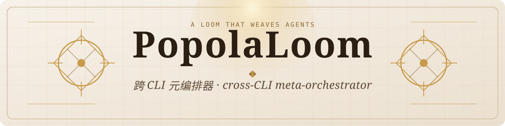

[](RELEASE_NOTES.md)
[](https://www.python.org/)
[](#license)

<!-- updated: 2026-05-10 -->

PopolaLoom is a local-first **meta-orchestrator** that sits on top of every agent CLI on your machine - Cursor, Claude Code, Codex, Kimi, GitHub Copilot - and gives them one dispatch surface, one durable task bus, and one shared human-in-the-loop channel. It has been Generally Available since `v0.9.0`; the current release line documented here is `v1.0.0-pre.1`.

## What it does

- **Unifies agent CLIs behind one command shape.** Use `popola dispatch ... --cli=cursor|claude|codex|kimi|copilot` instead of juggling different launch syntaxes for each tool.
- **Keeps work alive outside the terminal that launched it.** The `popolad` sidecar daemon owns task state, event logs, and attach/status/cancel semantics across shell closes, SSH reconnects, and machine restarts.
- **Bridges local automation and cloud runs under one operator model.** Cursor Cloud dispatch, self-hosted worker handoff, MCP tooling, and 5-channel HITL all plug into the same run graph.

## Quick start

### 1) Install in one command

```bash
curl -fsSL https://raw.githubusercontent.com/YoRHa-Agents/PopolaLoom/main/install.sh | bash
```

### 2) Initialize, boot, and dispatch

```bash
popola init
popola auth cursor set --validate    # optional for cursor-cloud
popola popolad start
popola dispatch "echo hello popola" --cli=cursor
popola list
popola attach <task_id> --follow
popola doctor
```

Cloud-only teams can use [`./cloud-quickstart.sh`](cloud-quickstart.sh) after exporting `CURSOR_API_KEY`. If you want the scripted local smoke path, run `bash examples/quickstart.sh`. For the guided install-to-first-task flow, see [`docs/QUICKSTART.md`](docs/QUICKSTART.md).

## Architecture


## Install and upgrade (v1.0.0-pre.1)

```bash
# Canonical install (default --from=git, tracks main)
./install.sh install

# Reproducible tag pin
./install.sh install --ref=v1.0.0-pre.1

# Optional keyring backend for secure Cursor credentials
./install.sh install --with-credentials

# Manual tag-pinned fallback
pip install git+https://github.com/YoRHa-Agents/PopolaLoom@v1.0.0-pre.1

# Upgrade an existing install
./install.sh update

# Upgrade and add the keyring extra
./install.sh update --with-credentials
```

Avoid the bare package-name install until the PyPI promotion patch lands. Current release details live in [`RELEASE_NOTES.md`](RELEASE_NOTES.md).

## Common commands

| Command | Purpose |
|---|---|
| `popola dispatch "<prompt>" --cli=<name>` | Spawn a task on a selected adapter |
| `popola attach <task_id> --follow` | Stream live task output and events |
| `popola status <task_id>` | Inspect a single task state envelope |
| `popola list [--all]` | List running or historical tasks |
| `popola popolad {start,stop,status}` | Manage the local daemon |
| `popola init [target]` | Install or refresh the PopolaLoom Skill in your IDE |
| `popola auth cursor set --validate` | Store and validate a Cursor API key |
| `popola doctor [--strict]` | Run the four-subsystem health check |

The full CLI and flag matrix is documented in [`docs/USER_GUIDE.md`](docs/USER_GUIDE.md).

## Why the "loom" metaphor?

- **Loom, not router.** Prompts, envelopes, event logs, and replies become one auditable run graph instead of isolated shell invocations.
- **Sidecar, not shell state.** The daemon owns task lifetime and persistence so work does not disappear with the terminal that launched it.
- **Two cloud paths, one CLI.** Use `popola dispatch --cli=cursor-cloud` for Cursor-managed runs, or `popola cloud worker ...` when this machine should execute as a self-hosted worker.

## Documentation

- [`docs/QUICKSTART.md`](docs/QUICKSTART.md) - first install to first dispatch
- [`docs/USER_GUIDE.md`](docs/USER_GUIDE.md) - CLI, MCP, HITL, cloud flows, and configuration
- [`docs/DEMO.md`](docs/DEMO.md) - walkthroughs and example outputs
- [`docs/design-ideas.md`](docs/design-ideas.md) - the architectural rationale
- [`docs/index.md`](docs/index.md) - GitHub Pages entry point
- [`docs/API_STABILITY.md`](docs/API_STABILITY.md) - stable vs experimental surface area

## License

MIT
