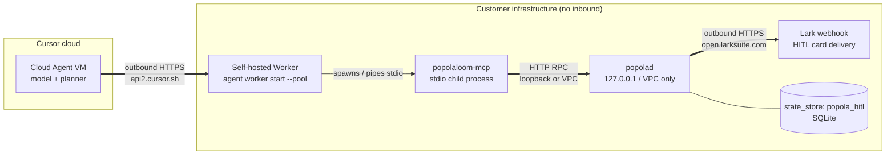
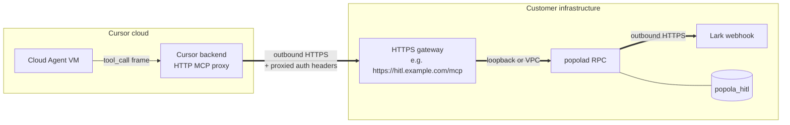

# PopolaLoom — User Guide (v0.9.6)

<!-- updated: 2026-05-10 -->

> **Generally Available since v0.9.0 (2026-05-08); current release v0.9.6 (2026-05-10).** See [API stability boundary](API_STABILITY.md) and [v0.7.x → v0.9.0 migration](MIGRATION_v07_to_v09.md). The CLI verb table + flag spellings + daemon RPC paths + `--json` schemas + `popolad.toml` section names are now under SemVer; experimental surfaces are marked `[experimental]` per [API_STABILITY §3](API_STABILITY.md#3-experimental-surfaces-no-semver-guarantee). **For v0.9.6 install via `./install.sh install`** (canonical; v0.9.6 default `--from=git` tracks `main`) **or `./install.sh install --ref=v0.9.6`** (canonical tag-pinned recipe) **or `pip install git+https://github.com/YoRHa-Agents/PopolaLoom@v0.9.6`** (manual fallback) — PyPI publish remains deferred to a v0.9.x patch (Q-D-5 偏离默认; see `BL-v0.9.x-PyPI` in TRACKER and [`RELEASE_NOTES.md`](../RELEASE_NOTES.md)). v0.9.6 closes [`./.local/feedbacks/feedback_for_v0.9.4.md`](../.local/feedbacks/feedback_for_v0.9.4.md) lines 2-5: the official installer no longer defaults to `pip install popolaloom` (which 404'd on Chinese pip mirrors); pass `--from=pypi --version=0.9.x` only after `BL-v0.9.x-PyPI` lands.

> Comprehensive reference for the `popola` CLI, MCP integration, HITL flows, Lark notifications, and the configuration surface. For first-time users, start with [`QUICKSTART.md`](QUICKSTART.md). For walkthroughs and example outputs, see [`DEMO.md`](DEMO.md). Cloud operators jump to the copy-paste-ready [`cloud-quickstart.sh`](../cloud-quickstart.sh) (v0.9.0+).

## Table of Contents

- [Mental model](#mental-model)
- [CLI verb reference](#cli-verb-reference)
  - [Task lifecycle](#task-lifecycle)
  - [Daemon management](#daemon-management)
  - [IDE integration](#ide-integration)
  - [Self-evaluation](#self-evaluation)
  - [Health + diagnostics](#health--diagnostics)
- [MCP integration](#mcp-integration)
- [HITL workflow](#hitl-workflow)
- [Lark integration](#lark-integration)
- [Adapter passthrough (`--cli-flag`)](#adapter-passthrough)
- [Cloud Agent dispatch (v0.8.5+)](#cloud-agent-dispatch-v085)
- [Credentials & secure storage (v0.9.2+)](#credentials--secure-storage-v092)
- [Self-hosted worker handoff (`popola cloud worker`, v0.9.1+)](#self-hosted-worker-handoff-popola-cloud-worker-v091)
- [Cloud HITL (Enterprise / Self-Hosted) (v0.8.7+)](#cloud-hitl-enterprise--self-hosted)
- [Multi-run cloud agents (v0.8.8+)](#multi-run-cloud-agents-v088)
- [Cost transparency — `status --verbose` (v0.8.8+)](#cost-transparency--status---verbose-v088)
- [Cross-PR relay — `popola relay` (v0.8.8+)](#cross-pr-relay--popola-relay-v088)
- [Quota-aware retry (`[cloud.backoff]` / `[cloud.busy_strategy]`) (v0.8.8+)](#quota-aware-retry-cloudbackoff--cloudbusy_strategy-v088)
- [`popola cloud runs` — list cloud-agent run history (v0.8.8+)](#popola-cloud-runs--list-cloud-agent-run-history-v088)
- [Hands-off envelope (v0.8.0+)](#hands-off-envelope)
- [Configuration (env vars)](#configuration)
- [Troubleshooting](#troubleshooting)
- [Architecture deep-dive](#architecture-deep-dive)
- [Reference](#reference)

## Mental model

PopolaLoom is a **sidecar daemon** (`popolad`) plus a **CLI** (`popola`) plus a **stdio MCP server** (`popolaloom-mcp`). The daemon binds a Unix Domain Socket at `$POPOLA_HOME/popolad.sock`, serves the dispatch / inspect / cancel / probe RPC, and owns:

- the **task pool** (vendored ArkTower `SqliteTaskRepository` — persistent across daemon restarts),
- the **NDJSON event log** under `$POPOLA_HOME/events/<task_id>.jsonl` (CloudEvents 1.0 envelope per event),
- the **LangGraph subgraph runner** (per-task; uses `interrupt()` for HITL pauses),
- the optional **`LarkSupervisor`** (manages a `lark-cli event consume` subprocess for inbound Lark replies, restart watchdog, ≤ 3 restarts → escalate).

Each task is a separate child subprocess of the agent CLI you specify (`cursor-agent`, `claude`, `codex`, …). The daemon watches the subprocess via a wait-thread, serializes its stdout/stderr into NDJSON events on the bus, broadcasts state transitions, and on terminal state writes a final `task.completed / task.failed / task.canceled` event plus an optional Lark notification card.

The `popola` CLI is a thin client over the UDS RPC: every verb (`dispatch`, `list`, `status`, `attach`, `cancel`, `probe`, `popolad`, `init`, `skill`, `doctor`, `eval`, `pending`, `feedback`) translates to one or more HTTP/JSON calls. The MCP server is a stdio bridge that exposes the same dispatch verbs as MCP tools so any MCP-aware IDE can call them as tool invocations.

The end result: you can `popola dispatch "..."` from any terminal, close that terminal, SSH in from another machine, run `popola attach <id> --follow`, and watch the task continue. HITL prompts are broadcast across **5 channels** (Lark, IDE, CLI, MCP, Web); the first responder wins via cross-channel sync (`hitl/sync.py:mark_answered` is atomic).

## CLI verb reference

### Task lifecycle

| Verb | Purpose | Example |
|---|---|---|
| `popola dispatch <prompt> --cli=<name>` | Spawn a new task on the named adapter; returns `task_id` | `popola dispatch "fix the bug in foo.py" --cli=cursor` |
| `popola dispatch ... --wait --timeout=120` | Block until terminal state (default 60s) | `popola dispatch "..." --cli=claude --wait --timeout=120` |
| `popola dispatch ... --cli-flag KEY=VAL` | Pass adapter-specific flags (repeatable; JSON-parsed) | `popola dispatch "..." --cli=cursor --cli-flag output_format=stream-json` |
| `popola dispatch ... --cwd <path>` | Spawn the subprocess with `Popen(cwd=...)` | `popola dispatch "refactor X" --cli=cursor --cwd ~/proj` |
| `popola dispatch ... --json` | Emit machine-readable JSON envelope | `popola dispatch "..." --cli=cursor --json` |
| `popola list` | List **non-terminal** tasks (default) | `popola list` |
| `popola list --all` | Include completed / failed / canceled | `popola list --all` |
| `popola list --json` | Machine-readable; pipes to `jq` | `popola list --all --json \| jq '.[] \| .task_id'` |
| `popola status <task_id>` | Single-task full state envelope | `popola status cursor-23e74ec18917` |
| `popola status <id> --json` | JSON envelope (state / pid / exit_code / events_log / arktower_task_id) | `popola status cursor-23e74ec18917 --json` |
| `popola attach <task_id> --follow` | Tail the SSE / NDJSON event stream (default `--follow`) | `popola attach cursor-23e74ec18917 --follow` |
| `popola attach <id> --no-follow` | One-shot dump of all events seen so far | `popola attach <id> --no-follow` |
| `popola cancel <task_id>` | SIGTERM → 5s grace → SIGKILL escalation | `popola cancel cursor-23e74ec18917` |
| `popola list-cli` | Print registered adapters + whether each binary is on PATH | `popola list-cli` |

The full lifecycle: `dispatched → running → (interrupted ↔ running)* → completed / failed / canceled`. The `interrupted` state is set when a LangGraph node calls `await interrupt(prompt)`; the daemon emits `task.elicited` on the event bus with the prompt body and broadcasts to the 5 HITL channels.

### Daemon management

| Verb | Purpose | Example |
|---|---|---|
| `popola popolad start` | Spawn `python -m popolaloom.daemon` with `start_new_session=True` | `popola popolad start` |
| `popola popolad start --foreground` | Run in the foreground (debugging mode) | `popola popolad start --foreground` |
| `popola popolad status` | Daemon socket + pid + probe roll-up | `popola popolad status` |
| `popola popolad stop` | SIGTERM → 5s → SIGKILL; clean pid + sock | `popola popolad stop` |
| `popola probe` | Lightweight liveness — pid + uptime + active task count | `popola probe` |

The daemon binds the UDS at `$POPOLA_HOME/popolad.sock` (default `~/.popola/popolad.sock`); the pidfile is `$POPOLA_HOME/popolad.pid`; the log is `$POPOLA_HOME/log/popolad.log`. Cold-start UDS-up time has a NFR-1 gate of ≤ 2s (median ~250ms on the dev VM).

### IDE integration

| Verb | Purpose | Example |
|---|---|---|
| `popola init` | Auto-detect every IDE present + install the canonical Skill | `popola init` |
| `popola init <ide>` | Install for one IDE (cursor / claude / codex / copilot / local) | `popola init cursor --global` |
| `popola init all --global` | Install for every detected IDE except local, with global scope | `popola init all --global` |
| `popola init --interactive` | Human-driven wizard (v0.5.5+; `typer.confirm` per IDE + scope) | `popola init --interactive` |
| `popola init --list` | Print every detected target + install path (no writes) | `popola init --list` |
| `popola init <ide> --dry-run` | Preview writes without touching disk | `popola init cursor --project --dry-run` |
| `popola skill install --target=<ide>` | Same as `popola init <ide>`, sub-verb form | `popola skill install --target=cursor` |
| `popola skill upgrade --target=<ide>` | **Overwrite** installed SKILL.md from the wheel (after `.popola-loom-bak.<ts>` backup) | `popola skill upgrade --target=cursor` |
| `popola skill upgrade --target=all` | Cycle every detected install | `popola skill upgrade --target=all` |
| `popola skill doctor` | Skill-only audit (subset of `popola doctor`) | `popola skill doctor` |
| `popola skill uninstall --target=<ide>` | Remove SKILL.md + marker (v0.8.4+) | `popola skill uninstall --target=cursor --global` |
| `popola skill uninstall --target=all` | Remove every Skill across IDEs | `popola skill uninstall --target=all --global` |

Per-IDE install paths:

| IDE | Scope | Install path |
|---|---|---|
| Cursor | global | `~/.cursor/skills/popola-loom/SKILL.md` |
| Cursor | project | `<repo>/.cursor/skills/popola-loom/SKILL.md` |
| Claude Code | global | `~/.claude/skills/popola-loom/SKILL.md` |
| Claude Code | project | `<repo>/.claude/skills/popola-loom/SKILL.md` |
| Codex | global | `$CODEX_HOME/skills/popola-loom/SKILL.md` (default `~/.codex/`) |
| Copilot | project-only | `<repo>/.github/copilot-instructions.md` (single-file flatten) |
| local | scaffold | `<repo>/.local/` (workspace surface) |

`popola init` differs from `popola skill upgrade` in two ways: (1) `init` is **idempotent** — second invocation prints `SKIP <path> (already installed)`; `upgrade` **always overwrites** (after writing a `.popola-loom-bak.<ts>` backup). (2) `init` is the first-time-installer entry point; `upgrade` is the post-`pip install --upgrade popolaloom` refresh entry point.

### `install.sh` — bash bootstrap installer (v0.8.4+; defaults flipped in v0.9.6)

The unified bash installer at the repo root (`install.sh`) wraps the four-step manual workflow (`pip install` → `popola skill install` → `popola popolad start` → `popola doctor`) into a single shell command. The same script also drives the inverse path: `install.sh uninstall` removes the Skills and uninstalls the package; `install.sh update` upgrades the wheel and refreshes the on-disk SKILL.md.

> **Current-release install note (v0.9.6)**: closes [`./.local/feedbacks/feedback_for_v0.9.4.md`](../.local/feedbacks/feedback_for_v0.9.4.md) lines 2-5 — the `--from` default flipped from `pypi` to `git` because PyPI publish remains deferred for the v0.9.x line (Q-D-5 偏离默认 / `BL-v0.9.x-PyPI`). A fresh `./install.sh install` no longer 404s on Chinese pip mirrors that don't carry `popolaloom` yet. New `--ref=<tag|branch|sha>` flag pins the install to a specific tag (`./install.sh install --ref=v0.9.6` is the canonical recipe). Pass `--from=pypi --version=0.9.x` only after the v0.9.x PyPI promotion patch lands; until then `--from=pypi` resolves to the prior v0.8.x stable line.

```bash
# Pull from GitHub and run as a one-liner (v0.9.6 default --from=git tracks main)
curl -fsSL https://raw.githubusercontent.com/YoRHa-Agents/PopolaLoom/main/install.sh | bash

# Same, with explicit options
curl -fsSL https://raw.githubusercontent.com/YoRHa-Agents/PopolaLoom/main/install.sh \
  | bash -s -- install --scope=global --target=all

# Same, tag-pinned for reproducibility (v0.9.6+ canonical recipe)
curl -fsSL https://raw.githubusercontent.com/YoRHa-Agents/PopolaLoom/main/install.sh \
  | bash -s -- install --ref=v0.9.6

# After a clone — same script, local invocation
./install.sh install --scope=project --target=cursor
./install.sh update
./install.sh uninstall --yes --purge
```

#### Verbs

| Verb | Purpose |
|---|---|
| `install` (default) | `pip install` (v0.9.6 default `--from=git` tracks main; `--ref=<tag>` pins; `--from=pypi --version=X.Y.Z` is the PyPI fallback once `BL-v0.9.x-PyPI` lands) → `popola skill install` → `popola popolad start` (best-effort) → `popola doctor` (best-effort) |
| `update` | `pip install --upgrade <spec>` → `popola skill upgrade --target=<...>` → `popola doctor` |
| `uninstall` | `popola popolad stop` (best-effort) → `popola skill uninstall --target=<...>` → `pip uninstall popolaloom` (gated on confirmation) → optional `rm -rf $POPOLA_HOME` when `--purge` is set |
| `version` | Print `install.sh v0.9.6` and exit |
| `help` / `--help` / `-h` | Print usage and exit |

#### Flag matrix

| Flag | Applies to | Purpose |
|---|---|---|
| `--scope=<global\|project>` | install / update / uninstall | Skill scope (default: `global`) |
| `--target=<cursor\|claude\|codex\|copilot\|all>` | install / update / uninstall | Which IDE Skill (default: `all`) |
| `--from=<git\|pypi\|PATH>` | install / update | Install source (**default in v0.9.6+: `git`**, tracks `main`; previously `pypi`) |
| `--ref=<tag\|branch\|sha>` | install / update | (v0.9.6+ NEW) Append `@<ref>` to the GitHub URL — requires `--from=git`; e.g. `--ref=v0.9.6` |
| `--version=<X.Y.Z>` | install / update | Pin a PyPI version (requires `--from=pypi`) |
| `--python=<bin>` | all | Python interpreter (default: search `python3.12 → python3.11 → python3 → python`) |
| `--no-skills` | all | Skip the Skill install / uninstall step |
| `--no-daemon` | install | Skip `popola popolad start` after pip install |
| `--purge` | uninstall | Also `rm -rf ${POPOLA_HOME:-$HOME/.popola}` after pip uninstall (gated on confirmation; **destructive**) |
| `--yes` / `-y` | uninstall | Skip interactive prompts (required for non-tty / scripted runs) |
| `--dry-run` | all | Print every command that would be run; no I/O |
| `--quiet` / `-q` | all | Suppress informational output |
| `--help` / `-h` | all | Print usage and exit |

#### `--from=` source resolution

| Value | Translates to |
|---|---|
| `git` (**default in v0.9.6+**) | `pip install git+https://github.com/YoRHa-Agents/PopolaLoom.git` |
| `git` + `--ref=<ref>` | `pip install git+https://github.com/YoRHa-Agents/PopolaLoom.git@<ref>` (e.g. `--ref=v0.9.6` → `…@v0.9.6`) |
| `pypi` | `pip install popolaloom` (currently delivers prior v0.8.x line until `BL-v0.9.x-PyPI` lands) |
| `pypi` + `--version=X.Y.Z` | `pip install popolaloom==X.Y.Z` |
| any other value (filesystem path) | `pip install <path>` (works for local clones, wheel files, and tarballs) |

For example: `./install.sh install --from=./dist/popolaloom-0.9.6-py3-none-any.whl` installs from a locally-built wheel. Contradictory inputs (`--ref` with `--from=pypi`, `--version=` without `--from=pypi`, `--ref` on the `uninstall` verb) fail loudly per the workspace No-Silent-Failures rule.

#### Examples

```bash
# Canonical v0.9.6 install (default --from=git, tracks main)
./install.sh install

# Canonical tag-pinned v0.9.6 install (recommended for reproducibility)
./install.sh install --ref=v0.9.6

# Install only for Cursor at project scope (default --from=git applies)
./install.sh install --target=cursor --scope=project

# Install pinned to a specific PyPI version (currently delivers prior v0.8.x line until BL-v0.9.x-PyPI)
./install.sh install --from=pypi --version=0.9.6

# Update only the package without touching Skill files
./install.sh update --no-skills

# Uninstall everything in one shot (interactive prompt before pip uninstall)
./install.sh uninstall

# Same, scripted (non-tty) — skip the prompt and purge ~/.popola/
./install.sh uninstall --yes --purge

# See exactly what would happen without touching disk
./install.sh install --dry-run
./install.sh install --dry-run --ref=v0.9.6
./install.sh uninstall --dry-run --yes
```

> **Destructive flag warning**: `install.sh uninstall --purge` deletes `${POPOLA_HOME:-$HOME/.popola}` (daemon socket, NDJSON event log, vendored ArkTower SQLite, daemon pidfile). The script gates the deletion behind a `[y/N]` prompt; pass `--yes` only when you have backed up anything you need.

#### Idempotency contract

- Re-running `install` with the same flags is safe (`pip install` is idempotent; `popola skill install` prints `SKIP` for byte-identical SKILL.md content).
- Re-running `uninstall` after the package is gone returns `popolaloom not installed; nothing to do` and exits 0.
- Re-running `uninstall --target=cursor` after the Skill is gone produces an `ABSENT` outcome from `popola skill uninstall` (no error).

#### When to use `install.sh` vs `popola init`

The two surfaces are **complementary**, not competing:

- `install.sh` is the **first-time bootstrap** — run it on a fresh machine to get popolaloom installed end-to-end (pip + Skills + daemon + doctor) in one command. Until v0.9.x is on PyPI, pass `--from=git` for the current release. It is also the recommended path for upgrade and uninstall.
- `popola init` is the **post-install IDE wizard** — run it after `install.sh` (or `pip install popolaloom`) to add additional IDEs, scaffold the `.local/` workspace surface, or run the interactive setup wizard.

### Self-evaluation

| Verb | Purpose | Example |
|---|---|---|
| `popola eval run --output PATH` | Run the 8-dim PopolaLoom-nines self-eval; write TOML | `popola eval run --output /tmp/nines.toml` |
| `popola eval show` | Show the dimension weights + last-run scores | `popola eval show` |
| `popola eval show --json` | JSON envelope (per-dim score + weight + composite) | `popola eval show --json` |

The 8 dimensions: `dispatch_isolation / cycle_convergence / hitl_latency / attach_correctness / cross_cli_handoff / single_threaded_writes / event_log_completeness / hitl_handleability`. Each scorer collects evidence from `~/.popola/events/*.jsonl` (NDJSON receipts) and emits a 0.0–1.0 score; the composite is a weighted sum (weights sum to 1.0; tunable in `nines.toml`).

### Health + diagnostics

| Verb | Purpose | Example |
|---|---|---|
| `popola doctor` | 4-subsystem audit; human-readable table; exit 0 by default | `popola doctor` |
| `popola doctor --strict` | Exit 1 on any FAIL (CI-friendly) | `popola doctor --strict` |
| `popola doctor --json` | 4-section envelope (skill / daemon / lark / arktower) + summary | `popola doctor --json` |
| `popola pending` | Show prompts awaiting human response | `popola pending` |
| `popola feedback <hitl_id> <answer> --reason "..."` | Submit a CLI-channel HITL response | `popola feedback hitl-abc12 yes --reason "verified backup"` |
| `popola version` | Print `popolaloom <version>` | `popola version` |

The `popola doctor` 4 subsystems:

1. **Skill** — every `(target, scope)` slot from `SKILL_TARGETS`; reports `OK` / `MISS` / `DRIFT` (drift = installed `.popola-loom-version` ≠ wheel version).
2. **Daemon** — `GET /probe` over the popolad UDS socket; `OK` (pid + uptime) when the daemon is up, `FAIL` otherwise.
3. **Lark** — `lark-cli` on PATH + `LARK_HITL_TARGET_OPEN_ID` env var; `OK` (both present), `WARN` (binary on PATH, env unset), `OFF` (binary missing — informational, not a fail).
4. **ArkTower** — vendored module imports cleanly + the two PopolaLoom migrations (`005_popolaloom_extensions.sql` / `006_popola_hitl.sql`) are on disk; `WARN` when migrations are missing (the daemon falls back to a no-op runner per the "degrade gracefully" constraint).

Exit code is `0` by default (WARN / DRIFT / MISS are informational); `--strict` escalates any FAIL into a non-zero exit.

## MCP integration

PopolaLoom's MCP server exposes the dispatch / inspect / HITL verbs to any MCP-aware IDE over stdio. To wire it into Cursor:

```jsonc
// ~/.cursor/mcp.json
{
  "mcpServers": {
    "popolaloom": {
      "command": "python",
      "args": ["-m", "popolaloom.mcp.server"]
    }
  }
}
```

For Claude Code:

```jsonc
// ~/.claude/mcp.json — same shape; the IDE auto-restarts the MCP child on save
{
  "mcpServers": {
    "popolaloom": {
      "command": "python",
      "args": ["-m", "popolaloom.mcp.server"]
    }
  }
}
```

After restart, the host agent sees the 9-verb stdio bridge:

- `popola_submit` — equivalent to `popola dispatch` (returns `task_id`)
- `popola_list` — equivalent to `popola list --all`
- `popola_status` — equivalent to `popola status <task_id>`
- `popola_attach_stream` — equivalent to `popola attach <task_id> --follow` (streams events over MCP)
- `popola_cancel` — equivalent to `popola cancel <task_id>`
- `popola_relay` — chain a follow-up task onto the prior task's output (per `mcp/tools.py`)
- `popola_supervise` — register a long-running supervised cycle
- `popola_federate` — multi-task fan-out with cross-task handoff envelopes
- `popola_supply_feedback` — equivalent to `popola feedback <hitl_id> <answer>`
- `popola_inject_subtask` — inject a child subtask under a parent

The elicitation builder (`popolaloom.mcp.elicitation`) renders pending HITL prompts as form-mode requests so the IDE can surface them as a chooser UI (a button-style picker for enum prompts; a freeform text field for open prompts).

## HITL workflow

Tasks pause at `await interrupt(prompt)` inside their LangGraph subgraph. The daemon broadcasts the prompt to **5 channels simultaneously**:

| Channel | How users respond | Code path |
|---|---|---|
| **Lark** | Tap "通过" / "拒绝" on the interactive card | `lark/listener.py` (button event → `LarkSupervisor` → state writeback) |
| **IDE** | Click in the host IDE's chooser UI (Cursor / Claude / Codex) | MCP elicitation form (form-mode tool result) |
| **CLI** | `popola pending` then `popola feedback <hitl_id> <answer>` | `cli/feedback_cmd.py` |
| **MCP** | Programmatic via `popola_supply_feedback` tool call | `mcp/tools.py:popola_supply_feedback` |
| **Web** | Static docs entry point and future dashboard channel | GitHub Pages now; browser dashboard remains a tracked roadmap surface |

The first responder wins via the atomic `mark_answered` in `hitl/sync.py`; the late responders see "already answered (via=<channel>)" and back off. The state writeback emits a `state.resumed` event; the LangGraph subgraph picks up where it left off.

A typical Lark approval flow:

```bash
export LARK_HITL_TARGET_OPEN_ID=ou_xxx           # your Lark open_id
popola dispatch "drop the staging.users table" --cli=cursor
# → cursor-deadbeef

# Inside the task, the adapter detects a destructive operation and calls
# `interrupt(prompt="ok to delete prod table?", options=["yes", "no"])`.
# The daemon broadcasts; you see a Lark card in your IM client + the
# task pauses at the `interrupt()` point.

# In Lark, you tap "通过" → LarkSupervisor catches the button event,
# writes "yes" back into the LangGraph state, the subgraph resumes.

popola attach cursor-deadbeef --follow            # see the resume + completion
```

## Lark integration

### Outbound (proactive notifications)

PopolaLoom sends interactive Lark cards on every terminal state transition. Defaults are 3 ON / 2 OFF (v0.4.1+):

| Trigger | Default | Card colour |
|---|---|---|
| `task.completed` | ON (`LARK_NOTIFY_ON_COMPLETED=1`) | green |
| `task.failed` | ON (`LARK_NOTIFY_ON_FAILED=1`) | red |
| `task.canceled` | ON (`LARK_NOTIFY_ON_CANCELED=1`) | yellow |
| `cancel → SIGKILL` | OFF (`LARK_NOTIFY_ON_CANCEL_ESCALATED=0`) | orange |

Cards include the prompt summary (truncated to `LARK_NOTIFY_PROMPT_TRUNCATE` chars; default 200), the task_id, the exit_code, and a deep-link to the events log path.

### Inbound (HITL replies + listener supervision)

The `LarkSupervisor` manages a `lark-cli event consume <events>` subprocess; it watches for "button click" events on cards with the `--metadata-key hitl_id=<id>` annotation and writes the chosen answer back into LangGraph state. If the listener subprocess dies, the supervisor restarts it (≤ 3 consecutive restarts → escalate to operator-visible HITL).

Per workspace rule, every Lark write operation appends the `\n---\n本消息由飞书工具 Lark-Cli 发送` footer.

### Gating

When `lark-cli` is missing OR `LARK_HITL_TARGET_OPEN_ID` is unset, the daemon silently degrades to NDJSON-only event logging. Every skip emits a single `lark.supervisor.skipped reason=...` INFO line so you can audit the gating decision in `popolad.log`.

## Adapter passthrough

`--cli-flag KEY=VAL` (repeatable) passes adapter-specific arguments to the underlying agent CLI. Values are JSON-parsed first (`true` / `123` / `"foo"`); on parse failure they fall back to a string (`output_format=text` is equivalent to `output_format="text"`). The dispatch handler collects them into an `extra: dict` which each adapter's `build_command` translates into the final `argv`.

| Adapter | KEY | Type | Becomes | Notes |
|---|---|---|---|---|
| `cursor` | `output_format` | str | `--output-format <val>` | Whitelist: `text` (default) / `stream-json`; violation → ValueError |
| `cursor` | `cwd_flag` | bool | `--cwd <cwd>` if true | Default false (let supervisor's `Popen(cwd=...)` control) |
| `cursor` | `session_id` | str | `--session-id <chatId>` | Reuse a `cursor-agent create-chat` pre-allocated chat |
| `cursor` | `cli_args` / `cmd_args` | str | passed through verbatim | Cursor `--trust` / `--no-color` flags etc. (v0.6.0+) |
| `claude` | `session_id` | str (UUID) | `--session-id <UUID>` | "Allocate ID first, then spawn" form |
| `claude` | `max_turns` | int | `--max-turns <n>` | Limits conversation rounds |
| `codex` | `sandbox` | str | `--sandbox <val>` | Whitelist: `read-only` / `workspace-write` / `danger-full-access` |

Common patterns:

```bash
# 1. Cursor stream-json output (lets supervisor parse tool-call events line-by-line)
popola dispatch "design caching layer" --cli=cursor \
  --cli-flag output_format=stream-json

# 2. Claude with a pre-allocated UUID + max_turns guard
SESSION=$(python -c "import uuid; print(uuid.uuid4())")
popola dispatch "refactor module X" --cli=claude \
  --cli-flag session_id="$SESSION" \
  --cli-flag max_turns=10

# 3. Codex sandbox locked to read-only
popola dispatch "review src/foo.py for bugs" --cli=codex \
  --cli-flag sandbox=read-only

# 4. Repeatable flags (cursor: stream-json + a session_id at once)
popola dispatch "..." --cli=cursor \
  --cli-flag output_format=stream-json \
  --cli-flag session_id=$CHAT_ID
```

Unknown KEYs are silently ignored by the adapter (forward-compat for newer adapter versions); the value-parse rules raise on whitelist violations (No Silent Failures for typed knobs).

## Cloud Agent dispatch (v0.8.5+)

> **v0.9.0 GA**: This section's CLI verb (`popola dispatch --cli=cursor-cloud`) and its flag spellings are part of the v0.9.x stable surface — see [API_STABILITY §2.1](API_STABILITY.md#21-cli-commands-and-flags). For a copy-paste-ready bootstrap, run [`./cloud-quickstart.sh`](../cloud-quickstart.sh).

<!-- updated: 2026-05-10 -->

### Prerequisites

1. **Daemon** — identical to other adapters: `popola popolad start` (Unix socket RPC).
2. **API key** — configure a Cursor Cloud Agents API key via either of the two stable precedence slots (v0.9.2+, see [API_STABILITY §2.5](API_STABILITY.md#25-cursor-api-key-credential-resolver-v092)):
   - **Env var (highest precedence)** — `export CURSOR_API_KEY="cr_..."`. This is the documented path for CI / ephemeral shells and remains backward-compatible with every v0.8.x guide.
   - **OS keyring** — `popola auth cursor set` stores the secret in macOS Keychain / Windows Credential Manager / libsecret (Linux) so subsequent shell sessions resolve it automatically without re-export. Requires the optional `keyring>=25` dependency, easiest path: `./install.sh install --with-credentials` (v0.9.7+) — bundles the extra into the same install. Manual fallback: `pip install 'popolaloom[credentials]'`.

   PopolaLoom authenticates with Cursor's Cloud Agents REST using **HTTP Basic** (username = API key, password empty) through `CloudCursorClient`. See the [Credentials & secure storage](#credentials--secure-storage-v092) section below for the full flow.

Without a configured key in **either** slot, `--cli=cursor-cloud` is rejected at adapter availability checks; the historical `--cli=cursor` subprocess path is unchanged.

### Dispatch

```bash
# Option A: env var (CI-friendly, ephemeral)
export CURSOR_API_KEY="cr_..."   # example shape only — use your Cursor dashboard key material

# Option B (v0.9.2+): OS keyring (persistent, no re-export needed)
popola auth cursor set --validate

popola dispatch "Plan database migration scaffolding" \
  --cli=cursor-cloud \
  --cwd ~/workspace/acme-backend \
  --cli-flag repo_url=https://github.com/acme/monorepo \
  --cli-flag starting_ref=main \
  --cli-flag model=composer-2 \
  --cli-flag auto_create_pr=false
```

The adapter (`CursorCloudAdapter`) packs your prompt + validated `extra` keys into JSON behind `CLOUD_BUILD_COMMAND_MARKER`. `Supervisor.spawn` recognises the sentinel and calls **`_spawn_cloud()`** instead of `Popen`.

To route a REST-created Cloud Agent through self-hosted / local workers, add routing extras such as `--cli-flag pool_name=popolaloom`, `--cli-flag worker_name=ci-1`, or `--cli-flag 'labels={"pool":"popolaloom"}'`. Any non-empty labels or convenience routing key implies Cursor's `usePrivateWorker=true`; explicitly combining `use_private_worker=false` with routing labels is rejected.

### Behaviour vs local adapters

| Surface | Local `cursor` / other CLIs | `cursor-cloud` |
|---|---|---|
| Execution | subprocess on workstation | Cursor-managed cloud workload |
| `popola cancel` | SIGTERM escalation | REST `cancel_run`; explicit EventLog tails on HTTP failures |
| `popola status` | `pid`, `runtime=local`, etc. | `runtime=cloud`, `cursor_agent_id` (`bc-*` prefix observed in API), `cursor_run_id`, `cloud_phase` |
| Browser tooling | IDE local session | Inspect runs at **`https://cursor.com/dashboard/cloud-agents`** (+ agents index) |

The cloud poller thread maps remote phases (`CREATING`, `RUNNING`, `FINISHED`, `ERROR`, `CANCELLED`, `EXPIRED`, …) into existing EventLog / FSM semantics so SSE consumers behave consistently.

### HITL bridging endpoints

Automations that run **outside** the IDE but still want first-responder HITL can call the authenticated daemon HTTP API:

| Verb | Route | Purpose |
|---|---|---|
| POST | `/hitl/cloud/request` | Register a structured question for cloud-hosted agents |
| GET | `/hitl/cloud/wait/{hitl_id}` | Block until answered / deadline (long-poll friendly) |
| POST | `/hitl/cloud/answer/{hitl_id}` | Submit a human-authored answer (paired with Lark + SQLite store) |

These compose with existing Lark fan-out: the **`cloud`** `HITLChannel` participates in identical first-responder-wins bookkeeping as Lark / MCP / IDE channels (`mark_answered`).

### Operational notes

1. **`auto_create_pr` defaults false** (`--cli-flag auto_create_pr=true` opts in) per release decision matrix.
2. Self-hosted worker routing flags are `use_private_worker`, `labels`, and the convenience keys `worker_name`, `machine_name`, `pool_name` (merged into labels as `worker`, `machine`, `pool`).
3. Prefer **narrow prompts** — every dispatch still records the Markdown handoff envelope for audit, but quota accrues on Cursor’s side.
4. Regression / smoke coverage lives under `tests/real_cursor_cloud/` with marker **`real_cursor_cloud`**; exporting `CURSOR_API_KEY` runs four cheap live tests (`create` + immediate `cancel`, metadata GETs, bogus-key sentinel). Omit the env var locally or in CI for **skipped-not-failed** semantics.

### SSE ingest (v0.8.6+)

<!-- updated: 2026-05-08 -->

For `runtime=cloud` tasks, `popola attach <task_id> --follow` now defaults to **SSE-by-default**: alongside the daemon's existing `/attach_stream` feed, the CLI opens an `httpx.stream("GET", /v1/agents/{id}/runs/{run_id}/stream)` against Cursor's REST and pumps `cloud.sse.*` envelopes (`assistant`, `tool_call`, `result`, `status`, `parse_error`, `stream_expired`, `dedup_drop`) into the same renderer. Each envelope carries the idempotency quintuple `(task_id, run_id, stream_session_id, sse_id, seq)` so downstream consumers can dedupe deterministically.

| Surface | Default behaviour (v0.8.6+) | Escape hatch |
|---|---|---|
| `popola attach <id> --follow` (cloud task) | SSE pump on a background thread + poll-driven `/attach_stream` view in foreground | `--no-stream` forces legacy poll-only |
| `popola attach <id> --follow` (local task) | Unchanged (poll-driven `/attach_stream`) | n/a |
| `popola attach <id> --no-follow` | One-shot dump (no SSE) | n/a |

**Auto-fallback to poll.** The SSE thread bows out cleanly without crashing when any of the following happens, and the existing poll-driven view continues:

- `CursorCloudStreamExpiredError` (HTTP `410 stream_expired` after the Cursor server's retention window elapses) — the reader does NOT reconnect `/stream`; status reconciles via the next `cloud.run_status` poll.
- `httpx.ReadError` / `httpx.ConnectError` / `httpx.TimeoutException` (network blip mid-stream).
- Missing `CURSOR_API_KEY` (cannot authenticate; surfaces a `[cloud sse] ...` one-liner on stderr per No-Silent-Failures).
- Main-thread teardown via `stop_event.set()` (Ctrl-C unwind).

On any fallback the renderer appends a `cloud.sse.fallback_to_poll` boundary marker so attached operators can see the transition without inspecting daemon logs.

**Tolerated divergence.** The `cloud_poller` thread remains the **sole writer** of `TaskHandle.cloud_phase` (per `state-source-of-truth.md` §1.2 rule 1); SSE events are **append-only on the EventLog** and never mutate state. As a consequence, the SSE-side "stream:running" hint may briefly disagree with the poller-driven `cloud_phase=CREATING` (or vice versa) for **up to ≤3 s** (poll interval `interval_s` + 1 s jitter; default `interval_s=2 s`). The renderer applies the §4 reconciliation rules: poller wins on every `cloud_phase` disagreement; SSE wins for fields the poller does not own (assistant text, per-tool diagnostics).

```bash
popola attach cursor-cloud-deadbeef --follow            # SSE-by-default
popola attach cursor-cloud-deadbeef --follow --no-stream # legacy poll-only
```

A `cloud.sse.*` envelope as it appears in `~/.popola/events/<task_id>.jsonl` (one CloudEvents 1.0 line per frame; the idempotency quintuple lives under `data`):

```json
{"type":"cloud.sse.assistant","time":"2026-05-08T10:00:01.234+00:00","data":{"task_id":"task-cloud-002","run_id":"run_abc123","stream_session_id":1,"sse_id":"42","seq":7,"payload":{"text":"Looking at the failing test..."}}}
```

### Cloud error hints (v0.8.6+)

<!-- updated: 2026-05-08 -->

v0.8.6 ships a 16-entry **422-family error catalog** embedded in `cursor_cloud.py` (`_ERROR_CATALOG` constant). The selector follows precedence `(error.code → error.message regex → HTTP status)` and dispatches into one of ten new `CursorCloud*Error` subclasses (e.g. `CursorCloudPlanRequiredError`, `RepoAllowlistError`, `GithubAppMissingError`, `GithubAppPermissionError`, `CursorCloudStreamExpiredError`). Every subclass carries `.hint_en` + `.hint_zh` strings (each ≤2 sentences, each containing ≥1 dashboard URL) and a stable `.cli_exit` code so scripted callers can branch on outcome.

Two representative bilingual hints (verbatim from the catalog so future drift is detectable by hash diff):

**`RepoAllowlistError`** (HTTP 422 / 400 / 403; `error.message` matches `(?i)(allow.?list|allowed.?repositor|repository.+not.+(configured|installed|allowed))`; CLI exit `78`):

- **EN hint:** *The Cursor GitHub App is not allow-listed for this repository. Open `https://github.com/apps/cursor` (or your org's Integrations page) and add the repo, then revisit `https://cursor.com/dashboard/integrations` to confirm the GitHub connection.*
- **ZH hint:** *Cursor GitHub App 未对该仓库开通。请到 `https://github.com/apps/cursor`（或组织 Integrations 页）勾选目标仓库，再到 `https://cursor.com/dashboard/integrations` 确认连接已生效。*

**`CursorCloudPlanRequiredError`** (HTTP 403 `plan_required`; CLI exit `78`):

- **EN hint:** *Cloud Agents require a paid Cursor plan; this account is on a free tier. Upgrade at `https://cursor.com/pricing` or use an account with paid access.*
- **ZH hint:** *Cloud Agents 需要付费版 Cursor 套餐，当前账户为免费档。请到 `https://cursor.com/pricing` 升级，或切换到已付费账户。*

The other 14 entries cover `401 unauthorized`, `401 api_key_not_found`, `403 role_forbidden`, `403 feature_unavailable`, `404 agent_not_found`/`run_not_found`, `409 agent_busy` / `agent_archived` / `run_not_cancellable`, `410 stream_expired`, `400/422 validation_error`, two more 422 GitHub-App categories, `429 rate_limit_exceeded` (deferred to v0.8.8), and `5xx internal_error` / `upstream_error`. The full text + retry/backoff matrix lives in the [research note (local-only)](../.local/research/v0.8.6_sse/422-error-catalog.md) §3 and is reproduced into the Python `_ERROR_CATALOG` constant verbatim.

### `popola init --target=cloud-only` (v0.9.0+)

<!-- updated: 2026-05-09 -->

> **Install prerequisite (v0.9.6 current)** — `popola` must be on PATH before this scaffold can run. For v0.9.6 install via `./install.sh install` (canonical; v0.9.6 default `--from=git` tracks `main`) OR `./install.sh install --ref=v0.9.6` (canonical tag-pinned recipe) OR `pip install git+https://github.com/YoRHa-Agents/PopolaLoom@v0.9.6` (manual fallback). v0.9.6 closes [`./.local/feedbacks/feedback_for_v0.9.4.md`](../.local/feedbacks/feedback_for_v0.9.4.md) lines 2-5: `./install.sh install` no longer 404s on Chinese pip mirrors that don't carry `popolaloom` yet. Pass `--from=pypi --version=0.9.x` only after the v0.9.x PyPI patch lands (Q-D-5 偏离默认: PyPI deferred to v0.9.x; see `BL-v0.9.x-PyPI` in TRACKER).


`popola init --target=cloud-only` is the v0.9.0 W2.4 scaffold profile that drops a **minimal, cloud-dispatch-only project skeleton** — three files at the project root, no IDE skill installs, no `.local/` workspace, no local CLI shims, no local-tier HITL stubs. It is the right starting point when:

- The team operates **exclusively** through Cursor Cloud Agents (no laptops running `cursor-agent` / `claude` / `codex` subprocess CLIs locally) and only needs the daemon's REST surface to dispatch + monitor cloud runs.
- A CI / runbook needs a deterministic project layout it can stamp into a fresh checkout (e.g. a "create cloud dispatch project" job in a platform team's templating pipeline).
- The default `--target=full` profile would create surface (e.g. `.local/`) the team has policy reasons to keep out of the repo.

The default `--target=full` profile (or no `--target` at all) preserves the existing 14-row verb + 8-modifier matrix byte-for-byte (auto-detect IDEs, scaffold `.local/`, install SKILL.md per detected IDE) — Q-D-4 偏离默认 ships cloud-only **alongside** that surface, never in place of it.

#### What the scaffold creates

```text
<project_root>/
├── popolad.toml         # cloud-only daemon config: [hitl.cloud], [cloud.backoff],
│                        # [cloud.busy_strategy], [cloud.relay] — NO bare [hitl]
├── .env.example         # CURSOR_API_KEY env var (empty) + commented optional overrides
└── Makefile             # dispatch / status / attach / relay shortcuts
```

The cloud-only `popolad.toml` carries exactly four sections — `[hitl.cloud]`, `[cloud.backoff]`, `[cloud.busy_strategy]`, `[cloud.relay]` — and intentionally omits the local-tier `[hitl]` block (that block is what wires the daemon's local Lark / MCP listeners; cloud-only mode never registers them). The `.env.example` carries a single REQUIRED variable (`CURSOR_API_KEY`) and three OPTIONAL overrides commented out (`POPOLA_HOME`, `CURSOR_API_BASE`, `POPOLA_HANDOFF_DIR`). The `Makefile` exposes four targets: `make dispatch PROMPT="..."` (the canonical entrypoint), `make status TASK_ID=...`, `make attach TASK_ID=...`, and `make relay TASK_ID=...` — each shells out to the corresponding `popola` subcommand with `--cli=cursor-cloud` baked in for `dispatch`.

#### Walkthrough — fresh project, first cloud dispatch

```bash
mkdir my-cloud-project && cd my-cloud-project
popola init --target=cloud-only
#   popola init — target: cloud-only
#     scaffolding cloud-only project skeleton (no local CLI shims, no local HITL stubs)
#     OK   ./popolad.toml
#     OK   ./.env.example
#     OK   ./Makefile

cp .env.example .env
# Edit .env, set: CURSOR_API_KEY=cr_...    (from https://cursor.com/dashboard → API Keys)

set -a && . ./.env && set +a            # export the env to the current shell
popola popolad start                    # boot the daemon (Unix socket RPC)

popola dispatch --cli=cursor-cloud --prompt "Plan database migration scaffolding"
# → cursor-cloud-deadbeef                (the dispatched task id; copy for status / attach)

popola attach cursor-cloud-deadbeef --follow    # SSE-by-default for runtime=cloud
# Or via the Makefile shortcut:
make dispatch PROMPT="Plan database migration scaffolding"
make attach   TASK_ID=cursor-cloud-deadbeef
```

#### Idempotency + `--force`

A second `popola init --target=cloud-only` invocation in the same directory prints `SKIP <path> (already exists; use --force to overwrite)` for each of the three files and preserves any operator edits — the same idempotency contract every other init verb already satisfies. Pass `--force` to overwrite the canonical content on top of any operator-modified copy: `popola init --target=cloud-only --force`. `--dry-run` is also honoured (`popola init --target=cloud-only --dry-run` prints `DRY <path>` for each entry without touching disk).

`--target=cloud-only` is mutually exclusive with the verb subcommands (`cursor` / `claude` / `copilot` / `codex` / `local` / `all`), with `--list`, and with `--interactive` — combining them surfaces a `BadParameter` error explaining the conflict (No Silent Failures). To extend a cloud-only project with one of those verbs later, run `popola init <verb>` separately; the cloud-only files are disjoint from the IDE skill install paths so the two scaffolds compose cleanly when needed.

Canonical design references:

- `.local/research/v0.8.5_cloud_agent/research.md`
- `.local/research/v0.8.5_cloud_agent/00-decision-matrix-zh.md`
- `.local/research/v0.8.6_sse/sse-event-schema.md` (v0.8.6 SSE protocol — local-only)
- `.local/research/v0.8.6_sse/state-source-of-truth.md` (writer contract + §4 reconciliation rules — local-only)
- `.local/research/v0.8.6_sse/422-error-catalog.md` (canonical hint source — local-only)
- [`docs/known-issues.md` — Cloud task hydration after daemon restart](known-issues.md)

## Credentials & secure storage (v0.9.2+)

<!-- updated: 2026-05-10 -->

> **Status**: v0.9.2 introduces a unified credential resolver and the
> `popola auth cursor` CLI surface so operators can store their Cursor
> Cloud Agents API key in the OS keyring instead of `export`-ing it in
> every shell. The historical `CURSOR_API_KEY` env-var path remains
> the highest-precedence slot; nothing about v0.8.x / v0.9.0 / v0.9.1
> docs is invalidated. See [API_STABILITY §2.5](API_STABILITY.md#25-cursor-api-key-credential-resolver-v092)
> for the full SemVer-stable contract.

### Why this exists

Cloud dispatch surfaces (`popola dispatch --cli=cursor-cloud`,
`popola attach <cloud-task>`, `popola cloud runs`, `popola relay`,
`popola cloud worker --pool`) all need the same Cursor Cloud Agents
REST API key. Pre-v0.9.2 every call site read
`os.environ["CURSOR_API_KEY"]` directly, which made operators choose
between:

- **Re-exporting** the key in every shell session (forgetful, easy to
  leak via `echo $CURSOR_API_KEY` to chat tools), or
- **Committing** it to a `.env` file (catastrophic if the file ends up
  in git history — the `popola init --target=cloud-only` scaffold's
  `.env.example` ships with the value blank for this reason).

v0.9.2 adds a third path: the OS keyring. The secret lives in macOS
Keychain / Windows Credential Manager / libsecret (Linux) — encrypted
at rest under the operator's login session. PopolaLoom reads it at
dispatch time without ever printing or logging the value.

### Precedence chain

The resolver applies the same precedence chain across every cloud
call site (formal contract in
[API_STABILITY §2.5](API_STABILITY.md#25-cursor-api-key-credential-resolver-v092)):

1. **Explicit override** — passed by tests / library callers via
   `CredentialResolver(override=...)`. CLI does NOT expose this slot.
2. **`CURSOR_API_KEY` env var** — backward-compatible with every
   pre-v0.9.2 doc. Whitespace-only values are ignored (treated as
   unset).
3. **OS keyring** — populated by `popola auth cursor set` (or the
   `init --target=cloud-only --configure-cursor-auth` prompt).
4. **Missing** — every cloud call site emits a remediation message
   listing all three of `popola auth cursor set`, `CURSOR_API_KEY`,
   and `popola init --target=cloud-only --configure-cursor-auth`.

The env var deliberately wins over the keyring so CI / debug shells
that set the env var see no surprise behaviour change after a
keyring entry is configured.

### `popola auth cursor` verb reference

| Verb | Purpose | Stable flags (v0.9.x) |
|---|---|---|
| `popola auth cursor set` | Persist a key in the OS keyring | `--api-key VAL`, `--from-env`, `--validate`, `--json` (`--api-key` ⊕ `--from-env`) |
| `popola auth cursor status` | Show resolver state without revealing the secret | `--json` |
| `popola auth cursor clear` | Remove the keyring entry (env var untouched) | `--yes` / `-y`, `--json` |

The literal API key value never appears in stdout / stderr / log
output for any of the three verbs. `set` reads from `--api-key`
(already on the operator's argv), `--from-env` (copies the env var
into the keyring), or a hidden-input prompt (`typer.prompt(hide_input=True)`).

#### Setup (one-time)

```bash
# 1. Install the optional extra (one-time per machine)
#    Canonical (v0.9.7+): bundles the extra into the same install
./install.sh install --with-credentials
#    On an existing install:
./install.sh update --with-credentials
#    Manual fallback (any popolaloom version):
pip install 'popolaloom[credentials]'

# 2. Store the key (interactive hidden-input prompt)
popola auth cursor set
# Cursor API key (will be stored in the OS keyring; input hidden):

# 2b. Or pipe-friendly variants
popola auth cursor set --api-key cr_...                       # explicit
popola auth cursor set --from-env                             # migrate from `export`
popola auth cursor set --api-key cr_... --validate            # round-trip GET /v1/me first

# 3. Confirm it's reachable
popola auth cursor status
# Cursor API key: configured
#   source:           keyring
#   backend:          macOS Keychain  (or "libsecret", "Secret Service", ...)
#   fingerprint:      9c1f3a4b2e8d
#   keyring available: True

# 3b. Same in JSON for scripting
popola auth cursor status --json
# {"backend_name": "macOS Keychain", "configured": true, "fingerprint": "9c1f3a4b2e8d", "keyring_available": true, "source": "keyring"}
```

After this, every cloud call site (`popola dispatch --cli=cursor-cloud`,
`popola cloud runs`, `popola attach <cloud-task>`, `popola relay`,
cloud cancel) resolves the key from the keyring without any further
configuration. You can `unset CURSOR_API_KEY` in your shell — the
keyring slot answers from then on.

#### Removing the entry

```bash
popola auth cursor clear --yes
# Cursor API key removed from the OS keyring.

# Idempotent — safe to call twice:
popola auth cursor clear --yes
# No Cursor API key was stored in the OS keyring (no-op).
```

`clear` does NOT touch `$CURSOR_API_KEY` — that env var is owned by
your shell / CI pipeline and clearing it via PopolaLoom would surprise
existing scripts.

### `init --target=cloud-only --configure-cursor-auth`

The cloud-only scaffold gained a `--configure-cursor-auth` flag in
v0.9.2 that walks the operator through a one-shot keyring setup right
after the three scaffold files (`popolad.toml` / `.env.example` /
`Makefile`) are on disk:

```bash
popola init --target=cloud-only --configure-cursor-auth
# popola init — target: cloud-only
#   ...
# Next steps:
#   1. cp .env.example .env && edit .env to set CURSOR_API_KEY
#   2. popola popolad start          (boot the daemon)
#   3. make dispatch PROMPT="..."    (or: popola dispatch ... --cli=cursor-cloud)
#
# Secure Cursor API key storage (v0.9.2+):
#   Store a Cursor API key in the OS keyring now? [y/N]:
```

The flag is **opt-in** because:

- It prompts; non-interactive callers (CI) should rely on the env
  var path (slot #2) and not be blocked by an interactive question.
- `--dry-run` short-circuits the prompt entirely (never ask for a
  secret during a preview — No Silent Failures).
- When the keyring extra is unavailable, the helper prints an
  actionable hint pointing at `./install.sh install --with-credentials`
  (v0.9.7+; or `./install.sh update --with-credentials` on existing
  installs) plus the `CURSOR_API_KEY` env-var / 0o600 `.env` fallback,
  rather than failing the whole scaffold.

The `popola init --interactive` wizard accepts the same flag and runs
the helper after the IDE / `.local/` install plan is applied.

### Init-time non-interactive intake (v0.9.5+)

v0.9.5 closes [`./.local/feedbacks/feedback_for_v0.9.4.md`](../.local/feedbacks/feedback_for_v0.9.4.md)
by adding two flags to `popola init` so an operator who knows their
Cursor API key up front can hand it over in one invocation and never
be asked again:

```bash
# Inline value: the literal goes through `store_cursor_api_key` →
# OS keyring. Implies --configure-cursor-auth on every init path.
popola init --cursor-api-key "cr_..."

# File path: the helper reads the first non-empty line (utf-8 strip).
# Mutually exclusive with --cursor-api-key.
popola init --cursor-api-key-file ./secrets/cursor.key

# Composes with every init path:
popola init cursor --cursor-api-key "cr_..."                       # verb subcommand
popola init --target=cloud-only --cursor-api-key "cr_..."          # cloud-only scaffold
popola init --interactive --cursor-api-key "cr_..."                # wizard skips the credential prompt
```

The flags are designed for **non-interactive** callers (CI bootstrap
scripts, containers, fresh-machine installers): the literal value is
forwarded straight to [`popolaloom.credentials.store_cursor_api_key`](../src/popolaloom/credentials.py)
and the operator-facing output prints only the SHA-256 fingerprint
(never the raw value). Empty / whitespace-only values are rejected
with a clear `BadParameter` error per **No Silent Failures**.

`--dry-run` short-circuits credential persistence with an explicit
one-line skip message — secrets must never be persisted during a
preview:

```bash
popola init --dry-run --cursor-api-key "cr_..."
# ...
#   credential setup skipped during dry-run preview (--dry-run is set; secret persistence requires a real install)
```

When the keyring extra is missing (i.e., the operator did not run
`./install.sh install --with-credentials` and did not manually
`pip install 'popolaloom[credentials]'`), the helper prints an
actionable hint pointing at `./install.sh install --with-credentials`
(v0.9.7+) plus the `CURSOR_API_KEY` env-var / 0o600 `.env` fallback,
then returns without exiting non-zero — the install path itself
succeeded; only credential persistence is degraded (best-effort).
Headless containers without a SecretService backend hit the same
fallback: install `--with-credentials`, then still rely on
`CURSOR_API_KEY` because no real keyring backend is registered.

### Security invariants (locked in v0.9.x)

The following invariants are part of the v0.9.x stable surface; tests
in [`tests/test_credentials.py`](../tests/test_credentials.py),
[`tests/cli/test_auth_cmd.py`](../tests/cli/test_auth_cmd.py), and
[`tests/test_credentials_redaction.py`](../tests/test_credentials_redaction.py)
pin them at PR time:

1. The literal API key value never appears in stdout, stderr, log
   output, NDJSON event payloads, audit rows, or handoff envelopes.
   Status surfaces show only `configured` / `source` /
   `backend_name` / `fingerprint` / `keyring_available`.
2. The fingerprint is the first **12 hex chars** of `sha256(value)`
   — enough to disambiguate "is this the same key I just set?"
   without leaking entropy.
3. The non-secret metadata file at
   `$POPOLA_HOME/credentials.toml` is created with mode `0600`
   (owner read/write only) and contains only `backend` /
   `fingerprint` / `last_set_at` — never the value itself.
4. The keyring service identifier `popolaloom.cursor` and username
   slot `default` are stable; changing either would orphan
   operator-stored secrets.
5. When the keyring extra is missing, `popola auth cursor set`
   exits **3** with a remediation hint rather than silently falling
   back to a plaintext file.
6. The cursor-cloud marker payload (visible via `popola list` /
   `popola status` after the v0.8.5 dispatch path) redacts
   `extra.api_key` to `<REDACTED:CURSOR_API_KEY>` before persisting,
   so the override slot leaks zero entropy into the SQLite +
   NDJSON surfaces.

### Threat model (out of scope)

The keyring backend is at most as secure as the operator's login
session. v0.9.2 does **not** defend against:

- A root-level attacker reading `/proc/<pid>/environ` (env var path).
- A malicious process running as the same user (the keyring is
  unlocked for the session — by design).
- Operators who paste the key into chat tools / commit it to git
  manually.

For company-wide deployments where these are concerns, use the
upstream Cursor [service account](https://cursor.com/docs/account/enterprise/service-accounts)
flow (mint a short-lived token via `POST /v1/sub-tokens` and set
`$CURSOR_API_KEY` in your secret manager — secret rotation is then
handled outside PopolaLoom).

## Self-hosted worker handoff (`popola cloud worker`, v0.9.1+)

<!-- updated: 2026-05-09 -->

> **Tier**: any plan. v0.9.1 adds a thin wrapper around Cursor's `agent worker` CLI so an operator on this machine can spin up a worker, sanity-check the connection, and hand off a task prompt to the [Cloud Agents UI](https://cursor.com/agents) without confusing it with the broad-audience `popola dispatch --cli=cursor-cloud` REST path. This section is the reference for the new four-verb subcommand group; the upstream Cursor docs at [My Machines](https://cursor.com/docs/cloud-agent/my-machines) and [Self-Hosted Pool](https://cursor.com/docs/cloud-agent/self-hosted-pool) remain the source of truth for the worker semantics themselves.

### Three dispatch shapes (mental model)

PopolaLoom v0.9.1+ recognises three distinct paths for getting a Cursor agent to do work; each surface is wired separately:

| Surface | What runs where | How you start it | Needs `CURSOR_API_KEY`? | Appears in Cloud Agents UI? |
|---|---|---|---|---|
| Local agent | Local subprocess on this box | `popola dispatch --cli=cursor` | No | No |
| Cloud REST | Cursor-managed cloud workload | `popola dispatch --cli=cursor-cloud` (see [Cloud Agent dispatch](#cloud-agent-dispatch-v085)) | Yes | Yes |
| Self-hosted worker | Cursor cloud orchestration + tool calls executed on this box | `popola cloud worker start` + dashboard / Slack / GitHub trigger | Pool only (service-account key); My Machines accepts browser login | Yes |

`popola cloud worker start` does **not** create a Cloud Agent run by itself. The worker process registers this machine with Cursor; a run can then be created from the dashboard ([cursor.com/agents](https://cursor.com/agents)), a chat-surface trigger (Slack / GitHub / Linear), or the Cloud Agents REST. The `worker handoff` verb just emits the prompt + URL pair so the human-driven step is copy-paste-friendly; the `worker dispatch` helper directly POSTs to `popolad` by default when you want PopolaLoom tracking and worker-name routing, with `--print-only` / `--dry-run` available for command preview.

### Verb reference

| Verb | Purpose | Notes |
|---|---|---|
| `popola cloud worker debug` | Wraps `agent worker debug` preflight | Forwards stdout/stderr verbatim. `--pool` requires `CURSOR_API_KEY`. |
| `popola cloud worker start` | Start or reuse the worker (foreground) | My Machines mode by default; `--pool` is Self-Hosted Pool (Enterprise). Omitted `--name` becomes `popolaloom-<repo>-<hash>`. Duplicate starts for the same `--worker-dir` exit 0 with a reuse message; `--allow-duplicate` opts out. |
| `popola cloud worker status` | Probe `/healthz` + `/readyz` + `/metrics` | Default `--management-addr 127.0.0.1:39231`. Loopback only; no `CURSOR_API_KEY` needed. |
| `popola cloud worker handoff` | Emit prompt + URL envelope | `--worker-id` builds `https://cursor.com/agents#workerId=<id>`; `--worker-url` overrides. JSON or Markdown. |
| `popola cloud worker dispatch` | Directly dispatch a worker-targeted REST run | Detects the existing workspace worker and POSTs `cli=cursor-cloud` to `popolad` with `worker_name`, repo/PR, `starting_ref`, and `model` extras. `--print-only` / `--dry-run` previews the equivalent command without contacting the daemon. |

### Worker bootstrap walkthrough

```bash
# 1. Preflight — runs `agent worker debug` and reports auth method, repo
#    label, and visibility probe. Confirms this machine can reach
#    api2.cursor.sh with the user's `agent login` session.
popola cloud worker debug --worker-dir "$(pwd)"

# 2. Start the worker. My Machines mode (default) accepts the browser
#    login that `agent login` set up; the worker's UUID + Cloud Agents
#    URL are printed once the outbound connection is live.
popola cloud worker start \
    --worker-dir "$(pwd)" \
    --management-addr 127.0.0.1:39231

# Output (foreground):
#   Worker is now running
#   Name: popolaloom-<repo>-<hash>
#   Run agents: https://cursor.com/agents#workerId=c60a7ec7-...

# 3. From a second terminal, sanity-check the worker without leaving
#    the foreground process. No CURSOR_API_KEY required.
popola cloud worker status --management-addr 127.0.0.1:39231 --json | jq

# 4. Hand off a task prompt to the dashboard. The envelope makes it
#    explicit that no popola task id is created — the run lives in
#    Cursor's Cloud Agents UI, not in `~/.popola/events/`.
popola cloud worker handoff \
    --worker-id c60a7ec7-a15c-4aff-a9d8-0b550c9893dc \
    --prompt "Refactor the caching layer and add unit tests"

# 5. For a popola-tracked REST run that targets this same worker, dispatch
#    directly through popolad. Use --print-only to preview the equivalent command.
popola cloud worker dispatch \
    "Refactor the caching layer and add unit tests" \
    --worker-dir "$(pwd)" \
    --repo-url https://github.com/acme/repo
```

### Workspace worker reuse

`popola cloud worker start` normalizes `--worker-dir` and scans local Linux procfs for an existing `agent worker start` / `cursor-agent worker start` process with the same resolved worker directory. When one is found, PopolaLoom prints `pid`, `name`, `management_addr` (when present), and `worker_dir`, then exits `0` without spawning another foreground worker. If procfs is unavailable or unreadable, detection fails open and the normal start path continues. Pass `--allow-duplicate` only when you intentionally want two Cursor workers serving the same workspace.

### Pool mode requires a service-account API key

`agent worker start --pool` is Enterprise-only; PopolaLoom mirrors that contract:

```bash
$ popola cloud worker start --pool --pool-name popolaloom
error: --pool requires a Cursor service-account API key (Enterprise).
Export CURSOR_API_KEY=<service-account-key> and retry, OR drop --pool
to launch a shared 'My Machines' worker (works with `agent login`).
  see: https://cursor.com/docs/cloud-agent/self-hosted-pool#authenticate-workers
```

Exit code `77` (matches the cloud-auth code used by `popola cloud runs`). Set `CURSOR_API_KEY=<service-account-key>` (NOT a personal / user / team key — see Cursor's [service accounts](https://cursor.com/docs/account/enterprise/service-accounts) doc for details) and retry. My Machines mode (`popola cloud worker start` without `--pool`) works with the standard browser-login auth.

### Status payload

`popola cloud worker status --json` returns the canonical envelope below. `metrics.values` only surfaces `cursor_self_hosted_worker_*` gauges and counters — unrelated metrics are dropped silently for forward-compat with newer worker builds.

```json
{
  "management_addr": "127.0.0.1:39231",
  "healthz": {"status": "ok", "status_code": 200, "timestamp": "..."},
  "readyz":  {"status": "ok", "status_code": 200, "connected": true, "claimed": false, "timestamp": "..."},
  "metrics": {
    "status": 200,
    "values": {
      "cursor_self_hosted_worker_connected": 1,
      "cursor_self_hosted_worker_session_active": 0,
      "cursor_self_hosted_worker_connect_attempts_total": 1
    }
  }
}
```

Connection failures (worker not running, wrong `--management-addr`, firewall) exit `1` with a hint that names the bind address; invalid CLI flags exit `2`.

### Handoff envelope contract

`popola cloud worker handoff` is intentionally side-effect-free: it never writes to `~/.popola/`, never spawns subprocesses, and never calls Cursor REST. The output makes the contract explicit so operators don't conflate the dashboard handoff with the REST path:

```json
{
  "kind": "popola.cloud.worker.handoff",
  "version": "v0.9.3",
  "title": null,
  "worker_url": "https://cursor.com/agents#workerId=...",
  "prompt": "...",
  "popola_task_id": null,
  "note": "PopolaLoom did NOT create a Cloud Agent run. Open the worker_url in a browser and paste the prompt to launch a Cloud Agent on this self-hosted worker, OR use `popola dispatch --cli=cursor-cloud` (requires CURSOR_API_KEY) to create a run via REST."
}
```

When you do want a popola-tracked task id (so `popola list` / `popola attach` work) and you have a `CURSOR_API_KEY`, use `popola dispatch --cli=cursor-cloud` instead — that path creates a run via REST, persists `cursor_agent_id` / `cursor_run_id` in the daemon, and surfaces the task in `popola list` with `runtime=cloud`.

## Cloud HITL (Enterprise / Self-Hosted)

<!-- updated: 2026-05-08 -->

> **Tier**: Enterprise / Self-Hosted. This sub-page documents the **private HITL tier** that v0.8.7 ships behind γ (Worker stdio MCP, first-class) or β (HTTP MCP, backend-proxied). **The broad-audience `popola dispatch ... --cli=cursor-cloud` REST path documented above remains fully usable without any of the prerequisites below** — only the human-approval-over-Lark sub-flow has the γ / β gating per Q-B-2 (split-tier docs). If you have neither a self-hosted worker option nor a public HTTPS gateway, skip to [`docs/known-issues.md` §"v0.8.7 — Cloud HITL transport (anti-patterns)"](known-issues.md#v087--cloud-hitl-transport-anti-patterns) for the supported alternatives — do **not** attempt residential NAT / port-forward.

> **v0.9.0 GA stability**: The daemon RPC triad (`POST /hitl/cloud/{request,wait,answer}`) and the [hitl.cloud] config schema are part of the v0.9.x stable surface — see [API_STABILITY §2.2](API_STABILITY.md#22-daemon-rpc-endpoints). The `popolaloom_cloud_hitl_request` MCP tool name is stable; arg / return shapes follow the same SemVer additive rules.

### Why this is a separate tier

v0.8.7 wraps the v0.8.5 `cloud_bridge` REST RPC triad (`POST /hitl/cloud/{request,wait,answer}` on `popolad`) in a single MCP tool — `popolaloom_cloud_hitl_request` — that a Cursor Cloud Agent calls to defer to a human via Lark. The MCP tool is shipped to the cloud agent over **two — and only two — supported transports** in v0.8.7 ([`deployment-modes.md` §1](../.local/research/v0.8.7_hitl/deployment-modes.md)):

- **γ — Worker stdio MCP (first-class).** `popolaloom-mcp` runs as a `command/stdio` MCP server on a Cursor Self-Hosted Pool worker (or a personal "My Machines" worker). The worker reaches `popolad` over loopback or VPC; the Cursor cloud reaches the worker over a long-lived **outbound HTTPS** session — no inbound ports, no public IP, no VPN required.
- **β — HTTP MCP (backend-proxied).** The team registers an HTTPS MCP URL reachable by Cursor's backend; tool calls are proxied through the backend, so MCP credentials never enter the cloud agent VM.

Both modes have non-trivial prerequisites (γ requires a Cursor Enterprise / Self-Hosted Pool worker; β requires a hardened HTTPS gateway with TLS + **HMAC validation at the gateway**, not at the popolad listener) — that gating is the reason this is a dedicated sub-page rather than a paragraph in the broad-audience quickstart. **Note (HMAC scoping):** HMAC enforcement lives in β only; γ delegates inbound-event authentication to the `lark-cli event consume` websocket session (lark-cli holds the bot token), so the popolad-side listener does NOT do HMAC validation in γ.

### Mode γ — Worker stdio MCP (first-class)

#### Prerequisites (γ)

| Requirement | Detail |
|---|---|
| Cursor plan | **Enterprise** for Self-Hosted Pool (org fleet); **any plan** for personal "My Machines" worker |
| Admin toggle | "Allow Self-Hosted Agents" enabled in [Cloud Agents dashboard](https://cursor.com/dashboard/cloud-agents#self-hosted-agents) |
| Worker auth | **Service account API key** for pool workers; user / personal API keys for `My Machines` only |
| Worker host | A machine / container that can run `agent worker start` and reach `popolad` on **loopback or private VPC** |
| `popolad` | Already installed on the same host or in the same private network; HTTP RPC bound to `127.0.0.1:<port>` (or RFC1918) — **never on a public interface** |
| `popolaloom-mcp` | v0.8.7 stdio MCP binary; installed on the worker |
| Outbound HTTPS | Worker can reach the hosts in the [Egress allowlist](#egress-allowlist) below |

#### Topology (γ)



The arrow from Cursor cloud to the worker is **outbound from the worker's perspective**: the worker initiates and holds open a long-lived HTTPS session to `api2.cursor.sh`. `popolaloom-mcp` is started **as a child of the worker** via the `command` (stdio) transport, so the MCP process inherits the worker's network namespace — and only the worker's. It therefore reaches `popolad` over private addresses without any tunnel.

#### Install steps (γ)

1. **Provision the worker** (one-time, per host):

   ```bash
   curl https://cursor.com/install -fsS | bash
   agent --version
   ```

   ([self-hosted-pool.md → Install the CLI](https://cursor.com/docs/cloud-agent/self-hosted-pool.md#install-the-cli))

2. **Authenticate** with a service account API key (pool) or a user-scoped token (My Machines):

   ```bash
   export CURSOR_API_KEY="<service-account-key>"
   ```

3. **Install `popolad` + `popolaloom-mcp`** on the same host (or a host that can reach `popolad` over RFC1918):

   ```bash
   pipx install popolaloom         # ships popolad + popolaloom-mcp
   popolad up                      # binds 127.0.0.1:<popolad_port>
   popola doctor                   # confirms popolad RPC + Lark creds + SQLite
   ```

   > **`popola doctor --cloud` deferred to v0.8.7.1.** The `--cloud`
   > sub-flag (which would smoke-check popolad RPC + Lark creds +
   > SQLite + JSON1 + the `state_store.last_lark_secret_rotated_at` >
   > 100-day warning in one shot) is tracked as `BL-v0.8.7-1` in the
   > [feedback tracker](../.local/feedbacks/TRACKER.md#backlog) for the
   > v0.8.7.1 patch — until then, the L3 quarterly rotation cadence is
   > enforced by [Webhook secret rotation](#webhook-secret-rotation)
   > calendar reminders and the existing `popola doctor` (no `--cloud`
   > sub-flag) covers the popolad RPC + Lark creds + SQLite checks.

4. **Register the MCP server** in the [Cloud Agents dashboard](https://cursor.com/agents) → MCP dropdown → Add → **Custom MCP** → transport **Command (stdio)**:

   ```jsonc
   {
     "command": "popolaloom-mcp",
     "args": [],
     "env": {
       "POPOLAD_BASE_URL": "http://127.0.0.1:<popolad_port>",
       "POPOLAD_API_KEY":  "<popolad-uid-scoped-token>"
     }
   }
   ```

   Per [self-hosted-pool.md → MCP servers](https://cursor.com/docs/cloud-agent/self-hosted-pool.md#mcp-servers), Command (stdio) entries **run on the worker** and "can reach private networks, internal APIs, and services behind your firewall."

   > **Env scrub note (SECURITY L2).** `popolaloom-mcp` reads only the
   > two env vars listed above; the **operator-managed** systemd / launchd
   > unit that supervises the worker is responsible for the env-allowlist
   > scrub (e.g. `Environment=POPOLAD_BASE_URL=… POPOLAD_API_KEY=…` plus
   > `EnvironmentFile=` from a sealed secret store). The `popolaloom-mcp`
   > binary itself does not currently fork-and-scrub at process boundary;
   > tracking as `BL-v0.8.7-3` for v0.8.7.1 patch.

   > **Auth model — γ vs β.** In γ mode, inbound Lark callbacks reach
   > popolad via a **`lark-cli event consume` websocket subscription** on
   > the worker; the bot session is authenticated server-side by Lark
   > before any NDJSON line reaches the Python listener, so **the
   > listener boundary itself does NOT do HMAC validation** (the secret
   > lives inside lark-cli's bot token, not exposed to popolad). HMAC
   > validation is only enforced in β mode where the public HTTPS
   > gateway terminates Cursor's MCP traffic — see [Mode β install
   > step 1](#install-steps-β) for the gateway-side `hmac.compare_digest`
   > requirement.

5. **Start the worker** (pool):

   ```bash
   cd /path/to/repo
   agent worker start --pool --pool-name popolaloom \
     --label hitl=enabled --management-addr ":8080"
   ```

6. **Verify** end-to-end:

   ```bash
   popola doctor                                    # popolad RPC + Lark creds + SQLite (general health)
   curl -s localhost:8080/healthz
   curl -s localhost:8080/metrics | grep cursor_self_hosted_worker_connected
   ```

   Then dispatch a smoke task from the dashboard or with REST routing:
   `popola dispatch "smoke" --cli=cursor-cloud --cli-flag repo_url=https://github.com/acme/repo --cli-flag pool_name=popolaloom`.

   > **Cloud-specific verification.** A combined cloud-aware
   > `popola doctor --cloud` (worker connected + MCP registered +
   > popolad reachable + Lark configured + JSON1 smoke) is tracked as
   > `BL-v0.8.7-1` in the [feedback tracker](../.local/feedbacks/TRACKER.md#backlog)
   > for the v0.8.7.1 patch — for v0.8.7 the verification splits into
   > the four commands above (`popola doctor` covers popolad +
   > SQLite + Lark; `curl healthz/metrics` covers the worker;
   > `popola dispatch --cli=cursor-cloud` is the integration smoke).

### Mode β — HTTP MCP (backend-proxied, fallback)

#### Prerequisites (β)

| Requirement | Detail |
|---|---|
| Cursor plan | **Any plan** that allows custom MCP servers (Enterprise *not* required) |
| HTTPS endpoint | A stable, internet-reachable HTTPS URL that Cursor's backend can connect to. Ephemeral residential NAT URLs / `localhost` are **not** supported. |
| TLS | Valid certificate (publicly trusted CA). Self-signed will be rejected by Cursor's backend proxy. |
| `popolad` | Reachable from the HTTPS endpoint (typically the endpoint *is* a thin reverse-proxy in front of `popolad`, terminating in the same VPC). |
| Auth | Header-based bearer token; **HMAC-SHA256 of the request body** with a rotating webhook secret (recommended, see [Webhook secret rotation](#webhook-secret-rotation)). |

#### Topology (β)



"Tool calls are proxied through the backend"; the cloud agent VM **never holds** the MCP `headers`, refresh tokens, or other credentials. Only the gateway is exposed to the public internet; `popolad` itself stays private behind the gateway.

#### Install steps (β)

1. **Stand up the HTTPS gateway** (typically a thin FastAPI / nginx reverse-proxy in the same VPC as `popolad`). The gateway must:
   - Speak [Streamable HTTP MCP](https://cursor.com/docs/mcp.md) (not SSE — Cloud Agents support **HTTP and stdio only**).
   - Validate the HMAC header on every request.
   - Forward the validated MCP tool call to `popolad` (`POST /hitl/cloud/request|wait|answer`).
2. **Issue and store** the rotating webhook secret in your secret manager. Plan a **quarterly rotation** (see [Webhook secret rotation](#webhook-secret-rotation) below).
3. **Register the MCP server** in the [Cloud Agents dashboard](https://cursor.com/agents) → MCP dropdown → Add → **Custom MCP** → transport **HTTP**:

   ```jsonc
   {
     "url": "https://hitl.example.com/mcp",
     "headers": {
       "Authorization": "Bearer <bootstrap-token>",
       "X-PopolaLoom-Tenant": "<tenant-id>"
     }
   }
   ```

   `headers` is encrypted at rest and **redacted on read** by Cursor. β real-traffic verification (`popola doctor --cloud --mode beta`) is referenced in `deployment-modes.md` §3.3 but not yet implemented in v0.8.7 — γ ships first-class; β adopters verify out-of-band for v0.8.7 and the doctor command is tracked as `BL-v0.8.7-1` for v0.8.7.1 (see [feedback tracker](../.local/feedbacks/TRACKER.md#backlog)).

### Decision matrix — γ vs β vs neither

| Your situation | Recommended mode | Why |
|---|---|---|
| **A.** Cursor Enterprise plan with self-hosted pool enabled | **γ** | First-class per Q-B-1; private `popolad` reach without any new internet-facing surface |
| **B.** Any Cursor plan + a personal devbox / VM you can run `agent worker start` on (My Machines) | **γ** (My Machines variant) | Same security envelope as Enterprise pool; `popolad` stays on loopback |
| **C.** No self-hosted pool, but a mature public HTTPS gateway and an SRE team to harden it | **β** | Backend-proxied HTTP MCP keeps credentials out of the cloud VM; avoids the Enterprise gating |
| **D.** Neither a self-hosted worker option nor a public HTTPS gateway | **❌ Not supported in v0.8.7** | Defer to a future SaaS HITL gateway (Stage 3 / v0.9+). Do **not** attempt residential NAT / port-forward — see [`docs/known-issues.md` §"v0.8.7 — Cloud HITL transport (anti-patterns)"](known-issues.md#v087--cloud-hitl-transport-anti-patterns) for the explicit "do NOT do this" list |
| **E.** OK with cloud-dispatch only (no HITL) | Either / neither | The broad-audience [Cloud Agent dispatch (v0.8.5+)](#cloud-agent-dispatch-v085) flow above does not require γ or β; install neither MCP transport |

### Egress allowlist

A v0.8.7 γ worker requires outbound HTTPS to the following hosts. **No inbound ports, no public IPs, no VPN tunnels** ([`deployment-modes.md` §6](../.local/research/v0.8.7_hitl/deployment-modes.md), citing [self-hosted-pool.md → Networking](https://cursor.com/docs/cloud-agent/self-hosted-pool.md#networking)).

| Host | Purpose | Required? |
|---|---|---|
| `api2.cursor.sh` | Long-lived agent session (control plane) | **Yes** — blocking it stops the worker from connecting |
| `api2direct.cursor.sh` | Same agent session (direct-access path) | **Yes** |
| `cloud-agent-artifacts.s3.us-east-1.amazonaws.com` | Artifact uploads (screenshots, logs) | Recommended (HITL works without it; PR embeds break) |
| `open.larksuite.com` *or* `open.feishu.cn` | Lark / Feishu HITL card delivery | **Yes** for HITL |
| Git host (`github.com`, internal GitLab, etc.) | Repo clone / push during cloud agent runs | Yes for cloud agent |
| Package registries (`pypi.org`, `registry.npmjs.org`, …) | Build / install steps inside agent runs | As needed |

> **Egress firewall sanity rule.** If the worker can reach `api2.cursor.sh`, `api2direct.cursor.sh`, **and** the configured Lark host, then γ HITL works. Any other failure is a `popolad` / `popolaloom-mcp` issue, not a network issue.

For β, the gateway must additionally accept inbound HTTPS from Cursor's egress IP ranges; those ranges are published at [`https://cursor.com/docs/ips.json`](https://cursor.com/docs/ips.json) and rotated periodically. Cursor itself recommends *not* using IP allowlists as the **primary** security mechanism — use HMAC as the primary control and treat IP allowlist as defense-in-depth.

### Webhook secret rotation (L3 — quarterly cadence)

Per the v0.8.7 lateral-movement gate (SECURITY §3 L3), rotate the Lark webhook secret on a **quarterly cadence**. Both γ and β share the same secret + rotation procedure.

| Quarter | Rotation date |
|---|---|
| **Q1** | January 15 |
| **Q2** | April 15 |
| **Q3** | July 15 |
| **Q4** | October 15 |

Rotation runbook (idempotent, ≤ 5 min wall-clock per cycle):

1. Mint the new secret in your secret manager (e.g., `openssl rand -hex 32`); store under `lark/webhook-secret/<YYYY>Q<n>`.
2. Update the popolad-side reader so **both** the current and the previous secret are accepted for a 24-hour grace window. This is zero-downtime: every Lark callback is verified against the union of the two secrets via timing-safe `hmac.compare_digest`.
3. Cycle the new secret into your Lark App / webhook configuration.
4. After 24 hours, drop the previous secret from the reader's union list.
5. Confirm rotation success via `popola doctor` (popolad RPC + Lark creds + SQLite checks land in the existing health probe). The `popola doctor --cloud` subcommand — which would emit a >100-day-old-secret warning automatically — is tracked as `BL-v0.8.7-1` in the [feedback tracker](../.local/feedbacks/TRACKER.md#backlog) for the v0.8.7.1 patch; until then, the quarterly cadence is enforced by calendar reminders alone.

Both γ (worker-side env var) and β (gateway-side validator) use the same secret material; you rotate once and propagate to both surfaces in step 3.

### L6 — Team follow-ups (lateral exposure callout)

> **⚠️ Team follow-ups + HITL: disable, or use service accounts.**
>
> Per [Cursor's settings docs → Lateral movement and secret exposure](https://cursor.com/docs/cloud-agent/settings.md#lateral-movement-and-secret-exposure), enabling **team follow-ups** lets a teammate steer an agent that holds **another user's secrets**. For PopolaLoom orgs that put **PII in HITL prompts** (customer data, internal financials, source code with secrets), team follow-ups are a lateral-movement vector: a follow-up from teammate B can drive an agent owned by user A to call `popolaloom_cloud_hitl_request` with user A's `POPOLAD_API_KEY` scope.
>
> **Recommended posture for HITL-handling orgs:** either set team follow-ups to **"Disabled"**, or restrict cloud agents that handle HITL to **service accounts only** (no per-user API keys mounted into the worker). The PopolaLoom audit log records `actor_open_id_if_any` in every `cloud_hitl.transition` event so post-incident attribution is possible, but the in-flight credential reuse is the upstream concern.

### L8 — Operational hygiene (do not commit MCP blob)

> **⚠️ Treat the MCP config blob as a secret.**
>
> Cursor encrypts `env` / `headers` at rest and redacts them on read in the dashboard, but operators must **not** commit MCP JSON blobs to git or paste them into chat. The `POPOLAD_API_KEY` (γ) or `Authorization: Bearer …` (β) header inside the blob bypasses the dashboard redaction once the JSON leaves Cursor's storage.

Sample pre-commit hook (drop into `examples/pre-commit-mcp-secret.sh`, point your `.git/hooks/pre-commit` at it, or wire into [`pre-commit`](https://pre-commit.com)):

```bash
#!/usr/bin/env bash
# Reject staged content that smells like a leaked Cloud Agents MCP blob.
set -e
if git diff --cached -G 'POPOLAD_API_KEY|cursor-stdio-mcp.*env' --quiet; then
  exit 0
fi
echo "ERROR: staged change appears to include a MCP config secret (POPOLAD_API_KEY / cursor-stdio-mcp env block)." >&2
echo "If this is a doc / test fixture, prefix the line with '# secret-hygiene: doc-only'." >&2
exit 1
```

### Worker hardening (L9)

On a Self-Hosted Pool worker, the MCP child runs as a non-root user with no SUID binaries on its `PATH`. For Kubernetes deployments using the Cursor Helm chart, set:

```yaml
securityContext:
  runAsNonRoot: true
  runAsUser: 1001
  fsGroup: 1001
```

For direct-host installs, smoke-check with `id` inside the worker process: it should return a non-root uid (e.g., `uid=1001(popolaloom) gid=1001(popolaloom)`).

### L10 — Cursor Cloud network access policy

Per [Cursor's network-access docs](https://cursor.com/docs/cloud-agent/security-network.md#network-access), prefer one of the restricted modes for any cloud agent that handles HITL prompts. The PopolaLoom Enterprise recommendation is:

> **Set the Cursor Cloud Agent network access policy to "Allowlist only"** for any agent that calls `popolaloom_cloud_hitl_request`. Allow-list the egress hosts from [Egress allowlist](#egress-allowlist) above and nothing else. **"Allow all"** is acceptable only for non-HITL dispatch (the broad-audience [Cloud Agent dispatch (v0.8.5+)](#cloud-agent-dispatch-v085) path).

Combined with the per-tenant `POPOLAD_API_KEY` scope (L1) and the env-allowlist on the MCP launcher (L2), this gives a defense-in-depth posture where a compromised agent cannot exfiltrate `popola_hitl` rows or pivot to internal services beyond the explicit allow-list.

### Approver ACL (P1)

Default = anyone in the Lark group the card is sent to. The webhook handler validates `event.operator.open_id` against the configured group membership (via Lark contact API or a static `LARK_HITL_ALLOWED_OPEN_IDS` env var); clicks from non-members return HTTP 403 + a private toast "你不在审批名单中". When `card_metadata.allowed_responder_open_ids` is set on a per-card basis (v1.x additive field), the per-card list overrides the group default for that card.

Two-approver workflow (`responder_policy = "serial_two"`, S2 in `lark-card-spec.md` §3.2): the second approver MUST be a different user from the first. A click from the first approver after their initial click is rejected with HTTP 409 + a private toast "你已审批一次，请等待二审".

### Replay safety (R1 / R2)

The MCP tool's `idempotency_key` (auto-derived as `sha256(task_id|cursor_agent_id|cursor_run_id|prompt_body)[:32]` when caller omits it; caller-supplied keys clamp to ≤ 128 chars) is **opaque** — the inputs are not recoverable from the key. Replays inside the 1-hour dedup window short-circuit and return the existing `hitl_id` + `deduped: true`; replays after the window create a new row.

A stolen `idempotency_key` gives the attacker only the existing answer (bounded staleness), not new state — the daemon SQLite table is the single source of dedup truth (no in-memory cache that survives across `popolad` restarts), so a captured key cannot be used to observe a future answer that has not been recorded yet.

### Configuration — `[hitl.cloud]` section in `popolad.toml`

v0.8.7 adds a strict-superset `[hitl.cloud]` section to `popolad.toml`; the existing `[hitl]` section continues to work unchanged.

```toml
[hitl.cloud]
timeout_seconds      = 1800   # default 30 min; clamped to [60, 86400]; out-of-range rejected with clear error
idempotency_window_s = 3600   # 1 h; replays inside the window short-circuit
max_concurrent_per_run = 1    # bounds parallel HITL prompts per cursor_run_id
```

Per-call `timeout_s` on the MCP tool overrides `timeout_seconds` for that one call; the config value is the fallback when caller omits.

### Tool-call return shape (cloud agent observes)

Successful answer:

```json
{
  "ok": true,
  "hitl_id": "<uuid_hex>",
  "answer": "approve",
  "option_id": "approve",
  "channel": "lark",
  "responder_id": "ou_<approver_open_id>",
  "answered_at": "2026-05-08T10:30:00.000Z",
  "deduped": false
}
```

Timeout (per Q-B-3 frozen contract):

```json
{
  "ok": false,
  "error": {
    "code": "timeout",
    "message": "HITL approval timed out after 1800s with no human response",
    "hitl_id": "<hitl_id>",
    "expiration_at": "2026-05-08T11:00:00.000Z",
    "answered_via": null
  }
}
```

Error codes per `mcp-tool-contract.md` §3.3: `timeout`, `cancelled`, `invalid_context`, `lark_unreachable`, `daemon_unreachable`, `internal`. Cloud agents may retry (creating a new `hitl_id`) or fail-loud per their own policy.

### Audit log

Every state transition + failure path emits exactly one NDJSON event under the `cloud_hitl.*` namespace, written to `~/.popola/events/<task_id>.jsonl`:

| Event | Required keys |
|---|---|
| `cloud_hitl.requested` | `hitl_id`, `task_id`, `agent_id`, `run_id`, `requester_ip_or_session`, `idempotency_key`, `created_at`, `deadline_at` |
| `cloud_hitl.answered` | `hitl_id`, `answered_by`, `answered_at`, `channel` (`lark`/`api`/`mcp`/`cli`/`web`/`cloud`), `option_id`, `reason_truncated_to_200_chars` |
| `cloud_hitl.failed` | `hitl_id_if_known`, `error_kind` (one of `timeout`/`cancelled`/`invalid_context`/`lark_unreachable`/`daemon_unreachable`/`internal`), `error_message_truncated_to_500_chars`, `failed_at`, `retry_after_s_if_set` |
| `cloud_hitl.transition` | `hitl_id`, `from_state`, `to_state`, `transitioned_at`, `actor_open_id_if_any` |

The `failed` event is emitted **before** the MCP tool returns the error envelope (per invariant I-6: No Silent Failures across the audit chain).

### Canonical design references (v0.8.7)

- [`deployment-modes.md`](../.local/research/v0.8.7_hitl/deployment-modes.md) — γ + β topology, prerequisites, install steps, lateral-movement checklist, minimal-connectivity host list (local-only research note)
- [`mcp-tool-contract.md`](../.local/research/v0.8.7_hitl/mcp-tool-contract.md) — `popolaloom_cloud_hitl_request` schema, wire mapping, failure modes, idempotency design (local-only)
- [`lark-card-spec.md`](../.local/research/v0.8.7_hitl/lark-card-spec.md) — `cloud_hitl_request_card_v1` template structure, P0 scenarios, versioning policy, security checks (local-only)
- [`long-tool-call-probe.md`](../.local/research/v0.8.7_hitl/long-tool-call-probe.md) — long-tool-call probe protocol; T1.1.1 OQ-1 status (local-only)
- [`SECURITY_CHECKLIST.md`](../.local/.agent/active/v0.8.7-cloud-hitl-prod/SECURITY_CHECKLIST.md) — 10-item lateral-movement checklist + 4 secret-hygiene items + 4 idempotency items + 4 audit items + 3 approval-policy items + sign-off matrix (local-only)
- [`docs/known-issues.md` §"v0.8.7 — Cloud HITL transport (anti-patterns)"](known-issues.md#v087--cloud-hitl-transport-anti-patterns) — the explicit "do NOT do this" callout

## Multi-run cloud agents (v0.8.8+)

<!-- updated: 2026-05-08 -->

> **v0.9.0 GA stability**: The sextuple identity envelope shape is stable; specific `cloud.sse.*` event sub-types remain **experimental** in v0.9.0 — see [API_STABILITY §3.4](API_STABILITY.md#34-sse-event-sub-types-cloudsse). The `cloud.run_started` / `cloud.run_finished` brackets emitted by popolad code (NOT synthesised from SSE) are stable.

v0.8.8 adds **multi-run support** to the `--cli=cursor-cloud` runtime: a single Cursor cloud agent (durable `agent.id`, `bc-*` prefix) may host N sequential follow-up runs created via `POST /v1/agents/{id}/runs`. Each run owns its own lifecycle (`CREATING → RUNNING → terminal`) and its own SSE channel `/v1/agents/{id}/runs/{run_id}/stream` — per Cursor's official wording, *"the stream is scoped to the requested run and does not replay prior runs"*. The PopolaLoom EventLog NDJSON file under `~/.popola/events/<task_id>.jsonl` is therefore the **only** durable source of cross-run history; once the per-run SSE retention window elapses (`X-Cursor-Stream-Retention-Seconds` header), the upstream stream returns `410 stream_expired` and the daemon reads terminal state via `GET /v1/agents/{id}/runs/{run_id}` instead of retrying the stream.

The contract is **strictly sequential**: per Cursor's API, *"Only one run can be active per agent. Calling this while another run is `CREATING` or `RUNNING` returns `409 agent_busy`. Wait for the existing run to terminate, or cancel it."* v0.8.8 honors this with the new async-queue `[cloud.busy_strategy]` (see [Quota-aware retry](#quota-aware-retry-cloudbackoff--cloudbusy_strategy-v088) below) — the daemon enqueues the follow-up dispatch behind the active run rather than failing fast, then re-issues the request when the existing run reaches a terminal phase. Parallel runs within one agent are explicitly out of scope (forbidden by upstream).

### Sextuple identity (extends the v0.8.6 quintuple)

Each event envelope written by v0.8.8 producers carries a six-tuple identity key under `data` so downstream consumers (replay, ArkTower archival, attach renderers) can dedup + re-order deterministically:

| Field | Source | Notes |
|---|---|---|
| `task_id` | popola-internal | stable across daemon restarts |
| `run_id` | Cursor `runId` | per-run, stable |
| `run_index` | popola-derived (0-based) | **NEW in v0.8.8** — first run = `0`, first follow-up = `1`, nth follow-up = `n` |
| `stream_session_id` | minted per `attach` connect | unchanged from v0.8.6 |
| `sse_id` | SSE `id:` line; falls back to `seq-{seq}` | unchanged |
| `seq` | per-`stream_session_id` monotonic | unchanged |

Legacy v0.8.6 envelopes that lack `run_index` are interpreted as `run_index=0` (single-run-only world) so historical event logs replay cleanly. v0.8.8 producers (`SSEReader._envelope`, `cloud_poller._emit_run_status`, terminal `task.{completed,failed,canceled}` paths, and the new `daemon/cloud_events.py` typed wrappers) MUST emit it explicitly.

### Two new event types: `cloud.run_started` / `cloud.run_finished`

Both events are **terminal-cycle markers** that bracket the inner stream of `cloud.run_status` and `cloud.sse.*` events for one run. Because they are emitted by popolad code (not synthesised from SSE), they are dedup-immune and safely re-orderable on replay. They are the canonical handles for renderers and replay tools to detect run boundaries without scanning every intermediate event.

| Producer | `type` | Cadence | Required `data` keys |
|---|---|---|---|
| popolad / supervisor | `cloud.run_started` | once per run, at creation | `task_id, agent_id, run_id, run_index, started_at, parent_run_id?, prompt_digest?` |
| poller (`CloudPollLoop`) | `cloud.run_finished` | once per run, at terminal phase | `task_id, agent_id, run_id, run_index, terminal_phase, ended_at, exit_code` |

`cloud.run_started.parent_run_id` carries the prior `run_id` when this is a follow-up; `null` for the initial run. Renderers use it to display "follow-up of run-N" in the divider line. `prompt_digest` (optional) is a SHA-256 hex of the follow-up `prompt.text` for at-a-glance diffing without leaking secrets.

### `attach --follow` rendering rules

Every line emitted by `popola attach <task_id> --follow` for a cloud task is now prefixed with `[run-N]` where `N = run_index` of the producing event. When the renderer's last-emitted `run_index` differs from the next event's `run_index`, a single divider line is emitted **before** the new event. Example session output for a 2-run agent:

```text
[run-0] STARTING ───► RUNNING
[run-0] tool_call: read_file(path="src/main.py")
[run-0] assistant: I will refactor the main module.
[run-0] FINISHED (exit 0)
─── follow-up: run-1 (parent=run-0) ───
[run-1] CREATING ───► RUNNING
[run-1] assistant: Adding troubleshooting steps.
[run-1] FINISHED (exit 0)
```

Dividers are **renderer-only** — they are NOT appended to EventLog (the underlying `cloud.run_started` event already encodes the boundary, so a fresh replay reconstructs the divider from event metadata).

Per-event sort key for live tail and replay: `(time, run_index, seq)` lexicographic ascending. Late-arriving events (poller observed run-0's terminal phase **after** the user issued the run-1 follow-up) sort by their original `time`, so the renderer can emit a `(late)` badge if their `time` is older than the most-recently-rendered event. Live tail is best-effort; replay (offline rendering) re-orders strictly.

### Replay determinism (I-9 invariant)

Replay is the operation `attach` performs when the user reconnects after a disconnect, or when ArkTower / `popola status --history` re-renders the EventLog file from scratch. **Replay MUST be idempotent**: running it twice on the same NDJSON file yields byte-identical rendered output. Permutations (original order, reversed, shuffled) all yield the same rendered output. Algorithm:

1. Read all envelopes from `~/.popola/events/<task_id>.jsonl`.
2. Drop duplicates on the sextuple `IdemKey_v088` — keep the **first** occurrence per key.
3. Sort surviving envelopes by `(time, run_index, seq)` ascending.
4. Render each envelope through the `[run-N]` prefix + divider rules above.

The sole-writer rule is unchanged from v0.8.6: only `CloudPollLoop` mutates `cloud_phase` on `TaskHandle`; SSE remains append-only on the EventLog. Multi-run inherits this — `run_index` lives on `TaskHandle.cloud_runs[run_id].run_index` and is mutated only by the supervisor (at creation) + persisted via ArkTower so it survives daemon restart.

### Reconciliation against manual follow-ups (lazy)

When run history pre-exists popolad's view (e.g., the user manually launched a follow-up via `https://cursor.com/agents` outside of `popola dispatch`), the daemon reconciles **only on the missing-`run_index` path**: at attach time, if an envelope arrives with no `run_index` and the in-memory counter cannot fill it, popolad calls `GET /v1/agents/{id}/runs?limit=100` once, counts oldest-first, and emits a `cloud.run_index_reconciled` SRE-visibility event so operators can detect runaway out-of-band activity. The reconcile call rides the `[cloud.backoff]` schedule (see below) — it is NOT unconditional on every attach.

For wire-level details (full sextuple semantics, six test invariants I-7..I-12, late-event handling, the `cloud.run_index_reconciled` event payload), see the local-only research note at `.local/research/v0.8.8_multi_run/event-merge-spec.md`.

## Cost transparency — `status --verbose` (v0.8.8+)

<!-- updated: 2026-05-08 -->

> **v0.9.0 GA stability**: The `--verbose` flag *itself* is stable; the 10-key `verbose` block is **experimental** in v0.9.0 — see [API_STABILITY §3.2](API_STABILITY.md#32-cost-surface-fields-in-popola-status-verbose-q-c-2). The shape will evolve as Cursor publishes authoritative cost / token fields.

v0.8.8 ships a **`popola status <task_id> --verbose`** flag that surfaces a curated set of cost-adjacent fields for cloud-runtime tasks. Per the locked v0.8.8 design decision **Q-C-2** (`decision-matrices-zh.md`), the cost block is **`--verbose`-only** — default `popola status` output is unchanged.

### Honest disclosure: `cost: n/a` is the only value in v0.8.8

The Cursor Cloud Agents v1 API does **not** document any per-run cost or token usage fields on the public REST or SSE wire. Run JSON (`GET /v1/agents/{id}/runs/{run_id}`) is just `{id, agentId, status, createdAt, updatedAt}` — no `usage`, no `cost`, no `tokens_*`. The only cost surface (`/teams/filtered-usage-events`) lives on the **Admin API**, is gated by Enterprise plan + `admin:*` scope, polls at hourly cadence, and has **no documented `runId` join key** to attribute charges to a specific cloud-agent run. Heuristic matching of money is unsafe.

PopolaLoom v0.8.8 therefore prints **`cost: n/a`** as a deliberate honest-disclosure literal rather than fabricating a number derived from token deltas × per-model rate-card. The display follows the locked compact one-line format below; surface tracking + future Admin-API correlation is in the v0.9+ roadmap.

### The 5 documented fields

```text
cost: n/a  model: <id|->  [mode: max|thinking-high]  wall: NN.Ns  link: <agent.url>
```

| Field | Source | Notes |
|---|---|---|
| `cost: n/a` | locked literal | No fabricated numbers — operators verify cost via the dashboard link below. |
| `model: <id>` | `extra["model"]` recorded at dispatch time | Falls back to `model: -` when the user did not pass `model` and Cursor server-side-resolved the default. The daemon emits a `cloud.model_default_used` event so SREs can audit drift if Cursor's system default ever changes. |
| `mode: max` (segment) | `extra["model_params"]` includes a non-default reasoning / max-mode value | Omitted entirely (NOT rendered as `mode: std`) when defaults apply, to keep the line compact. |
| `wall: NN.Ns` | derived from `(updatedAt − createdAt)` for terminal runs; `now − createdAt` for `RUNNING` (suffixed `~`) | This is end-to-end **latency**, not invoice-line minutes — Cursor may bill on tokens, not wall time. |
| `link: <agent.url>` | `agent.url` from `GET /v1/agents/{id}` | Open in browser to inspect raw cost via the dashboard if you have admin scope. |

Example renderings:

```text
$ popola status cursor-cloud-deadbeef --verbose
... (default block — runtime, state, cursor_agent_id, cursor_run_id, cloud_phase, etc.) ...
cost: n/a  model: composer-2  wall: 41.2s  link: https://cursor.com/agents?id=bc-xxxxxxxx

$ popola status cursor-cloud-archived --verbose
... (default block) ...
cost: n/a  model: claude-4-sonnet-thinking  mode: max  wall: 312.7s  agent: ARCHIVED  link: https://cursor.com/agents?id=bc-xxxxxxxx
```

### `--json --verbose` schema

```json
{
  "task_id": "cursor-cloud-deadbeef",
  "status": "FINISHED",
  "verbose": {
    "cost_estimate_usd": null,
    "model_id": "composer-2",
    "model_mode": "std",
    "tokens_input": null,
    "tokens_output": null,
    "tokens_total": null,
    "wall_clock_s": 41.2,
    "agent_status": "ACTIVE",
    "agent_url": "https://cursor.com/agents?id=bc-xxxxxxxx",
    "doc_anchor": "https://cursor.com/docs/cloud-agent/api/endpoints.md#get-a-run"
  }
}
```

All cost / token fields are explicitly `null` (not absent) so machine-readers can `if x.cost_estimate_usd is None` without a `KeyError`. `doc_anchor` points the reader at the public schema so they can verify field provenance independent of PopolaLoom version. **`--json` without `--verbose` MUST omit the entire `verbose` block** (key absent, NOT null) so accidental `jq .verbose.cost_estimate_usd` on default-mode JSON is a hard error rather than a silent null.

### Logging policy (file permissions, log levels)

PopolaLoom v0.8.8 enforces the **No Quiet Leakage** invariant for cost-adjacent data:

- The `daemon/log_redact.py` helper `scrub_cost_fields(payload: dict) -> dict` deep-copies and removes any of `{"usage", "tokens_input", "tokens_output", "cacheReadTokens", "cacheWriteTokens", "chargedCents", "totalCents", "tokenUsage", "cursorTokenFee", "spendCents", "cost_estimate_usd"}` before any `INFO` / `WARNING` emit.
- `EventLog.append()` calls `os.chmod(path, 0o600)` after rotation/creation; `events/*.jsonl` is owner-only.
- `popolad.debug.log` (only enabled by explicit `LOG_LEVEL=DEBUG`) is mode `0o600` since DEBUG payloads may contain undocumented response extras.
- A CI lint guard in the default lane greps `logger.info(.*\busage\b)` and `logger.info(.*\bcost\b)` outside `tests/`.

For the full 13-field catalog (F1..F13: documented stable, SDK-only deferred, Admin-API never-joined), see the local-only research note at `.local/research/v0.8.8_multi_run/cost-fields.md`.

## Cross-PR relay — `popola relay` (v0.8.8+)

<!-- updated: 2026-05-08 -->

> **v0.9.0 GA stability**: `popola relay` verb name + the 7 documented flags + exit codes are stable. The `[cloud.relay]` config schema's section name + key spellings + the three loader-locked booleans are stable; **default values** are experimental and may tighten in v0.9.x patches with a CHANGELOG note (Q-C-4 mitigation review) — see [API_STABILITY §3.3](API_STABILITY.md#33-cloudrelay-config-schema-q-c-4).

> **⚠️ Q-C-4 deviation callout — relay defaults to AUTO**
>
> v0.8.8 changes `popola relay <task_a>` from "default human-confirm" (the v0.8.7 baseline) to **default auto-dispatch**. This is a deliberate deviation from the safe default in `decision-matrices-zh.md` Q-C-4 (per the user-locked roadmap entry *"若选其他：全自动 handoff"*). Operators opt out with `--no-confirm` (refuse) or `--dry-run` (preview-only); operators wanting the v0.8.7 default flip back globally by setting `[cloud.relay] mode = "confirm"` in `popolad.toml`.
>
> Five mandatory mitigations (M1..M5) replace the human gate with a machine-enforced policy gate; **read this section before running `popola relay` in a multi-org or production context.** Spec: [`relay-auto-safety.md`](../.local/research/v0.8.8_multi_run/relay-auto-safety.md) (research note, local-only — `.local/` is gitignored).

### What `popola relay` does

`popola relay <task_a>` turns the **output** of one cloud run (`task_a`) into the **input** of a brand-new cloud run (`task_b`). It targets the most common reviewer-loop pattern: run A produced a PR / branch / summary; run B has to pick that up and continue work — possibly against a sibling repository. The primitive sits one rung above the v0.7.x file-based `HandoffEnvelope` and one rung below `popola dispatch --cli=cursor-cloud`. It does three things in a single well-typed step:

1. **Read terminal-state outputs of `task_a`** via `CloudCursorClient.get_agent` / `.get_run` (filtering on `state.is_terminal()`).
2. **Materialise a follow-up dispatch payload** (`prompt`, `repos[0].url`, `model`, `auto_create_pr=False`) shaped exactly like `CloudCursorClient.create_agent` expects.
3. **Dispatch (or preview) the payload** through the same daemon pipeline `popola dispatch --cli=cursor-cloud` already uses — a relay-launched run is observably indistinguishable from a hand-typed `dispatch`.

### Synopsis (7 flags)

```text
popola relay <task_a> [--target-repo URL]
                      [--message TEXT]
                      [--dry-run | --no-confirm]
                      [--confirm-allowlist]
                      [--idempotency-key KEY]
                      [--json]
                      [--verbose]
                      [-h | --help]
```

| flag | default | semantics |
|---|---|---|
| `--dry-run` | off | Compute the proposed payload, run the **full** allowlist + secret-regex + size-cap policy gate, write a `mode="dry-run"` row to the audit log, print the payload (or its JSON shape under `--json`), and **exit 0 without any cloud API call**. Mutually exclusive with `--no-confirm`. |
| `--no-confirm` | off | **Explicit per-invocation opt-in** to the auto-dispatch deviation. When the operator has set `[cloud.relay] mode = "confirm"` in `popolad.toml`, this flag re-enables auto on a per-call basis. Mutually exclusive with `--dry-run`. |
| `--target-repo URL` | inherited from `task_a.repos[0].url` | Override target repo for run_b. Required when run_a's payload had no repo (legacy / pure-prUrl runs). MUST be a fully-qualified GitHub URL (`https://github.com/<org>/<repo>`). |
| `--confirm-allowlist` | off | Required when `--target-repo` resolves to a repo NOT in `[cloud.relay] repo_allowlist`. Without this flag, an out-of-allowlist target is rejected with **exit 1** (`PolicyDenied`). The override is recorded as `gate_decision="override_confirm_allowlist"` in the audit log. |
| `--message TEXT` | extracted summary from run_a's last `result` SSE event (truncated to 4000 chars) | Custom prompt **prefix** for run_b. The final prompt is `f"{message_prefix}\n\nFollow-up to: {prUrl}\n\nContext:\n{summary}"`. Empty `--message ""` is rejected with exit 2. |
| `--idempotency-key KEY` | derived sha256-prefix | Stable token used to suppress double-dispatch on operator retry. Same `(source_task, target_repo, idempotency_key)` within `[cloud.relay] idempotency_window_s` (default 3600 s = 1 h) returns the previously-recorded `target_task` with `outcome="dispatched_idempotent"`. |
| `--json` | off | Emit the dispatch summary as a single JSON object on stdout (machine-readable). Keys: `source_task, source_repo, target_task, target_repo, model, prompt_sha256, mode, outcome, audit_path, dispatched_at`. |

### The 5 mandatory mitigations (M1..M5)

The deviation is locked safely behind five mitigations enforced as **Stage 5 release-gate criteria** — `tag v0.8.8 + GitHub Release` does NOT proceed until all 5 are evidenced (zero deferred items per `relay-auto-safety.md` §10):

1. **M1 — Repo allowlist** (`[cloud.relay] repo_allowlist`). **Default `[]` BLOCKS all relays out-of-the-box.** A fresh install cannot accidentally relay anywhere; operators MUST configure the allowlist consciously. The match is full string equality on the canonicalised `<org>/<repo>` form (no regex, no glob — operator's "looks safe" intuition doesn't map to glob's actual matching semantics, and the v0.8.8 lock window is too small to ship a typed regex grammar with full coverage). Override per-invocation with `--confirm-allowlist`; the override is forensically recorded.
2. **M2 — Append-only audit log** at `.local/.agent/archive/relay/<task_a_id>.jsonl` (mode `0o600`, parent dir `0o700`). Every `popola relay` invocation produces exactly one terminal audit row — `auto` / `confirmed` / `dry-run` / `rejected_*` / `secret_detected` / `cloud_api_error`. The audit row is written **before** the cloud `POST` (so a crash mid-call leaves a `dispatch_inflight` row that the next invocation reconciles against the daemon's StateStore). 14 mandatory keys per row including `payload_sha256` (sha256 of the canonical envelope, NOT the prompt body — the audit log NEVER stores the prompt body, only its hash, so a 30 KB prompt produces a 16-byte audit field).
3. **M3 — Secret-redaction pre-flight scanner**. Primary backend: [`detect-secrets`](https://github.com/Yelp/detect-secrets) v1.5.0+; fallback: built-in regex catalogue covering 6 token shapes — AWS Access Key (`AKIA…`), GitHub PAT (`ghp_…`), Stripe API Key (`sk_live_…` / `sk_test_…`), JWT (`eyJ…`), Slack Token (`xoxb-…`), and a generic high-entropy heuristic (Shannon ≥ 4.5 bits/char). Hit → exit 1, audit row `outcome="rejected_secret_detected"`, full token redacted to `…<last4>` everywhere. The escape hatch `--allow-secret-shape <name>` is per-shape (NOT a global bypass) and is itself audited. The scanner runs **before** the allowlist gate so a leaked secret never enters an audit log keyed off "we then chose to override the allowlist".
4. **M4 — RELEASE_NOTES callout** at the top of every v0.8.8 release-notes block warning operators of the auto-default behavior change. See [`RELEASE_NOTES.md`](../RELEASE_NOTES.md). A docs-side test (`tests/docs/test_release_notes_callout.py`) asserts the callout's presence + position above the first `##` H2 heading.
5. **M5 — CI isolation tests** in `tests/cli/test_relay_safety.py` (default `pytest -m "not real_cursor_cloud"` lane): allowlist accept/reject, secret rejection parametrized over all 6 shapes (S1..S6), audit-row shape with `0o600` mode assertion, and `--dry-run` produces zero outbound HTTP requests (mock `httpx` via `respx`).

### Minimal `[cloud.relay]` config

```toml
# popolad.toml — cross-PR relay primitive (v0.8.8)
[cloud.relay]
mode                  = "auto"     # "auto" (default; Q-C-4 deviation) | "confirm" (restores v0.8.7 human gate)
repo_allowlist        = ["neolix-ai/popola-loom", "neolix-ai/arktower"]
prompt_size_cap_bytes = 16384      # int, [1024, 1_048_576]; default 16 KiB
idempotency_window_s  = 3600       # int, [60, 86_400]; default 1 h
audit_root            = ""         # str; default ".local/.agent/archive/relay/" when empty
```

The loader rejects three forbidden values for v0.8.8 (with the spec-locked error messages so the rejection is forensically traceable): `require_confirm_allowlist_flag = false`, `secret_scan_enabled = false`, `dry_run_emits_audit = false`. These are locked-on for v0.8.8; v0.9 may relax `secret_scan_enabled` to `true`-default-warn-on-set-false.

### Examples

```bash
# Default — auto-dispatch (Q-C-4 deviation), inheriting target repo
$ popola relay v088-task-abc
DISPATCHED v088-task-def → https://github.com/neolix-ai/popola-loom
  model=composer-2  prUrl=https://github.com/neolix-ai/popola-loom/pull/42
  audit=.local/.agent/archive/relay/v088-task-abc.jsonl

# Preview only — no API call, full policy gate runs
$ popola relay v088-task-abc --dry-run --json
{"mode": "dry-run", "outcome": "would_dispatch",
 "source_task": "v088-task-abc", "source_repo": "neolix-ai/popola-loom",
 "target_repo": "neolix-ai/popola-loom", "model": "composer-2",
 "prompt_sha256": "9c1f...", "audit_path": "...", "dispatched_at": null}

# Cross-org relay — repo NOT in allowlist; requires explicit override
$ popola relay v088-task-abc --target-repo https://github.com/external/fork
ERROR: target repo 'external/fork' is not in [cloud.relay] repo_allowlist
       (allowlist: ['neolix-ai/popola-loom', 'neolix-ai/arktower'])
       Pass --confirm-allowlist to override; the override is recorded
       to the audit log and visible in popola status --verbose.
$ echo $?
1

# Same invocation, allowlist override accepted (forensically traceable)
$ popola relay v088-task-abc --target-repo https://github.com/external/fork \
                              --confirm-allowlist
WARNING: dispatching relay outside repo_allowlist via --confirm-allowlist
         (target=external/fork); audit row recorded at <path>
DISPATCHED v088-task-ghi → https://github.com/external/fork  ...
```

### Exit-code matrix

The `popola relay` exit codes are a **strict subset** of the codes already in flight from `cursor_cloud.py` plus the local CLI codes 0 / 1 / 2; no new codes introduced. CI integrations may safely write `case $? in` switches against this closed set:

| Code | Class | When |
|---|---|---|
| **0** | success | dispatch returned 200/201; OR dry-run completed; OR idempotent skip |
| **1** | policy denied | allowlist gate failed (no override); secret regex hit; payload too large; user typed `n` at confirm prompt under `mode = "confirm"` |
| **2** | invalid args | mutex flags, bad URL, empty `--message`, non-terminal `task_a`, missing `task_a`, TTY-less confirm |
| **75** | cloud API error | 5xx from `POST /v1/agents`; network timeout; `CursorCloudError` base |
| **77** | cloud auth error | 401/403 → `CursorCloudAuthError` |
| **78** | cloud feature unavailable | `CursorCloudPlanRequiredError` / `GithubAppMissingError` / `GithubAppPermissionError` |
| **100** | cloud not found | `CursorCloudNotFoundError` on the run_a probe |
| **102** | cloud conflict | `CursorCloudConflictError` (`409 agent_busy`) when `[cloud.busy_strategy] mode = "fail_fast"`; under the default `"queue"` mode the daemon converts this to a queued dispatch and the CLI exits 0 with a `queued_at` timestamp in the JSON body |

For the full design (12-key audit row + 5 optional keys, payload extraction rules, derivation of `prompt_sha256`, the order-of-operations gate, integration points, the 8 test invariants TI-1..TI-8), see the local-only research notes at `.local/research/v0.8.8_multi_run/relay-primitive.md` and `.local/research/v0.8.8_multi_run/relay-auto-safety.md`.

## Quota-aware retry (`[cloud.backoff]` / `[cloud.busy_strategy]`) (v0.8.8+)

<!-- updated: 2026-05-08 -->

v0.8.5–v0.8.7 surfaced 429 / 409 errors immediately; operators had **no knob** to tune the backoff schedule, no `Retry-After` honoring, and no observable signal that the daemon was sitting in backoff (a stalled CLI looked indistinguishable from a hung daemon). v0.8.8 closes both gaps via two new `popolad.toml` sections — `[cloud.backoff]` (configurable retry schedule with `Retry-After` honoring; Q-C-3) and `[cloud.busy_strategy]` (async-queue for `409 agent_busy`; Q-C-5) — and four new default-visible EventLog event types (`cloud.queued_quota_exceeded`, `cloud.queue_exit`, `cloud.busy_queued`, `cloud.busy_dispatched`, `cloud.busy_timeout`) per Q-C-7.

### `[cloud.backoff]` — 429 retry schedule

```toml
[cloud.backoff]
max_retries        = 5      # int, [0, 20]; 0 disables retry entirely (single-shot)
base_backoff_ms    = 500    # int, [50, 60_000]; initial delay for retry #0
max_backoff_ms     = 30000  # int, [base_backoff_ms, 600_000]; per-attempt cap
jitter_pct         = 25     # int, [0, 100]; ±N% multiplicative jitter
honor_retry_after  = true   # bool; when present, server header replaces the computed backoff
```

With the documented defaults, the **un-jittered** schedule is `500 ms → 1 s → 2 s → 4 s → 8 s → 16 s` (cumulative worst-case ≈ 31.5 s). With ±25% jitter it lands in `[23.6 s, 39.4 s]` — five retries fits inside Cursor's per-minute rate-limit window. The wrapper helper `cursor_cloud._retrying_request` consumes this config and is now the **sole** backoff implementation in PopolaLoom; the existing ad-hoc `0.5 * 2**attempt` in `CloudPollLoop._poll_run_body` (which had **no jitter and no `Retry-After` honoring**) has been retired.

`Retry-After` is RFC 7231 §7.1.3: either a `delta-seconds` integer or an HTTP-date. The parser handles both forms (HTTP-date via `email.utils.parsedate_to_datetime`, clamped ≥ 0); a garbled header logs a `WARNING` (per No Silent Failures) and falls through to the local schedule. When `honor_retry_after = true` (default) and the server header is parseable, the server hint **replaces** the computed backoff (clamped to `max_backoff_ms`). `false` is a debug escape hatch — useful for validating the local schedule independently of server hints.

The events surface — a single `cloud.queued_quota_exceeded` envelope at attempt #0 plus a `cloud.queue_exit` envelope at the end of the sequence (`outcome ∈ {"success","exhausted","cancelled"}`) — fires **once per backoff sequence**, not per attempt; the attach UI cares about "we hit a wall", not the individual retry beats. Default-visible: `popola status` surfaces a single line `WAITING: rate_limit retry 2/5 next=~2.5s` until the matching `cloud.queue_exit success` arrives, and `popola attach` prints the events inline (NOT debug-filtered).

### `[cloud.busy_strategy]` — `409 agent_busy` async queue

Cursor's API contract: *"Only one run can be active per agent. Calling this while another run is `CREATING` or `RUNNING` returns `409 agent_busy`. Wait for the existing run to terminate, or cancel it."* — meaning **the conflict is transient and self-resolving**. v0.8.8 ships `mode = "queue"` as the default per Q-C-5: the daemon enqueues the follow-up dispatch (FIFO, keyed by `agent_id`), polls the existing run every `queue_poll_interval_s`, and re-issues the request when it reaches a terminal phase.

```toml
[cloud.busy_strategy]
mode                  = "queue"   # "queue" (default) | "fail_fast" (preserves v0.8.7 behavior)
queue_poll_interval_s = 5         # int, [1, 60]; cadence for the daemon's pending-queue drainer
queue_max_wait_s      = 1800      # int, [60, 86_400]; ceiling per queued task; 0 = no ceiling
notify_on_dispatch    = true      # bool; emit cloud.busy_dispatched on transition (default true)
```

CLI contract under `mode = "queue"`: `popola dispatch --cli=cursor-cloud ...` returns immediately when the daemon enqueues, with stderr `QUEUED: agent=<id> position=<n> deadline=<iso>; popola attach <task_id> to follow.` — and exits **0** at this point. The daemon owns subsequent failures; once the dispatch fires, the standard `task.completed` / `task.failed` event sequence drives the eventual exit code surfaced via `popola status` / `popola attach`. No exit-code change for the dispatch CLI — the queue path is asynchronous by design. `popola attach <task_id>` shows a `WAITING` banner until `cloud.busy_dispatched` is observed.

Three new default-visible events fire in this path:

| Event | When | Payload |
|---|---|---|
| `cloud.busy_queued` | On 409 → enqueue | `{task_id, agent_id, current_run_id, queue_position, deadline_ts}` |
| `cloud.busy_dispatched` | On successful re-issue | `{task_id, agent_id, prev_run_id, new_run_id, waited_ms}` |
| `cloud.busy_timeout` | On `queue_max_wait_s` expiry | `{task_id, agent_id, waited_ms, current_run_id_at_timeout}` |

Timeout semantics: `queue_max_wait_s` expiry → the queued task is converted to a **fail-fast result with exit `75`** — overload, NOT exit `102` — because the wait expired, not the agent itself. Under `mode = "fail_fast"` (v0.8.7-compatible), `409 agent_busy` propagates immediately to exit `102` and no queue is consulted.

### Validation rules (No Silent Failures)

The `daemon/main.py:load_popolad_config` extension follows the v0.8.7 `[hitl.cloud]` rejection style: type-strict (`bool` rejected for any int field; `int` rejected for any `str` field), range-strict (no clamping — out-of-range rejected), inter-key invariant `max_backoff_ms ≥ base_backoff_ms` and `mode = "queue" ⇒ queue_poll_interval_s ≤ queue_max_wait_s` (when `queue_max_wait_s > 0`), and unknown-key warning so a future-flag typo (`max_retires`, `repos_allowlist`) surfaces before bite. v0.8.7 deployments with no `[cloud.backoff]` / `[cloud.busy_strategy]` blocks load cleanly under the v0.8.8 schema with documented defaults.

For wire-level details (full backoff algorithm with jitter, `Retry-After` parser, queue lifecycle state machine, exit-code matrix, and the catalog redundancy plan for v0.8.9), see the local-only research note at `.local/research/v0.8.8_multi_run/quota-config.md`.

## `popola cloud runs` — list cloud-agent run history (v0.8.8+)

<!-- updated: 2026-05-08 -->

> **v0.9.0 GA stability**: The wrapping `popola cloud` sub-app is stable; the `runs` verb itself is **experimental** in v0.9.0 — its 6-column rendered table layout, the `--include-events` slow-path JSON shape, and the cross-verb 404 → exit `4` disposition (vs `popola dispatch --cli=cursor-cloud` 404 → exit `100`) may evolve in v0.9.x minors. See [API_STABILITY §3.1](API_STABILITY.md#31-popola-cloud-runs-q-c-1).

> **Q-C-1 deviation note**: the locked decision in `decision-matrices-zh.md` was to defer this subcommand to v0.9.0 (default `"status` displays `cursor_run_id` / `latest`; document the API for power users") — v0.8.8 ships the **偏离默认 path** so users can enumerate, paginate, and inspect every run of a cloud agent without leaving the CLI. `popola list` stays single-row-per-task (no multi-run sprawl) and `popola cloud runs` is the dedicated history viewer.

`popola cloud runs <task_id>` wraps Cursor's `GET /v1/agents/{id}/runs` REST endpoint **directly** via a new `CloudCursorClient.list_runs` method. The authoritative source for run history is Cursor's REST — the CLI bypasses local cache so listings are always a fresh authoritative read.

### Synopsis

```text
popola cloud runs <task_id> [--limit N | --cursor S | --json | --include-events]
```

| flag | default | help |
|---|---|---|
| `--limit N` | `20` | Max rows per page. Mirrors Cursor REST `?limit=`; **capped at 100** per official docs. Values >100 are clamped + a stderr warning is logged (No-Silent-Failures). |
| `--cursor S` | `None` | Pagination cursor from a previous page's `next_cursor`. Honored verbatim — popola does not auto-paginate. |
| `--json` | `false` | Emit machine-readable JSON instead of a Rich table (full `run_id` un-truncated; matches the schema below). |
| `--include-events` | `false` | Add per-row `events_summary` (1 extra `GET /runs/{run_id}` round-trip per row). Slower but useful for post-mortem. |

The new sub-app `popola cloud` is a **Typer sub-app** registered alongside `popola popolad` / `popola init` / `popola skill` / `popola handoff`; future cloud-only verbs (`popola cloud agents list`, `popola cloud cancel <run>`) will extend the same group without further CLI churn.

### Default 6-column table

| # | Column | Render rule |
|---|---|---|
| 1 | `run_id` | Truncated to first 16 chars + `…`. Full id available in `--json`. |
| 2 | `run_index` | Zero-based; **latest run = highest index** (per user-locked Q-C-1 derivation). Computed from `(total_returned + paged_offset) - 1 - i` where `i` is position in `items` (newest-first). |
| 3 | `state` | Lowercased Cursor `RunStatus` enum: `creating` / `running` / `finished` / `cancelled` / `expired` / `error`. |
| 4 | `created_at` | Verbatim ISO-8601 (e.g. `2026-04-13T18:30:00.000Z`). |
| 5 | `wall_clock` | `HH:MM:SS` when `≥ 60 s`; `N.Ns` when `< 60 s`. Live runs (non-terminal) suffix `…` (e.g. `00:01:23…`) to signal the clock is still ticking. |
| 6 | `model` | Parent agent's request-time model (1 cached `GET /v1/agents/{id}` per invocation). Falls back to `-` when unavailable. |

Sample output:

```text
$ popola cloud runs cursor-add-readme-3a7f9c1d
┃ run_id              ┃ run_index ┃ state    ┃ created_at                  ┃ wall_clock ┃ model                    ┃
│ run-00000000-00…    │ 1         │ running  │ 2026-04-13T18:50:00.000Z    │ 00:01:00…  │ claude-4-sonnet-thinking │
│ run-aaaaaaaa-00…    │ 0         │ finished │ 2026-04-13T18:30:00.000Z    │ 00:15:00   │ claude-4-sonnet-thinking │

... showing 2 runs (page); more available. To continue:
  popola cloud runs cursor-add-readme-3a7f9c1d --cursor=eyJyZHNJZCI6...
```

Empty list: when `items == []` and `nextCursor == null`, prints `No runs for task <task_id>` to stdout and exits **0** (an empty result is NOT an error).

### `--json` schema preview

```json
{
  "task_id": "cursor-add-readme-3a7f9c1d",
  "agent_id": "bc-00000000-0000-0000-0000-000000000001",
  "runs": [
    {
      "run_id": "run-00000000-0000-0000-0000-000000000002",
      "run_index": 1,
      "state": "running",
      "created_at": "2026-04-13T18:50:00.000Z",
      "updated_at": "2026-04-13T18:51:00.000Z",
      "wall_clock_s": 60.0,
      "model": "claude-4-sonnet-thinking",
      "events_summary": null
    }
  ],
  "next_cursor": "eyJ...",
  "has_more": true
}
```

`runs[].run_id` is un-truncated (table truncation is render-only); `next_cursor` is echoed verbatim from Cursor REST; `has_more = (next_cursor != None)`. The `--json` output validates against the JSON schema fixture at `tests/cli/fixtures/cloud_runs_v1.json`.

### Error matrix (8 cases)

| Failure | Cursor HTTP | popola exit | stderr message |
|---|---|---|---|
| `task_id` unknown locally | n/a | **4** | `error: task not found: <task_id>` |
| Task is `runtime=local` (not cloud) | n/a | **1** | `error: not a cloud task; use 'popola list' to find a cloud task` |
| `CURSOR_API_KEY` unset | n/a | **77** | `error: CURSOR_API_KEY env var is required for 'popola cloud runs'` |
| Cursor API agent gone | 404 `agent_not_found` | **4** (Q-C-1 OQ-1 — diverges from `popola dispatch` exit 100) | `error: cursor agent not found (may have been deleted): <agent_id>` + bilingual hint |
| Cursor API auth / revoked key | 401 / 403 | **77** (Q-C-1 OQ-2 — aligns with catalog `CursorCloudAuthError`) | `error: cursor API auth failed: <hint_zh + hint_en>` |
| Plan required | 403 `plan_required` | **78** | catalog hint |
| Rate limit (429) | 429 | **75** | catalog hint + observed `Retry-After` |
| Backend 5xx | 500/502/503/504 | **75** | catalog hint |
| Daemon down (Step 1 — `GET /status/...`) | n/a | **1** | `error: popolad not running, run 'popola popolad start' to start it` |

The two-step call structure: **(1)** daemon-bound `GET /status/{task_id}` (UDS) resolves `cursor_agent_id` and validates `runtime=cloud`; failures route through `_render_connect_error` (exit 1) for daemon-down and `error: task not found: <task_id>` (exit 4) for missing. **(2)** Cloud-direct `GET /v1/agents/{id}/runs` (Cursor REST) — failures route through `_map_http_error` per the table above. **No** caching layer sits between (1) and (2): each `popola cloud runs` invocation is a fresh authoritative read.

### Compared to `popola status --verbose`

| | `popola status <task_id> --verbose` | `popola cloud runs <task_id>` |
|---|---|---|
| Scope | **Single latest run** (v0.8.5+ `cursor_run_id` semantics; v0.8.8 makes this `latest_run_id`) | **Full pageable history** of every run for the agent, newest first |
| Source | Local daemon (`GET /status/{task_id}` over UDS) | Cursor REST live (`GET /v1/agents/{id}/runs`); local consulted only to resolve `cursor_agent_id` |
| Cost surface | 5 fields incl. `cost: n/a`, `model`, `wall`, `link` | 6-column table (no cost surface; `model` echoed from agent-level fallback) |
| Pagination | n/a (one row) | `--cursor` + `--limit` (default 20, max 100); CLI does NOT auto-paginate |
| Use when | "what's the current state of my task?" | "what's the full run history of my long-running cloud task?" |

### Walkthrough scenarios

#### Scenario 1 — list all runs of a long-running cloud task (default + pagination)

You dispatched a cloud task days ago, manually issued several follow-ups via the [Cloud Agents dashboard](https://cursor.com/agents), and now want to enumerate every run for post-mortem. The default page size is 20 (matches Cursor REST), and the CLI does NOT auto-paginate so long listings stay scriptable:

```bash
$ popola cloud runs cursor-cloud-deadbeef
┃ run_id              ┃ run_index ┃ state    ┃ created_at                  ┃ wall_clock ┃ model        ┃
│ run-zzzzzzzz-00…    │ 4         │ running  │ 2026-05-08T19:00:00.000Z    │ 00:02:30…  │ composer-2   │
│ run-yyyyyyyy-00…    │ 3         │ finished │ 2026-05-08T18:00:00.000Z    │ 00:32:00   │ composer-2   │
│ ... 18 more runs ...                                                                                  │

... showing 20 runs (page); more available. To continue:
  popola cloud runs cursor-cloud-deadbeef --cursor=eyJyZHNJZCI6...

# Walk pagination scriptably (e.g., dump everything to JSON for jq processing)
$ NEXT="" && while :; do
    OUT=$(popola cloud runs cursor-cloud-deadbeef --json --limit 100 ${NEXT:+--cursor "$NEXT"})
    echo "$OUT" | jq '.runs[]'
    NEXT=$(echo "$OUT" | jq -r '.next_cursor // empty')
    [ -z "$NEXT" ] && break
  done
```

#### Scenario 2 — inspect events of a specific run (`--include-events` slow path)

You suspect run-2 had a tool-call failure and want to see the per-run events summary without opening the dashboard. `--include-events` triggers a per-row `GET /runs/{run_id}` for `events_summary` (`tool_call_count`, `assistant_message_count`, `had_error`, `first_event_at`, `last_event_at`); per-row failure → `null` + stderr WARN, but the table row still renders (No-Silent-Failures):

```bash
$ popola cloud runs cursor-cloud-deadbeef --include-events --json --limit 5 \
    | jq '.runs[] | {run_index, state, events_summary}'
{
  "run_index": 4,
  "state": "running",
  "events_summary": {
    "tool_call_count": 12,
    "assistant_message_count": 3,
    "had_error": false,
    "first_event_at": "2026-05-08T19:00:01.000Z",
    "last_event_at":  "2026-05-08T19:02:30.000Z"
  }
}
{
  "run_index": 2,
  "state": "error",
  "events_summary": {
    "tool_call_count": 3,
    "assistant_message_count": 1,
    "had_error": true,
    "first_event_at": "2026-05-08T17:00:01.000Z",
    "last_event_at":  "2026-05-08T17:00:45.000Z"
  }
}
```

For wire-level details (full request/response shapes, `nextCursor` round-trip, the JSON schema fixture, the 8 acceptance criteria AC.1..AC.8, and the rationale for the 404→4 / 401→77 exit-code disposition diverging from `popola dispatch`'s legacy 100/77), see the local-only research note at `.local/research/v0.8.8_multi_run/runs-subcommand-spec.md` — the spec is the single source of truth and these docs only summarise.

## Hands-off envelope (v0.8.0+)

v0.7.1 introduced the `popolaloom.handoff` substrate (Pydantic v2 `HandoffEnvelope` + Markdown front-matter ser/deser + slug-hash addressing + atomic writer + active/archive 双层); v0.7.2 wired it into `Popolad.dispatch_with_envelope` (E3 internal unification) so every dispatch persists a file-based payload + injects `POPOLA_HANDOFF_FILE` / `POPOLA_HANDOFF_ID` into the spawn env (C5 双通道); v0.7.3 added `popola dispatch --replay`, the HITL `FeedbackEnvelope` companion (Q7=yes), and the legacy `RelayHandoffEnvelope → HandoffEnvelope` bridge.

### Why a file?

- **Length**: prompts above 16 KB blow argv on macOS / hit the kernel `MAX_ARG_STRLEN` cliff on Linux. A file dodges this entirely.
- **Audit**: every dispatch leaves a Markdown receipt under `.local/.agent/handoff/<id>.md` (gitignored as of v0.7.0); inspect with `cat`, search with `grep`, archive with `popola handoff archive`.
- **Replay**: `popola dispatch --replay <id>` re-issues the exact dispatch from disk — the slug-hash id is content-derived so the same prompt/cli/extra always maps to the same id.
- **Cross-CLI handoff**: the existing `relay()` primitive (cursor → claude → codex chain) gets a stable on-disk audit trail per hop (via `to_handoff_envelope` bridge).

### Envelope shape (Markdown front-matter)

```
---
schema_version: '1'
handoff_id: cursor-fix-bug-in-foo-py-3a7f9c1d
created_at: '2026-05-06T14:30:00+00:00'
source_cli: null
target_cli: cursor
parent_task_id: null
cwd: null
adapter_extra: {}
constraints: {}
reason: null
tags: []
---
fix the bug in foo.py — there's a NoneType error around line 42
```

The Pydantic v2 model `popolaloom.handoff.HandoffEnvelope` enforces `extra="forbid"` so unknown front-matter keys raise (No Silent Failures). The id format is `<target_cli>-<slug-from-prompt>-<8hex content hash>` where the hex covers `(target_cli, prompt, parent_task_id, adapter_extra, constraints)`.

### `popola handoff` CLI (filesystem-only — no daemon required)

| Verb | Purpose | Example |
|---|---|---|
| `popola handoff list [--json] [--handoff-dir DIR]` | List active envelopes (newest first) | `popola handoff list` |
| `popola handoff show <id> [--json] [--handoff-dir DIR]` | Print Markdown envelope (or JSON) | `popola handoff show cursor-fix-bug-foo-py-3a7f9c1d` |
| `popola handoff archive <id> <task_id> [--archive-root DIR]` | Snapshot to `<archive_root>/<task_id>/<id>.md` | `popola handoff archive <id> cursor-23e74ec18917` |
| `popola dispatch --replay <id>` | Re-run the exact prior dispatch | `popola dispatch --replay cursor-fix-bug-foo-py-3a7f9c1d` |

`--handoff-dir` overrides the active root resolution order: explicit arg > `$POPOLA_HANDOFF_DIR` env > `.local/.agent/handoff/` (default).

### Channel injection (C5 双通道)

The dispatch path injects two complementary channels:

1. **env (primary, always live)**: `POPOLA_HANDOFF_FILE=<abs path>` + `POPOLA_HANDOFF_ID=<slug-hash>` are added to the spawn env. The agent inside the sub-CLI (cursor-agent / claude / codex / ...) can `cat $POPOLA_HANDOFF_FILE` to inspect the original dispatch — including audit-only fields (`reason`, `tags`) that don't fit into a single argv prompt.
2. **flag (forward-compat, opt-in)**: when `--cli-flag popola_handoff_flag=true` is set, the cmd argv is post-processed to append `--popola-handoff-file <path>`. **Off by default** because vanilla `cursor-agent` / `claude` / `codex` don't recognise the flag yet — auto-injecting would break their argv parsing. The flag stays as a hook for sub-CLIs that gain native support later.

The env-channel always wins over caller-provided base_env keys with the same name (anti-impersonation invariant — see `tests/daemon/test_dispatch_with_envelope.py::test_handoff_with_envelope_overlay_overrides_caller_env`).

### HITL feedback envelope (v0.7.3+, Q7=yes — foundation slice)

`popolaloom.handoff.FeedbackEnvelope` mirrors the dispatch envelope's design choices for HITL answers (the user's typed reply to a `LangGraph.interrupt()` prompt). Filename pattern: `<task_id>-fb-<8hex>.md` (the `-fb-` infix marks feedback files distinct from dispatch envelopes in the same active dir). Schema fields: `feedback_id`, `task_id`, `hitl_id`, `answer` (body), `reason`, `tags`, `responder`, `channel` (which HITL channel — `cli`/`lark`/`ide`/`mcp`/`web` — submitted the reply).

v0.7.3 ships the writer + schema; the live `popola feedback ...` CLI flow does NOT yet auto-persist (avoiding daemon-side coordination risk). Callers can manually call `write_feedback(env)` from custom scripts. A future v0.9.x minor will add `popola feedback ... --persist` to wire it into the live HITL flow.

### Legacy `RelayHandoffEnvelope` bridge (v0.7.3+)

The v0.3.0 `popolaloom.daemon.primitives.RelayHandoffEnvelope` used by the relay primitive predates the v0.8.0 envelope schema. v0.7.3 ships `to_handoff_envelope(relay_env, prompt=..., cwd=...)` to convert old → new (mapping `source_task_id → parent_task_id`, folding `payload → adapter_extra["_relay_payload"]`, tagging with `"relay-bridged"`). The relay primitive itself still emits the legacy schema unchanged so v0.3.0–v0.7.2 consumers keep working; new code paths can call the bridge then `write_envelope` for file-based audit.

### Programmatic API

```python
from datetime import UTC, datetime
from popolaloom.handoff import (
    HandoffEnvelope,
    FeedbackEnvelope,
    generate_handoff_id,
    generate_feedback_id,
    write_envelope,
    write_feedback,
    list_active_envelopes,
    load_envelope,
    archive_envelope,
)

# Build + write a dispatch envelope manually (rarely needed — Popolad does this for you)
env = HandoffEnvelope(
    handoff_id=generate_handoff_id("cursor", "fix bug"),
    created_at=datetime.now(UTC),
    target_cli="cursor",
    prompt="fix bug",
    reason="user reported during code review",
    tags=["v0.7.x"],
)
path = write_envelope(env)

# Iterate active envelopes
for s in list_active_envelopes():
    print(s.handoff_id, s.path, s.size_bytes, s.mtime)

# Archive a finished task's envelope
archive_envelope(path, "cursor-23e74ec18917")
```

The full module surface (`from popolaloom.handoff import ...`):

| Symbol | Kind | Purpose |
|---|---|---|
| `HandoffEnvelope` | Pydantic v2 | Dispatch envelope schema |
| `FeedbackEnvelope` | Pydantic v2 | HITL feedback companion (v0.7.3+) |
| `HandoffSummary` | frozen dataclass | Lightweight listing entry (id/path/size/mtime) |
| `generate_handoff_id` | function | `<cli>-<slug>-<8hex>` |
| `generate_feedback_id` | function | `<task_id>-fb-<8hex>` |
| `slugify_prompt` | function | Prompt → safe ASCII slug |
| `content_hash` | function | Canonical-JSON SHA-256 first 8 hex |
| `write_envelope` | function | Atomic write to active root |
| `write_feedback` | function | Atomic write of feedback envelope |
| `envelope_path` / `feedback_path` | function | Canonical path resolution (no I/O) |
| `archive_envelope` | function | Copy active → `<archive_root>/<task_id>/` (D4) |
| `archive_dir_for` | function | Canonical archive dir (no I/O) |
| `list_active_envelopes` | function | Enumerate active envelopes |
| `load_envelope` | function | Read + parse a specific envelope |
| `resolve_envelope_path` | function | Canonical path resolution (no I/O) |
| `DEFAULT_HANDOFF_ROOT` | constant | `Path(".local/.agent/handoff")` |
| `DEFAULT_ARCHIVE_ROOT` | constant | `Path(".local/.agent/archive")` |
| `HANDOFF_SCHEMA_VERSION` / `FEEDBACK_SCHEMA_VERSION` | constant | Anchor for forward-compat schema evolution |

## Configuration

PopolaLoom uses environment variables for configuration (per ADR — explicit > implicit). Set them before `popola popolad start`; the daemon picks them up at boot.

| Env var | Purpose | Default |
|---|---|---|
| `POPOLA_HOME` | Daemon socket / events / sqlite / pid root | `~/.popola/` |
| `POPOLA_USE_GRAPH` | Enable the LangGraph subgraph (v0.3.0+; off → no HITL) | `1` |
| `POPOLA_ARKTOWER_MIGRATIONS_DIR` | Override the vendored ArkTower migrations dir | (unset → vendored auto-detect) |
| `CODEX_HOME` | Codex Skill directory + config root | `~/.codex/` |
| `LARK_HITL_TARGET_OPEN_ID` | Recipient `open_id` for HITL prompts + terminal cards | (unset → Lark silent) |
| `LARK_NOTIFY_TARGET_OPEN_ID` | Dedicated terminal-state recipient (split from HITL) | falls back to `LARK_HITL_TARGET_OPEN_ID` |
| `LARK_NOTIFY_ON_COMPLETED` | `task.completed` → green card | `1` (ON) |
| `LARK_NOTIFY_ON_FAILED` | `task.failed` → red card | `1` (ON) |
| `LARK_NOTIFY_ON_CANCELED` | `task.canceled` → yellow card | `1` (ON) |
| `LARK_NOTIFY_ON_CANCEL_ESCALATED` | `cancel → SIGKILL` → orange card | `0` (OFF) |
| `LARK_NOTIFY_PROMPT_TRUNCATE` | Prompt summary char cap (50–2000) | `200` |
| `LARK_PRIORITY_BOT_ID` | Which bot to send via (multi-bot setup) | (unset → default bot) |

`popola init` does **not** export env vars (operator manages `~/.bashrc` / `~/.zshrc` directly), but `popola doctor` displays the current values so you can audit what the daemon will do at next boot.

## Troubleshooting

| Symptom | Likely cause | Fix |
|---|---|---|
| `popola: command not found` | `pip install` succeeded but `~/.local/bin` not on PATH | `export PATH="$HOME/.local/bin:$PATH"` (and append to shell rc) |
| `popolad failed to bind socket` | Stale socket from a prior daemon | `rm ~/.popola/popolad.sock` then `popola popolad start` |
| `popolad failed to bind socket: still running` | A previous daemon is still alive | `popola popolad stop` first |
| `popola doctor` reports `DRIFT` for a Skill | On-disk SKILL.md version ≠ wheel version (post-`pip install --upgrade` without re-install) | `popola skill upgrade --target=all` |
| `popola doctor` reports `MISS` for a Skill | Slot exists but file is missing | `popola init <ide> [--global \| --project]` |
| Cursor / Claude doesn't auto-load the Skill | Skill discovery happens at IDE startup | Restart the IDE (or open a new chat) |
| `Permission denied` installing globally | System-wide `pip install` requires root | `pip install --user popolaloom` or use a virtualenv |
| `lark-cli not found` (warning in `popola doctor`) | `lark-cli` is missing from PATH | Install lark-cli OR ignore (Lark integration is opt-in) |
| `ArkTower migrations dir not found` | `POPOLA_ARKTOWER_MIGRATIONS_DIR` points at a non-existent dir | Unset it (vendored migrations are auto-detected) OR fix the path |
| `popola list` is empty after dispatch | The dispatched subprocess failed at spawn (e.g. `cursor-agent` not on PATH) | `popola list --all` then `popola status <id>` to see the error in the `failed` envelope |
| `popola attach` shows no events | The task already terminated; the SSE stream replays the log then exits | Use `popola attach --no-follow` for a one-shot dump |
| Daemon log location | — | `$POPOLA_HOME/log/popolad.log` (default `~/.popola/log/popolad.log`) |

## Architecture deep-dive

The daemon is structured as four loosely-coupled subsystems that communicate via the in-process event bus:

1. **RPC server** (`daemon/rpc.py`) — FastAPI app over UDS; handles every CLI / MCP request. Lifespan hook rehydrates the task pool from SQLite on boot and tears down active tasks + the optional `LarkSupervisor` on shutdown.
2. **Task pool** (`popolaloom._vendored.arktower.SqliteTaskRepository`) — durable per-task state machine + the 4 schema migrations. Cross-restart rehydrate uses the SQLite snapshot; the daemon resumes any task whose subprocess pid is still alive after restart.
3. **Subprocess supervisor** (`daemon/supervisor.py`) — spawns each agent CLI with `Popen(start_new_session=True)` so the subprocess survives daemon restart; captures stdout/stderr line-by-line, emits NDJSON events on the bus, watches via a wait-thread, and on terminal state writes the `task.{completed,failed,canceled}` event.
4. **HITL bridge** (`hitl/`) — 5 renderers (lark / ide / cli / mcp / web) consume `task.elicited` events and present prompts. The `hitl/sync.py:mark_answered` is the atomic primitive; the LangGraph state-writeback is what unblocks the subgraph.

The optional `LarkSupervisor` (`lark/supervisor.py`) is wired only when `LARK_HITL_TARGET_OPEN_ID` is set + `lark-cli` is on PATH; it spawns a `lark-cli event consume` listener subprocess and watches it (≤ 3 consecutive deaths → escalate). NFR-2 (status RTT mean ≤ 200ms over 50 samples), NFR-9 (dispatch p95 ≤ 1s over 20 samples), and NFR-1 (cold-start UDS-up ≤ 2s) all have benchmarks under `tests/matrix/nfr/`.

For the visual ASCII-diagram architecture overview, see [`README.md#architecture-tldr`](https://github.com/YoRHa-Agents/PopolaLoom/blob/main/README.md#architecture-tldr) — the diagram covers the same surfaces above. For session walkthroughs (with example outputs of `popola init` / `popola doctor` / etc.), see [`DEMO.md`](DEMO.md).

## Reference

- **Canonical Skill** (loaded by every host agent post-`popola init`): `src/popolaloom/skills/popola-loom/SKILL.md`
- **Installer Skill** (v0.7.0+; opt-in for fresh install): `src/popolaloom/skills/install-popola/SKILL.md`
- **Latest release**: [`RELEASE_NOTES.md`](https://github.com/YoRHa-Agents/PopolaLoom/blob/main/RELEASE_NOTES.md)
- **Historical archive**: [`CHANGELOG.md`](https://github.com/YoRHa-Agents/PopolaLoom/blob/main/CHANGELOG.md)
- **Vendoring policy + ArkTower refresh procedure**: [`VENDORING.md`](https://github.com/YoRHa-Agents/PopolaLoom/blob/main/VENDORING.md)
- **Quickstart smoke script**: [`examples/quickstart.sh`](https://github.com/YoRHa-Agents/PopolaLoom/blob/main/examples/quickstart.sh)
- **Self-evolution evidence ledgers** (v0.3.x rounds): `evidence/round-{1..5}-evidence.md`
- **Sibling project**: [ArkTower](https://github.com/YoRHa-Agents/ArkTower) (task pool / FSM / SQL migrations source)
- **Per-task quality framework**: [DevolaFlow](https://github.com/YoRHa-Agents/DevolaFlow) (Skill coexists with PopolaLoom's; install both)
