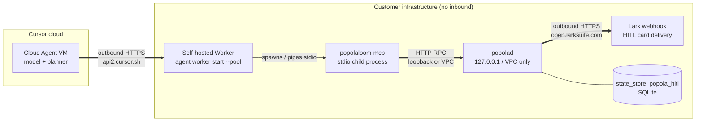
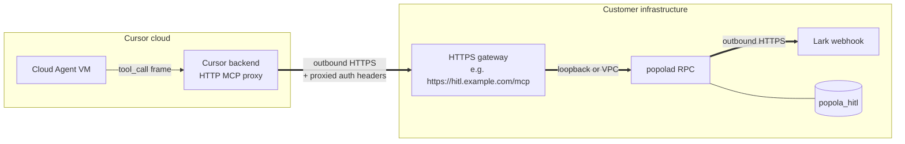

# PopolaLoom — User Guide (v0.8.5)

> Comprehensive reference for the `popola` CLI, MCP integration, HITL flows, Lark notifications, and the configuration surface. For first-time users, start with [`QUICKSTART.md`](QUICKSTART.md). For walkthroughs and example outputs, see [`DEMO.md`](DEMO.md).

## Table of Contents

- [Mental model](#mental-model)
- [CLI verb reference](#cli-verb-reference)
  - [Task lifecycle](#task-lifecycle)
  - [Daemon management](#daemon-management)
  - [IDE integration](#ide-integration)
  - [Self-evaluation](#self-evaluation)
  - [Health + diagnostics](#health--diagnostics)
- [MCP integration](#mcp-integration)
- [HITL workflow](#hitl-workflow)
- [Lark integration](#lark-integration)
- [Adapter passthrough (`--cli-flag`)](#adapter-passthrough)
- [Cloud Agent dispatch (v0.8.5+)](#cloud-agent-dispatch-v085)
- [Cloud HITL (Enterprise / Self-Hosted) (v0.8.7+)](#cloud-hitl-enterprise--self-hosted)
- [Hands-off envelope (v0.8.0+)](#hands-off-envelope)
- [Configuration (env vars)](#configuration)
- [Troubleshooting](#troubleshooting)
- [Architecture deep-dive](#architecture-deep-dive)
- [Reference](#reference)

## Mental model

PopolaLoom is a **sidecar daemon** (`popolad`) plus a **CLI** (`popola`) plus a **stdio MCP server** (`popolaloom-mcp`). The daemon binds a Unix Domain Socket at `$POPOLA_HOME/popolad.sock`, serves the dispatch / inspect / cancel / probe RPC, and owns:

- the **task pool** (vendored ArkTower `SqliteTaskRepository` — persistent across daemon restarts),
- the **NDJSON event log** under `$POPOLA_HOME/events/<task_id>.jsonl` (CloudEvents 1.0 envelope per event),
- the **LangGraph subgraph runner** (per-task; uses `interrupt()` for HITL pauses),
- the optional **`LarkSupervisor`** (manages a `lark-cli event consume` subprocess for inbound Lark replies, restart watchdog, ≤ 3 restarts → escalate).

Each task is a separate child subprocess of the agent CLI you specify (`cursor-agent`, `claude`, `codex`, …). The daemon watches the subprocess via a wait-thread, serializes its stdout/stderr into NDJSON events on the bus, broadcasts state transitions, and on terminal state writes a final `task.completed / task.failed / task.canceled` event plus an optional Lark notification card.

The `popola` CLI is a thin client over the UDS RPC: every verb (`dispatch`, `list`, `status`, `attach`, `cancel`, `probe`, `popolad`, `init`, `skill`, `doctor`, `eval`, `pending`, `feedback`) translates to one or more HTTP/JSON calls. The MCP server is a stdio bridge that exposes the same dispatch verbs as MCP tools so any MCP-aware IDE can call them as tool invocations.

The end result: you can `popola dispatch "..."` from any terminal, close that terminal, SSH in from another machine, run `popola attach <id> --follow`, and watch the task continue. HITL prompts are broadcast across **5 channels** (Lark, IDE, CLI, MCP, Web); the first responder wins via cross-channel sync (`hitl/sync.py:mark_answered` is atomic).

## CLI verb reference

### Task lifecycle

| Verb | Purpose | Example |
|---|---|---|
| `popola dispatch <prompt> --cli=<name>` | Spawn a new task on the named adapter; returns `task_id` | `popola dispatch "fix the bug in foo.py" --cli=cursor` |
| `popola dispatch ... --wait --timeout=120` | Block until terminal state (default 60s) | `popola dispatch "..." --cli=claude --wait --timeout=120` |
| `popola dispatch ... --cli-flag KEY=VAL` | Pass adapter-specific flags (repeatable; JSON-parsed) | `popola dispatch "..." --cli=cursor --cli-flag output_format=stream-json` |
| `popola dispatch ... --cwd <path>` | Spawn the subprocess with `Popen(cwd=...)` | `popola dispatch "refactor X" --cli=cursor --cwd ~/proj` |
| `popola dispatch ... --json` | Emit machine-readable JSON envelope | `popola dispatch "..." --cli=cursor --json` |
| `popola list` | List **non-terminal** tasks (default) | `popola list` |
| `popola list --all` | Include completed / failed / canceled | `popola list --all` |
| `popola list --json` | Machine-readable; pipes to `jq` | `popola list --all --json \| jq '.[] \| .task_id'` |
| `popola status <task_id>` | Single-task full state envelope | `popola status cursor-23e74ec18917` |
| `popola status <id> --json` | JSON envelope (state / pid / exit_code / events_log / arktower_task_id) | `popola status cursor-23e74ec18917 --json` |
| `popola attach <task_id> --follow` | Tail the SSE / NDJSON event stream (default `--follow`) | `popola attach cursor-23e74ec18917 --follow` |
| `popola attach <id> --no-follow` | One-shot dump of all events seen so far | `popola attach <id> --no-follow` |
| `popola cancel <task_id>` | SIGTERM → 5s grace → SIGKILL escalation | `popola cancel cursor-23e74ec18917` |
| `popola list-cli` | Print registered adapters + whether each binary is on PATH | `popola list-cli` |

The full lifecycle: `dispatched → running → (interrupted ↔ running)* → completed / failed / canceled`. The `interrupted` state is set when a LangGraph node calls `await interrupt(prompt)`; the daemon emits `task.elicited` on the event bus with the prompt body and broadcasts to the 5 HITL channels.

### Daemon management

| Verb | Purpose | Example |
|---|---|---|
| `popola popolad start` | Spawn `python -m popolaloom.daemon` with `start_new_session=True` | `popola popolad start` |
| `popola popolad start --foreground` | Run in the foreground (debugging mode) | `popola popolad start --foreground` |
| `popola popolad status` | Daemon socket + pid + probe roll-up | `popola popolad status` |
| `popola popolad stop` | SIGTERM → 5s → SIGKILL; clean pid + sock | `popola popolad stop` |
| `popola probe` | Lightweight liveness — pid + uptime + active task count | `popola probe` |

The daemon binds the UDS at `$POPOLA_HOME/popolad.sock` (default `~/.popola/popolad.sock`); the pidfile is `$POPOLA_HOME/popolad.pid`; the log is `$POPOLA_HOME/log/popolad.log`. Cold-start UDS-up time has a NFR-1 gate of ≤ 2s (median ~250ms on the dev VM).

### IDE integration

| Verb | Purpose | Example |
|---|---|---|
| `popola init` | Auto-detect every IDE present + install the canonical Skill | `popola init` |
| `popola init <ide>` | Install for one IDE (cursor / claude / codex / copilot / local) | `popola init cursor --global` |
| `popola init all --global` | Install for every detected IDE except local, with global scope | `popola init all --global` |
| `popola init --interactive` | Human-driven wizard (v0.5.5+; `typer.confirm` per IDE + scope) | `popola init --interactive` |
| `popola init --list` | Print every detected target + install path (no writes) | `popola init --list` |
| `popola init <ide> --dry-run` | Preview writes without touching disk | `popola init cursor --project --dry-run` |
| `popola skill install --target=<ide>` | Same as `popola init <ide>`, sub-verb form | `popola skill install --target=cursor` |
| `popola skill upgrade --target=<ide>` | **Overwrite** installed SKILL.md from the wheel (after `.popola-loom-bak.<ts>` backup) | `popola skill upgrade --target=cursor` |
| `popola skill upgrade --target=all` | Cycle every detected install | `popola skill upgrade --target=all` |
| `popola skill doctor` | Skill-only audit (subset of `popola doctor`) | `popola skill doctor` |
| `popola skill uninstall --target=<ide>` | Remove SKILL.md + marker (v0.8.4+) | `popola skill uninstall --target=cursor --global` |
| `popola skill uninstall --target=all` | Remove every Skill across IDEs | `popola skill uninstall --target=all --global` |

Per-IDE install paths:

| IDE | Scope | Install path |
|---|---|---|
| Cursor | global | `~/.cursor/skills/popola-loom/SKILL.md` |
| Cursor | project | `<repo>/.cursor/skills/popola-loom/SKILL.md` |
| Claude Code | global | `~/.claude/skills/popola-loom/SKILL.md` |
| Claude Code | project | `<repo>/.claude/skills/popola-loom/SKILL.md` |
| Codex | global | `$CODEX_HOME/skills/popola-loom/SKILL.md` (default `~/.codex/`) |
| Copilot | project-only | `<repo>/.github/copilot-instructions.md` (single-file flatten) |
| local | scaffold | `<repo>/.local/` (workspace surface) |

`popola init` differs from `popola skill upgrade` in two ways: (1) `init` is **idempotent** — second invocation prints `SKIP <path> (already installed)`; `upgrade` **always overwrites** (after writing a `.popola-loom-bak.<ts>` backup). (2) `init` is the first-time-installer entry point; `upgrade` is the post-`pip install --upgrade popolaloom` refresh entry point.

### `install.sh` — bash bootstrap installer (v0.8.4+)

The unified bash installer at the repo root (`install.sh`) wraps the four-step manual workflow (`pip install` → `popola skill install` → `popola popolad start` → `popola doctor`) into a single shell command. The same script also drives the inverse path: `install.sh uninstall` removes the Skills and uninstalls the package; `install.sh update` upgrades the wheel and refreshes the on-disk SKILL.md.

```bash
# Pull from GitHub and run as a one-liner
curl -fsSL https://raw.githubusercontent.com/YoRHa-Agents/PopolaLoom/main/install.sh | bash

# Same, with explicit options
curl -fsSL https://raw.githubusercontent.com/YoRHa-Agents/PopolaLoom/main/install.sh \
  | bash -s -- install --scope=global --target=all

# After a clone — same script, local invocation
./install.sh install --scope=project --target=cursor
./install.sh update
./install.sh uninstall --yes --purge
```

#### Verbs

| Verb | Purpose |
|---|---|
| `install` (default) | `pip install popolaloom` → `popola skill install` → `popola popolad start` (best-effort) → `popola doctor` (best-effort) |
| `update` | `pip install --upgrade popolaloom` → `popola skill upgrade --target=<...>` → `popola doctor` |
| `uninstall` | `popola popolad stop` (best-effort) → `popola skill uninstall --target=<...>` → `pip uninstall popolaloom` (gated on confirmation) → optional `rm -rf $POPOLA_HOME` when `--purge` is set |
| `version` | Print `install.sh v0.8.4` and exit |
| `help` / `--help` / `-h` | Print usage and exit |

#### Flag matrix

| Flag | Applies to | Purpose |
|---|---|---|
| `--scope=<global\|project>` | install / update / uninstall | Skill scope (default: `global`) |
| `--target=<cursor\|claude\|codex\|copilot\|all>` | install / update / uninstall | Which IDE Skill (default: `all`) |
| `--from=<pypi\|git\|PATH>` | install / update | Install source (default: `pypi`) |
| `--version=<X.Y.Z>` | install / update | Pin a PyPI version (requires `--from=pypi`) |
| `--python=<bin>` | all | Python interpreter (default: search `python3.12 → python3.11 → python3 → python`) |
| `--no-skills` | all | Skip the Skill install / uninstall step |
| `--no-daemon` | install | Skip `popola popolad start` after pip install |
| `--purge` | uninstall | Also `rm -rf ${POPOLA_HOME:-$HOME/.popola}` after pip uninstall (gated on confirmation; **destructive**) |
| `--yes` / `-y` | uninstall | Skip interactive prompts (required for non-tty / scripted runs) |
| `--dry-run` | all | Print every command that would be run; no I/O |
| `--quiet` / `-q` | all | Suppress informational output |
| `--help` / `-h` | all | Print usage and exit |

#### `--from=` source resolution

| Value | Translates to |
|---|---|
| `pypi` (default) | `pip install popolaloom` |
| `pypi` + `--version=X.Y.Z` | `pip install popolaloom==X.Y.Z` |
| `git` | `pip install git+https://github.com/YoRHa-Agents/PopolaLoom.git` |
| any other value (filesystem path) | `pip install <path>` (works for local clones, wheel files, and tarballs) |

For example: `./install.sh install --from=./dist/popolaloom-0.8.4-py3-none-any.whl` installs from a locally-built wheel.

#### Examples

```bash
# Fresh install for every IDE at user-home scope (the typical first run)
./install.sh install

# Install only for Cursor at project scope, from the latest main on GitHub
./install.sh install --target=cursor --scope=project --from=git

# Install pinned to a specific PyPI version
./install.sh install --version=0.8.4

# Update only the package without touching Skill files
./install.sh update --no-skills

# Uninstall everything in one shot (interactive prompt before pip uninstall)
./install.sh uninstall

# Same, scripted (non-tty) — skip the prompt and purge ~/.popola/
./install.sh uninstall --yes --purge

# See exactly what would happen without touching disk
./install.sh install --dry-run
./install.sh uninstall --dry-run --yes
```

> **Destructive flag warning**: `install.sh uninstall --purge` deletes `${POPOLA_HOME:-$HOME/.popola}` (daemon socket, NDJSON event log, vendored ArkTower SQLite, daemon pidfile). The script gates the deletion behind a `[y/N]` prompt; pass `--yes` only when you have backed up anything you need.

#### Idempotency contract

- Re-running `install` with the same flags is safe (`pip install` is idempotent; `popola skill install` prints `SKIP` for byte-identical SKILL.md content).
- Re-running `uninstall` after the package is gone returns `popolaloom not installed; nothing to do` and exits 0.
- Re-running `uninstall --target=cursor` after the Skill is gone produces an `ABSENT` outcome from `popola skill uninstall` (no error).

#### When to use `install.sh` vs `popola init`

The two surfaces are **complementary**, not competing:

- `install.sh` is the **first-time bootstrap** — run it on a fresh machine to get popolaloom installed end-to-end (pip + Skills + daemon + doctor) in one command. Also the recommended path for upgrade and uninstall.
- `popola init` is the **post-install IDE wizard** — run it after `install.sh` (or `pip install popolaloom`) to add additional IDEs, scaffold the `.local/` workspace surface, or run the interactive setup wizard.

### Self-evaluation

| Verb | Purpose | Example |
|---|---|---|
| `popola eval run --output PATH` | Run the 8-dim PopolaLoom-nines self-eval; write TOML | `popola eval run --output /tmp/nines.toml` |
| `popola eval show` | Show the dimension weights + last-run scores | `popola eval show` |
| `popola eval show --json` | JSON envelope (per-dim score + weight + composite) | `popola eval show --json` |

The 8 dimensions: `dispatch_isolation / cycle_convergence / hitl_latency / attach_correctness / cross_cli_handoff / single_threaded_writes / event_log_completeness / hitl_handleability`. Each scorer collects evidence from `~/.popola/events/*.jsonl` (NDJSON receipts) and emits a 0.0–1.0 score; the composite is a weighted sum (weights sum to 1.0; tunable in `nines.toml`).

### Health + diagnostics

| Verb | Purpose | Example |
|---|---|---|
| `popola doctor` | 4-subsystem audit; human-readable table; exit 0 by default | `popola doctor` |
| `popola doctor --strict` | Exit 1 on any FAIL (CI-friendly) | `popola doctor --strict` |
| `popola doctor --json` | 4-section envelope (skill / daemon / lark / arktower) + summary | `popola doctor --json` |
| `popola pending` | Show prompts awaiting human response | `popola pending` |
| `popola feedback <hitl_id> <answer> --reason "..."` | Submit a CLI-channel HITL response | `popola feedback hitl-abc12 yes --reason "verified backup"` |
| `popola version` | Print `popolaloom <version>` | `popola version` |

The `popola doctor` 4 subsystems:

1. **Skill** — every `(target, scope)` slot from `SKILL_TARGETS`; reports `OK` / `MISS` / `DRIFT` (drift = installed `.popola-loom-version` ≠ wheel version).
2. **Daemon** — `GET /probe` over the popolad UDS socket; `OK` (pid + uptime) when the daemon is up, `FAIL` otherwise.
3. **Lark** — `lark-cli` on PATH + `LARK_HITL_TARGET_OPEN_ID` env var; `OK` (both present), `WARN` (binary on PATH, env unset), `OFF` (binary missing — informational, not a fail).
4. **ArkTower** — vendored module imports cleanly + the two PopolaLoom migrations (`005_popolaloom_extensions.sql` / `006_popola_hitl.sql`) are on disk; `WARN` when migrations are missing (the daemon falls back to a no-op runner per the "degrade gracefully" constraint).

Exit code is `0` by default (WARN / DRIFT / MISS are informational); `--strict` escalates any FAIL into a non-zero exit.

## MCP integration

PopolaLoom's MCP server exposes the dispatch / inspect / HITL verbs to any MCP-aware IDE over stdio. To wire it into Cursor:

```jsonc
// ~/.cursor/mcp.json
{
  "mcpServers": {
    "popolaloom": {
      "command": "python",
      "args": ["-m", "popolaloom.mcp.server"]
    }
  }
}
```

For Claude Code:

```jsonc
// ~/.claude/mcp.json — same shape; the IDE auto-restarts the MCP child on save
{
  "mcpServers": {
    "popolaloom": {
      "command": "python",
      "args": ["-m", "popolaloom.mcp.server"]
    }
  }
}
```

After restart, the host agent sees the 9-verb stdio bridge:

- `popola_submit` — equivalent to `popola dispatch` (returns `task_id`)
- `popola_list` — equivalent to `popola list --all`
- `popola_status` — equivalent to `popola status <task_id>`
- `popola_attach_stream` — equivalent to `popola attach <task_id> --follow` (streams events over MCP)
- `popola_cancel` — equivalent to `popola cancel <task_id>`
- `popola_relay` — chain a follow-up task onto the prior task's output (per `mcp/tools.py`)
- `popola_supervise` — register a long-running supervised cycle
- `popola_federate` — multi-task fan-out with cross-task handoff envelopes
- `popola_supply_feedback` — equivalent to `popola feedback <hitl_id> <answer>`
- `popola_inject_subtask` — inject a child subtask under a parent

The elicitation builder (`popolaloom.mcp.elicitation`) renders pending HITL prompts as form-mode requests so the IDE can surface them as a chooser UI (a button-style picker for enum prompts; a freeform text field for open prompts).

## HITL workflow

Tasks pause at `await interrupt(prompt)` inside their LangGraph subgraph. The daemon broadcasts the prompt to **5 channels simultaneously**:

| Channel | How users respond | Code path |
|---|---|---|
| **Lark** | Tap "通过" / "拒绝" on the interactive card | `lark/listener.py` (button event → `LarkSupervisor` → state writeback) |
| **IDE** | Click in the host IDE's chooser UI (Cursor / Claude / Codex) | MCP elicitation form (form-mode tool result) |
| **CLI** | `popola pending` then `popola feedback <hitl_id> <answer>` | `cli/feedback_cmd.py` |
| **MCP** | Programmatic via `popola_supply_feedback` tool call | `mcp/tools.py:popola_supply_feedback` |
| **Web** | Static docs entry point and future dashboard channel | GitHub Pages now; browser dashboard remains a tracked roadmap surface |

The first responder wins via the atomic `mark_answered` in `hitl/sync.py`; the late responders see "already answered (via=<channel>)" and back off. The state writeback emits a `state.resumed` event; the LangGraph subgraph picks up where it left off.

A typical Lark approval flow:

```bash
export LARK_HITL_TARGET_OPEN_ID=ou_xxx           # your Lark open_id
popola dispatch "drop the staging.users table" --cli=cursor
# → cursor-deadbeef

# Inside the task, the adapter detects a destructive operation and calls
# `interrupt(prompt="ok to delete prod table?", options=["yes", "no"])`.
# The daemon broadcasts; you see a Lark card in your IM client + the
# task pauses at the `interrupt()` point.

# In Lark, you tap "通过" → LarkSupervisor catches the button event,
# writes "yes" back into the LangGraph state, the subgraph resumes.

popola attach cursor-deadbeef --follow            # see the resume + completion
```

## Lark integration

### Outbound (proactive notifications)

PopolaLoom sends interactive Lark cards on every terminal state transition. Defaults are 3 ON / 2 OFF (v0.4.1+):

| Trigger | Default | Card colour |
|---|---|---|
| `task.completed` | ON (`LARK_NOTIFY_ON_COMPLETED=1`) | green |
| `task.failed` | ON (`LARK_NOTIFY_ON_FAILED=1`) | red |
| `task.canceled` | ON (`LARK_NOTIFY_ON_CANCELED=1`) | yellow |
| `cancel → SIGKILL` | OFF (`LARK_NOTIFY_ON_CANCEL_ESCALATED=0`) | orange |

Cards include the prompt summary (truncated to `LARK_NOTIFY_PROMPT_TRUNCATE` chars; default 200), the task_id, the exit_code, and a deep-link to the events log path.

### Inbound (HITL replies + listener supervision)

The `LarkSupervisor` manages a `lark-cli event consume <events>` subprocess; it watches for "button click" events on cards with the `--metadata-key hitl_id=<id>` annotation and writes the chosen answer back into LangGraph state. If the listener subprocess dies, the supervisor restarts it (≤ 3 consecutive restarts → escalate to operator-visible HITL).

Per workspace rule, every Lark write operation appends the `\n---\n本消息由飞书工具 Lark-Cli 发送` footer.

### Gating

When `lark-cli` is missing OR `LARK_HITL_TARGET_OPEN_ID` is unset, the daemon silently degrades to NDJSON-only event logging. Every skip emits a single `lark.supervisor.skipped reason=...` INFO line so you can audit the gating decision in `popolad.log`.

## Adapter passthrough

`--cli-flag KEY=VAL` (repeatable) passes adapter-specific arguments to the underlying agent CLI. Values are JSON-parsed first (`true` / `123` / `"foo"`); on parse failure they fall back to a string (`output_format=text` is equivalent to `output_format="text"`). The dispatch handler collects them into an `extra: dict` which each adapter's `build_command` translates into the final `argv`.

| Adapter | KEY | Type | Becomes | Notes |
|---|---|---|---|---|
| `cursor` | `output_format` | str | `--output-format <val>` | Whitelist: `text` (default) / `stream-json`; violation → ValueError |
| `cursor` | `cwd_flag` | bool | `--cwd <cwd>` if true | Default false (let supervisor's `Popen(cwd=...)` control) |
| `cursor` | `session_id` | str | `--session-id <chatId>` | Reuse a `cursor-agent create-chat` pre-allocated chat |
| `cursor` | `cli_args` / `cmd_args` | str | passed through verbatim | Cursor `--trust` / `--no-color` flags etc. (v0.6.0+) |
| `claude` | `session_id` | str (UUID) | `--session-id <UUID>` | "Allocate ID first, then spawn" form |
| `claude` | `max_turns` | int | `--max-turns <n>` | Limits conversation rounds |
| `codex` | `sandbox` | str | `--sandbox <val>` | Whitelist: `read-only` / `workspace-write` / `danger-full-access` |

Common patterns:

```bash
# 1. Cursor stream-json output (lets supervisor parse tool-call events line-by-line)
popola dispatch "design caching layer" --cli=cursor \
  --cli-flag output_format=stream-json

# 2. Claude with a pre-allocated UUID + max_turns guard
SESSION=$(python -c "import uuid; print(uuid.uuid4())")
popola dispatch "refactor module X" --cli=claude \
  --cli-flag session_id="$SESSION" \
  --cli-flag max_turns=10

# 3. Codex sandbox locked to read-only
popola dispatch "review src/foo.py for bugs" --cli=codex \
  --cli-flag sandbox=read-only

# 4. Repeatable flags (cursor: stream-json + a session_id at once)
popola dispatch "..." --cli=cursor \
  --cli-flag output_format=stream-json \
  --cli-flag session_id=$CHAT_ID
```

Unknown KEYs are silently ignored by the adapter (forward-compat for newer adapter versions); the value-parse rules raise on whitelist violations (No Silent Failures for typed knobs).

## Cloud Agent dispatch (v0.8.5+)

### Prerequisites

1. **Daemon** — identical to other adapters: `popola popolad start` (Unix socket RPC).
2. **API key** — export a non-empty **`CURSOR_API_KEY`**. PopolaLoom authenticates with Cursor’s Cloud Agents REST using **HTTP Basic** (username = API key, password empty) through `CloudCursorClient`.

Without the key, `--cli=cursor-cloud` is rejected at adapter availability checks; the historical `--cli=cursor` subprocess path is unchanged.

### Dispatch

```bash
export CURSOR_API_KEY="cr_..."   # example shape only — use your Cursor dashboard key material
popola dispatch "Plan database migration scaffolding" \
  --cli=cursor-cloud \
  --cwd ~/workspace/acme-backend \
  --cli-flag repo_url=https://github.com/acme/monorepo \
  --cli-flag starting_ref=main \
  --cli-flag model=composer-2 \
  --cli-flag auto_create_pr=false
```

The adapter (`CursorCloudAdapter`) packs your prompt + validated `extra` keys into JSON behind `CLOUD_BUILD_COMMAND_MARKER`. `Supervisor.spawn` recognises the sentinel and calls **`_spawn_cloud()`** instead of `Popen`.

### Behaviour vs local adapters

| Surface | Local `cursor` / other CLIs | `cursor-cloud` |
|---|---|---|
| Execution | subprocess on workstation | Cursor-managed cloud workload |
| `popola cancel` | SIGTERM escalation | REST `cancel_run`; explicit EventLog tails on HTTP failures |
| `popola status` | `pid`, `runtime=local`, etc. | `runtime=cloud`, `cursor_agent_id` (`bc-*` prefix observed in API), `cursor_run_id`, `cloud_phase` |
| Browser tooling | IDE local session | Inspect runs at **`https://cursor.com/dashboard/cloud-agents`** (+ agents index) |

The cloud poller thread maps remote phases (`CREATING`, `RUNNING`, `FINISHED`, `ERROR`, `CANCELLED`, `EXPIRED`, …) into existing EventLog / FSM semantics so SSE consumers behave consistently.

### HITL bridging endpoints

Automations that run **outside** the IDE but still want first-responder HITL can call the authenticated daemon HTTP API:

| Verb | Route | Purpose |
|---|---|---|
| POST | `/hitl/cloud/request` | Register a structured question for cloud-hosted agents |
| GET | `/hitl/cloud/wait/{hitl_id}` | Block until answered / deadline (long-poll friendly) |
| POST | `/hitl/cloud/answer/{hitl_id}` | Submit a human-authored answer (paired with Lark + SQLite store) |

These compose with existing Lark fan-out: the **`cloud`** `HITLChannel` participates in identical first-responder-wins bookkeeping as Lark / MCP / IDE channels (`mark_answered`).

### Operational notes

1. **`auto_create_pr` defaults false** (`--cli-flag auto_create_pr=true` opts in) per release decision matrix.
2. Prefer **narrow prompts** — every dispatch still records the Markdown handoff envelope for audit, but quota accrues on Cursor’s side.
3. Regression / smoke coverage lives under `tests/real_cursor_cloud/` with marker **`real_cursor_cloud`**; exporting `CURSOR_API_KEY` runs four cheap live tests (`create` + immediate `cancel`, metadata GETs, bogus-key sentinel). Omit the env var locally or in CI for **skipped-not-failed** semantics.

### SSE ingest (v0.8.6+)

<!-- updated: 2026-05-08 -->

For `runtime=cloud` tasks, `popola attach <task_id> --follow` now defaults to **SSE-by-default**: alongside the daemon's existing `/attach_stream` feed, the CLI opens an `httpx.stream("GET", /v1/agents/{id}/runs/{run_id}/stream)` against Cursor's REST and pumps `cloud.sse.*` envelopes (`assistant`, `tool_call`, `result`, `status`, `parse_error`, `stream_expired`, `dedup_drop`) into the same renderer. Each envelope carries the idempotency quintuple `(task_id, run_id, stream_session_id, sse_id, seq)` so downstream consumers can dedupe deterministically.

| Surface | Default behaviour (v0.8.6+) | Escape hatch |
|---|---|---|
| `popola attach <id> --follow` (cloud task) | SSE pump on a background thread + poll-driven `/attach_stream` view in foreground | `--no-stream` forces legacy poll-only |
| `popola attach <id> --follow` (local task) | Unchanged (poll-driven `/attach_stream`) | n/a |
| `popola attach <id> --no-follow` | One-shot dump (no SSE) | n/a |

**Auto-fallback to poll.** The SSE thread bows out cleanly without crashing when any of the following happens, and the existing poll-driven view continues:

- `CursorCloudStreamExpiredError` (HTTP `410 stream_expired` after the Cursor server's retention window elapses) — the reader does NOT reconnect `/stream`; status reconciles via the next `cloud.run_status` poll.
- `httpx.ReadError` / `httpx.ConnectError` / `httpx.TimeoutException` (network blip mid-stream).
- Missing `CURSOR_API_KEY` (cannot authenticate; surfaces a `[cloud sse] ...` one-liner on stderr per No-Silent-Failures).
- Main-thread teardown via `stop_event.set()` (Ctrl-C unwind).

On any fallback the renderer appends a `cloud.sse.fallback_to_poll` boundary marker so attached operators can see the transition without inspecting daemon logs.

**Tolerated divergence.** The `cloud_poller` thread remains the **sole writer** of `TaskHandle.cloud_phase` (per `state-source-of-truth.md` §1.2 rule 1); SSE events are **append-only on the EventLog** and never mutate state. As a consequence, the SSE-side "stream:running" hint may briefly disagree with the poller-driven `cloud_phase=CREATING` (or vice versa) for **up to ≤3 s** (poll interval `interval_s` + 1 s jitter; default `interval_s=2 s`). The renderer applies the §4 reconciliation rules: poller wins on every `cloud_phase` disagreement; SSE wins for fields the poller does not own (assistant text, per-tool diagnostics).

```bash
popola attach cursor-cloud-deadbeef --follow            # SSE-by-default
popola attach cursor-cloud-deadbeef --follow --no-stream # legacy poll-only
```

A `cloud.sse.*` envelope as it appears in `~/.popola/events/<task_id>.jsonl` (one CloudEvents 1.0 line per frame; the idempotency quintuple lives under `data`):

```json
{"type":"cloud.sse.assistant","time":"2026-05-08T10:00:01.234+00:00","data":{"task_id":"task-cloud-002","run_id":"run_abc123","stream_session_id":1,"sse_id":"42","seq":7,"payload":{"text":"Looking at the failing test..."}}}
```

### Cloud error hints (v0.8.6+)

<!-- updated: 2026-05-08 -->

v0.8.6 ships a 16-entry **422-family error catalog** embedded in `cursor_cloud.py` (`_ERROR_CATALOG` constant). The selector follows precedence `(error.code → error.message regex → HTTP status)` and dispatches into one of ten new `CursorCloud*Error` subclasses (e.g. `CursorCloudPlanRequiredError`, `RepoAllowlistError`, `GithubAppMissingError`, `GithubAppPermissionError`, `CursorCloudStreamExpiredError`). Every subclass carries `.hint_en` + `.hint_zh` strings (each ≤2 sentences, each containing ≥1 dashboard URL) and a stable `.cli_exit` code so scripted callers can branch on outcome.

Two representative bilingual hints (verbatim from the catalog so future drift is detectable by hash diff):

**`RepoAllowlistError`** (HTTP 422 / 400 / 403; `error.message` matches `(?i)(allow.?list|allowed.?repositor|repository.+not.+(configured|installed|allowed))`; CLI exit `78`):

- **EN hint:** *The Cursor GitHub App is not allow-listed for this repository. Open `https://github.com/apps/cursor` (or your org's Integrations page) and add the repo, then revisit `https://cursor.com/dashboard/integrations` to confirm the GitHub connection.*
- **ZH hint:** *Cursor GitHub App 未对该仓库开通。请到 `https://github.com/apps/cursor`（或组织 Integrations 页）勾选目标仓库，再到 `https://cursor.com/dashboard/integrations` 确认连接已生效。*

**`CursorCloudPlanRequiredError`** (HTTP 403 `plan_required`; CLI exit `78`):

- **EN hint:** *Cloud Agents require a paid Cursor plan; this account is on a free tier. Upgrade at `https://cursor.com/pricing` or use an account with paid access.*
- **ZH hint:** *Cloud Agents 需要付费版 Cursor 套餐，当前账户为免费档。请到 `https://cursor.com/pricing` 升级，或切换到已付费账户。*

The other 14 entries cover `401 unauthorized`, `401 api_key_not_found`, `403 role_forbidden`, `403 feature_unavailable`, `404 agent_not_found`/`run_not_found`, `409 agent_busy` / `agent_archived` / `run_not_cancellable`, `410 stream_expired`, `400/422 validation_error`, two more 422 GitHub-App categories, `429 rate_limit_exceeded` (deferred to v0.8.8), and `5xx internal_error` / `upstream_error`. The full text + retry/backoff matrix lives in the [research note (local-only)](../.local/research/v0.8.6_sse/422-error-catalog.md) §3 and is reproduced into the Python `_ERROR_CATALOG` constant verbatim.

Canonical design references:

- `.local/research/v0.8.5_cloud_agent/research.md`
- `.local/research/v0.8.5_cloud_agent/00-decision-matrix-zh.md`
- `.local/research/v0.8.6_sse/sse-event-schema.md` (v0.8.6 SSE protocol — local-only)
- `.local/research/v0.8.6_sse/state-source-of-truth.md` (writer contract + §4 reconciliation rules — local-only)
- `.local/research/v0.8.6_sse/422-error-catalog.md` (canonical hint source — local-only)
- [`docs/known-issues.md` — Cloud task hydration after daemon restart](known-issues.md)

## Cloud HITL (Enterprise / Self-Hosted)

<!-- updated: 2026-05-08 -->

> **Tier**: Enterprise / Self-Hosted. This sub-page documents the **private HITL tier** that v0.8.7 ships behind γ (Worker stdio MCP, first-class) or β (HTTP MCP, backend-proxied). **The broad-audience `popola dispatch ... --cli=cursor-cloud` REST path documented above remains fully usable without any of the prerequisites below** — only the human-approval-over-Lark sub-flow has the γ / β gating per Q-B-2 (split-tier docs). If you have neither a self-hosted worker option nor a public HTTPS gateway, skip to [`docs/known-issues.md` §"v0.8.7 — Cloud HITL transport (anti-patterns)"](known-issues.md#v087--cloud-hitl-transport-anti-patterns) for the supported alternatives — do **not** attempt residential NAT / port-forward.

### Why this is a separate tier

v0.8.7 wraps the v0.8.5 `cloud_bridge` REST RPC triad (`POST /hitl/cloud/{request,wait,answer}` on `popolad`) in a single MCP tool — `popolaloom_cloud_hitl_request` — that a Cursor Cloud Agent calls to defer to a human via Lark. The MCP tool is shipped to the cloud agent over **two — and only two — supported transports** in v0.8.7 ([`deployment-modes.md` §1](../.local/research/v0.8.7_hitl/deployment-modes.md)):

- **γ — Worker stdio MCP (first-class).** `popolaloom-mcp` runs as a `command/stdio` MCP server on a Cursor Self-Hosted Pool worker (or a personal "My Machines" worker). The worker reaches `popolad` over loopback or VPC; the Cursor cloud reaches the worker over a long-lived **outbound HTTPS** session — no inbound ports, no public IP, no VPN required.
- **β — HTTP MCP (backend-proxied).** The team registers an HTTPS MCP URL reachable by Cursor's backend; tool calls are proxied through the backend, so MCP credentials never enter the cloud agent VM.

Both modes have non-trivial prerequisites (γ requires a Cursor Enterprise / Self-Hosted Pool worker; β requires a hardened HTTPS gateway with TLS + **HMAC validation at the gateway**, not at the popolad listener) — that gating is the reason this is a dedicated sub-page rather than a paragraph in the broad-audience quickstart. **Note (HMAC scoping):** HMAC enforcement lives in β only; γ delegates inbound-event authentication to the `lark-cli event consume` websocket session (lark-cli holds the bot token), so the popolad-side listener does NOT do HMAC validation in γ.

### Mode γ — Worker stdio MCP (first-class)

#### Prerequisites (γ)

| Requirement | Detail |
|---|---|
| Cursor plan | **Enterprise** for Self-Hosted Pool (org fleet); **any plan** for personal "My Machines" worker |
| Admin toggle | "Allow Self-Hosted Agents" enabled in [Cloud Agents dashboard](https://cursor.com/dashboard/cloud-agents#self-hosted-agents) |
| Worker auth | **Service account API key** for pool workers; user / personal API keys for `My Machines` only |
| Worker host | A machine / container that can run `agent worker start` and reach `popolad` on **loopback or private VPC** |
| `popolad` | Already installed on the same host or in the same private network; HTTP RPC bound to `127.0.0.1:<port>` (or RFC1918) — **never on a public interface** |
| `popolaloom-mcp` | v0.8.7 stdio MCP binary; installed on the worker |
| Outbound HTTPS | Worker can reach the hosts in the [Egress allowlist](#egress-allowlist) below |

#### Topology (γ)



The arrow from Cursor cloud to the worker is **outbound from the worker's perspective**: the worker initiates and holds open a long-lived HTTPS session to `api2.cursor.sh`. `popolaloom-mcp` is started **as a child of the worker** via the `command` (stdio) transport, so the MCP process inherits the worker's network namespace — and only the worker's. It therefore reaches `popolad` over private addresses without any tunnel.

#### Install steps (γ)

1. **Provision the worker** (one-time, per host):

   ```bash
   curl https://cursor.com/install -fsS | bash
   agent --version
   ```

   ([self-hosted-pool.md → Install the CLI](https://cursor.com/docs/cloud-agent/self-hosted-pool.md#install-the-cli))

2. **Authenticate** with a service account API key (pool) or a user-scoped token (My Machines):

   ```bash
   export CURSOR_API_KEY="<service-account-key>"
   ```

3. **Install `popolad` + `popolaloom-mcp`** on the same host (or a host that can reach `popolad` over RFC1918):

   ```bash
   pipx install popolaloom         # ships popolad + popolaloom-mcp
   popolad up                      # binds 127.0.0.1:<popolad_port>
   popola doctor                   # confirms popolad RPC + Lark creds + SQLite
   ```

   > **`popola doctor --cloud` deferred to v0.8.7.1.** The `--cloud`
   > sub-flag (which would smoke-check popolad RPC + Lark creds +
   > SQLite + JSON1 + the `state_store.last_lark_secret_rotated_at` >
   > 100-day warning in one shot) is tracked as `BL-v0.8.7-1` in the
   > [feedback tracker](../.local/feedbacks/TRACKER.md#backlog) for the
   > v0.8.7.1 patch — until then, the L3 quarterly rotation cadence is
   > enforced by [Webhook secret rotation](#webhook-secret-rotation)
   > calendar reminders and the existing `popola doctor` (no `--cloud`
   > sub-flag) covers the popolad RPC + Lark creds + SQLite checks.

4. **Register the MCP server** in the [Cloud Agents dashboard](https://cursor.com/agents) → MCP dropdown → Add → **Custom MCP** → transport **Command (stdio)**:

   ```jsonc
   {
     "command": "popolaloom-mcp",
     "args": [],
     "env": {
       "POPOLAD_BASE_URL": "http://127.0.0.1:<popolad_port>",
       "POPOLAD_API_KEY":  "<popolad-uid-scoped-token>"
     }
   }
   ```

   Per [self-hosted-pool.md → MCP servers](https://cursor.com/docs/cloud-agent/self-hosted-pool.md#mcp-servers), Command (stdio) entries **run on the worker** and "can reach private networks, internal APIs, and services behind your firewall."

   > **Env scrub note (SECURITY L2).** `popolaloom-mcp` reads only the
   > two env vars listed above; the **operator-managed** systemd / launchd
   > unit that supervises the worker is responsible for the env-allowlist
   > scrub (e.g. `Environment=POPOLAD_BASE_URL=… POPOLAD_API_KEY=…` plus
   > `EnvironmentFile=` from a sealed secret store). The `popolaloom-mcp`
   > binary itself does not currently fork-and-scrub at process boundary;
   > tracking as `BL-v0.8.7-3` for v0.8.7.1 patch.

   > **Auth model — γ vs β.** In γ mode, inbound Lark callbacks reach
   > popolad via a **`lark-cli event consume` websocket subscription** on
   > the worker; the bot session is authenticated server-side by Lark
   > before any NDJSON line reaches the Python listener, so **the
   > listener boundary itself does NOT do HMAC validation** (the secret
   > lives inside lark-cli's bot token, not exposed to popolad). HMAC
   > validation is only enforced in β mode where the public HTTPS
   > gateway terminates Cursor's MCP traffic — see [Mode β install
   > step 1](#install-steps-β) for the gateway-side `hmac.compare_digest`
   > requirement.

5. **Start the worker** (pool):

   ```bash
   cd /path/to/repo
   agent worker start --pool --pool-name popolaloom \
     --label hitl=enabled --management-addr ":8080"
   ```

6. **Verify** end-to-end:

   ```bash
   popola doctor                                    # popolad RPC + Lark creds + SQLite (general health)
   curl -s localhost:8080/healthz
   curl -s localhost:8080/metrics | grep cursor_self_hosted_worker_connected
   ```

   Then dispatch a smoke task from the dashboard or `popola dispatch --cli=cursor-cloud --label pool=popolaloom`.

   > **Cloud-specific verification.** A combined cloud-aware
   > `popola doctor --cloud` (worker connected + MCP registered +
   > popolad reachable + Lark configured + JSON1 smoke) is tracked as
   > `BL-v0.8.7-1` in the [feedback tracker](../.local/feedbacks/TRACKER.md#backlog)
   > for the v0.8.7.1 patch — for v0.8.7 the verification splits into
   > the four commands above (`popola doctor` covers popolad +
   > SQLite + Lark; `curl healthz/metrics` covers the worker;
   > `popola dispatch --cli=cursor-cloud` is the integration smoke).

### Mode β — HTTP MCP (backend-proxied, fallback)

#### Prerequisites (β)

| Requirement | Detail |
|---|---|
| Cursor plan | **Any plan** that allows custom MCP servers (Enterprise *not* required) |
| HTTPS endpoint | A stable, internet-reachable HTTPS URL that Cursor's backend can connect to. Ephemeral residential NAT URLs / `localhost` are **not** supported. |
| TLS | Valid certificate (publicly trusted CA). Self-signed will be rejected by Cursor's backend proxy. |
| `popolad` | Reachable from the HTTPS endpoint (typically the endpoint *is* a thin reverse-proxy in front of `popolad`, terminating in the same VPC). |
| Auth | Header-based bearer token; **HMAC-SHA256 of the request body** with a rotating webhook secret (recommended, see [Webhook secret rotation](#webhook-secret-rotation)). |

#### Topology (β)



"Tool calls are proxied through the backend"; the cloud agent VM **never holds** the MCP `headers`, refresh tokens, or other credentials. Only the gateway is exposed to the public internet; `popolad` itself stays private behind the gateway.

#### Install steps (β)

1. **Stand up the HTTPS gateway** (typically a thin FastAPI / nginx reverse-proxy in the same VPC as `popolad`). The gateway must:
   - Speak [Streamable HTTP MCP](https://cursor.com/docs/mcp.md) (not SSE — Cloud Agents support **HTTP and stdio only**).
   - Validate the HMAC header on every request.
   - Forward the validated MCP tool call to `popolad` (`POST /hitl/cloud/request|wait|answer`).
2. **Issue and store** the rotating webhook secret in your secret manager. Plan a **quarterly rotation** (see [Webhook secret rotation](#webhook-secret-rotation) below).
3. **Register the MCP server** in the [Cloud Agents dashboard](https://cursor.com/agents) → MCP dropdown → Add → **Custom MCP** → transport **HTTP**:

   ```jsonc
   {
     "url": "https://hitl.example.com/mcp",
     "headers": {
       "Authorization": "Bearer <bootstrap-token>",
       "X-PopolaLoom-Tenant": "<tenant-id>"
     }
   }
   ```

   `headers` is encrypted at rest and **redacted on read** by Cursor. β real-traffic verification (`popola doctor --cloud --mode beta`) is referenced in `deployment-modes.md` §3.3 but not yet implemented in v0.8.7 — γ ships first-class; β adopters verify out-of-band for v0.8.7 and the doctor command is tracked as `BL-v0.8.7-1` for v0.8.7.1 (see [feedback tracker](../.local/feedbacks/TRACKER.md#backlog)).

### Decision matrix — γ vs β vs neither

| Your situation | Recommended mode | Why |
|---|---|---|
| **A.** Cursor Enterprise plan with self-hosted pool enabled | **γ** | First-class per Q-B-1; private `popolad` reach without any new internet-facing surface |
| **B.** Any Cursor plan + a personal devbox / VM you can run `agent worker start` on (My Machines) | **γ** (My Machines variant) | Same security envelope as Enterprise pool; `popolad` stays on loopback |
| **C.** No self-hosted pool, but a mature public HTTPS gateway and an SRE team to harden it | **β** | Backend-proxied HTTP MCP keeps credentials out of the cloud VM; avoids the Enterprise gating |
| **D.** Neither a self-hosted worker option nor a public HTTPS gateway | **❌ Not supported in v0.8.7** | Defer to a future SaaS HITL gateway (Stage 3 / v0.9+). Do **not** attempt residential NAT / port-forward — see [`docs/known-issues.md` §"v0.8.7 — Cloud HITL transport (anti-patterns)"](known-issues.md#v087--cloud-hitl-transport-anti-patterns) for the explicit "do NOT do this" list |
| **E.** OK with cloud-dispatch only (no HITL) | Either / neither | The broad-audience [Cloud Agent dispatch (v0.8.5+)](#cloud-agent-dispatch-v085) flow above does not require γ or β; install neither MCP transport |

### Egress allowlist

A v0.8.7 γ worker requires outbound HTTPS to the following hosts. **No inbound ports, no public IPs, no VPN tunnels** ([`deployment-modes.md` §6](../.local/research/v0.8.7_hitl/deployment-modes.md), citing [self-hosted-pool.md → Networking](https://cursor.com/docs/cloud-agent/self-hosted-pool.md#networking)).

| Host | Purpose | Required? |
|---|---|---|
| `api2.cursor.sh` | Long-lived agent session (control plane) | **Yes** — blocking it stops the worker from connecting |
| `api2direct.cursor.sh` | Same agent session (direct-access path) | **Yes** |
| `cloud-agent-artifacts.s3.us-east-1.amazonaws.com` | Artifact uploads (screenshots, logs) | Recommended (HITL works without it; PR embeds break) |
| `open.larksuite.com` *or* `open.feishu.cn` | Lark / Feishu HITL card delivery | **Yes** for HITL |
| Git host (`github.com`, internal GitLab, etc.) | Repo clone / push during cloud agent runs | Yes for cloud agent |
| Package registries (`pypi.org`, `registry.npmjs.org`, …) | Build / install steps inside agent runs | As needed |

> **Egress firewall sanity rule.** If the worker can reach `api2.cursor.sh`, `api2direct.cursor.sh`, **and** the configured Lark host, then γ HITL works. Any other failure is a `popolad` / `popolaloom-mcp` issue, not a network issue.

For β, the gateway must additionally accept inbound HTTPS from Cursor's egress IP ranges; those ranges are published at [`https://cursor.com/docs/ips.json`](https://cursor.com/docs/ips.json) and rotated periodically. Cursor itself recommends *not* using IP allowlists as the **primary** security mechanism — use HMAC as the primary control and treat IP allowlist as defense-in-depth.

### Webhook secret rotation (L3 — quarterly cadence)

Per the v0.8.7 lateral-movement gate (SECURITY §3 L3), rotate the Lark webhook secret on a **quarterly cadence**. Both γ and β share the same secret + rotation procedure.

| Quarter | Rotation date |
|---|---|
| **Q1** | January 15 |
| **Q2** | April 15 |
| **Q3** | July 15 |
| **Q4** | October 15 |

Rotation runbook (idempotent, ≤ 5 min wall-clock per cycle):

1. Mint the new secret in your secret manager (e.g., `openssl rand -hex 32`); store under `lark/webhook-secret/<YYYY>Q<n>`.
2. Update the popolad-side reader so **both** the current and the previous secret are accepted for a 24-hour grace window. This is zero-downtime: every Lark callback is verified against the union of the two secrets via timing-safe `hmac.compare_digest`.
3. Cycle the new secret into your Lark App / webhook configuration.
4. After 24 hours, drop the previous secret from the reader's union list.
5. Confirm rotation success via `popola doctor` (popolad RPC + Lark creds + SQLite checks land in the existing health probe). The `popola doctor --cloud` subcommand — which would emit a >100-day-old-secret warning automatically — is tracked as `BL-v0.8.7-1` in the [feedback tracker](../.local/feedbacks/TRACKER.md#backlog) for the v0.8.7.1 patch; until then, the quarterly cadence is enforced by calendar reminders alone.

Both γ (worker-side env var) and β (gateway-side validator) use the same secret material; you rotate once and propagate to both surfaces in step 3.

### L6 — Team follow-ups (lateral exposure callout)

> **⚠️ Team follow-ups + HITL: disable, or use service accounts.**
>
> Per [Cursor's settings docs → Lateral movement and secret exposure](https://cursor.com/docs/cloud-agent/settings.md#lateral-movement-and-secret-exposure), enabling **team follow-ups** lets a teammate steer an agent that holds **another user's secrets**. For PopolaLoom orgs that put **PII in HITL prompts** (customer data, internal financials, source code with secrets), team follow-ups are a lateral-movement vector: a follow-up from teammate B can drive an agent owned by user A to call `popolaloom_cloud_hitl_request` with user A's `POPOLAD_API_KEY` scope.
>
> **Recommended posture for HITL-handling orgs:** either set team follow-ups to **"Disabled"**, or restrict cloud agents that handle HITL to **service accounts only** (no per-user API keys mounted into the worker). The PopolaLoom audit log records `actor_open_id_if_any` in every `cloud_hitl.transition` event so post-incident attribution is possible, but the in-flight credential reuse is the upstream concern.

### L8 — Operational hygiene (do not commit MCP blob)

> **⚠️ Treat the MCP config blob as a secret.**
>
> Cursor encrypts `env` / `headers` at rest and redacts them on read in the dashboard, but operators must **not** commit MCP JSON blobs to git or paste them into chat. The `POPOLAD_API_KEY` (γ) or `Authorization: Bearer …` (β) header inside the blob bypasses the dashboard redaction once the JSON leaves Cursor's storage.

Sample pre-commit hook (drop into `examples/pre-commit-mcp-secret.sh`, point your `.git/hooks/pre-commit` at it, or wire into [`pre-commit`](https://pre-commit.com)):

```bash
#!/usr/bin/env bash
# Reject staged content that smells like a leaked Cloud Agents MCP blob.
set -e
if git diff --cached -G 'POPOLAD_API_KEY|cursor-stdio-mcp.*env' --quiet; then
  exit 0
fi
echo "ERROR: staged change appears to include a MCP config secret (POPOLAD_API_KEY / cursor-stdio-mcp env block)." >&2
echo "If this is a doc / test fixture, prefix the line with '# secret-hygiene: doc-only'." >&2
exit 1
```

### Worker hardening (L9)

On a Self-Hosted Pool worker, the MCP child runs as a non-root user with no SUID binaries on its `PATH`. For Kubernetes deployments using the Cursor Helm chart, set:

```yaml
securityContext:
  runAsNonRoot: true
  runAsUser: 1001
  fsGroup: 1001
```

For direct-host installs, smoke-check with `id` inside the worker process: it should return a non-root uid (e.g., `uid=1001(popolaloom) gid=1001(popolaloom)`).

### L10 — Cursor Cloud network access policy

Per [Cursor's network-access docs](https://cursor.com/docs/cloud-agent/security-network.md#network-access), prefer one of the restricted modes for any cloud agent that handles HITL prompts. The PopolaLoom Enterprise recommendation is:

> **Set the Cursor Cloud Agent network access policy to "Allowlist only"** for any agent that calls `popolaloom_cloud_hitl_request`. Allow-list the egress hosts from [Egress allowlist](#egress-allowlist) above and nothing else. **"Allow all"** is acceptable only for non-HITL dispatch (the broad-audience [Cloud Agent dispatch (v0.8.5+)](#cloud-agent-dispatch-v085) path).

Combined with the per-tenant `POPOLAD_API_KEY` scope (L1) and the env-allowlist on the MCP launcher (L2), this gives a defense-in-depth posture where a compromised agent cannot exfiltrate `popola_hitl` rows or pivot to internal services beyond the explicit allow-list.

### Approver ACL (P1)

Default = anyone in the Lark group the card is sent to. The webhook handler validates `event.operator.open_id` against the configured group membership (via Lark contact API or a static `LARK_HITL_ALLOWED_OPEN_IDS` env var); clicks from non-members return HTTP 403 + a private toast "你不在审批名单中". When `card_metadata.allowed_responder_open_ids` is set on a per-card basis (v1.x additive field), the per-card list overrides the group default for that card.

Two-approver workflow (`responder_policy = "serial_two"`, S2 in `lark-card-spec.md` §3.2): the second approver MUST be a different user from the first. A click from the first approver after their initial click is rejected with HTTP 409 + a private toast "你已审批一次，请等待二审".

### Replay safety (R1 / R2)

The MCP tool's `idempotency_key` (auto-derived as `sha256(task_id|cursor_agent_id|cursor_run_id|prompt_body)[:32]` when caller omits it; caller-supplied keys clamp to ≤ 128 chars) is **opaque** — the inputs are not recoverable from the key. Replays inside the 1-hour dedup window short-circuit and return the existing `hitl_id` + `deduped: true`; replays after the window create a new row.

A stolen `idempotency_key` gives the attacker only the existing answer (bounded staleness), not new state — the daemon SQLite table is the single source of dedup truth (no in-memory cache that survives across `popolad` restarts), so a captured key cannot be used to observe a future answer that has not been recorded yet.

### Configuration — `[hitl.cloud]` section in `popolad.toml`

v0.8.7 adds a strict-superset `[hitl.cloud]` section to `popolad.toml`; the existing `[hitl]` section continues to work unchanged.

```toml
[hitl.cloud]
timeout_seconds      = 1800   # default 30 min; clamped to [60, 86400]; out-of-range rejected with clear error
idempotency_window_s = 3600   # 1 h; replays inside the window short-circuit
max_concurrent_per_run = 1    # bounds parallel HITL prompts per cursor_run_id
```

Per-call `timeout_s` on the MCP tool overrides `timeout_seconds` for that one call; the config value is the fallback when caller omits.

### Tool-call return shape (cloud agent observes)

Successful answer:

```json
{
  "ok": true,
  "hitl_id": "<uuid_hex>",
  "answer": "approve",
  "option_id": "approve",
  "channel": "lark",
  "responder_id": "ou_<approver_open_id>",
  "answered_at": "2026-05-08T10:30:00.000Z",
  "deduped": false
}
```

Timeout (per Q-B-3 frozen contract):

```json
{
  "ok": false,
  "error": {
    "code": "timeout",
    "message": "HITL approval timed out after 1800s with no human response",
    "hitl_id": "<hitl_id>",
    "expiration_at": "2026-05-08T11:00:00.000Z",
    "answered_via": null
  }
}
```

Error codes per `mcp-tool-contract.md` §3.3: `timeout`, `cancelled`, `invalid_context`, `lark_unreachable`, `daemon_unreachable`, `internal`. Cloud agents may retry (creating a new `hitl_id`) or fail-loud per their own policy.

### Audit log

Every state transition + failure path emits exactly one NDJSON event under the `cloud_hitl.*` namespace, written to `~/.popola/events/<task_id>.jsonl`:

| Event | Required keys |
|---|---|
| `cloud_hitl.requested` | `hitl_id`, `task_id`, `agent_id`, `run_id`, `requester_ip_or_session`, `idempotency_key`, `created_at`, `deadline_at` |
| `cloud_hitl.answered` | `hitl_id`, `answered_by`, `answered_at`, `channel` (`lark`/`api`/`mcp`/`cli`/`web`/`cloud`), `option_id`, `reason_truncated_to_200_chars` |
| `cloud_hitl.failed` | `hitl_id_if_known`, `error_kind` (one of `timeout`/`cancelled`/`invalid_context`/`lark_unreachable`/`daemon_unreachable`/`internal`), `error_message_truncated_to_500_chars`, `failed_at`, `retry_after_s_if_set` |
| `cloud_hitl.transition` | `hitl_id`, `from_state`, `to_state`, `transitioned_at`, `actor_open_id_if_any` |

The `failed` event is emitted **before** the MCP tool returns the error envelope (per invariant I-6: No Silent Failures across the audit chain).

### Canonical design references (v0.8.7)

- [`deployment-modes.md`](../.local/research/v0.8.7_hitl/deployment-modes.md) — γ + β topology, prerequisites, install steps, lateral-movement checklist, minimal-connectivity host list (local-only research note)
- [`mcp-tool-contract.md`](../.local/research/v0.8.7_hitl/mcp-tool-contract.md) — `popolaloom_cloud_hitl_request` schema, wire mapping, failure modes, idempotency design (local-only)
- [`lark-card-spec.md`](../.local/research/v0.8.7_hitl/lark-card-spec.md) — `cloud_hitl_request_card_v1` template structure, P0 scenarios, versioning policy, security checks (local-only)
- [`long-tool-call-probe.md`](../.local/research/v0.8.7_hitl/long-tool-call-probe.md) — long-tool-call probe protocol; T1.1.1 OQ-1 status (local-only)
- [`SECURITY_CHECKLIST.md`](../.local/.agent/active/v0.8.7-cloud-hitl-prod/SECURITY_CHECKLIST.md) — 10-item lateral-movement checklist + 4 secret-hygiene items + 4 idempotency items + 4 audit items + 3 approval-policy items + sign-off matrix (local-only)
- [`docs/known-issues.md` §"v0.8.7 — Cloud HITL transport (anti-patterns)"](known-issues.md#v087--cloud-hitl-transport-anti-patterns) — the explicit "do NOT do this" callout

## Hands-off envelope (v0.8.0+)

v0.7.1 introduced the `popolaloom.handoff` substrate (Pydantic v2 `HandoffEnvelope` + Markdown front-matter ser/deser + slug-hash addressing + atomic writer + active/archive 双层); v0.7.2 wired it into `Popolad.dispatch_with_envelope` (E3 internal unification) so every dispatch persists a file-based payload + injects `POPOLA_HANDOFF_FILE` / `POPOLA_HANDOFF_ID` into the spawn env (C5 双通道); v0.7.3 added `popola dispatch --replay`, the HITL `FeedbackEnvelope` companion (Q7=yes), and the legacy `RelayHandoffEnvelope → HandoffEnvelope` bridge.

### Why a file?

- **Length**: prompts above 16 KB blow argv on macOS / hit the kernel `MAX_ARG_STRLEN` cliff on Linux. A file dodges this entirely.
- **Audit**: every dispatch leaves a Markdown receipt under `.local/.agent/handoff/<id>.md` (gitignored as of v0.7.0); inspect with `cat`, search with `grep`, archive with `popola handoff archive`.
- **Replay**: `popola dispatch --replay <id>` re-issues the exact dispatch from disk — the slug-hash id is content-derived so the same prompt/cli/extra always maps to the same id.
- **Cross-CLI handoff**: the existing `relay()` primitive (cursor → claude → codex chain) gets a stable on-disk audit trail per hop (via `to_handoff_envelope` bridge).

### Envelope shape (Markdown front-matter)

```
---
schema_version: '1'
handoff_id: cursor-fix-bug-in-foo-py-3a7f9c1d
created_at: '2026-05-06T14:30:00+00:00'
source_cli: null
target_cli: cursor
parent_task_id: null
cwd: null
adapter_extra: {}
constraints: {}
reason: null
tags: []
---
fix the bug in foo.py — there's a NoneType error around line 42
```

The Pydantic v2 model `popolaloom.handoff.HandoffEnvelope` enforces `extra="forbid"` so unknown front-matter keys raise (No Silent Failures). The id format is `<target_cli>-<slug-from-prompt>-<8hex content hash>` where the hex covers `(target_cli, prompt, parent_task_id, adapter_extra, constraints)`.

### `popola handoff` CLI (filesystem-only — no daemon required)

| Verb | Purpose | Example |
|---|---|---|
| `popola handoff list [--json] [--handoff-dir DIR]` | List active envelopes (newest first) | `popola handoff list` |
| `popola handoff show <id> [--json] [--handoff-dir DIR]` | Print Markdown envelope (or JSON) | `popola handoff show cursor-fix-bug-foo-py-3a7f9c1d` |
| `popola handoff archive <id> <task_id> [--archive-root DIR]` | Snapshot to `<archive_root>/<task_id>/<id>.md` | `popola handoff archive <id> cursor-23e74ec18917` |
| `popola dispatch --replay <id>` | Re-run the exact prior dispatch | `popola dispatch --replay cursor-fix-bug-foo-py-3a7f9c1d` |

`--handoff-dir` overrides the active root resolution order: explicit arg > `$POPOLA_HANDOFF_DIR` env > `.local/.agent/handoff/` (default).

### Channel injection (C5 双通道)

The dispatch path injects two complementary channels:

1. **env (primary, always live)**: `POPOLA_HANDOFF_FILE=<abs path>` + `POPOLA_HANDOFF_ID=<slug-hash>` are added to the spawn env. The agent inside the sub-CLI (cursor-agent / claude / codex / ...) can `cat $POPOLA_HANDOFF_FILE` to inspect the original dispatch — including audit-only fields (`reason`, `tags`) that don't fit into a single argv prompt.
2. **flag (forward-compat, opt-in)**: when `--cli-flag popola_handoff_flag=true` is set, the cmd argv is post-processed to append `--popola-handoff-file <path>`. **Off by default** because vanilla `cursor-agent` / `claude` / `codex` don't recognise the flag yet — auto-injecting would break their argv parsing. The flag stays as a hook for sub-CLIs that gain native support later.

The env-channel always wins over caller-provided base_env keys with the same name (anti-impersonation invariant — see `tests/daemon/test_dispatch_with_envelope.py::test_handoff_with_envelope_overlay_overrides_caller_env`).

### HITL feedback envelope (v0.7.3+, Q7=yes — foundation slice)

`popolaloom.handoff.FeedbackEnvelope` mirrors the dispatch envelope's design choices for HITL answers (the user's typed reply to a `LangGraph.interrupt()` prompt). Filename pattern: `<task_id>-fb-<8hex>.md` (the `-fb-` infix marks feedback files distinct from dispatch envelopes in the same active dir). Schema fields: `feedback_id`, `task_id`, `hitl_id`, `answer` (body), `reason`, `tags`, `responder`, `channel` (which HITL channel — `cli`/`lark`/`ide`/`mcp`/`web` — submitted the reply).

v0.7.3 ships the writer + schema; the live `popola feedback ...` CLI flow does NOT yet auto-persist (avoiding daemon-side coordination risk). Callers can manually call `write_feedback(env)` from custom scripts. v0.8.x patches will add `popola feedback ... --persist` to wire it into the live HITL flow.

### Legacy `RelayHandoffEnvelope` bridge (v0.7.3+)

The v0.3.0 `popolaloom.daemon.primitives.RelayHandoffEnvelope` used by the relay primitive predates the v0.8.0 envelope schema. v0.7.3 ships `to_handoff_envelope(relay_env, prompt=..., cwd=...)` to convert old → new (mapping `source_task_id → parent_task_id`, folding `payload → adapter_extra["_relay_payload"]`, tagging with `"relay-bridged"`). The relay primitive itself still emits the legacy schema unchanged so v0.3.0–v0.7.2 consumers keep working; new code paths can call the bridge then `write_envelope` for file-based audit.

### Programmatic API

```python
from datetime import UTC, datetime
from popolaloom.handoff import (
    HandoffEnvelope,
    FeedbackEnvelope,
    generate_handoff_id,
    generate_feedback_id,
    write_envelope,
    write_feedback,
    list_active_envelopes,
    load_envelope,
    archive_envelope,
)

# Build + write a dispatch envelope manually (rarely needed — Popolad does this for you)
env = HandoffEnvelope(
    handoff_id=generate_handoff_id("cursor", "fix bug"),
    created_at=datetime.now(UTC),
    target_cli="cursor",
    prompt="fix bug",
    reason="user reported during code review",
    tags=["v0.7.x"],
)
path = write_envelope(env)

# Iterate active envelopes
for s in list_active_envelopes():
    print(s.handoff_id, s.path, s.size_bytes, s.mtime)

# Archive a finished task's envelope
archive_envelope(path, "cursor-23e74ec18917")
```

The full module surface (`from popolaloom.handoff import ...`):

| Symbol | Kind | Purpose |
|---|---|---|
| `HandoffEnvelope` | Pydantic v2 | Dispatch envelope schema |
| `FeedbackEnvelope` | Pydantic v2 | HITL feedback companion (v0.7.3+) |
| `HandoffSummary` | frozen dataclass | Lightweight listing entry (id/path/size/mtime) |
| `generate_handoff_id` | function | `<cli>-<slug>-<8hex>` |
| `generate_feedback_id` | function | `<task_id>-fb-<8hex>` |
| `slugify_prompt` | function | Prompt → safe ASCII slug |
| `content_hash` | function | Canonical-JSON SHA-256 first 8 hex |
| `write_envelope` | function | Atomic write to active root |
| `write_feedback` | function | Atomic write of feedback envelope |
| `envelope_path` / `feedback_path` | function | Canonical path resolution (no I/O) |
| `archive_envelope` | function | Copy active → `<archive_root>/<task_id>/` (D4) |
| `archive_dir_for` | function | Canonical archive dir (no I/O) |
| `list_active_envelopes` | function | Enumerate active envelopes |
| `load_envelope` | function | Read + parse a specific envelope |
| `resolve_envelope_path` | function | Canonical path resolution (no I/O) |
| `DEFAULT_HANDOFF_ROOT` | constant | `Path(".local/.agent/handoff")` |
| `DEFAULT_ARCHIVE_ROOT` | constant | `Path(".local/.agent/archive")` |
| `HANDOFF_SCHEMA_VERSION` / `FEEDBACK_SCHEMA_VERSION` | constant | Anchor for forward-compat schema evolution |

## Configuration

PopolaLoom uses environment variables for configuration (per ADR — explicit > implicit). Set them before `popola popolad start`; the daemon picks them up at boot.

| Env var | Purpose | Default |
|---|---|---|
| `POPOLA_HOME` | Daemon socket / events / sqlite / pid root | `~/.popola/` |
| `POPOLA_USE_GRAPH` | Enable the LangGraph subgraph (v0.3.0+; off → no HITL) | `1` |
| `POPOLA_ARKTOWER_MIGRATIONS_DIR` | Override the vendored ArkTower migrations dir | (unset → vendored auto-detect) |
| `CODEX_HOME` | Codex Skill directory + config root | `~/.codex/` |
| `LARK_HITL_TARGET_OPEN_ID` | Recipient `open_id` for HITL prompts + terminal cards | (unset → Lark silent) |
| `LARK_NOTIFY_TARGET_OPEN_ID` | Dedicated terminal-state recipient (split from HITL) | falls back to `LARK_HITL_TARGET_OPEN_ID` |
| `LARK_NOTIFY_ON_COMPLETED` | `task.completed` → green card | `1` (ON) |
| `LARK_NOTIFY_ON_FAILED` | `task.failed` → red card | `1` (ON) |
| `LARK_NOTIFY_ON_CANCELED` | `task.canceled` → yellow card | `1` (ON) |
| `LARK_NOTIFY_ON_CANCEL_ESCALATED` | `cancel → SIGKILL` → orange card | `0` (OFF) |
| `LARK_NOTIFY_PROMPT_TRUNCATE` | Prompt summary char cap (50–2000) | `200` |
| `LARK_PRIORITY_BOT_ID` | Which bot to send via (multi-bot setup) | (unset → default bot) |

`popola init` does **not** export env vars (operator manages `~/.bashrc` / `~/.zshrc` directly), but `popola doctor` displays the current values so you can audit what the daemon will do at next boot.

## Troubleshooting

| Symptom | Likely cause | Fix |
|---|---|---|
| `popola: command not found` | `pip install` succeeded but `~/.local/bin` not on PATH | `export PATH="$HOME/.local/bin:$PATH"` (and append to shell rc) |
| `popolad failed to bind socket` | Stale socket from a prior daemon | `rm ~/.popola/popolad.sock` then `popola popolad start` |
| `popolad failed to bind socket: still running` | A previous daemon is still alive | `popola popolad stop` first |
| `popola doctor` reports `DRIFT` for a Skill | On-disk SKILL.md version ≠ wheel version (post-`pip install --upgrade` without re-install) | `popola skill upgrade --target=all` |
| `popola doctor` reports `MISS` for a Skill | Slot exists but file is missing | `popola init <ide> [--global \| --project]` |
| Cursor / Claude doesn't auto-load the Skill | Skill discovery happens at IDE startup | Restart the IDE (or open a new chat) |
| `Permission denied` installing globally | System-wide `pip install` requires root | `pip install --user popolaloom` or use a virtualenv |
| `lark-cli not found` (warning in `popola doctor`) | `lark-cli` is missing from PATH | Install lark-cli OR ignore (Lark integration is opt-in) |
| `ArkTower migrations dir not found` | `POPOLA_ARKTOWER_MIGRATIONS_DIR` points at a non-existent dir | Unset it (vendored migrations are auto-detected) OR fix the path |
| `popola list` is empty after dispatch | The dispatched subprocess failed at spawn (e.g. `cursor-agent` not on PATH) | `popola list --all` then `popola status <id>` to see the error in the `failed` envelope |
| `popola attach` shows no events | The task already terminated; the SSE stream replays the log then exits | Use `popola attach --no-follow` for a one-shot dump |
| Daemon log location | — | `$POPOLA_HOME/log/popolad.log` (default `~/.popola/log/popolad.log`) |

## Architecture deep-dive

The daemon is structured as four loosely-coupled subsystems that communicate via the in-process event bus:

1. **RPC server** (`daemon/rpc.py`) — FastAPI app over UDS; handles every CLI / MCP request. Lifespan hook rehydrates the task pool from SQLite on boot and tears down active tasks + the optional `LarkSupervisor` on shutdown.
2. **Task pool** (`popolaloom._vendored.arktower.SqliteTaskRepository`) — durable per-task state machine + the 4 schema migrations. Cross-restart rehydrate uses the SQLite snapshot; the daemon resumes any task whose subprocess pid is still alive after restart.
3. **Subprocess supervisor** (`daemon/supervisor.py`) — spawns each agent CLI with `Popen(start_new_session=True)` so the subprocess survives daemon restart; captures stdout/stderr line-by-line, emits NDJSON events on the bus, watches via a wait-thread, and on terminal state writes the `task.{completed,failed,canceled}` event.
4. **HITL bridge** (`hitl/`) — 5 renderers (lark / ide / cli / mcp / web) consume `task.elicited` events and present prompts. The `hitl/sync.py:mark_answered` is the atomic primitive; the LangGraph state-writeback is what unblocks the subgraph.

The optional `LarkSupervisor` (`lark/supervisor.py`) is wired only when `LARK_HITL_TARGET_OPEN_ID` is set + `lark-cli` is on PATH; it spawns a `lark-cli event consume` listener subprocess and watches it (≤ 3 consecutive deaths → escalate). NFR-2 (status RTT mean ≤ 200ms over 50 samples), NFR-9 (dispatch p95 ≤ 1s over 20 samples), and NFR-1 (cold-start UDS-up ≤ 2s) all have benchmarks under `tests/matrix/nfr/`.

For the visual ASCII-diagram architecture overview, see [`README.md#architecture-tldr`](https://github.com/YoRHa-Agents/PopolaLoom/blob/main/README.md#architecture-tldr) — the diagram covers the same surfaces above. For session walkthroughs (with example outputs of `popola init` / `popola doctor` / etc.), see [`DEMO.md`](DEMO.md).

## Reference

- **Canonical Skill** (loaded by every host agent post-`popola init`): `src/popolaloom/skills/popola-loom/SKILL.md`
- **Installer Skill** (v0.7.0+; opt-in for fresh install): `src/popolaloom/skills/install-popola/SKILL.md`
- **Latest release**: [`RELEASE_NOTES.md`](https://github.com/YoRHa-Agents/PopolaLoom/blob/main/RELEASE_NOTES.md)
- **Historical archive**: [`CHANGELOG.md`](https://github.com/YoRHa-Agents/PopolaLoom/blob/main/CHANGELOG.md)
- **Vendoring policy + ArkTower refresh procedure**: [`VENDORING.md`](https://github.com/YoRHa-Agents/PopolaLoom/blob/main/VENDORING.md)
- **Quickstart smoke script**: [`examples/quickstart.sh`](https://github.com/YoRHa-Agents/PopolaLoom/blob/main/examples/quickstart.sh)
- **Self-evolution evidence ledgers** (v0.3.x rounds): `evidence/round-{1..5}-evidence.md`
- **Sibling project**: [ArkTower](https://github.com/YoRHa-Agents/ArkTower) (task pool / FSM / SQL migrations source)
- **Per-task quality framework**: [DevolaFlow](https://github.com/YoRHa-Agents/DevolaFlow) (Skill coexists with PopolaLoom's; install both)
