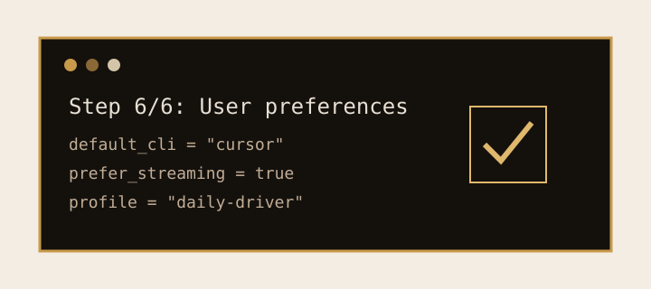
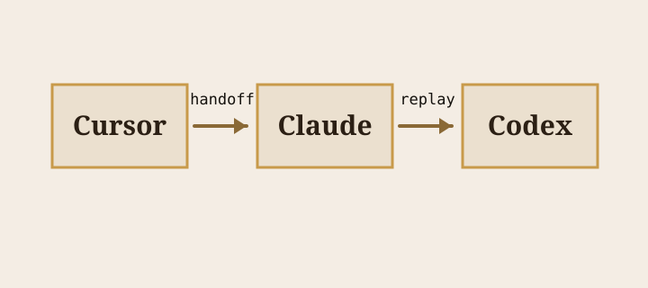

<!-- updated: 2026-05-11 -->

<section class="hero hero--small">
  <h1>PopolaLoom 演示页</h1>
  
选一个场景，照着命令跑，再 attach 到织机的事件流。

  
<a href="index.html">返回文档首页</a>

</section>

## 场景选择

  <a class="scenario-card" href="#local-single-cli">v0.1.0+<h3>本地单 CLI（Cursor）</h3>
让 `popolad` 保留本地 Cursor 任务事件流。
查看流程</a>
  <a class="scenario-card" href="#cross-cli-handoff">v0.7.0+<h3>跨 CLI handoff</h3>
把 prompt 写成 Markdown 信封，再交给另一个 CLI。
查看流程</a>
  <a class="scenario-card" href="#hitl-pause">v0.4.1+<h3>HITL 暂停 + Lark 审批</h3>
五个通道抢答同一个原子回答。
查看流程</a>
  <a class="scenario-card" href="#cloud-agent">v0.8.5+<h3>Cloud Agent 派发</h3>
使用 Cursor Cloud，同时保留 `status`、`attach`、cancel。
查看流程</a>
  <a class="scenario-card" href="#self-hosted-worker">v0.9.1+<h3>Self-hosted worker handoff</h3>
把本机注册成 Cursor worker，再选择由谁创建 run。
查看流程</a>
  <a class="scenario-card" href="#cross-pr-relay">v0.8.8+<h3>跨 PR relay</h3>
把一个 cloud task 的结果变成下一个 repo-aware cloud task。
查看流程</a>
  <a class="scenario-card" href="#cli-preferences-wizard">v0.9.10+<h3>CLI preferences wizard</h3>
`popola init --interactive` Step 6 记录派发偏好。
查看流程</a>
  <a class="scenario-card" href="#multi-cli-relay">v0.9.10+<h3>多 CLI relay</h3>
Cursor → Claude → Codex，使用 `handoff list` 和 `dispatch --replay`。
查看流程</a>
  <a class="scenario-card" href="#daemon-doctor-fix">v0.9.10+<h3>Daemon doctor + fix</h3>
把红色 `popola doctor` 检查修到全绿。
查看流程</a>

<section id="local-single-cli" class="demo-scenario">
  <h2>本地单 CLI（Cursor）</h2>
  
最小路径证明 PopolaLoom 是持久任务总线，而不是 shell alias。

  

命令流

  <pre class="terminal-block terminal-block--active"><code>派发前先启动 daemon。
popola popolad start
popola dispatch "echo hello from popola" --cli=cursor
popola attach &lt;task_id&gt; --follow</code></pre>
  

  

    
<h3>预期事件序列</h3>
`task.dispatched` → `process.started` → `process.stdout` → `task.completed`。

    
<h3>常见坑</h3>
本地 subprocess 不会出现在 Cursor dashboard；请用 `attach`。

    
<h3>验证命令</h3>
`popola status &lt;task_id&gt; --json | jq '.state'`

    
<h3>Skill / Workflow 链接</h3>
<a href="USER_GUIDE.html#cli-速查">CLI 速查</a>

  

</section>

<section id="cross-cli-handoff" class="demo-scenario">
  <h2>跨 CLI handoff（Cursor → Claude）</h2>
  
每次 dispatch 都先写 Markdown front-matter 信封，再构造 adapter argv。

  

命令流

  <pre class="terminal-block terminal-block--active"><code>交给另一个 CLI 前先检查 envelope。
popola dispatch "fix the NoneType bug in foo.py" --cli=cursor
popola handoff list
popola handoff show &lt;handoff_id&gt;
popola dispatch "review the cursor fix and propose follow-up tests" --cli=claude --cwd "$(pwd)"</code></pre>
  

  

<h3>预期事件序列</h3>
Cursor 任务完成，信封可列出，Claude 任务用独立事件日志启动。

<h3>常见坑</h3>
archive 后再用旧 handoff id；先重新 `popola handoff list`。

<h3>验证命令</h3>
`popola handoff show &lt;handoff_id&gt; --json`

<h3>Skill / Workflow 链接</h3>
<a href="USER_GUIDE.html#hands-off-envelope">Hands-off envelope</a>

</section>

<section id="hitl-pause" class="demo-scenario">
  <h2>HITL 暂停 + Lark 审批</h2>
  
LangGraph 节点调用 `interrupt()` 后，daemon 会把一个 HITL 请求发到所有可用通道。

  

命令流

  <pre class="terminal-block terminal-block--active"><code>只回答一个 pending HITL 请求。
popola attach &lt;task_id&gt; --follow
popola pending
popola feedback hitl-abc12 yes --reason "verified backup taken"
popola status &lt;task_id&gt; --json</code></pre>
  

  

<h3>预期事件序列</h3>
`task.elicited` → 一个获胜回答 → `state.resumed` → 终态。

<h3>常见坑</h3>
第一个回答胜出后，迟到的 Lark / CLI 回答会被拒绝。

<h3>验证命令</h3>
`popola pending --json | jq 'length'`

<h3>Skill / Workflow 链接</h3>
<a href="USER_GUIDE.html#hitl-工作流">HITL 工作流</a>

</section>

<section id="cloud-agent" class="demo-scenario">
  <h2>Cloud Agent 派发</h2>
  
Cloud runtime 把本地 `Popen` 换成 Cursor Background Agent REST，但保留同样的 task id 形状。

  

命令流

  <pre class="terminal-block terminal-block--active"><code>先配置凭据，再使用 cursor-cloud。
./install.sh install --with-credentials
popola auth cursor set --validate
popola dispatch "Plan database migration scaffolding" --cli=cursor-cloud --cli-flag repo_url=https://github.com/acme/repo
popola attach &lt;cloud_task_id&gt; --follow</code></pre>
  

  

<h3>预期事件序列</h3>
`runtime=cloud` 任务出现，Cursor SSE 优先流入，poller 仍负责终态。

<h3>常见坑</h3>
GitHub integration 缺失或 stream 过期；PopolaLoom 会显式提示并 fallback 到 polling。

<h3>验证命令</h3>
`popola list --json | jq '.[] | select(.runtime=="cloud")'`

<h3>Skill / Workflow 链接</h3>
<a href="USER_GUIDE.html#credentials-与安全存储v092">Cloud 凭据</a>

</section>

<section id="self-hosted-worker" class="demo-scenario">
  <h2>Self-hosted worker handoff</h2>
  
`popola cloud worker` 包装 Cursor worker CLI，让这台机器出现在 Cloud Agents UI。

  

命令流

  <pre class="terminal-block terminal-block--active"><code>start 前先用 debug 捕获本地前置条件。
popola cloud worker debug --worker-dir "$(pwd)"
popola cloud worker start --worker-dir "$(pwd)"
popola cloud worker status --management-addr 127.0.0.1:39231 --json
popola cloud worker handoff --worker-dir "$(pwd)" --prompt "Run the migration smoke"</code></pre>
  

  

<h3>预期事件序列</h3>
`debug` 通过，worker 启动或复用 singleton，`status` 报 loopback health，handoff 输出 prompt + URL。

<h3>常见坑</h3>
同目录重复 start；默认复用 singleton，除非传 `--allow-duplicate`。

<h3>验证命令</h3>
`popola cloud worker status --management-addr 127.0.0.1:39231 --json | jq '.ready'`

<h3>Skill / Workflow 链接</h3>
<a href="USER_GUIDE.html#self-hosted-worker-handoffv091">Self-hosted worker</a>

</section>

<section id="cross-pr-relay" class="demo-scenario">
  <h2>跨 PR relay</h2>
  
Relay 通过 allowlist 和 audit gate，把一个 cloud task 的结果变成另一个 cloud task 的 prompt。

  

命令流

  <pre class="terminal-block terminal-block--active"><code>先 dry-run，让 policy 决策可见。
popola relay &lt;source_cloud_task_id&gt; --dry-run
popola relay &lt;source_cloud_task_id&gt; --target-repo https://github.com/acme/other-repo --confirm-allowlist
popola attach &lt;relay_task_id&gt; --follow</code></pre>
  

  

<h3>预期事件序列</h3>
policy dry-run、allowlist 决策、新 `cursor-cloud` 任务、可 attach 的 relay 事件流。

<h3>常见坑</h3>
repo allowlist 默认为空会阻断；`--confirm-allowlist` 会记录 override。

<h3>验证命令</h3>
`popola relay &lt;source_cloud_task_id&gt; --dry-run --json | jq '.outcome'`

<h3>Skill / Workflow 链接</h3>
<a href="USER_GUIDE.html#hands-off-envelope">Relay / handoff</a>

</section>

<section id="cli-preferences-wizard" class="demo-scenario">
  <h2>CLI preferences wizard</h2>
  <figure class="scenario-figure"></figure>
  
`popola init --interactive` 的 Step 6 记录可重复 dispatch 偏好，之后命令显式 opt in。

  

命令流

  <pre class="terminal-block terminal-block--active"><code>Step 6 只填路由默认值，不填 secret。
popola init --interactive
# Step 6/6: User preferences
# 1. Select default CLI: cursor
# 2. Select default workspace: $(pwd)
# 3. Prefer streaming attach? yes
# 4. Confirm before cloud dispatch? yes
# 5. Save profile name: daily-driver
popola dispatch "summarize the repo" --use-preferences</code></pre>
  

  

<h3>预期事件序列</h3>
wizard 写入 `[user_preferences]`，选择 profile，dispatch 展开默认值，任务发出正常本地事件。

<h3>常见坑</h3>
不要把 API key 写进 preferences；凭据放 keyring 或 `CURSOR_API_KEY`。

<h3>验证命令</h3>
`popola doctor --json | jq '.user_preferences'`

<h3>Skill / Workflow 链接</h3>
<a href="USER_GUIDE.html#用户偏好v0910">用户偏好</a>

</section>

<section id="multi-cli-relay" class="demo-scenario">
  <h2>多 CLI relay（Cursor → Claude → Codex）</h2>
  <figure class="scenario-figure"></figure>
  
Envelope chain 让每个 CLI 保持干净子进程，同时保留可审计路径。

  

命令流

  <pre class="terminal-block terminal-block--active"><code>用 replay id 避免复制长 prompt。
popola dispatch "design the cache migration" --cli=cursor --wait
popola handoff list
popola dispatch --replay &lt;cursor_handoff_id&gt; --cli=claude --wait
popola handoff list
popola dispatch --replay &lt;claude_handoff_id&gt; --cli=codex --cli-flag sandbox=read-only</code></pre>
  

  

<h3>预期事件序列</h3>
Cursor 产生设计信封，Claude replay 进入实现评审，Codex 用只读 sandbox replay Claude 信封。

<h3>常见坑</h3>
replay 错信封会造成角色漂移；派发前先看 `target_cli` 和 summary。

<h3>验证命令</h3>
`popola handoff list --json | jq '.[0].handoff_id'`

<h3>Skill / Workflow 链接</h3>
<a href="USER_GUIDE.html#hands-off-envelope">Workflow 2 / hands-off envelope</a>

</section>

<section id="daemon-doctor-fix" class="demo-scenario">
  <h2>Daemon doctor + fix</h2>
  <figure class="scenario-figure"></figure>
  
演示或 CI smoke 前，用 doctor 走一条红到绿的短路径。

  

命令流

  <pre class="terminal-block terminal-block--active"><code>按 doctor 提示修失败子系统，再重跑。
popola doctor
# ✗ popolad: socket missing
popola popolad start
popola doctor --json
# ✓ all checks</code></pre>
  

  

<h3>预期事件序列</h3>
Doctor 报一个红色子系统，fix 命令启动 daemon，重跑后所有检查变绿。

<h3>常见坑</h3>
陈旧 socket 可能像 daemon 失败；如果 start 报已有 daemon，先 stop。

<h3>验证命令</h3>
`popola doctor --json | jq '.overall'`

<h3>Skill / Workflow 链接</h3>
<a href="USER_GUIDE.html#cli-速查">Health + diagnostics</a>

</section>

Generated 2026-05-11 against PopolaLoom v1.0.0-pre.1. For walkthroughs with full output, see [DEMO.md](DEMO.html).
